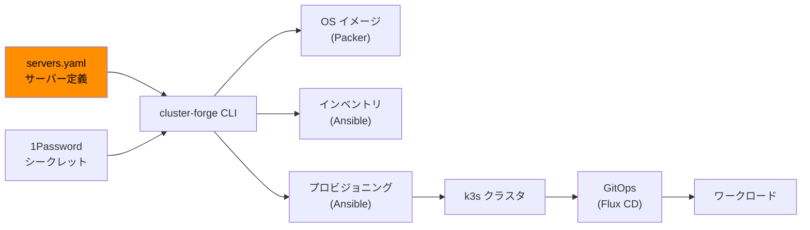

# br-cluster

Raspberry Pi で Kubernetes クラスタを構築・運用するためのモノレポです。統合 CLI `cluster-forge` を使い、OS イメージのビルドからクラスタのプロビジョニング、GitOps によるワークロード管理までを自動化します。

自宅ネットワークに隔離されたクラスタを構築し、Kubernetes やインフラ自動化の学習環境として活用することを目的としています。

## 構成概要



## 技術スタック

| カテゴリ | ツール |
|---|---|
| CLI / 自動化 | Python 3.12+, Click, Pydantic, Jinja2 |
| OS イメージ | Packer (packer-builder-arm), cloud-init |
| プロビジョニング | Ansible |
| Kubernetes | k3s, Cilium CNI, CoreDNS, kube-vip |
| GitOps | Flux CD v2 |
| ストレージ | Longhorn |
| シークレット管理 | 1Password Connect, External Secrets Operator |
| TLS 証明書 | cert-manager (ACME + DNS01) |
| 開発ツール | uv, ruff, pytest |

## ディレクトリ構成

| ディレクトリ / ファイル | 概要 |
|---|---|
| `cli/` | 統合 CLI (`cluster-forge`) — ソースコード + テスト |
| `imager/` | Packer HCL (OS イメージ定義) |
| `provisioner/` | Ansible (ノードプロビジョニング) |
| `manifests/` | Kubernetes マニフェスト (Flux GitOps) |
| `docker/` | Ansible Runner コンテナ |
| `servers.yaml` | サーバー定義 (Single Source of Truth) |
| `compose.yaml` | Docker Compose (1Password Connect + Ansible Runner) |
| `docs/` | ドキュメント |

## 前提条件

### ハードウェア

- Raspberry Pi (ARM64) x 8 台 (gateway x1, master x3, worker x4)
- Ethernet スイッチ
- microSD カード

### ソフトウェア

- Python 3.12+
- [uv](https://docs.astral.sh/uv/) (Python パッケージマネージャー)
- Docker / Docker Compose
- [Packer](https://www.packer.io/)
- [1Password CLI](https://developer.1password.com/docs/cli/) (`op`)

### アカウント

- 1Password (Connect Server 用の credentials と token)

## セットアップ

```shell
# Python 依存関係のインストール
uv sync
```

`.secret/` に 1Password Connect の credentials を配置:

```
.secret/
├── dev/
│   ├── 1password-credentials.json
│   └── .connect_token
└── prod/
    ├── 1password-credentials.json
    └── .connect_token
```

## クイックスタート

```shell
# 1. 環境の起動 (1Password Connect + Ansible Runner)
uv run cluster-forge bootstrap --env dev

# 2. OS イメージのビルド
uv run cluster-forge build-image --env dev

# 3. プロビジョニング (k3s クラスタ構築)
uv run cluster-forge generate-inventory --env dev
uv run cluster-forge provision setup --env dev
uv run cluster-forge provision run --env dev setup-gateway
uv run cluster-forge provision run --env dev setup-node

# 4. GitOps デプロイ (Flux CD)
uv run cluster-forge provision run --env dev bootstrap-cluster
```

## ドキュメント

| ドキュメント | 内容 |
|---|---|
| [アーキテクチャ概要](docs/architecture.md) | 全体設計、設計判断の理由、servers.yaml の役割 |
| [ネットワーク設計](docs/network.md) | IP 設計、ファイアウォール、DNS、kube-vip |
| [CLI リファレンス](docs/cli.md) | cluster-forge の全コマンドとワークフロー |
| [イメージビルドとプロビジョニング](docs/provisioning.md) | Packer / Ansible の流れ、Playbook 解説、サーバー構成 |
| [Kubernetes クラスタ内アーキテクチャ](docs/kubernetes.md) | プラットフォームサービス、デプロイフェーズ、オブザーバビリティ |

## 開発

```shell
# チェック一括実行 (CI と同等)
make check

# 個別実行
make lint              # ruff check + format check
make format            # ruff format 適用
make test              # pytest
make packer-validate   # packer fmt check
```
