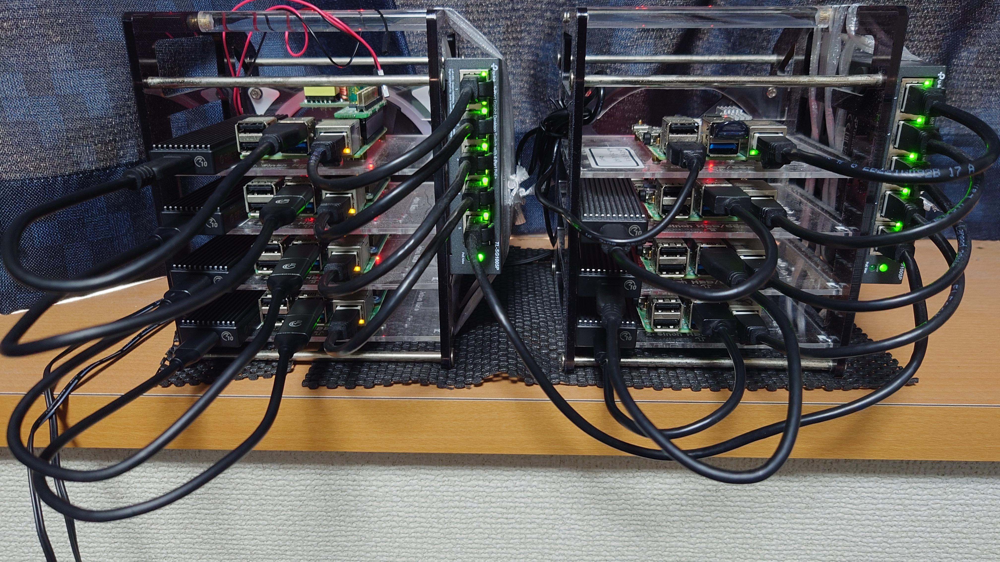

# br-cluster

自宅 Raspberry Pi 上に構築する k3s クラスタ **br-cluster** の構成 / プロビジョニング / GitOps を一括管理するリポジトリ。

- 8 ノード (gateway1 / external1 / k3s 6 台) を **Packer** で焼いた Ubuntu 24.04 で起動
- **Ansible** + 自前 CLI (`cluster-forge`) で初期構築、以降は **Flux** で同期
- 外部公開は **Cloudflare Tunnel + Access** + **Envoy Gateway** + **Zitadel OIDC**
- 設計判断と全体像は [`docs/architecture.md`](docs/architecture.md)



## ディレクトリ構成

| ディレクトリ      | 役割 |
|-------------------|------|
| `cli/cluster_forge/` | Packer / Ansible / 1Password Connect を束ねる Python CLI |
| `imager/`         | Packer (ARM in Docker) で Pi 用 Ubuntu イメージを生成 |
| `provisioner/`    | Ansible (playbooks / roles / inventories) |
| `manifests/`      | k3s に適用する YAML (Flux で同期) |
|   `manifests/clusters/prod/` | Flux 同期のエントリポイント (Kustomization の集合) |
|   `manifests/platform/<name>/` | コンポーネント単位の Helm / 追加リソース |
| `docker/`         | Compose で 1Password Connect / Ansible Runner を起動 |
| `scripts/`        | 補助スクリプト (Grafana ダッシュボード取得など) |
| `servers.yaml`    | サーバー定義の SoT |
| `Makefile`        | CLI ラッパー (`make {env}/...`) |
| `docs/`           | ドキュメント (詳細は [`docs/README.md`](docs/README.md)) |

## クイックスタート

開発環境のセットアップは [`docs/provisioning.md`](docs/provisioning.md) に詳細。

### 必要なツール

```sh
mise install         # Python / uv / packer 等のバージョン揃え
uv sync              # Python 依存
docker info          # Docker daemon が動くこと
```

### 1Password 認証情報

`.secret/{env}/1password-credentials.json` と `.secret/{env}/.connect_token` を配置 (リポジトリ非追跡、1Password 管理者から取得)。

### よく使うコマンド

`{env}` は `dev` または `prod`。CLI と Make の対応は [`docs/provisioning.md#主要コマンド`](docs/provisioning.md#主要コマンド) 参照。

```sh
make {env}/bootstrap                       # 1Password Connect + Ansible Runner 起動
make {env}/build-image                     # 全ノードの OS イメージ生成
make {env}/generate-inventory              # Ansible inventory 生成
make {env}/provision/setup-gateway         # gateway1 を立てる (DHCP/DNS が動く)
make {env}/provision/setup-external        # external1 を立てる
make {env}/provision/setup-node            # k3s + CNI/CoreDNS/kube-vip ブート
make {env}/provision/bootstrap-cluster     # Flux 投入
make {env}/provision/setup-monitoring-agent
make {env}/provision/k3s-stop              # k3s 停止
make {env}/provision/shutdown-cluster      # 順序付きシャットダウン
make {env}/clean                           # compose down
```

開発タスク:

```sh
make lint            # ruff check + format check
make format          # ruff format
make test            # pytest
make check           # lint + test + packer-validate
```

## ドキュメント

詳細はすべて [`docs/`](docs/) 配下。入口は [`docs/README.md`](docs/README.md)。

- 全体像と設計判断: [`docs/architecture.md`](docs/architecture.md)
- 物理 / ネットワーク: [`docs/hardware.md`](docs/hardware.md), [`docs/network.md`](docs/network.md)
- プロビジョニング: [`docs/provisioning.md`](docs/provisioning.md)
- CLI (`cluster-forge`): [`docs/cli.md`](docs/cli.md)
- k3s / プラットフォーム: [`docs/kubernetes.md`](docs/kubernetes.md), [`docs/platform/`](docs/platform/)
- 運用 Runbook: [`docs/operations.md`](docs/operations.md)

## 関連リポジトリ

| リポ                                          | 役割 |
|-----------------------------------------------|------|
| `bright-room/br-cluster` (このリポ)           | k3s 内リソース + 物理 / OS / k3s ブート |
| `bright-room/br-cloudflare-terraform`         | Cloudflare Tunnel / Access / DNS Zone |
| `bright-room/br-cluster-zitadel-terraform`    | Zitadel テナント / アプリ / ロール (tofu-controller が apply) |

責務の境界は [`docs/architecture.md#管理境界-どこを誰が管理するか`](docs/architecture.md#管理境界-どこを誰が管理するか) を参照。
