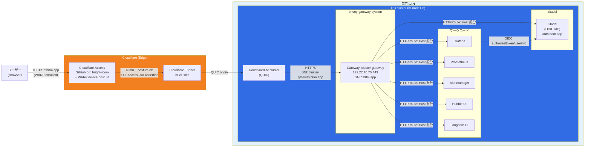

# アーキテクチャ概要

Raspberry Pi 上に構築する自宅 Kubernetes (k3s) クラスタ **br-cluster** の全体設計と、設計判断の背景をまとめる。

## 全体構成



## 外部公開の流れ

1. **ブラウザ → Cloudflare Edge**: ユーザーが `https://<service>.b8m.app/` にアクセス
2. **Cloudflare Access**: 未認証ならGitHub SSO にリダイレクト、GitHub Org `bright-room` のメンバーのみ許可。成功すると `Cf-Access-Jwt-Assertion` ヘッダを付けて origin に転送
3. **Cloudflare Tunnel (br-cluster)**: Edge からクラスタ内の `cloudflared` Pod に QUIC で配送(外向き接続 = 家庭ルーターのポート開放不要)
4. **cloudflared Pod → cluster-gateway**: `https://172.22.10.70:443` に転送。SNI には `cluster-gateway.b8m.app` を明示的に指定(Envoy Gateway の strict SNI match 対応)
5. **Envoy (cluster-gateway)**: `*.b8m.app` 証明書で TLS 終端、`HTTPRoute` を元に Host ヘッダで各サービスへ振り分け
6. **各ワークロード**: CF Access JWT ヘッダを信頼する設定で、そのままログイン済み状態で表示(Grafana の場合 `auth.jwt` で検証)

## Gateway

- **GatewayClass / EnvoyProxy**: `cluster-gateway` / `cluster-proxy` の1組のみ
- **LoadBalancer IP**: `172.22.10.70` を Cilium LB-IPAM + L2 Announcement Policy で自動 announce
- **TLS**: `*.b8m.app` 証明書を cert-manager + Let's Encrypt DNS01 challenge (Cloudflare API) で自動発行・更新
- **HTTPRoute**: 各サービス namespace に `<name>-b8m` HTTPRoute を配置

## DNS

- Zone **`b8m.app`** を Cloudflare で管理 (TF: `br-cloudflare-terraform` repo)
- `*.b8m.app` 配下のレコードは **external-dns-cloudflare** が `Gateway` / `HTTPRoute` アノテーションから自動発行
  - Gateway の `external-dns.alpha.kubernetes.io/target` で Tunnel CNAME (`<tunnel-id>.cfargotunnel.com`) を指定
  - HTTPRoute の `cloudflare-proxied: "true"` で CF proxy 有効化
- external-dns v0.21.0 の gateway-api source は target annotation を **Gateway からのみ** 読む (HTTPRoute には書かない)

## 認証

2 層構成:

1. **ネットワーク層 (Cloudflare Access)**: `*.b8m.app` に到達する前にエッジで弾く
   - `include`: GitHub Organization `bright-room` メンバー
   - `require`: WARP device posture (接続済みの `bright-room` team 端末のみ)
   - enrollment 専用アプリだけ WARP require を外して chicken-and-egg を回避
2. **アプリ層 (Zitadel OIDC)**: クラスタ内 Zitadel (`auth.b8m.app`) を OIDC provider として、各アプリが identity を取得
   - ユーザー/プロジェクト/アプリ登録は `br-cluster-zitadel-terraform` で IaC 管理
   - tofu-controller がクラスタ内で plan/apply、state は k8s Secret (cluster 破棄と同期)
   - メール (verification / password reset) は Resend SMTP 経由

### アプリごとの統合パターン

| アプリ | パターン | 備考 |
|---|---|---|
| Alertmanager / Hubble UI / Longhorn UI / Prometheus | Envoy Gateway `SecurityPolicy` + OIDC filter | gateway 側で強制、アプリ側はユーザー情報を受け取らない |
| Grafana | Grafana 自身の `auth.generic_oauth` | SecurityPolicy を **付けない** (二重 OIDC 回避)、Grafana の Org ロールにマッピング可 |
| Zitadel console (`auth.b8m.app`) | Zitadel 自身がログイン UI | CF Access (WARP + GitHub) が前段 |

### SecurityPolicy の OIDC provider 参照

in-cluster の OIDC issuer (`auth.b8m.app`) を `provider.issuer` だけで指定すると、Envoy の DNS 解決が STRICT_DNS クラスタに頼ることになる。Envoy 内蔵の DNS resolver を `EnvoyProxy.spec.bootstrap` で **c-ares → getaddrinfo に差し替え済み**なので素直に動くが、IdP を k8s Service として明示的に指す方が failure mode が局所化される。

```yaml
spec:
  oidc:
    provider:
      issuer: https://auth.b8m.app
      backendRefs:
        - { kind: Service, name: zitadel, namespace: zitadel, port: 8080 }
```

別 namespace を参照するので `zitadel` ns 側に `ReferenceGrant` が必要 (`manifests/platform/zitadel/app/base/referencegrant.yaml`)。

## 管理の境界 (scope)

- **k3s 内のリソース**: 本リポ (`br-cluster`) で管理、Flux GitOps で適用
- **Cloudflare 側**: `br-cloudflare-terraform` リポで管理 (Tunnel / Access App / DNS / Zone 設定)
- **物理/OS レイヤ**: Packer (`imager/`) + Ansible (`provisioner/`) + CLI (`cli/cluster_forge/`) で管理
- **非 k3s インフラ (`*.cluster-internal.bright-room.net`: dns/ntp/gateway/external/node/object-storage)**: br-cluster のスコープ外。変更しない

## 設計判断

### なぜ Cloudflare Tunnel か

- 家庭ルーターのポート開放/動的DNS が不要。外向き接続のみでクラスタが公開される
- DDoS / bot 耐性を Cloudflare エッジが肩代わり
- WAF / Access / Geo ブロック等が CF 側で一括設定可能

### なぜ `*.b8m.app` か

- 当初 `*.cluster-platform.bright-room.net` を使っていたが、Cloudflare Universal SSL の **2nd-level wildcard が Free プラン非対応** にぶつかった
- 1st-level wildcard (`*.b8m.app`) に統合することで、ACM 有料プラン不要で TLS 終端可能
- ドメインも短く覚えやすい

### なぜ CF Access JWT 直検証から Zitadel OIDC に戻ったか

- 旧構成: CF Access が発行する JWT を各アプリが JWKS で検証、auto-sign-up で Admin 付与
- ユーザー/ロールの管理が CF Access 依存で「アプリ単位で権限を絞る」ができなかった
- Zitadel をクラスタ内で立てて OIDC provider に変更。アプリは Zitadel の user/role を受け取り、CF Access は **ネットワーク境界** の役割に限定
- Keycloak を避けたのは JVM の重さ (Pi 上で non-trivial) と DB 運用コスト。Zitadel は Go + CNPG (既存) で動く

### Gateway 分離の設計

過去に `public-gateway` / `internal-gateway` / `cluster-gateway` の3本に分けていたが、Access で in/out を分けられるため `cluster-gateway` 1本に統一。GatewayClass / EnvoyProxy / Gateway / HTTPRoute の本数が大幅に減った。

## 新しい OIDC 保護アプリを追加する手順

既存 app (Alertmanager / Hubble / Longhorn / Prometheus) をテンプレートに使う想定。

1. **br-cluster**: HTTPRoute を追加してホスト名を決める (`<name>.b8m.app`)
2. **br-cluster-zitadel-terraform**: `zitadel_application_oidc.platform` の for_each map にエントリ追加 → tofu-controller apply で `tf-zitadel-output` に `<name>_client_id` / `<name>_client_secret` が書き出される
3. **br-cluster**: アプリの namespace に
   - `ExternalSecret` (store: `kubernetes-backend`, tf-zitadel-output の 2 キーを `client-id` / `client-secret` に rename コピー)
   - `SecurityPolicy` (`issuer: https://auth.b8m.app`, `backendRefs` で `zitadel` Service 指定, `redirectURL: https://<name>.b8m.app/oauth2/callback`)
4. **br-cluster**: `manifests/platform/zitadel/app/base/referencegrant.yaml` の `from` リストに対象 namespace を追加 (初回だけ)
5. **br-cloudflare-terraform**: `access_applications` map に `<name> = "<name>.b8m.app"` を追加 → CF Access (GitHub org + WARP) がホスト名に効く

Grafana のように**アプリが自前の OIDC を持っている場合**は 3 の `SecurityPolicy` を付けず、アプリ側の generic OAuth 設定で client 情報を流し込む (実例: `manifests/platform/grafana/app/base/values.yaml`)。

## 関連ドキュメント

- `docs/incidents/` — 過去のインシデント記録
- `README.md` — セットアップ/運用コマンド
- `CLAUDE.md` — プロジェクトの規約・ツール利用方針
