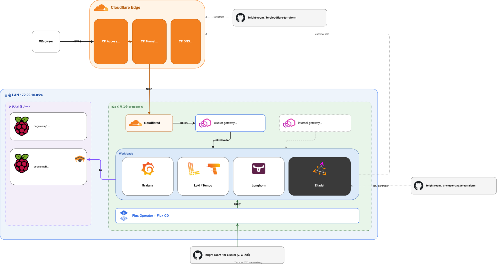
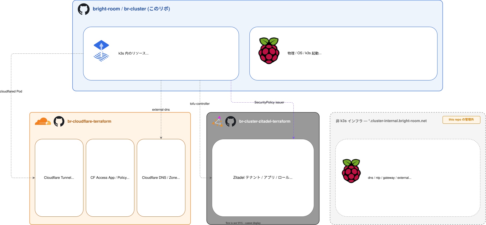

# アーキテクチャ概要

br-cluster の **システム全体像と設計判断の "なぜ" を集約**する。各レイヤの実装詳細は別ドキュメントを参照。

| レイヤ | 詳細 |
|-------|------|
| 物理 | [`docs/hardware.md`](hardware.md) |
| L2/L3 / VIP / DNS / nftables | [`docs/network.md`](network.md) |
| Packer / Ansible / cluster-forge | [`docs/provisioning.md`](provisioning.md) |
| k3s / cluster-settings / Flux ブート順 | [`docs/kubernetes.md`](kubernetes.md) |
| プラットフォームコンポーネント (8 グループ) | [`docs/platform/`](platform/) |

## 全体構成

## 外部公開フロー

`https://<svc>.b8m.app` を叩いたときの経路:

1. **ブラウザ → Cloudflare Edge**
2. **Cloudflare Access** で認証: GitHub Org `bright-room` + WARP device posture。成功すると `Cf-Access-Jwt-Assertion` ヘッダ付与
3. **Cloudflare Tunnel** が QUIC でクラスタ内 `cloudflared` Pod に配送 (家庭ルーターは outbound のみ)
4. cloudflared → `https://172.22.10.70:443` (cluster-gateway VIP)、SNI に `cluster-gateway.b8m.app` を明示
5. **Envoy Gateway** が `*.b8m.app` 証明書で TLS 終端、HTTPRoute の Host で振り分け
6. 各ワークロードは Envoy `SecurityPolicy` の OIDC filter または自前 OIDC で Zitadel ログイン

ポート開放不要・DDoS 対策・Geo ブロック等は Cloudflare 側に集約。詳細は [`docs/network.md`](network.md) と [`docs/platform/networking.md`](platform/networking.md)。

## 認証 (2 層構成)

| 層 | 実装 | 範囲 | 失敗時の挙動 |
|----|------|------|-------------|
| ネットワーク層 | **Cloudflare Access** (GitHub Org + WARP posture) | `*.b8m.app` 全体 | エッジで弾かれる、クラスタには到達しない |
| アプリ層       | **Zitadel OIDC** (`auth.b8m.app`) を 2 系統で消費: Envoy `SecurityPolicy` (OIDC filter) / アプリ自前 (`auth.generic_oauth` 等) | アプリ単位の user / role | アプリが 401 を返す |

- enrollment 専用アプリだけ WARP require を外して chicken-and-egg を回避
- アプリ別パターン:

| アプリ | アプリ層認証 |
|--------|------|
| Alertmanager / Hubble UI / Longhorn UI / Prometheus | Envoy `SecurityPolicy` OIDC filter |
| Grafana | アプリ自身の `auth.generic_oauth` (Envoy SecurityPolicy は **付けない** = 二重 OIDC 回避) |
| Zitadel console (`auth.b8m.app`) | Zitadel 自身が IdP、CF Access が前段 |

詳細は [`docs/platform/identity.md`](platform/identity.md) と [`docs/platform/networking.md`](platform/networking.md#envoy-gateway)。

## 管理境界 (どこを誰が管理するか)

br-cluster 1 つで全部を管理せず、**責務単位で 4 リポ + 物理運用** に分けている。

| 領域 | 場所 | このリポからの操作 |
|------|------|-------------------|
| k3s 内のリソース | `manifests/` (Flux で適用) | 直接編集 |
| 物理 / OS / k3s 起動 | `imager/` `provisioner/` `cli/` | 直接編集 |
| Cloudflare (Tunnel / Access / DNS Zone 設定) | `bright-room/br-cloudflare-terraform` | **触らない** (terraform repo で管理) |
| Zitadel リソース (user / app / role) | `bright-room/br-cluster-zitadel-terraform` | クラスタ内の tofu-controller が apply |
| 非 k3s インフラ (`*.cluster-internal.bright-room.net`) | 別 (br-external1 上の手動セット等) | **br-cluster のスコープ外** |

## 主要な設計判断

### なぜ Cloudflare Tunnel か

- 家庭ルーターのポート開放 / 動的 DNS が不要 (outbound 接続のみで成立)
- DDoS / bot 耐性を Cloudflare エッジが肩代わり
- WAF / Access / Geo ブロック等を 1 箇所で集中管理

### なぜ `*.b8m.app` か

- 当初 `*.cluster-platform.bright-room.net` を使っていたが、Cloudflare Universal SSL の **2nd-level wildcard が Free プラン非対応**にぶつかった
- 1st-level wildcard (`*.b8m.app`) に統合することで、ACM 有料プラン不要で TLS 終端可能
- 短く覚えやすい

### なぜ CF Access JWT 直検証 → Zitadel OIDC に戻したか

- 旧構成: CF Access が発行する JWT を各アプリが JWKS で検証、auto-sign-up で Admin 付与
- ユーザー / ロールの管理が CF Access 依存で「アプリ単位で権限を絞る」ができなかった
- Zitadel をクラスタ内で立てて OIDC provider に変更。アプリは Zitadel の user / role を受け取り、CF Access は **ネットワーク境界の役割に限定**
- Keycloak を避けたのは JVM の重さ (Pi 上で non-trivial) と DB 運用コスト。Zitadel は Go + CNPG (既存) で動く

### Gateway 統合 (1 本構成)

過去に `public-gateway` / `internal-gateway` / `cluster-gateway` の 3 本に分けていたが、Access で in/out を分けられるため **`cluster-gateway` 1 本に統一** (LAN 内向け配信用に `internal-gateway` のみ別途残す)。GatewayClass / EnvoyProxy / Gateway / HTTPRoute の本数が大幅に減った。

### なぜ Cilium か (CNI 選定)

- eBPF で **CNI + kube-proxy 代替 + LB-IPAM + L2 Announcement + Hubble** を一本化
- Pi の限られたリソースで複数 OSS を並走させない
- 詳細 → [`docs/platform/networking.md`](platform/networking.md)

### なぜ k3s 同梱の servicelb / traefik / Helm Controller を全部 disable か

- LB は Cilium LB-IPAM、Ingress は Envoy Gateway、Helm は Flux に責務移譲
- 同じレイヤーに 2 つの実装が並走するのを避ける (k3s のデフォルトを残すと debug 困難)
- 詳細 → [`docs/kubernetes.md`](kubernetes.md)

### なぜ Longhorn のオフクラスタバックアップを撤去したか

- 学習環境のため PVC 内容は再現可能 (Git からの再構築前提)
- 2026-04-13 commit `41f3782` で Garage stack ごと削除
- スナップショット機能は残してある。将来必要なら復活可
- 詳細 → [`docs/platform/storage.md`](platform/storage.md)

### なぜ Loki / Tempo を `br-external1` Garage に置くか

- Pi の Longhorn 容量を圧迫しない
- クラスタ全体障害でもデータが残る場所が必要
- 詳細 → [`docs/platform/observability.md`](platform/observability.md)

## 新しい OIDC 保護アプリを追加する手順

既存 app (Alertmanager / Hubble / Longhorn / Prometheus) をテンプレートに使う想定。

| Step | リポ | 作業 |
|------|------|------|
| 1 | `br-cluster` | `manifests/platform/<app>/config/.../httproute.yaml` を追加してホスト名 `<name>.b8m.app` を決める |
| 2 | `br-cluster-zitadel-terraform` | `zitadel_application_oidc.platform` の `for_each` map にエントリ追加 → tofu-controller apply で `tf-zitadel-output` Secret に `<name>_client_id` / `<name>_client_secret` が書き出される |
| 3 | `br-cluster` | アプリ namespace に **`ExternalSecret`** (store: `kubernetes-backend`、`tf-zitadel-output` の 2 キーを `client-id` / `client-secret` に rename) と **`SecurityPolicy`** (`issuer: https://auth.b8m.app`、`backendRefs` で `zitadel` Service 指定、`redirectURL: https://<name>.b8m.app/oauth2/callback`) を追加 |
| 4 | `br-cluster` | [`manifests/platform/zitadel/app/base/referencegrant.yaml`](../manifests/platform/zitadel/app/base/referencegrant.yaml) の `from` リストに対象 namespace を追加 (初回のみ) |
| 5 | `br-cloudflare-terraform` | `access_applications` map に `<name> = "<name>.b8m.app"` を追加 → CF Access (GitHub Org + WARP) が新ホストに効く |

Grafana のように **アプリ自前の OIDC** を持つ場合は Step 3 の `SecurityPolicy` を **付けず**、アプリ側の generic OAuth 設定で client 情報を流し込む (実例: [`manifests/platform/grafana/app/base/values.yaml`](../manifests/platform/grafana/app/base/values.yaml))。

詳細 → [`docs/platform/identity.md`](platform/identity.md)。

## 関連

- [`docs/kubernetes.md`](kubernetes.md) — 全 platform コンポーネント一覧 (グループ別リンク)
- [`docs/platform/`](platform/) — 各グループの詳細
- [`docs/incidents/`](incidents/) — 過去のインシデント記録
- [`README.md`](../README.md) — リポ概要 / セットアップ
