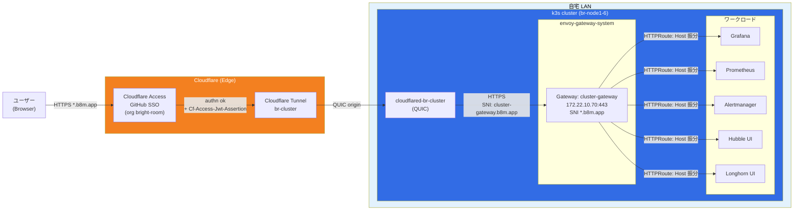

# アーキテクチャ概要

Raspberry Pi 上に構築する自宅 Kubernetes (k3s) クラスタ **br-cluster** の全体設計と、設計判断の背景をまとめる。

## 全体構成

## 外部公開の流れ

1. **ブラウザ → Cloudflare Edge**: ユーザーが `https://<service>.b8m.app/` にアクセス
2. **Cloudflare Access**: 未認証ならGitHub SSO にリダイレクト、GitHub Org `bright-room` のメンバーのみ許可。成功すると `Cf-Access-Jwt-Assertion` ヘッダを付けて origin に転送
3. **Cloudflare Tunnel (br-cluster)**: Edge からクラスタ内の `cloudflared` Pod に QUIC で配送(外向き接続 = 家庭ルーターのポート開放不要)
4. **cloudflared Pod → cluster-gateway**: `https://172.22.10.70:443` に転送。SNI には `cluster-gateway.b8m.app` を明示的に指定(Envoy Gateway の strict SNI match 対応)
5. **Envoy (cluster-gateway)**: `*.b8m.app` 証明書で TLS 終端、`HTTPRoute` を元に Host ヘッダで各サービスへ振り分け
6. **各ワークロード**: CF Access JWT ヘッダを信頼する設定で、そのままログイン済み状態で表示(Grafana の場合 `auth.jwt` で検証)

## Gateway

- **GatewayClass / EnvoyProxy**: `cluster-gateway` / `cluster-proxy` の1組のみ
- **LoadBalancer IP**: `172.22.10.70` を Cilium LB-IPAM + L2 Announcement Policy で自動 announce
- **TLS**: `*.b8m.app` 証明書を cert-manager + Let's Encrypt DNS01 challenge (Cloudflare API) で自動発行・更新
- **HTTPRoute**: 各サービス namespace に `<name>-b8m` HTTPRoute を配置

## DNS

- Zone **`b8m.app`** を Cloudflare で管理 (TF: `br-cloudflare-terraform` repo)
- `*.b8m.app` 配下のレコードは **external-dns-cloudflare** が `Gateway` / `HTTPRoute` アノテーションから自動発行
  - Gateway の `external-dns.alpha.kubernetes.io/target` で Tunnel CNAME (`<tunnel-id>.cfargotunnel.com`) を指定
  - HTTPRoute の `cloudflare-proxied: "true"` で CF proxy 有効化
- external-dns v0.21.0 の gateway-api source は target annotation を **Gateway からのみ** 読む (HTTPRoute には書かない)

## 認証

- **エッジ (Cloudflare Access)**: GitHub Organization `bright-room` のメンバーを唯一の Allow 条件とする自前 IdP ポリシー
- **Grafana**: `auth.jwt` で `Cf-Access-Jwt-Assertion` を CF Access JWKS (`https://bright-room.cloudflareaccess.com/cdn-cgi/access/certs`) で検証、auto_sign_up で org Admin ロール付与
- その他サービス (Prometheus / Alertmanager / Hubble UI / Longhorn UI) は組み込み認証 or 無認証で、アクセス制御は CF Access に一任

## 管理の境界 (scope)

- **k3s 内のリソース**: 本リポ (`br-cluster`) で管理、Flux GitOps で適用
- **Cloudflare 側**: `br-cloudflare-terraform` リポで管理 (Tunnel / Access App / DNS / Zone 設定)
- **物理/OS レイヤ**: Packer (`imager/`) + Ansible (`provisioner/`) + CLI (`cli/cluster_forge/`) で管理
- **非 k3s インフラ (`*.cluster-internal.bright-room.net`: dns/ntp/gateway/external/node/object-storage)**: br-cluster のスコープ外。変更しない

## 設計判断

### なぜ Cloudflare Tunnel か

- 家庭ルーターのポート開放/動的DNS が不要。外向き接続のみでクラスタが公開される
- DDoS / bot 耐性を Cloudflare エッジが肩代わり
- WAF / Access / Geo ブロック等が CF 側で一括設定可能

### なぜ `*.b8m.app` か

- 当初 `*.cluster-platform.bright-room.net` を使っていたが、Cloudflare Universal SSL の **2nd-level wildcard が Free プラン非対応** にぶつかった
- 1st-level wildcard (`*.b8m.app`) に統合することで、ACM 有料プラン不要で TLS 終端可能
- ドメインも短く覚えやすい

### なぜ CF Access + IdP の2段構え(Keycloak)を廃止したか

- 旧構成: CF Access (GitHub) → Keycloak → Grafana OIDC で認証が二重
- Keycloak 自体が JVM ベースで Pi クラスタ上では重く、DB (cnpg) の運用コストも高い
- **CF Access JWT を Grafana が直接検証** することで単一サインオンに統合
- Keycloak は学習目的で将来ゼロから再構築する方針で完全削除

### Gateway 分離の設計

過去に `public-gateway` / `internal-gateway` / `cluster-gateway` の3本に分けていたが、Access で in/out を分けられるため `cluster-gateway` 1本に統一。GatewayClass / EnvoyProxy / Gateway / HTTPRoute の本数が大幅に減った。

## 関連ドキュメント

- `docs/incidents/` — 過去のインシデント記録
- `README.md` — セットアップ/運用コマンド
- `CLAUDE.md` — プロジェクトの規約・ツール利用方針
