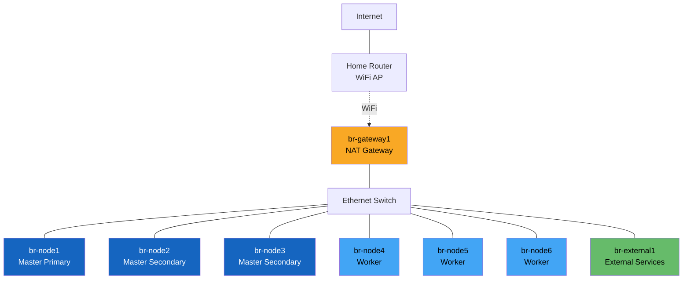
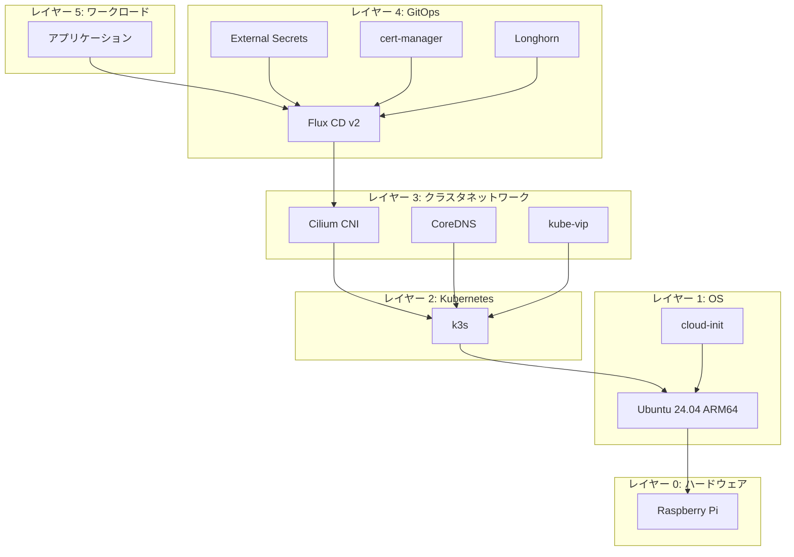
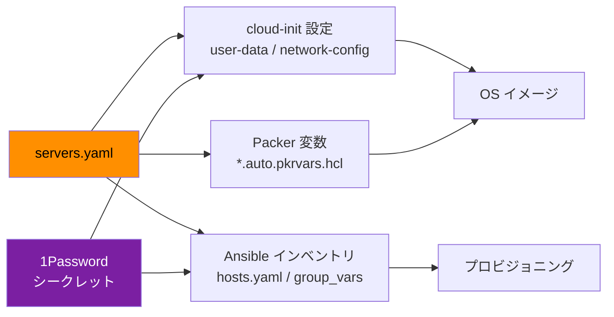
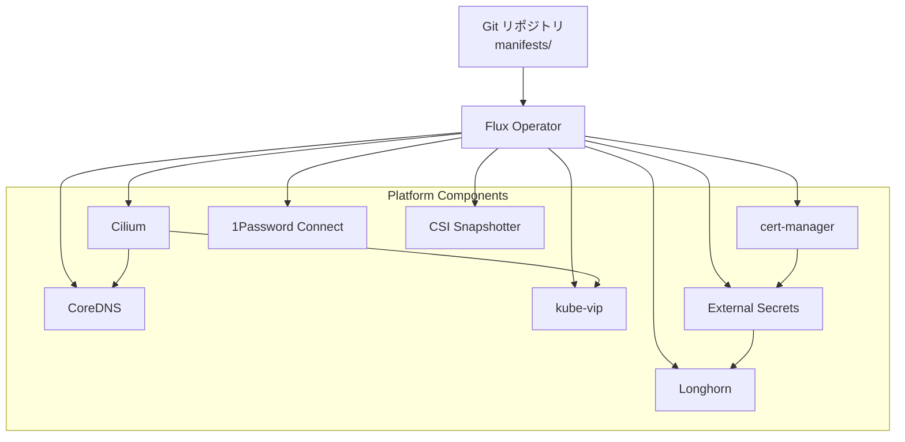

# アーキテクチャ概要

## システム概要

br-cluster は、Raspberry Pi を使って自宅に Kubernetes クラスタを構築・運用するプロジェクトです。

「サーバー定義ファイル (`servers.yaml`) を書くだけで、OS イメージのビルドからクラスタの構築まで一気通貫で自動化する」ことを目指しています。手作業による設定のばらつきや手順の属人化を排除し、再現可能なインフラを実現します。

## 物理構成



| サーバー | 種別 | 役割 |
|---|---|---|
| br-gateway1 | gateway | WiFi で WAN に接続し、NAT・DHCP・DNS・NTP・ファイアウォールを提供 |
| br-node1 | node (primary) | k3s コントロールプレーン（初期マスター） |
| br-node2, br-node3 | node (secondary) | k3s コントロールプレーン（追加マスター） |
| br-node4, br-node5, br-node6 | node (worker) | k3s ワーカーノード |
| br-external1 | external | バックアップストレージなどクラスタ外サービス |

## ネットワーク概要

クラスタは **172.22.10.0/24** の閉じたプライベートネットワーク上に構築されています。ゲートウェイノードが唯一の WAN 接続点で、NAT によってクラスタ内ノードのインターネットアクセスを提供します。

Kubernetes API には **kube-vip** が **172.22.10.60** に仮想 IP (VIP) を払い出し、マスターノード間で ARP フェイルオーバーによる高可用性を実現しています。

詳細は [ネットワーク設計](network.md) を参照してください。

## 論理アーキテクチャ

ベアメタルの Raspberry Pi から動作するクラスタまで、以下のレイヤーで構成されます。



各レイヤーが独立したツールで管理されています。

| レイヤー | ツール | 管理方法 |
|---|---|---|
| OS イメージ | Packer + cloud-init | `cluster-forge build-image` |
| OS 設定・k3s | Ansible | `cluster-forge provision run` |
| クラスタネットワーク | Ansible (bootstrap) | `cluster-forge provision run setup-node` |
| GitOps 以降 | Flux CD | `manifests/` の Git push で自動反映 |

## Single Source of Truth: servers.yaml

このプロジェクトの中心にあるのが `servers.yaml` です。

```yaml
servers:
  - name: br-node1
    type: node
    k8s_role: primary
```

この 1 ファイルから以下がすべて自動生成されます。



**なぜこの設計か**: サーバーの追加・変更時に `servers.yaml` だけを編集すれば済むようにするためです。設定の散在による不整合を防ぎ、「この IP はどこで定義されている？」という疑問をなくします。IP アドレスや認証情報は 1Password に格納し、コードリポジトリには一切含めません。

## シークレット管理

シークレットは **1Password Connect** を介して取得します。

```
┌─────────────────────────────────────────────────┐
│  開発マシン                                      │
│                                                  │
│  cluster-forge ──→ 1Password Connect API (:8080) │
│       │                    ↕                     │
│       │            1Password Connect Sync        │
│       │                    ↕                     │
│       ↓            1Password Cloud               │
│  Ansible Runner                                  │
└─────────────────────────────────────────────────┘
```

- **開発時** (`cluster-forge generate-config` 等): `op` CLI でローカルに取得
- **プロビジョニング時**: Docker Compose で起動した Connect API 経由で Ansible が取得
- **クラスタ内**: External Secrets Operator が 1Password Connect から Kubernetes Secret を同期

Vault 名は `br-cluster-{env}` (dev / prod) で環境ごとに分離されています。

## GitOps: Flux CD

クラスタ内のすべてのワークロードは `manifests/` ディレクトリで宣言的に管理され、Flux CD が Git リポジトリを監視して自動デプロイします。



`manifests/` の構造:

```
manifests/
├── clusters/prod/platform/  # クラスタ固有の Kustomization (prod 環境)
└── platform/                # 再利用可能な Platform Components
    ├── cert-manager/        # TLS 証明書自動発行 (ACME + DNS01)
    ├── cilium/              # CNI プラグイン
    ├── coredns/             # クラスタ内 DNS
    ├── kube-vip/            # 仮想 IP (コントロールプレーン HA)
    ├── longhorn/            # 分散ブロックストレージ
    ├── external-secrets/    # 1Password → Kubernetes Secret 同期
    ├── flux-operator/       # Flux CD v2
    ├── onepassword-connect/ # 1Password API プロキシ
    └── csi-external-snapshotter/
```

各コンポーネントは `app/` (Helm チャート定義) と `config/` (設定値) に分かれ、`base/` と `overlays/{env}/` による Kustomize オーバーレイパターンを採用しています。

## 設計判断

### k3s を選んだ理由

Raspberry Pi (ARM64) ではメモリとストレージが限られます。k3s は Kubernetes の軽量ディストリビューションで、etcd の代わりに SQLite/組み込み etcd を使い、不要なコンポーネントを除外して約 512MB のメモリで動作します。フル Kubernetes (kubeadm) では各ノードに 2GB 以上必要で、4GB メモリの Pi では実用的なワークロードの余地がなくなります。

### Cilium CNI を選んだ理由

Cilium は eBPF ベースの CNI で、kube-proxy を完全に置き換えられます。ARM64 環境では iptables のオーバーヘッドが性能に直結するため、eBPF による高効率なパケット処理が有利です。また NetworkPolicy を L7 レベルまで制御でき、クラスタのセキュリティ強化にもつながります。

### kube-vip を選んだ理由

コントロールプレーンの高可用性に必要な仮想 IP を、追加のロードバランサーなしで実現します。各マスターノードに DaemonSet として配置され、ARP (L2) フェイルオーバーで VIP を引き継ぎます。MetalLB と異なり、コントロールプレーン VIP に特化したシンプルな構成です。

### Packer でイメージをビルドする理由

SD カードに焼くイメージを Packer で事前構築することで、ノードの追加・交換時に同じイメージを再利用できます。cloud-init で初期設定を焼き込むため、ノードは電源投入後に自動的にネットワーク参加可能な状態になります。手動でセットアップする手順がなく、再現性が保証されます。

### ゲートウェイノードで NAT する理由

クラスタを自宅ネットワークから隔離するためです。独立した 172.22.10.0/24 ネットワーク上にクラスタを構築し、ゲートウェイの nftables ファイアウォールで通信を制御します。これにより、クラスタ内の実験が自宅の他のデバイスに影響を与えるリスクを抑えつつ、本番環境に近いネットワーク構成を学習できます。
