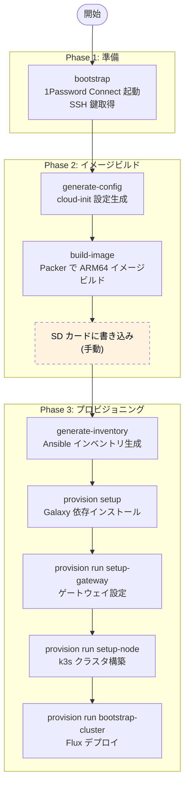

# CLI リファレンス (cluster-forge)

## 概要

`cluster-forge` は、OS イメージのビルドからクラスタのプロビジョニングまでを統合する CLI ツールです。内部的には Packer、Ansible、Docker Compose、1Password CLI を呼び出していますが、利用者はこのツール 1 つで全操作を実行できます。

## ワークフロー

典型的なクラスタ構築は以下の流れで進みます。



> 破線の「SD カードに書き込み」のみ手動作業です。それ以外はすべて CLI で自動化されています。

## コマンドリファレンス

### bootstrap

1Password Connect を起動し、SSH 鍵を取得して Ansible Runner コンテナを起動します。

```shell
uv run cluster-forge bootstrap --env dev
```

**実行される処理:**
1. Docker Compose で `op-connect-api` / `op-connect-sync` を起動
2. Connect API の `/heartbeat` エンドポイントで Ready を待機
3. 1Password vault から各サーバーの SSH 公開鍵・IP・ユーザー名を取得
4. `docker/ssh/keys/` に公開鍵を書き出し、`docker/ssh/config` を生成
5. `ansible-runner` コンテナを起動

### generate-config

servers.yaml と 1Password のシークレットから cloud-init 設定ファイルを生成します。

```shell
# 全サーバー
uv run cluster-forge generate-config --env dev

# 特定サーバーのみ
uv run cluster-forge generate-config --env dev --server br-node1
```

**生成されるファイル:**
- `.generated/cloud-init/{env}/{server}/user-data` — ホスト名、ユーザー、SSH 鍵、パッケージ等
- `.generated/cloud-init/{env}/{server}/network-config` — ネットワーク設定 (gateway のみ)

### generate-inventory

servers.yaml と 1Password から Ansible 用の動的インベントリを生成します。

```shell
uv run cluster-forge generate-inventory --env dev
```

**生成されるファイル:**
- `provisioner/inventories/{env}/hosts.yaml` — ホスト・グループ定義
- `provisioner/inventories/{env}/group_vars/all/cluster_hosts.yaml` — 全ホストの IP・MAC・ドメイン
- `provisioner/inventories/{env}/host_vars/{gateway}.yaml` — ゲートウェイの WAN IP

### build-image

Packer で ARM64 Ubuntu イメージをビルドします。デフォルトで事前に `generate-config` を実行します。

```shell
# 全サーバー (config 生成 → ビルド)
uv run cluster-forge build-image --env dev

# 特定サーバーのみ
uv run cluster-forge build-image --env dev --server br-node1

# config 生成をスキップ (すでに生成済みの場合)
uv run cluster-forge build-image --env dev --skip-generate
```

**出力:** `.generated/images/{env}/{server}.img`

### provision (グループ)

Ansible Runner コンテナ内で Ansible コマンドを実行します。

#### provision setup

Ansible Galaxy の依存 (roles / collections) をインストールします。

```shell
uv run cluster-forge provision setup --env dev
```

#### provision run

Ansible Playbook を実行します。

```shell
uv run cluster-forge provision run --env dev <playbook>

# ドライラン (変更差分の表示のみ)
uv run cluster-forge provision run --env dev setup-node --check
```

**利用可能な Playbook:**

| Playbook 名 | 対象ホスト | 内容 |
|---|---|---|
| `setup-gateway` | gateway | ゲートウェイ設定 (NAT, DHCP, DNS, NTP, nftables) |
| `setup-external` | external | 外部ノード設定 |
| `setup-node` | master, worker | k3s クラスタ構築 (4 段階の Play) |
| `setup-backup` | 対象ノード | Restic バックアップ設定 |
| `setup-monitoring-agent` | 対象ノード | 監視エージェント設定 |
| `bootstrap-cluster` | localhost | Flux デプロイ、シークレット注入、クラスタ検証 |
| `k3s-start` | master | k3s サービス起動 |
| `k3s-stop` | master | k3s サービス停止 |
| `k3s-reset` | master | k3s 完全リセット |

#### provision ping

全ホストへの疎通確認を行います。

```shell
uv run cluster-forge provision ping --env dev
```

#### provision lint

Ansible Playbook の静的解析 (ansible-lint) を実行します。

```shell
uv run cluster-forge provision lint --env dev
```

### clean

Docker コンテナを停止します。`--all` で生成ファイルも削除します。

```shell
# コンテナ停止のみ
uv run cluster-forge clean --env dev

# コンテナ停止 + 生成ファイル削除
uv run cluster-forge clean --env dev --all
```

## 環境システム

`--env` オプションで `dev` / `prod` を切り替えます。

| 項目 | 環境ごとに分離されるもの |
|---|---|
| 1Password Vault | `br-cluster-dev` / `br-cluster-prod` |
| シークレットファイル | `.secret/dev/` / `.secret/prod/` |
| 生成ファイル | `.generated/cloud-init/{env}/` / `.generated/images/{env}/` |
| Ansible インベントリ | `provisioner/inventories/{env}/` |
| Docker Compose プロジェクト | `dev-cluster-forge` / `prod-cluster-forge` |

## Makefile ショートカット

よく使うコマンドには Makefile のショートカットがあります。

```shell
# 環境操作
make dev/bootstrap
make dev/clean
make dev/clean-all

# イメージビルド
make dev/build-image                    # 全サーバー
make dev/image-build/br-node1           # 特定サーバー

# インベントリ生成
make dev/generate-inventory

# プロビジョニング
make dev/provision/setup-node
make dev/provision/setup-gateway
make dev/provision/bootstrap-cluster
make dev/provision/ping
make dev/provision/lint

# 開発 (CI と同等)
make check                              # lint + test + packer-validate
make lint                               # ruff check + format check
make format                             # ruff format 適用
make test                               # pytest
```

`dev` を `prod` に置き換えると本番環境に対して実行されます。
