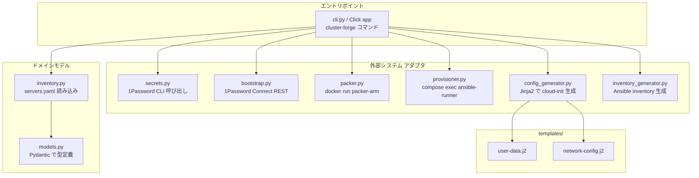

# cluster-forge CLI

`cli/cluster_forge/` に置かれた **Python (Click) ベースの CLI**。Packer / Ansible / 1Password Connect / Docker Compose を 1 つのワークフローに束ね、`make {env}/...` から呼ばれる。

このドキュメントは仕様 / 使い方 / 拡張ガイドラインを集約する。プロビジョニング全体のフローは [`docs/provisioning.md`](provisioning.md) を参照。

## 役割

`cluster-forge` は **薄いオーケストレーション層**。実際の処理は外部ツール (Packer / Ansible / `op` CLI / Docker) が行い、CLI はそれらに渡す引数の生成と起動順序の制御だけを担当する。

| 担当する | 担当しない |
|----------|-----------|
| `servers.yaml` を読んで対象サーバーを解決 | k8s リソースの生成 (Flux / kustomize の責務) |
| 1Password から秘密情報を取得 | secret の永続化 (1Password が SoT) |
| Packer / Ansible に渡す変数 / inventory を生成 | OS イメージのビルド (Packer 本体が実行) |
| Docker Compose で 1Password Connect / Ansible Runner を起動 | Pod 起動 / Helm install (Flux / k3s が実行) |

## アーキテクチャ



## モジュール一覧

| モジュール | 行数 | 役割 |
|-----------|------|------|
| `cli.py`               | 262 | Click app のエントリポイント。`bootstrap` / `generate-config` / `build-image` / `generate-inventory` / `provision *` / `clean` の各サブコマンドを提供 |
| `models.py`            |  32 | `ServerType` / `K8sRole` / `ServerDefinition` / `Inventory` の Pydantic モデル |
| `inventory.py`         |  12 | `servers.yaml` を読んで `Inventory` を返すだけの薄い層 |
| `secrets.py`           | 166 | `SecretProvider` インターフェース + `OnePasswordCliProvider` (host の `op` CLI 経由) + `MockSecretProvider` (テスト用) |
| `bootstrap.py`         | 153 | 1Password Connect REST API クライアント。SSH 鍵の取得、`docker/ssh/config` 生成 |
| `config_generator.py`  |  78 | Jinja2 で `user-data` / `network-config` を server ごとに生成 |
| `inventory_generator.py` | 181 | servers.yaml + 1Password から Ansible inventory (`hosts.yaml` / `cluster_hosts.yaml` / `host_vars/`) を生成 |
| `packer.py`            |  63 | `docker run mkaczanowski/packer-builder-arm` を起動して OS イメージをビルド |
| `provisioner.py`       |  72 | `compose exec ansible-runner ansible-playbook ...` を起動。`PLAYBOOK_COMMANDS` でハイフン区切りのキー名と yaml のパスを対応付け |
| `templates/`           | —   | `user-data.j2` / `network-config.j2` (Packer 入力) |

## コマンド一覧

| コマンド | 用途 | 詳細 |
|---------|------|------|
| `cluster-forge bootstrap --env <env>`            | 1Password Connect (Compose) と Ansible Runner を起動、SSH 鍵を `docker/ssh/` に書き出し | [`docs/provisioning.md#step-2-bootstrap-1password-connect--ansible-runner`](provisioning.md) |
| `cluster-forge generate-config --env <env> [--server <name>]` | `servers.yaml` + 1Password から cloud-init を `.generated/cloud-init/{env}/<server>/` に生成 | host の `op` CLI を使う (Connect 不要) |
| `cluster-forge build-image --env <env> [--server <name>] [--skip-generate]` | Packer で `.generated/images/{env}/<server>.img` を生成 (デフォルトで `generate-config` を先に走らせる) | Docker daemon が必要 |
| `cluster-forge generate-inventory --env <env>`   | Ansible inventory を `provisioner/inventories/{env}/` に生成 | host の `op` CLI を使う |
| `cluster-forge provision setup --env <env>`      | Ansible Runner 内で `ansible-galaxy install -r requirements.yaml` | 初回のみ |
| `cluster-forge provision run --env <env> <playbook> [--check]` | Ansible Runner 内で playbook を実行 (`--check` で dry-run) | playbook key 一覧は下表 |
| `cluster-forge provision ping --env <env>`       | 全ホスト疎通確認 | |
| `cluster-forge provision lint --env <env>`       | ansible-lint | |
| `cluster-forge clean --env <env> [--all]`        | `docker compose down -v`、`--all` で `.generated/` も削除 | |

### provision run で指定できる playbook

[`provisioner.py:PLAYBOOK_COMMANDS`](../cli/cluster_forge/provisioner.py) の SoT。Make ターゲットも同じキーで生成されている。

```python
{
  "setup-gateway":            "playbooks/setup_gateway.yaml",
  "setup-external":           "playbooks/setup_external.yaml",
  "setup-node":               "playbooks/setup_node.yaml",
  "setup-monitoring-agent":   "playbooks/setup_monitoring_agent.yaml",
  "setup-k3s-leader-restart": "playbooks/setup_k3s_leader_restart.yaml",
  "bootstrap-cluster":        "playbooks/bootstrap_cluster.yaml",
  "k3s-start":                "playbooks/k3s_start.yaml",
  "k3s-stop":                 "playbooks/k3s_stop.yaml",
  "k3s-reset":                "playbooks/k3s_reset.yaml",
  "shutdown-cluster":         "playbooks/shutdown_cluster.yaml",
}
```

### CLI と Make の対応

通常運用では **Make を叩く**。`Makefile` が CLI のラッパー。

| 用途 | CLI | Make |
|------|-----|------|
| bootstrap                | `cluster-forge bootstrap --env {env}`              | `make {env}/bootstrap` |
| イメージ生成              | `cluster-forge build-image --env {env}`            | `make {env}/build-image` / `make {env}/image-build/<host>` |
| inventory 生成            | `cluster-forge generate-inventory --env {env}`     | `make {env}/generate-inventory` |
| Playbook 実行             | `cluster-forge provision run --env {env} <pb>`     | `make {env}/provision/<pb>` |
| ping                     | `cluster-forge provision ping --env {env}`         | `make {env}/provision/ping` |
| lint                     | `cluster-forge provision lint --env {env}`         | `make {env}/provision/lint` |
| clean                    | `cluster-forge clean --env {env} [--all]`          | `make {env}/clean` / `make {env}/clean-all` |

## 1Password アクセスの 2 経路

`cluster-forge` は 1Password を **2 つの経路**で叩く。混同しないこと。

| 経路 | クライアント | いつ使う | 認証 |
|------|--------------|----------|------|
| **host `op` CLI** (`OnePasswordCliProvider`) | `subprocess.run(["op", "read", uri])` | `generate-config` / `build-image` / `generate-inventory` (= ホストでの事前準備) | `op` CLI のセッション (運用者がローカルで `op signin` 済み) |
| **Connect REST API** (`bootstrap.ConnectClient`) | `urllib.request` で `http://localhost:8080/v1/...` | `bootstrap` で SSH 情報を取得 / クラスタ内 Pod が触る Vault | `OP_CONNECT_TOKEN` |

`bootstrap` は Connect API を起動するためのものであり、**`generate-*` / `build-image` には不要**。

## 環境前提

- Python 3.12+
- `uv` (依存解決と実行)
- Docker daemon (Compose と Packer ARM コンテナ)
- `op` CLI (host で `op signin` 済み)
- `mise install` で `python` / `uv` / `packer` のバージョンを揃える
- `.secret/{env}/1password-credentials.json` と `.secret/{env}/.connect_token` (リポ非追跡、1Password 管理者から取得)

## テスト

`cli/tests/` に pytest。

```sh
make test                 # = uv run pytest -v
```

| テストファイル | 対象 |
|---------------|------|
| `test_cli.py`                 | Click コマンド (`CliRunner` でサブコマンド呼び出し) |
| `test_inventory.py`           | `servers.yaml` の読み込み |
| `test_config_generator.py`    | `user-data` / `network-config` の Jinja レンダリング |
| `test_inventory_generator.py` | Ansible inventory 生成 |
| `test_packer.py`              | docker run のコマンドライン構築 |
| `test_provisioner.py`         | `compose exec ansible-runner` のコマンドライン構築 |
| `test_bootstrap.py`           | Connect API クライアント (mock) |

`MockSecretProvider` (`secrets.py`) を fixture (`mock_provider` in `conftest.py`) で差し替えるパターン。1Password / Docker / Packer / Ansible の **実体は呼ばない**。

## 拡張ガイドライン

### 新しい Playbook を CLI に追加

1. `provisioner/playbooks/<name>.yaml` を追加
2. [`provisioner.py:PLAYBOOK_COMMANDS`](../cli/cluster_forge/provisioner.py) のマップにハイフン区切りキー → yaml パスのエントリを追加
3. `Makefile` の `PLAYBOOKS` 変数に追加 (`make {env}/provision/<name>` ターゲットが自動生成される)
4. `cli/tests/test_provisioner.py` に新キーが受理されることのテストを追加
5. `docs/provisioning.md` の Playbook 一覧表に行を追加
6. 運用者向けの runbook が必要なら `docs/operations.md` に節を追加

### 新しいサーバー種別を追加

1. `cli/cluster_forge/models.py` の `ServerType` enum に追加
2. `inventory_generator.py` の `_build_domains` / `_build_interfaces` で新種別の振る舞いを定義
3. `servers.yaml` の **schema は手書き**なので、追加した値が `ServerType` enum と一致することを確認
4. `cli/tests/conftest.py` に新種別のフィクスチャを追加
5. 関連 Ansible role / playbook が必要なら `provisioner/roles/` と `provisioner/inventories/prod/group_vars/all/cluster_hosts.yaml` の `cluster_hosts[*].interfaces` などを更新
6. `docs/hardware.md` のノード一覧表を更新

### 新しい 1Password フィールドを参照

1. `cli/cluster_forge/secrets.py` の `ServerSecrets` / `NetworkSecrets` / `InventorySecrets` のいずれか適切な dataclass にフィールドを追加
2. `OnePasswordCliProvider` の `get_*_secrets` で `_read("op://br-cluster-{env}/<item>/<field>")` を追加
3. `MockSecretProvider` (テスト用) にも同フィールドを返すように
4. 1Password Vault `br-cluster-{env}` 側に該当 item / field を作成 (両環境分)
5. テストを追加 (`test_config_generator.py` / `test_inventory_generator.py`)

### Click コマンドを追加

`cli.py` に `@main.command()` か `@<group>.command()` で追加。原則:

- **オプション標準化**: env は `ENV_OPTION` (必須 / `dev`/`prod`)、server は `SERVER_OPTION` (任意)
- **`compose_cmd` / `compose_env`**: Compose 経由の操作なら `_compose_cmd(env)` / `_compose_env(env)` で組み立て (環境変数 `OP_SESSION` / `OP_CONNECT_TOKEN` / `SSH_AUTH_SOCK` を含む)
- **直接ホストで動く処理**: `OnePasswordCliProvider(env)` を渡す。`bootstrap` 不要にする
- **副作用は明示**: `subprocess.run(..., check=True)` で例外伝播。CLI 側で `click.ClickException` に変換するのは認証情報欠落のような UX 上必要な場合のみ

## デザイン判断

| 判断 | 採用 | 不採用 / 旧構成 | 理由 |
|------|------|-----------------|------|
| CLI の言語 | Python (Click) | Bash / Go | Pydantic / Jinja / passlib 等のエコシステム流用、テストが書きやすい |
| 設定の SoT | `servers.yaml` (Pydantic で検証) | CLI 引数 | サーバー一覧を 1 箇所に集約、CLI は読むだけ |
| 1Password 経路 | 2 経路を明示分離 (`OnePasswordCliProvider` と `ConnectClient`) | 統一 | host 用 / Pod 用で認証の出所が違うため、別実装で分離した方が責務が明確 |
| Packer / Ansible 起動 | `subprocess.run` + Docker | Python ライブラリ呼び出し | バージョン固定が容易、ホスト環境を汚さない |
| テスト | `subprocess` を mock、外部呼び出しは引数組み立てだけテスト | 実コマンドを実行 | CI で 1Password / Docker daemon を要求しない |
| ロギング | `click.echo` のみ、構造化ログなし | logging モジュール | CLI なので人間向けの一行 echo で十分 |
| Make 併設 | CLI と Make 双方を提供 | どちらか一方 | CLI は機能の SoT、Make は **環境別 (`dev` / `prod`) の区切り** とハイフン区切りプレイブック名のラッパー |

## 関連

- [`docs/provisioning.md`](provisioning.md) — CLI を使ったゼロからの構築フロー全体
- [`docs/operations.md`](operations.md) — 日常運用 (Make ターゲット主体)
- [`Makefile`](../Makefile) — CLI のラッパー
- [`servers.yaml`](../servers.yaml) — サーバー定義の SoT
- [`pyproject.toml`](../pyproject.toml) — Python 依存とエントリポイント定義
