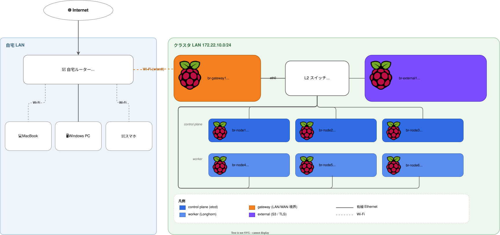

# 物理構成

br-cluster の物理ハードウェアと、各ノードが担う役割をまとめる。

## ノード一覧

サーバー定義は [`servers.yaml`](../servers.yaml) が唯一の情報源。ここに無いノードは存在しない。

| ホスト名             | `type`       | `services`                     | `k8s_role` | `storage_mode` | データ用マウント       | 用途 |
|----------------------|--------------|---------------------------------|------------|----------------|------------------------|------|
| `br-gateway1`        | `gateway`    | —                                | —          | `none`         | —                      | LAN の DHCP / DNS / NTP、WAN ↔ LAN ルーティング (nftables)、cloudflared |
| `br-db1`             | `standalone` | `postgresql`, `certbot`         | —          | `ext4`         | `/var/lib/postgresql`  | PostgreSQL (Zitadel / Argo Workflows) |
| `br-storage1`        | `standalone` | `garage`, `caddy`, `certbot`    | —          | `ext4`         | `/storage`             | Garage S3 (Argo Workflows artifact)、Caddy、Let's Encrypt |
| `br-observability1`  | `standalone` | (なし)                           | —          | `ext4`         | `/storage`             | OS のみ。用途は別 proposal で決定 |
| `br-ai1`             | `standalone` | (なし)                           | —          | `ext4`         | `/storage`             | OS のみ。用途は別 proposal で決定 |
| `br-cluster1`        | `node`       | —                                | `primary`  | `none`         | —                      | k3s 制御プレーン (SQLite datastore、taint 維持) |
| `br-cluster2`        | `node`       | —                                | `worker`   | `none`         | —                      | k3s ワーカー |
| `br-cluster3`        | `node`       | —                                | `worker`   | `none`         | —                      | k3s ワーカー |

`br-observability1` / `br-ai1` の `ext4` パーティションは、後から切り直すのに再フラッシュが要るため当面用途が無くても先に切ってある。`storage_mode: none` の `br-cluster1-3` は Longhorn 撤去により PVC 利用者がゼロになったため。

## ネットワークトポロジ

クラスタは自宅 LAN とは別の **専用サブネット (172.22.52.0/24)** を持ち、`br-gateway1` がその境界ルーターを兼ねる。日常使いの端末 (MacBook / Windows PC / スマホ) は自宅ルーター配下の通常 LAN に居て、クラスタへは `br-gateway1` 経由で到達する。

<!-- TODO(figure): 2026-09-05 のノード再編を未反映。draw.io で更新が必要 -->

`br-gateway1` だけが 2 系統 (LAN: `eth0` / WAN: `wlan0`) を持ち、残りのノードは `eth0` のみでクラスタ LAN に参加する。

## 共通ハードウェア

全ノードで共通の前提。

| 項目         | 値                                                     | 備考 |
|--------------|--------------------------------------------------------|------|
| SBC          | Raspberry Pi (ARM64)                                   | Ubuntu 24.04 preinstalled-server `arm64+raspi` ベースの Packer イメージで起動 ([`imager/source.pkr.hcl`](../imager/source.pkr.hcl)) |
| OS ストレージ | USB3 → NVMe アダプタ (Realtek RTL9210) + SSD            | UAS 無効化 quirk **必須** (下記参照) |
| ネットワーク | 有線 Ethernet `eth0` をクラスタ LAN に接続              | `br-gateway1` のみ追加で Wi-Fi `wlan0` を WAN 側に使用 |

### RTL9210 UAS quirk

RTL9210 は UAS (USB Attached SCSI) で random hang する既知問題があり、quirk 未設定のノードは高負荷時にフリーズしてクラスタごと巻き込む。**全ノードで例外なく適用する**。

| 項目     | 内容 |
|----------|------|
| 設定先   | `/boot/firmware/cmdline.txt` |
| 設定値   | `usb-storage.quirks=0bda:9210:u` |
| 設定箇所 | [`provisioner/roles/common/tasks/system.yaml`](../provisioner/roles/common/tasks/system.yaml) |

## ディスクレイアウト

`storage_mode` は [`provisioner/inventories/base/group_vars/all/main.yaml`](../provisioner/inventories/base/group_vars/all/main.yaml) のデフォルトを各ホストの `host_vars/*.yaml` で上書きする。

| storage_mode | 対象                              | OS パーティション | データパーティション | マウントオプション |
|--------------|------------------------------------|-------------------|----------------------|--------------------|
| `none`       | gateway1, cluster1-3               | ディスク全体を `/` | なし                 | —                  |
| `ext4`       | db1, storage1, observability1, ai1 | 先頭 64 GiB を `/` | 残り領域を ext4      | `defaults,noatime,discard,nofail` |

`storage_mode: none` の場合、制御プレーンはデータを持たない (SQLite datastore は `/var/lib/rancher/k3s` 配下で OS と同居する) ため、追加パーティションを切らない。

`storage_mode: ext4` のマウント先はホストごとに異なる。

| ホスト                | mount_point           | 用途 |
|-----------------------|------------------------|------|
| `br-db1`              | `/var/lib/postgresql` | PostgreSQL の data_dir |
| `br-storage1`         | `/storage`            | Garage の `data_dir` / `meta_dir` |
| `br-observability1`   | `/storage`            | 当面未使用 (別 proposal で決定) |
| `br-ai1`              | `/storage`            | 当面未使用 (別 proposal で決定) |

初回 provision 時、[`provisioner/tasks/init_disk.yaml`](../provisioner/tasks/init_disk.yaml) が root を 64 GiB に縮めてから残りを ext4 で切る。`apt upgrade` の前段で実行する (順序を逆にすると dist-upgrade がディスク配置の都合で失敗する)。

## 役割別の詳細

### br-gateway1 (Gateway)

| 項目       | 内容 |
|------------|------|
| NIC        | `eth0` → クラスタ LAN (172.22.52.0/24) / `wlan0` → 自宅 Wi-Fi (WAN 側) |
| サービス   | DHCP / DNS / NTP / nftables (INPUT・FORWARD・NAT) / cloudflared |
| DHCP 配布  | `172.22.52.150-190` |
| DNS        | 内部ゾーン `prod.br-cluster.bright-room.net` / `prod.internal-service.bright-room.net` を権威、他は `8.8.8.8` / `8.8.4.4` にフォワード |
| NTP        | 上流 `ntp.nict.jp` |
| 主要 NAT   | k3s API 向け DNAT (`br-cluster1` 実 IP) + LAN → WAN Masquerade (ルール詳細は [`network.md#nat`](network.md#nat)、宛先の意味は [`kubernetes.md#トポロジ`](kubernetes.md#トポロジ)) |
| Ansible role | [`provisioner/roles/gateway`](../provisioner/roles/gateway) + `ipr-cnrs.nftables` |
| 詳細       | [`docs/network.md`](network.md) |

### br-db1 (standalone: postgresql)

| 項目         | 内容 |
|--------------|------|
| 役割         | クラスタ外 PostgreSQL (Zitadel / Argo Workflows の DB を収容) |
| PostgreSQL   | apt 版 16、`zitadel` / `argo_workflows` の DB とロールを作成 |
| Certbot      | Let's Encrypt (DNS01, Cloudflare)。`rdbms.prod.internal-service.bright-room.net` 向けに発行し、証明書を `postgres` ユーザーが読める形でコピー |
| Ansible role | [`provisioner/roles/postgresql`](../provisioner/roles/postgresql) |

### br-storage1 (standalone: garage, caddy, certbot)

| 項目         | 内容 |
|--------------|------|
| 役割         | クラスタ外部のオブジェクトストア + リバースプロキシ + TLS 発行 |
| Garage v2    | S3 互換、`argo-workflows` バケットを提供 |
| Caddy        | リバースプロキシ (Garage S3 の TLS 終端) |
| Certbot      | Let's Encrypt (DNS01, Cloudflare)、deploy-hook で Caddy / Garage をリロード |
| 用途         | Argo Workflows の artifact / log 保存先 |
| Ansible role | [`provisioner/roles/garage`](../provisioner/roles/garage) / [`caddy`](../provisioner/roles/caddy) / [`certbot`](../provisioner/roles/certbot) |

### br-observability1 (standalone: なし)

本 proposal の範囲では **OS だけ入った空のホスト**。`ext4` パーティションだけ先に切ってある。載せるものはオブザーバビリティ基盤の再構築を扱う別 proposal で決める。Ansible role は `common` のみ。

### br-ai1 (standalone: なし)

`br-observability1` と同様、OS だけ入った空のホスト。用途 (Renovate PR のマージ妥当性確認を `claude -p` で自律実行する構想など) は別 proposal で決める。Ansible role は `common` のみ。

### br-cluster1-3 (k3s ノード)

物理ホストとしては全 3 台が同一構成 (Pi + RTL9210 + SSD)、`storage_mode: none` (PVC 利用者ゼロのためデータパーティションは切らない)。

k3s レイヤの役割 (control-plane / worker / 起動方法) は [`docs/kubernetes.md#ノード別-k3s-役割`](kubernetes.md#ノード別-k3s-役割) を参照。

## 関連

- [`docs/network.md`](network.md) — IP 設計・ファイアウォール・DNS
- [`docs/provisioning.md`](provisioning.md) — Packer / Ansible でノードを構築する流れ
- [`servers.yaml`](../servers.yaml) — サーバー定義 (SoT)
- [`provisioner/inventories/base/host_vars/`](../provisioner/inventories/base/host_vars) — ホスト別の上書き設定
