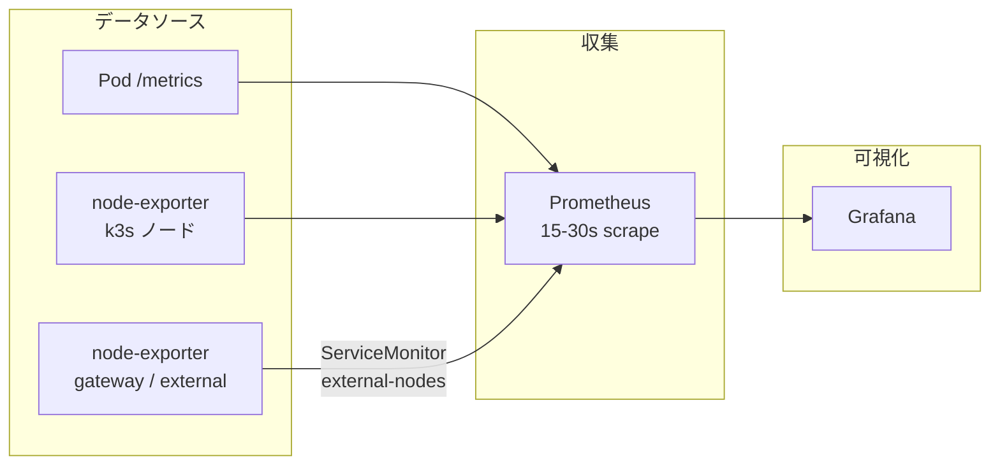
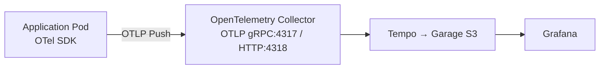
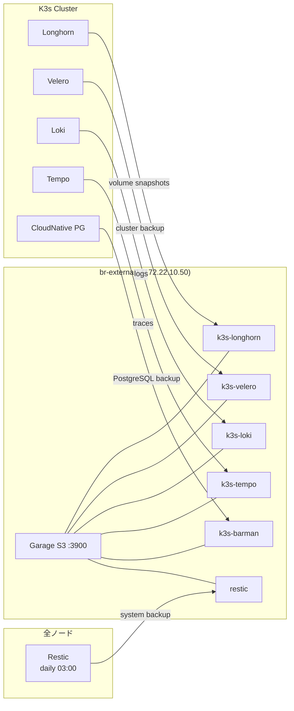

# Kubernetes クラスタ内アーキテクチャ

k3s クラスタ内で動作するプラットフォームサービスの全体像を説明します。
クラスタの構築手順については [プロビジョニング](provisioning.md) を参照してください。

## サービスレイヤー図

クラスタ内のサービスは依存関係に基づいて階層化されています。下位レイヤーが正常に動作していないと、上位レイヤーはデプロイできません。

```
╔═══════════════════════════════════════════════════════════════════╗
║                 K3s Cluster (3 Master + 3 Worker)                ║
║                                                                  ║
║  ┌────────────────────────────────────────────────────────────┐  ║
║  │ L8: Service Mesh / Auth / MQ                               │  ║
║  │   Istio   Keycloak   Kafka (Strimzi)   Kiali               │  ║
║  ├────────────────────────────────────────────────────────────┤  ║
║  │ L7: Observability UI                                       │  ║
║  │   Grafana   Fluent (Fluentd+Bit)   Elastic Stack   OTEL   │  ║
║  ├────────────────────────────────────────────────────────────┤  ║
║  │ L6: Storage / Monitoring / Backup / Databases              │  ║
║  │   Longhorn   kube-prometheus   Loki   Tempo   Velero       │  ║
║  │   External DNS   CloudNative PG   MongoDB                  │  ║
║  ├────────────────────────────────────────────────────────────┤  ║
║  │ L5: Networking / DNS                                       │  ║
║  │   Cilium (CNI)   CoreDNS                                   │  ║
║  ├────────────────────────────────────────────────────────────┤  ║
║  │ L4: Cert / Gateway                                         │  ║
║  │   cert-manager config   Envoy Gateway config               │  ║
║  ├────────────────────────────────────────────────────────────┤  ║
║  │ L3: Secrets Provider                                       │  ║
║  │   External Secrets   1Password Connect                     │  ║
║  ├────────────────────────────────────────────────────────────┤  ║
║  │ L2: TLS / Gateway Controller                               │  ║
║  │   cert-manager   Envoy Gateway                             │  ║
║  ├────────────────────────────────────────────────────────────┤  ║
║  │ L1: Base Infrastructure                                    │  ║
║  │   metrics-server  CSI Snapshotter  Kube-VIP  System Upgrade│  ║
║  │   FluxCD (Operator + Instance)                             │  ║
║  └────────────────────────────────────────────────────────────┘  ║
╚═══════════════════════════════════════════════════════════════════╝
```

## Namespace 別サービス配置

| Namespace | サービス | 種別 | 役割 |
|---|---|---|---|
| kube-system | Cilium Agent | DaemonSet | CNI / kube-proxy 置換 |
| kube-system | Cilium Operator | Deployment | Cilium 管理 (control-plane) |
| kube-system | Kube-VIP | DaemonSet | K8s API VIP (masters のみ) |
| kube-system | CoreDNS | Deployment | クラスタ内 DNS |
| kube-system | metrics-server | Deployment | リソースメトリクス (HPA) |
| kube-system | snapshot-controller | Deployment | ボリュームスナップショット |
| flux-system | Flux Operator + Controllers | Deployment | GitOps (source/kustomize/helm/notification) |
| cert-manager | cert-manager | Deployment | TLS 証明書自動発行 (Let's Encrypt + DNS01) |
| external-secrets | External Secrets | Deployment | 外部シークレット同期 |
| onepassword | 1Password Connect | Deployment | 1Password API プロキシ |
| envoy-gateway-system | Envoy Gateway | Deployment | L7 Gateway API コントローラ |
| longhorn-system | Longhorn Manager | DaemonSet | 分散ブロックストレージ |
| kube-prom-stack | Prometheus + Alertmanager | StatefulSet | メトリクス監視 |
| kube-prom-stack | node-exporter | DaemonSet | ノードメトリクス収集 |
| grafana | Grafana | Deployment | ダッシュボード / 可視化 |
| loki | Loki | StatefulSet | ログストレージ (→ Garage S3) |
| tempo | Tempo | StatefulSet | トレースストレージ (→ Garage S3) |
| fluent | Fluentd | StatefulSet | ログ集約 (LB: 172.22.10.65) |
| fluent | Fluent Bit | DaemonSet | ノード内ログ収集 |
| elastic | ECK Operator + Elasticsearch + Kibana | StatefulSet | ログ検索 |
| otel | OpenTelemetry Collector | Deployment | テレメトリ収集・転送 |
| istio-system | istiod | Deployment | サービスメッシュ |
| kiali | Kiali | Deployment | メッシュ可視化 UI |
| cnpg-system | CloudNative PG Operator | Deployment | PostgreSQL オペレータ |
| keycloak | Keycloak + PostgreSQL | StatefulSet | SSO / IAM (OIDC) |
| kafka | Strimzi Operator + Kafka + Kafdrop | StatefulSet | メッセージキュー |
| mongodb | MongoDB Community Operator | Deployment | MongoDB オペレータ |
| external-dns | external-dns | Deployment | DNS レコード自動登録 |
| velero | Velero | Deployment | クラスタバックアップ (→ Garage S3) |
| system-upgrade | System Upgrade Controller | Deployment | k3s 自動アップグレード |

## Pod 配置ポリシー

Master ノードには `node-role.kubernetes.io/control-plane:NoSchedule` の Taint が設定されています。

| 配置 | 対象 |
|---|---|
| 全ノード (DaemonSet) | Cilium Agent, node-exporter, Fluent Bit, Longhorn Manager |
| Master のみ (DaemonSet + Toleration) | Kube-VIP, Cilium Operator |
| Worker のみ | その他すべてのワークロード |

Worker ノードの `/storage` (LVM) が Longhorn のデータ保存先として使用されます。

## LoadBalancer IP 割り当て

Cilium L2 announcement で払い出される仮想 IP:

| IP | サービス | 用途 |
|---|---|---|
| 172.22.10.60 | Kube-VIP | Kubernetes API (コントロールプレーン HA) |
| 172.22.10.64 | Envoy Gateway (public) | `*.b8m.app` 外部公開 HTTPS |
| 172.22.10.65 | Fluentd | 外部ノードからのログ受信 (port 24224) |
| 172.22.10.66 | Istio Gateway | サービスメッシュ Ingress |
| 172.22.10.67 | Kafka Gateway | 外部からの Kafka アクセス |
| 172.22.10.68 | Envoy Gateway (internal) | `*.cluster-internal.bright-room.net` 内部用 |

## Envoy Gateway によるドメイン公開

2 つの Gateway が外部・内部トラフィックを受け付けます。

| Gateway | ドメイン | LB IP | 用途 |
|---|---|---|---|
| public-gateway | `*.b8m.app` | 172.22.10.64 | 外部公開サービス |
| internal-gateway | `*.cluster-internal.bright-room.net` | 172.22.10.68 | 内部インフラサービス |

両方とも HTTP (80) + HTTPS (443) リスナーを持ち、cert-manager で TLS 証明書を自動管理します。

### 内部サービスの HTTPRoute

internal-gateway 経由で公開されるインフラサービスの Web UI:

| サービス | ドメイン | Service → Port |
|---|---|---|
| Grafana | `grafana.cluster-internal.bright-room.net` | grafana:3000 |
| Prometheus | `prometheus.cluster-internal.bright-room.net` | kube-prometheus-stack-prometheus:9090 |
| Alertmanager | `alertmanager.cluster-internal.bright-room.net` | kube-prometheus-stack-alertmanager:9093 |
| Longhorn | `longhorn.cluster-internal.bright-room.net` | longhorn-frontend:80 |
| Kiali | `kiali.cluster-internal.bright-room.net` | kiali:20001 |
| Hubble UI | `hubble.cluster-internal.bright-room.net` | hubble-ui:80 |
| Kibana | `kibana.cluster-internal.bright-room.net` | efk-kb-http:5601 |
| Keycloak | `keycloak.cluster-internal.bright-room.net` | keycloak-http:8080 |
| Kafdrop | `kafdrop.cluster-internal.bright-room.net` | kafdrop:9000 |
| OTel Collector | `otel-collector.cluster-internal.bright-room.net` | opentelemetry-collector:4318 |

### 外部アクセスの経路

ブラウザから内部サービス (例: Grafana) にアクセスする際の経路:

```
User → grafana.cluster-internal.bright-room.net
  │
  │ (1) DNS 解決
  ▼
Gateway CoreDNS (.1:53)
  → External DNS が自動登録
  → 172.22.10.68 (internal LB)
  │
  │ (2) HTTPS 接続
  ▼
Cilium L2 LoadBalancer
  → Envoy Gateway Pod に転送
  │
  │ (3) Gateway API ルーティング
  ▼
internal-gateway (TLS 終端: cert-manager)
  → HTTPRoute: grafana → grafana-svc:3000
  │
  │ (4) Service → Pod
  ▼
Grafana Pod (namespace: grafana)
```

## オブザーバビリティパイプライン

### メトリクス収集



- Prometheus が ServiceMonitor に基づいて Pull (scrape) する構成
- クラスタ外ノード (gateway / external) の node-exporter (:9100) も `ServiceMonitor: external-nodes` で収集

### ログ収集

```mermaid
graph LR
    subgraph "k3s ノード"
        fb_k8s[Fluent Bit<br/>DaemonSet]
        pod_log[Pod stdout/err]
        var_log[/var/log/*]
    end

    subgraph "外部ノード"
        fb_ext[Fluent Bit<br/>systemd service]
        ext_log[/var/log/*]
    end

    subgraph "集約"
        fd[Fluentd<br/>LB: .65:24224]
    end

    subgraph "ストレージ"
        loki[Loki → Garage S3]
        es[Elasticsearch]
    end

    subgraph "可視化"
        grafana[Grafana]
        kibana[Kibana]
    end

    pod_log --> fb_k8s
    var_log --> fb_k8s
    ext_log --> fb_ext
    fb_k8s --> fd
    fb_ext --> fd
    fd --> loki
    fd --> es
    loki --> grafana
    es --> kibana
```

- Fluent Bit がログを収集し、Fluentd (LB: 172.22.10.65) に転送
- Fluentd が Loki (長期保存) と Elasticsearch (全文検索) に振り分け

### トレーシング



- **Push 型**: アプリケーションから OTel Collector に OTLP で送信 (Collector はスクレイプしない)
- ブラウザ計装も `otel-collector.cluster-internal.bright-room.net` 経由で受信可能 (CORS 設定済み)

## S3 ストレージフロー (Garage)

br-external1 上の Garage が S3 互換オブジェクトストレージとして機能し、クラスタ内の複数サービスのバックエンドになっています。



各サービスの S3 認証情報は External Secrets 経由で 1Password から取得されます。

## Kubernetes Secrets 管理フロー

クラスタ内でのシークレットの流れ:

```
1Password Vault (Cloud)
    │
    │  HTTP (REST API)
    ▼
1Password Connect (namespace: onepassword, :8080)
    │
    │  参照
    ▼
ClusterSecretStore (provider: onepassword)
    │
    │  参照
    ▼
ExternalSecret CRD (各 namespace に配置)
    │
    │  自動作成・同期
    ▼
Kubernetes Secret (Pod にマウント)
```

アプリケーションは ExternalSecret を宣言するだけで、1Password の値が Kubernetes Secret として自動的に同期されます。Secret の手動作成は不要です。

## FluxCD GitOps フロー

```
GitHub: br-cluster (main branch)
└── manifests/clusters/prod/
    ├── config/cluster-settings.yaml  ← 変数 (S3 エンドポイント等)
    └── infra/*.yaml                  ← Flux Kustomization CRD
                │
                │ pull (30m interval)
                ▼
source-controller (GitRepository: flux-system)
                │
                ▼
kustomize-controller
├── Kustomization CRD を読み込み
├── kustomize build で各 path をレンダリング
├── postBuild.substituteFrom で cluster-settings の変数を展開
└── dependsOn でトポロジカル順にクラスタへ apply
                │
     ┌──────────┼──────────┐
     ▼          ▼          ▼
 HelmRelease  Kubernetes  CRDs
 → helm-      Resources   (Gateway,
   controller              Istio 等)
```

## デプロイフェーズ

`bootstrap-cluster` 後、Flux が以下のフェーズ順にサービスをデプロイします。各フェーズは前のフェーズが正常であることが前提です。

### Phase 1: シークレット管理基盤

> 他のほぼすべてのコンポーネントが依存する最重要基盤。

| コンポーネント | 依存先 |
|---|---|
| onepassword-connect-app | なし |
| external-secrets-app | なし |
| external-secrets-config | 上記 2 つ |

確認: ClusterSecretStore が `Valid` 状態であること。

### Phase 2: 証明書 + ネットワーク基盤

| コンポーネント | 依存先 |
|---|---|
| cert-manager-app | なし |
| cert-manager-config | cert-manager-app, Phase 1 |
| coredns-app | なし |
| kube-vip-app | なし |
| cilium-app | Phase 1 |
| cilium-config | cilium-app |

確認: ClusterIssuer が `Ready`、Cilium Agent が全ノードで Running、VIP に疎通可能。

### Phase 3: ストレージ

| コンポーネント | 依存先 |
|---|---|
| csi-external-snapshotter-app | なし |
| longhorn-app | snapshotter, Phase 1 |

確認: StorageClass `longhorn` が Default。

### Phase 4: Ingress ゲートウェイ

| コンポーネント | 依存先 |
|---|---|
| envoy-gateway-app | なし |
| envoy-gateway-config | envoy-gateway-app, cert-manager-config |
| external-dns-app | Phase 1 |

確認: Gateway が Programmed、LB IP にポート 80/443 で到達可能。

### Phase 5: サービスメッシュ

| コンポーネント | 依存先 |
|---|---|
| istio-app | cilium-config, coredns-app |

### Phase 6: メトリクス監視

| コンポーネント | 依存先 |
|---|---|
| metrics-server-app | なし |
| kube-prometheus-stack-app | Phase 1, Phase 3 |

確認: `kubectl top nodes` が値を返す、Prometheus Targets が UP。

### Phase 7: ログ + トレーシング

| コンポーネント | 依存先 |
|---|---|
| loki-app | Phase 1, Phase 3 |
| tempo-app | Phase 1, Phase 3 |
| fluent-app | cert-manager-config, Phase 1, loki |
| opentelemetry-collector-app | Phase 1, prometheus, loki, tempo |

### Phase 8: ダッシュボード + データベース

| コンポーネント | 依存先 |
|---|---|
| grafana-app | Phase 1, prometheus, loki, tempo |
| eck-operator-app | なし |
| cloudnative-pg-app | Phase 3 |
| mongodb-community-operator-app | Phase 3 |
| elastic-stack-app | eck-operator, Phase 1, Phase 3 |

### Phase 9: 認証 + メッセージキュー + メッシュ可視化

| コンポーネント | 依存先 |
|---|---|
| keycloak-app | cloudnative-pg |
| kafka-app | Phase 1, Phase 3, envoy-gateway |
| velero-app | Phase 1, snapshotter, longhorn |
| kiali-app | istio, keycloak, grafana, tempo, prometheus |

### Phase 10: クラスタ管理

| コンポーネント | 依存先 |
|---|---|
| system-upgrade-app | なし |
| system-upgrade-config | system-upgrade-app |

確認: Plan リソースが作成され、k3s バージョンが計画通り。

## サービス間データフロー

```
                          ┌─────────────────┐
                          │   Internet      │
                          └────────┬────────┘
                                   │
                        ┌──────────┴──────────┐
                        │ br-gateway1         │
                        │ NAT / FW / DNS      │
                        │ DHCP / NTP          │
                        └──────────┬──────────┘
                                   │
       ┌───────────────────────────┼───────────────────────────┐
       │                           │                           │
┌──────┴──────┐            ┌───────┴──────┐           ┌───────┴───────┐
│ Masters x3  │◄──────────►│ Workers x3   │           │ br-external1  │
│ K3s Server  │  cluster   │ K3s Agent    │           │               │
│ etcd (HA)   │  network   │ Workloads    │           │               │
│ Kube-VIP    │            │              │           │               │
│ VIP .10.60  │            │ Longhorn ────┤── S3 ────►│ Garage        │
└─────────────┘            │ Loki    ─────┤── S3 ────►│ (buckets)     │
                           │ Tempo   ─────┤── S3 ────►│               │
                           │ Velero  ─────┤── S3 ────►│ Certbot       │
                           └──────────────┘           └───────────────┘

kubectl ──► Kube-VIP (172.22.10.60:6443) ──► Active Master (ARP failover)
```
