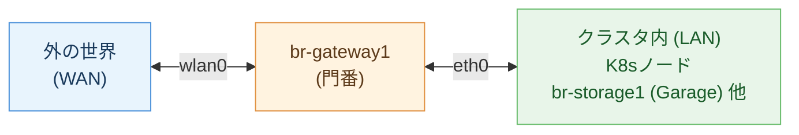
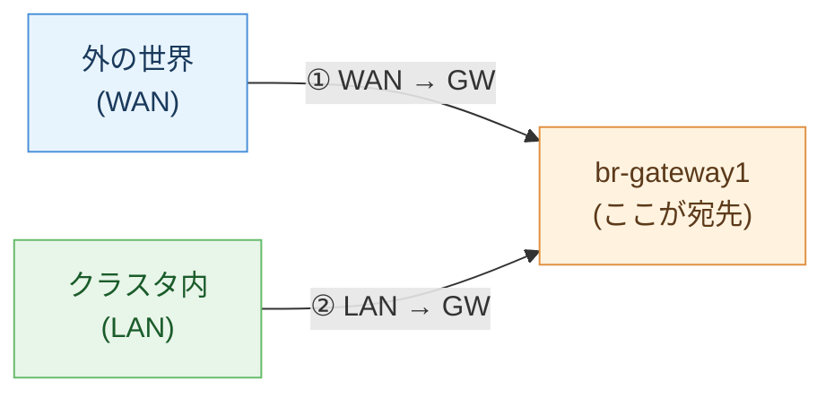
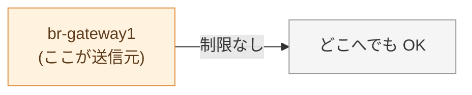
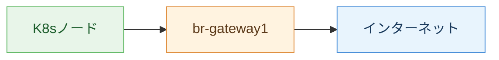
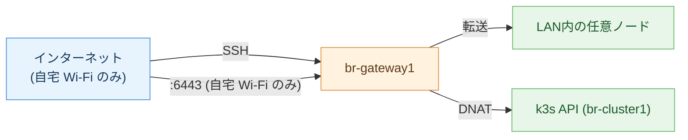
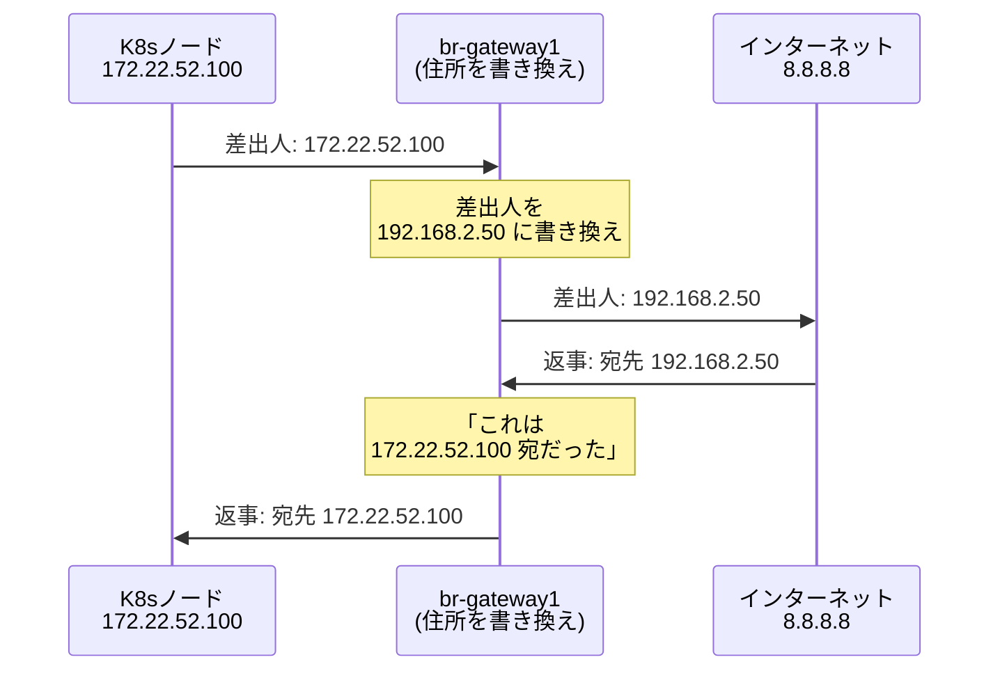
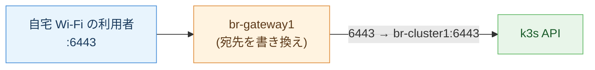
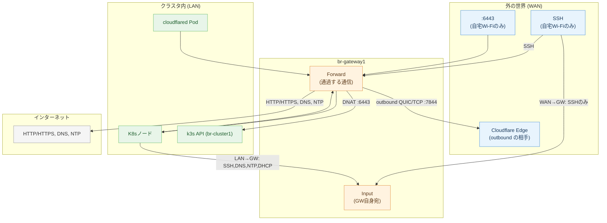

# br-gateway1 nftables ルール解説

## 全体像

`br-gateway1` は、クラスタの **玄関の門番** です。外の世界とクラスタ内の間に立って、全ての通信をチェックします。

門番は通信を **4つの場面** でチェックします。

---

## 1. Input = 「門番自身に話しかける通信」

ゲートウェイを通り抜けるのではなく、**ゲートウェイ本人宛** の通信です。

### 基本方針: 全部拒否! 以下だけ通す

### ① 外(WAN) → ゲートウェイ自身

| 許可するもの | 何に使う？ |
|---|---|
| SSH (自宅 Wi-Fi からのみ) | 自宅にいるときの緊急ログイン用フォールバック |
| DNS | 自宅 Wi-Fi の他の端末が gateway1 を DNS として使うため |

日常の SSH ログインは Cloudflare WARP 経由 (家 LAN と同じ hostname で到達) を使う。ここで許可している SSH は **WARP/Cloudflare が落ちたときの避難経路**で、しかも自宅 Wi-Fi の IP アドレス帯からしか受け付けない。インターネットの誰からでも叩ける窓口ではない。

### ② クラスタ内(LAN) → ゲートウェイ自身

| 許可するもの | 何に使う？ |
|---|---|
| SSH | ノードからゲートウェイにログイン |
| DNS | 「google.com の IP 教えて」という名前解決 |
| NTP | 時計合わせ |
| DHCP | 「IP アドレスちょうだい」 |

### 常に許可

| 許可するもの | 何に使う？ |
|---|---|
| ping (ICMP) | 「生きてる？」の確認 |

---

## 2. Output = 「門番自身が出す通信」

自分自身は信用しているので **全部許可** です。

---

## 3. Forward = 「門を通り抜ける通信」

ゲートウェイ自身には用がなく、**中継して通過する** 通信のルールです。これが一番重要。

### 基本方針: 全部拒否! 以下だけ通す

### クラスタ内 → 外 (LAN → WAN)

クラスタ内のマシンがインターネットに出る通信です。

| 許可するもの | 何に使う？ |
|---|---|
| HTTP / HTTPS | Web サイトへのアクセス、パッケージ取得、Flux の Git clone |
| DNS | 名前解決 |
| NTP | 時計合わせ |
| Cloudflare Tunnel (QUIC/TCP、ポート 7844) | cloudflared が Cloudflare Edge に張る outbound トンネル |
| SMTP submission (587) | Zitadel → Resend (メール送信) |

**それ以外は拒否。** 例えば、ノードから外部への SSH は通せません。

### 外 → クラスタ内 (WAN → LAN)

外からクラスタ内のマシンにアクセスする通信です。ここは **かなり絞られています**。

| 許可するもの | 何に使う？ |
|---|---|
| SSH (自宅 Wi-Fi からのみ) | 外から LAN 内の任意のノードにログイン (WARP 障害時のフォールバック) |
| 6443 (自宅 Wi-Fi からのみ) | 外から k3s API にアクセス (`kubectl`、WARP 障害時のフォールバック) |

**それ以外は何も通しません。** `*.b8m.app` の Web サービスは、この WAN→LAN の穴を一切使わずに公開されています。代わりに `cloudflared` が LAN 側から Cloudflare Edge へ **outbound** でトンネルを張り、外部からのリクエストはそのトンネルの中を通って届きます (ゲートウェイの inbound ルールは何も開けなくてよい)。詳しくは [`docs/platform/networking.md#外部公開フロー-httpssvcb8mapp`](platform/networking.md#外部公開フロー-httpssvcb8mapp) を参照。

---

## 4. NAT = 「住所の書き換え」

クラスタ内のマシンは `172.22.52.x` というプライベート IP を持っています。これは **クラスタ内だけで通じる住所** で、外の世界からは直接アクセスできません。

そこでゲートウェイが **郵便局** のように住所を書き換えます。

### 中から外へ出るとき (マスカレード)

### 外から中へ入るとき (DNAT = 転送)

外からはクラスタ内の `172.22.52.x` が見えません。代わりにゲートウェイの IP + ポート番号で受けて、中の正しいマシンに転送します。

**現状 DNAT で転送しているのは k3s API (`:6443`) の 1 つだけ** です (しかも上で見たとおり自宅 Wi-Fi からしか叩けません)。他のサービスは DNAT を使わず、`cloudflared` の outbound トンネル経由で公開されています。

| 外から見えるアドレス | 転送先 | 用途 |
|---|---|---|
| `192.168.2.50:6443` (自宅 Wi-Fi のみ) | `172.22.52.100:6443` (`br-cluster1`) | `kubectl` 操作 (WARP 障害時のフォールバック) |

k3s の API サーバーは control-plane が `br-cluster1` の 1 台だけなので、VIP のような「複数台のどれかに向ける」仕組みは無く、常にこの 1 台に転送します。

---

## 全通信の一覧

