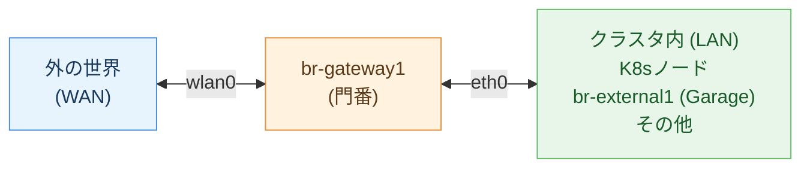
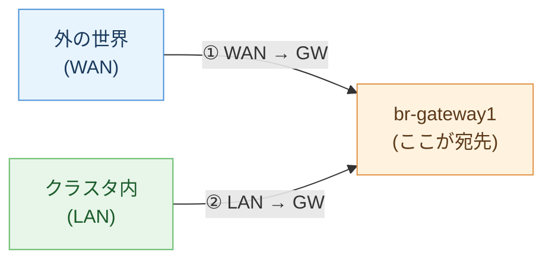
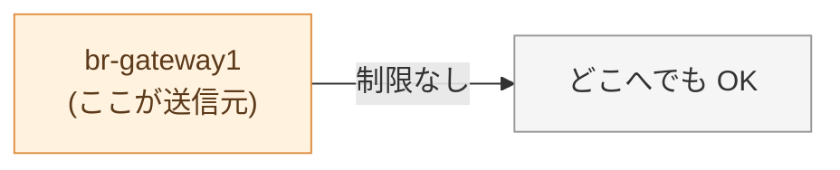
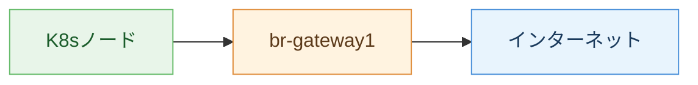
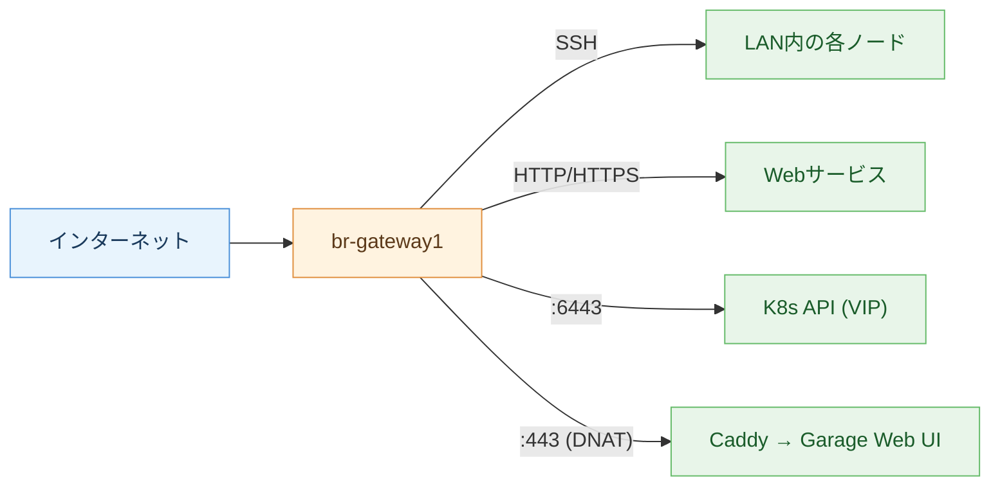
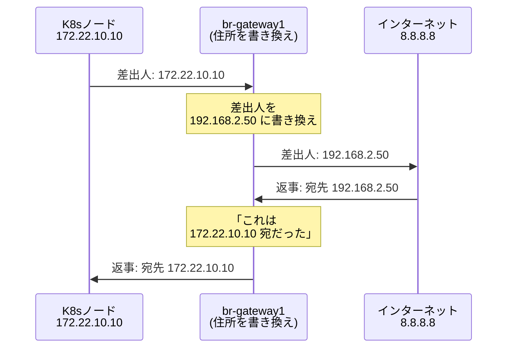
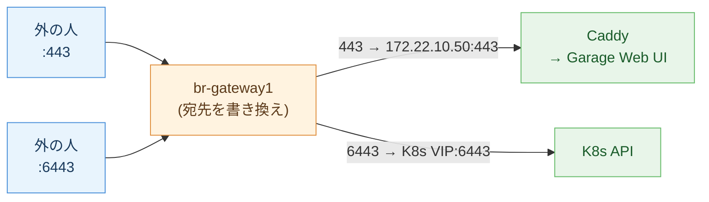
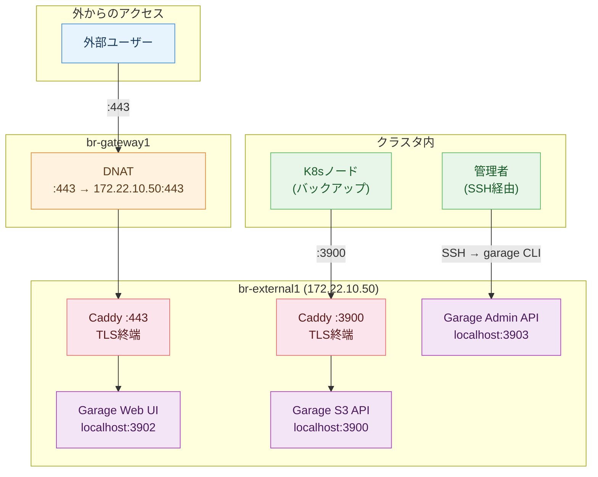
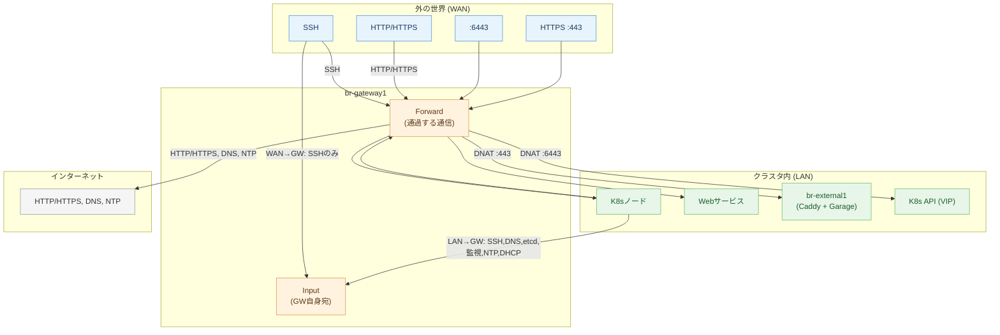

# br-gateway1 nftables ルール解説

## 全体像

`br-gateway1` は、クラスタの **玄関の門番** です。外の世界とクラスタ内の間に立って、全ての通信をチェックします。

門番は通信を **4つの場面** でチェックします。

---

## 1. Input = 「門番自身に話しかける通信」

ゲートウェイを通り抜けるのではなく、**ゲートウェイ本人宛** の通信です。

**基本方針: 全部拒否! 以下だけ通す**

### ① 外(WAN) → ゲートウェイ自身

| 許可するもの | 何に使う？ |
|---|---|
| SSH | 外からゲートウェイにログイン |

**これだけ。** 最低限に絞っています。

### ② クラスタ内(LAN) → ゲートウェイ自身

| 許可するもの | 何に使う？ |
|---|---|
| SSH | ノードからゲートウェイにログイン |
| DNS | 「google.com の IP 教えて」という名前解決 |
| etcd (2379) | K8s の設定データベース |
| node-exporter (9100) | 「CPU 使用率いくつ？」等の監視データ収集 |
| NTP | 時計合わせ |
| DHCP | 「IP アドレスちょうだい」 |

### 常に許可

| 許可するもの | 何に使う？ |
|---|---|
| ping (ICMP) | 「生きてる？」の確認 |

---

## 2. Output = 「門番自身が出す通信」

自分自身は信用しているので **全部許可** です。

---

## 3. Forward = 「門を通り抜ける通信」

ゲートウェイ自身には用がなく、**中継して通過する** 通信のルールです。これが一番重要。

**基本方針: 全部拒否! 以下だけ通す**

### クラスタ内 → 外 (LAN → WAN)

クラスタ内のマシンがインターネットに出る通信です。

| 許可するもの | 何に使う？ |
|---|---|
| HTTP / HTTPS | Web サイトへのアクセス、パッケージ取得、Flux の Git clone |
| DNS | 名前解決 |
| NTP | 時計合わせ |

**それ以外は拒否。** 例えば、ノードから外部への SSH は通せません。

### 外 → クラスタ内 (WAN → LAN)

外からクラスタ内のマシンにアクセスする通信です。

| 許可するもの | 何に使う？ |
|---|---|
| SSH | 外から LAN 内のどのノードにもログイン |
| HTTP / HTTPS | 外から LAN 内の Web サービスにアクセス |
| 6443 | 外から K8s API にアクセス (kubectl) |
| 443 (DNAT) | 外から Garage Web UI にアクセス (Caddy 経由) |

---

## 4. NAT = 「住所の書き換え」

クラスタ内のマシンは `172.22.x.x` というプライベート IP を持っています。これは **クラスタ内だけで通じる住所** で、外の世界からは直接アクセスできません。

そこでゲートウェイが **郵便局** のように住所を書き換えます。

### 中から外へ出るとき (マスカレード)

### 外から中へ入るとき (DNAT = 転送)

外からはクラスタ内の `172.22.x.x` が見えません。代わりにゲートウェイの IP + ポート番号で受けて、中の正しいマシンに転送します。

| 外から見えるアドレス | 転送先 | 用途 |
|---|---|---|
| `192.168.2.50:443` | `172.22.10.50:443` (Caddy) | Garage Web UI (TLS) |
| `192.168.2.50:6443` | K8s API VIP:6443 | kubectl 操作 |

---

## Garage まわりの通信フロー

Garage には複数のポートがありますが、用途によってアクセス経路が異なります。

| 経路 | 用途 | TLS |
|---|---|---|
| 外 → GW(:443) → Caddy → Garage Web UI | Web UI を外から閲覧 | あり |
| K8sノード → Caddy(:3900) → Garage S3 API | バックアップ (Restic, Longhorn, Barman) | あり |
| SSH → garage CLI → Admin API (localhost:3903) | バケット作成・キー管理 | 不要 (localhost) |

---

## 全通信の一覧

