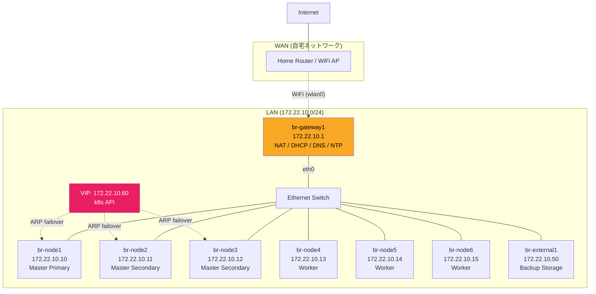
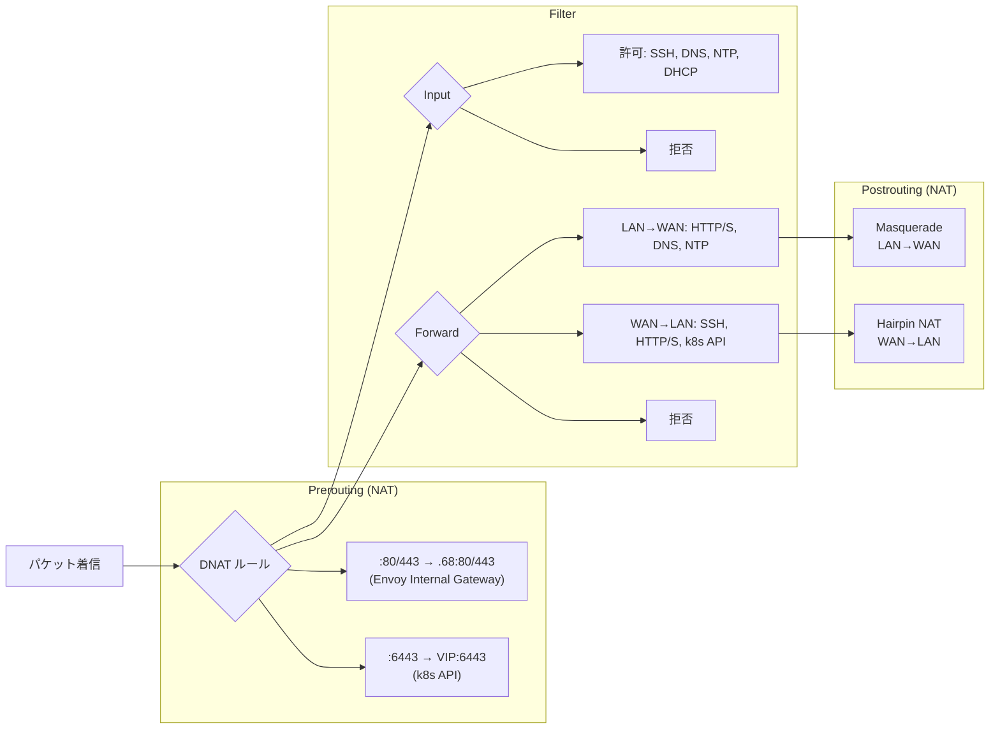

# ネットワーク設計

## ネットワーク構成図



## IP アドレス設計

| ホスト / 用途 | IP アドレス | 備考 |
|---|---|---|
| br-gateway1 (LAN 側) | 172.22.10.1 | DHCP/DNS/NTP サーバー |
| br-node1 | 172.22.10.10 | k3s Master (Primary) |
| br-node2 | 172.22.10.11 | k3s Master (Secondary) |
| br-node3 | 172.22.10.12 | k3s Master (Secondary) |
| br-node4 | 172.22.10.13 | k3s Worker |
| br-node5 | 172.22.10.14 | k3s Worker |
| br-node6 | 172.22.10.15 | k3s Worker |
| br-external1 | 172.22.10.50 | バックアップストレージ (Garage) |
| k8s API VIP | 172.22.10.60 | kube-vip (フローティング IP) |
| Envoy Public Gateway LB | 172.22.10.64 | *.b8m.app 外部公開 |
| Fluentd LB | 172.22.10.65 | ログ収集 |
| Envoy Internal Gateway LB | 172.22.10.68 | *.cluster-internal.bright-room.net 内部サービス |
| DHCP 範囲 | 172.22.10.100 - .200 | 未割り当てノード用 |

> IP アドレスの実際の値は 1Password に格納されています。上記は設計上の割り当て例です。

## ゲートウェイの役割

br-gateway1 はクラスタの「関所」です。2 つのネットワークインターフェースを持ちます。

| インターフェース | 接続先 | 用途 |
|---|---|---|
| wlan0 | WiFi (自宅ルーター) | WAN 接続 |
| eth0 | Ethernet Switch | LAN 接続 (172.22.10.0/24) |

ゲートウェイが提供するサービス:

- **NAT**: LAN → WAN のアドレス変換（マスカレード）
- **DHCP**: LAN 内ノードへの IP 自動配布
- **DNS**: LAN 内の名前解決（フォワーダー: 8.8.8.8 / 8.8.4.4）
- **NTP**: 時刻同期（upstream: ntp.nict.jp）
- **ファイアウォール**: nftables による通信制御

## ファイアウォール (nftables)

ゲートウェイの nftables は「デフォルト拒否」ポリシーで、必要な通信だけを許可します。

### パケットフロー



### 許可されている通信

**Input (ゲートウェイ自体への通信)**

| 方向 | プロトコル | ポート | 用途 |
|---|---|---|---|
| LAN → GW | TCP | SSH, domain, 2379, 9100 | SSH / DNS / etcd / Prometheus |
| LAN → GW | UDP | domain, ntp, bootps | DNS / NTP / DHCP |
| WAN → GW | TCP | SSH | リモート管理 |

**Forward (ゲートウェイを通過する通信)**

| 方向 | プロトコル | ポート | 用途 |
|---|---|---|---|
| LAN → WAN | TCP | HTTP, HTTPS, domain | Web アクセス、DNS |
| LAN → WAN | UDP | domain, ntp | DNS、NTP |
| WAN → LAN | TCP | SSH | ノードへの SSH (ProxyJump) |
| WAN → LAN | TCP | HTTP, HTTPS | Web サービス |
| WAN → LAN | TCP | 6443 | Kubernetes API (DNAT → VIP) |

**NAT (アドレス変換)**

| ルール | 変換内容 |
|---|---|
| Masquerade | LAN (172.22.10.0/24) → WAN 発信時にゲートウェイの WAN IP に変換 |
| DNAT :80 | WAN:80 → 172.22.10.68:80 (Envoy Internal Gateway) |
| DNAT :443 | WAN:443 → 172.22.10.68:443 (Envoy Internal Gateway) |
| DNAT :6443 | WAN:6443 → 172.22.10.60:6443 (k8s API VIP) |
| Hairpin NAT | WAN → LAN の DNAT 後に送信元もマスカレード (ヘアピン) |

## DNS アーキテクチャ

DNS は 2 層構成です。

| 層 | 提供元 | 用途 |
|---|---|---|
| LAN DNS | br-gateway1 (dnsmasq) | LAN 内ノードの名前解決。フォワーダーとして 8.8.8.8 / 8.8.4.4 を使用 |
| クラスタ DNS | CoreDNS (k8s Pod) | Kubernetes Service / Pod の名前解決 |

### 内部ドメイン

クラスタドメインは `cluster-internal.bright-room.net` です。

| ドメイン | 解決先 |
|---|---|
| `br-gateway1.cluster-internal.bright-room.net` | 172.22.10.1 |
| `br-node1.cluster-internal.bright-room.net` | 172.22.10.10 |
| `backup-storage.cluster-internal.bright-room.net` | 172.22.10.50 |
| `k8s-api.cluster-internal.bright-room.net` | 172.22.10.60 (VIP) |

### ドメイン体系

このクラスタでは 2 つのドメインを使い分けています。

| ドメイン | 用途 | DNS 管理 | アクセス経路 |
|---|---|---|---|
| `*.cluster-internal.bright-room.net` | インフラ (ノード間通信, S3, 内部 Web UI) | Gateway CoreDNS (静的 + External DNS 書込) | WAN → DNAT → Internal Gateway (172.22.10.68) |
| `*.b8m.app` | K8s サービス外部公開 (Grafana, Keycloak 等) | Cloudflare DNS | Internet → Cloudflare Tunnel → Public Gateway (172.22.10.64) |

**External DNS の仕組み**: Kubernetes 内の HTTPRoute リソースにホスト名が定義されると、External DNS が自動的にゲートウェイの CoreDNS (etcd バックエンド) に `*.cluster-internal.bright-room.net` の DNS レコードを登録します。手動での DNS 設定は不要です。

### WAN からの内部サービスアクセス (Split-horizon DNS)

WAN クライアント (開発 Mac 等) から `*.cluster-internal.bright-room.net` のサービスにアクセスする場合:

1. DNS クエリ → Gateway の WAN 側 CoreDNS が WAN IP を返す (template によるワイルドカード応答)
2. WAN IP:80/443 へ接続 → nftables DNAT → Internal Gateway (172.22.10.68)
3. Internal Gateway が Host ヘッダーで適切なサービスにルーティング

個別の DNAT ルール:
- `k8s-api.cluster-internal.bright-room.net:6443` → DNAT → 172.22.10.60 (k8s API VIP)

## ノード間の通信パス

クラスタ内の主要な通信経路の一覧です。

| 通信元 | 通信先 | プロトコル | 用途 |
|---|---|---|---|
| 全ノード | br-gateway1:53 | UDP/TCP | DNS 名前解決 |
| 全ノード | br-gateway1:123 | UDP | NTP 時刻同期 |
| 全ノード | br-external1:3900 | HTTPS | Restic バックアップ → Garage S3 |
| Worker Pods | br-external1:3900 | HTTPS | Loki/Tempo/Longhorn/Velero → Garage S3 |
| Worker Pods | br-gateway1:2379 | HTTP | External DNS → etcd (DNS レコード書込) |
| Secondary Masters | br-node1:6443 | HTTPS | k3s join (ブートストラップ時) |
| kubectl / FluxCD | 172.22.10.60:6443 | HTTPS | K8s API (Kube-VIP 経由) |
| WAN | br-gateway1 | TCP | SSH, HTTP/S, K8s API(6443) フォワード |
| br-gateway1 | WAN | UDP/TCP | DNS forwarder (8.8.8.8), NTP upstream (ntp.nict.jp) |

## kube-vip: Kubernetes API の高可用性

kube-vip は 3 台のマスターノード上に DaemonSet として動作し、**172.22.10.60** の仮想 IP を共有します。

```
              ┌─ br-node1 (Master) ─ VIP 保持 ─┐
kubectl ──→ 172.22.10.60 ←─ ARP ─┤                            │
              ├─ br-node2 (Master) ─ standby    │
              └─ br-node3 (Master) ─ standby    │
                                                 │
         ※ 障害発生時、ARP で VIP が別ノードに移動 ←┘
```

- **プロトコル**: ARP (Layer 2 フェイルオーバー)
- **効果**: マスターノードが 1 台停止しても、他のマスターが VIP を引き継ぎ、kubectl や worker ノードからの API アクセスが途切れない
- **なぜ L2 か**: 同一サブネット (172.22.10.0/24) 内のため、BGP のような L3 ルーティングは不要
