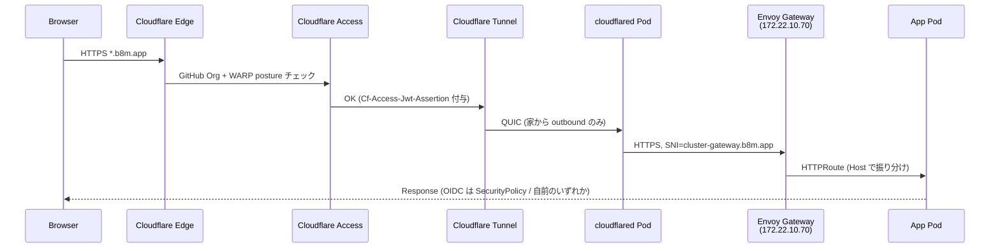

# ネットワーク設計

IP 設計、ファイアウォール、DNS、VIP、外部公開の経路をまとめる。物理構成は [`docs/hardware.md`](hardware.md) を参照。

## サブネット

数値ソース: [`provisioner/inventories/base/group_vars/all/network.yaml`](../provisioner/inventories/base/group_vars/all/network.yaml) (cluster_network / dhcp / cluster_vips)、Pod/Service CIDR は k3s デフォルト。

| 範囲                          | 用途                                  | 出典 |
|-------------------------------|---------------------------------------|------|
| `172.22.10.0/24`              | クラスタ LAN                          | `cluster_network.cidr` |
| `172.22.10.1`                 | `br-gateway1` (静的)                  | `cluster_hosts[br-gateway1].ip` |
| `172.22.10.10–15`             | `br-node1-6` (Kea DHCP の MAC reservation で固定) | `cluster_hosts` |
| `172.22.10.50`                | `br-external1` (同上)                 | `cluster_hosts[br-external1].ip` |
| `172.22.10.60`                | k8s API VIP (kube-vip ARP)            | `cluster_vips[k8s-api]` |
| `172.22.10.64/26` (.64–.127)  | LoadBalancer IP プール (Cilium LB-IPAM) | `manifests/platform/cilium/config/base/ip-pool-lb.yaml` |
| `172.22.10.70`                | cluster-gateway (Envoy, 外部公開)     | `CLUSTER_GATEWAY_IP` |
| `172.22.10.71`                | internal-gateway (Envoy, LAN 内向け)  | `INTERNAL_CLUSTER_GATEWAY_IP` |
| `172.22.10.100–200`           | DHCP 動的レンジ (予備、reservation 範囲外) | `dhcp.range_*` |
| `10.42.0.0/16`                | k3s Pod CIDR (Cilium)                 | nftables `pod_cidr` define |
| `10.43.0.0/16`                | k3s Service CIDR (k3s デフォルト)     | `coredns_cluster_ip: 10.43.0.10` |

## ホスト IP / VIP

ノード IP は [`provisioner/inventories/prod/group_vars/all/cluster_hosts.yaml`](../provisioner/inventories/prod/group_vars/all/cluster_hosts.yaml) で MAC アドレスとセットで定義され、Kea DHCP の host reservation として配布される (動的レンジの `.100–200` は予備)。

| IP             | 名称              | 提供者                        | 内部 DNS 名 |
|----------------|-------------------|-------------------------------|-------------|
| `172.22.10.1`  | `br-gateway1`     | 静的 (cloud-init / cluster_hosts) | `gateway1.cluster-internal.bright-room.net`、`dns.…`、`ntp.…` |
| `172.22.10.10` | `br-node1`        | Kea DHCP reservation          | `node1.cluster-internal.bright-room.net` |
| `172.22.10.11` | `br-node2`        | Kea DHCP reservation          | `node2.…` |
| `172.22.10.12` | `br-node3`        | Kea DHCP reservation          | `node3.…` |
| `172.22.10.13` | `br-node4`        | Kea DHCP reservation          | `node4.…` |
| `172.22.10.14` | `br-node5`        | Kea DHCP reservation          | `node5.…` |
| `172.22.10.15` | `br-node6`        | Kea DHCP reservation          | `node6.…` |
| `172.22.10.50` | `br-external1`    | Kea DHCP reservation          | `external1.…`、`object-storage.…` |
| `172.22.10.60` | k8s API VIP       | kube-vip DaemonSet (control-plane で ARP) | `k8s-api.cluster-internal.bright-room.net` |
| `172.22.10.70` | cluster-gateway   | Cilium LB-IPAM (annotation 固定) + L2 announce | `*.b8m.app` 終端 |
| `172.22.10.71` | internal-gateway  | 同上                          | LAN 内サービス向け |

### LB IP の払い出し方式

`172.22.10.70` (cluster-gateway) / `172.22.10.71` (internal-gateway) は Cilium LB-IPAM プール `172.22.10.64/26` から annotation で明示固定。annotation 例 / ARP 二重化 (Cilium L2 + kube-vip svc_enable) / 追加手順は [`docs/platform/networking.md#lb-ip-払い出し`](platform/networking.md#lb-ip-払い出し)。

## DHCP / DNS / NTP (gateway1)

| サービス | 実装           | 配布レンジ / 主な役割 | 設定先 |
|----------|----------------|------------------------|--------|
| DHCP     | Kea (`kea-dhcp4-server`) | `172.22.10.100–200` (予備動的)、ホストは MAC reservation で固定 | [`provisioner/roles/gateway/tasks/dhcp.yaml`](../provisioner/roles/gateway/tasks/dhcp.yaml) |
| DNS      | CoreDNS + etcd plugin | 内部ゾーン権威、外部は `8.8.8.8` / `8.8.4.4` にフォワード | [`provisioner/roles/gateway/templates/Corefile.j2`](../provisioner/roles/gateway/templates/Corefile.j2) |
| NTP      | systemd-timesyncd 等   | 上流 `ntp.nict.jp` (フォールバック `ntp{1,2,3}.jst.mfeed.ad.jp`) | [`provisioner/roles/gateway/tasks/ntp.yaml`](../provisioner/roles/gateway/tasks/ntp.yaml) |

DHCP option で配布する DNS は `172.22.10.1` (gateway1 の CoreDNS)。Pod・ノード問わず全名前解決の入口は gateway1。

## DNS ゾーン

### 内部ゾーン (`cluster-internal.bright-room.net`)

| 項目 | 内容 |
|------|------|
| 権威  | gateway1 の CoreDNS |
| 静的レコード  | `cluster_hosts[*].domains` と `cluster_vips[*].domain` を Corefile の `hosts` ブロックに展開 |
| 動的レコード  | k3s 内の **external-dns-coredns** が Gateway/HTTPRoute から etcd (`http://172.22.10.1:2379`) 経由で skydns 形式で書き込み、CoreDNS の `etcd` プラグインが配信 |

### 外部ゾーン (`b8m.app`)

| 項目 | 内容 |
|------|------|
| 権威 | Cloudflare DNS (別リポジトリ `br-cloudflare-terraform` で IaC 管理) |
| 動的レコード | k3s 内の **external-dns-cloudflare** が Gateway/HTTPRoute から CNAME を書き込み |
| Gateway target | `external-dns.alpha.kubernetes.io/target` で Tunnel CNAME (`<tunnel-id>.cfargotunnel.com`) を指す (Gateway 側に書く / external-dns v0.21+ の gateway-api source は HTTPRoute からは読まない) |
| CF Proxy | HTTPRoute の `external-dns.alpha.kubernetes.io/cloudflare-proxied: "true"` で有効化 |

### WAN から引ける内部名

`wan_exposed_domains` に列挙した名前のみ、CoreDNS が **gateway1 の WAN IP** を返す (Corefile の WAN 側 bind ブロックで定義)。実体到達は次節 nftables の DNAT。

```yaml
# group_vars/all/network.yaml
wan_exposed_domains:
  - "k8s-api.{{ cluster_domain }}"
```

## ファイアウォール (nftables on gateway1)

全文は [`provisioner/inventories/base/host_vars/br-gateway1.yaml`](../provisioner/inventories/base/host_vars/br-gateway1.yaml)。要点を抜粋。

### INPUT (gateway1 自身あての着信)

| 入口            | 許可ポート |
|-----------------|-----------|
| LAN `eth0` TCP  | `ssh`, `domain`(53), `2379` (etcd), `9100` (kube node-exporter), `9101` (systemd node-exporter), `12345` (Alloy HTTP) |
| LAN `eth0` UDP  | `domain`, `ntp`, `bootps` (DHCP) |
| WAN `wlan0` TCP | `ssh`, `domain` |
| WAN `wlan0` UDP | `domain` |
| Pod CIDR `10.42/16` TCP | `domain`, `2379` (CoreDNS ↔ etcd) |

### FORWARD (経路許可)

| 方向         | 許可 |
|--------------|------|
| LAN → WAN TCP | `http`, `https`, `domain`, `7844` (cloudflared QUIC), `submission` (587, Zitadel → Resend SMTP) |
| LAN → WAN UDP | `domain`, `ntp`, `7844` |
| WAN → LAN     | `ssh` (任意ノード), `tcp/6443` (k8s-api VIP `172.22.10.60` 宛のみ) |

### NAT

| チェーン      | ルール |
|---------------|--------|
| `prerouting`  | DNAT: WAN `tcp/6443` → `172.22.10.60:6443` (k8s API) |
| `postrouting` | LAN → WAN masquerade、WAN → LAN hairpin masquerade (DNAT 戻り経路) |

## 外部公開フロー (`https://<svc>.b8m.app`)



ポイント:
- **家庭ルーターのポート開放は不要**。outbound QUIC のみで全部成立
- TLS 終端は Envoy で実施 (`*.b8m.app` を cert-manager + Let's Encrypt DNS01 で自動発行)
- 認証は 2 層: Cloudflare Access (ネットワーク層) + Zitadel OIDC (アプリ層)
- 詳細な認証フローは [`docs/architecture.md`](architecture.md)

## クラスタ内限定の経路 (internal-gateway)

| 項目 | 内容 |
|------|------|
| IP | `172.22.10.71` (LB-IPAM annotation で固定) |
| 用途 | 非 k3s ノード (gateway1 / external1) の Alloy から Loki 等への push |
| アクセス | LAN 内からのみ (Cloudflare Tunnel を経由しない) |

k3s ノード自身からは **`localhost:30800` (NodePort)** 経由で Loki に push する。Cilium eBPF kube-proxy replacement が自ノードで NodePort を backend に変換するため、自ノードが L2 lease holder でなくても動く。

## 関連

- [`docs/hardware.md`](hardware.md) — 物理構成・NIC 割当
- [`docs/kubernetes.md`](kubernetes.md) — k3s 内部 (Cilium / Gateway 等)
- [`docs/architecture.md`](architecture.md) — 設計判断 (なぜ Cloudflare Tunnel か等)
- [`docs/network-nftables-guide.md`](network-nftables-guide.md) — nftables ルールの初学者向け解説
- [`provisioner/inventories/prod/group_vars/all/cluster_hosts.yaml`](../provisioner/inventories/prod/group_vars/all/cluster_hosts.yaml) — ホスト IP/MAC の SoT
