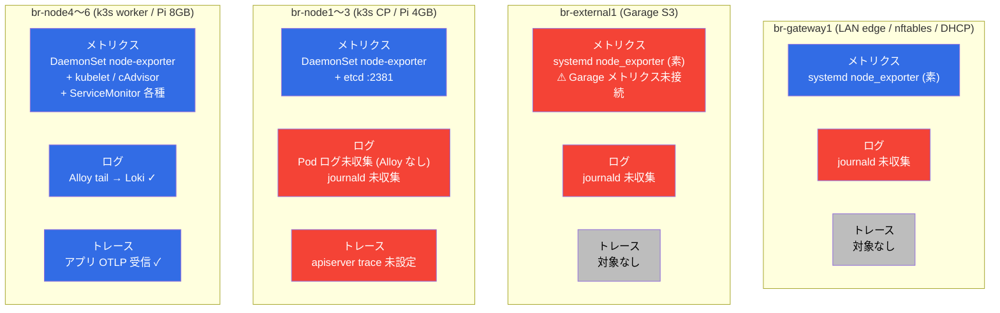
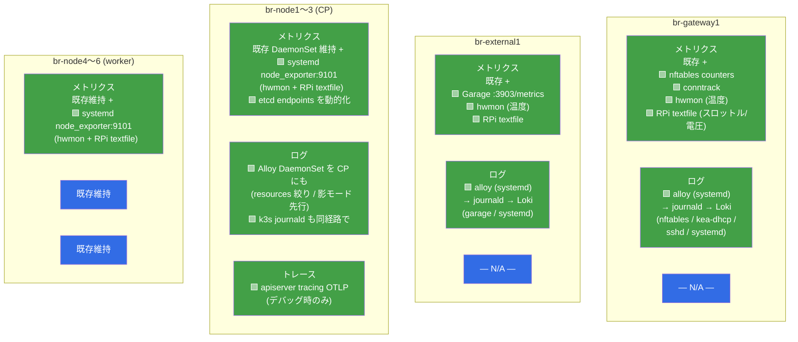
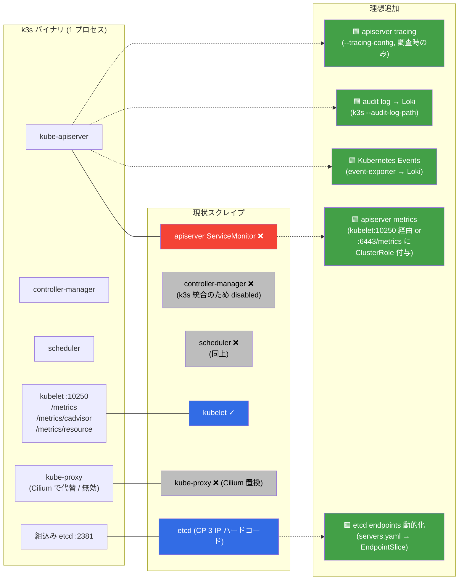
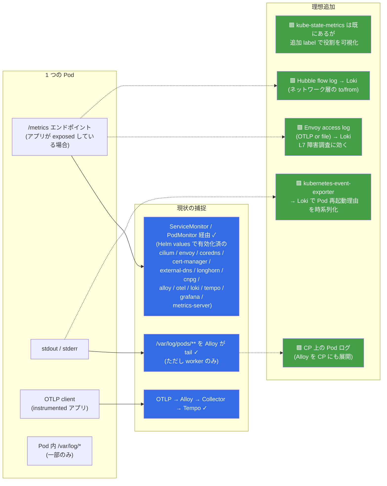
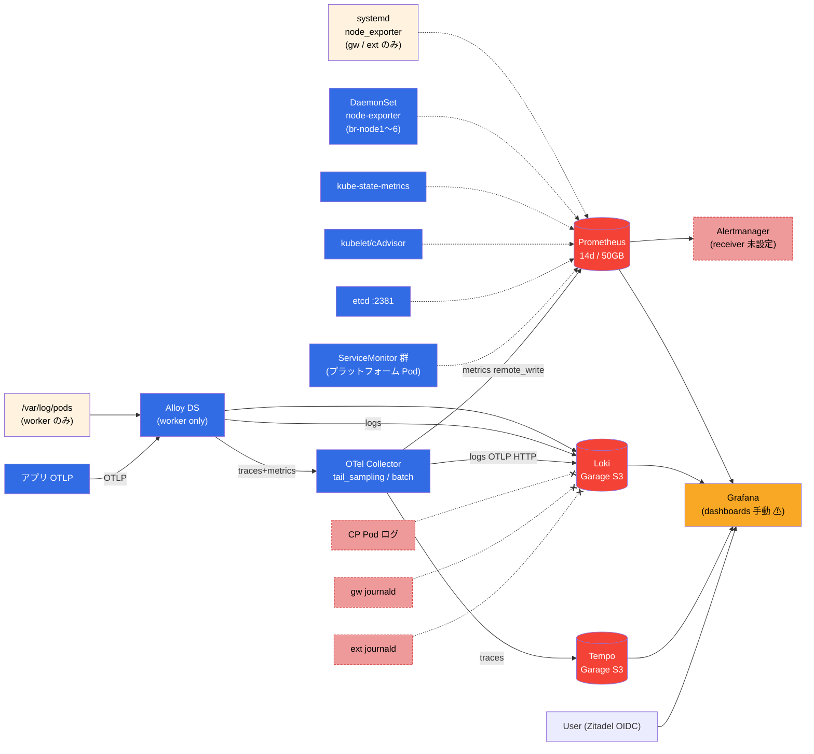
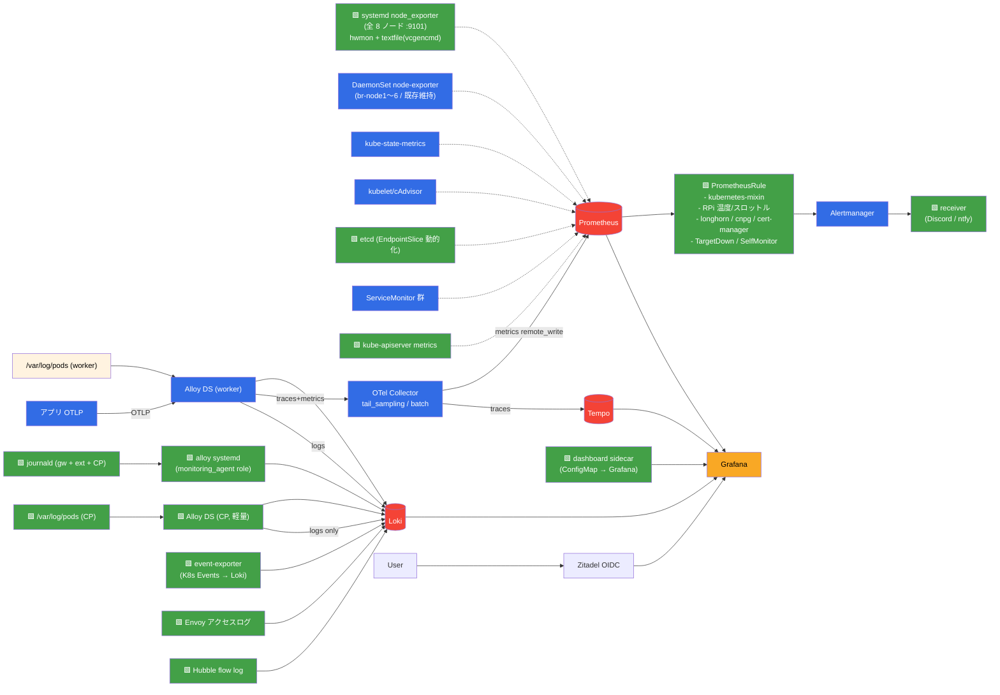

# 可観測性 メンタルモデル

「どのサーバーから / k3s から / Pod から / 何を取って / どこへ送るか」を整理した視覚化ドキュメント。
色の意味は全図共通:

- 🟦 青 = 現状 **取れている**
- 🟥 赤 = 現状 **取れていない** (ギャップ)
- 🟩 緑 = 理想で **追加する**

---

## 1. サーバー役割ごとのシグナル収集マトリクス

### 現状

### 理想

---

## 2. k3s 自身から取れるもの

k3s は **control-plane コンポーネントが 1 バイナリに同梱**されているのが普通の k8s と違う点。個別の endpoint を叩くのではなく、kubelet + etcd だけで大半が取れる。

**要点**:
- `kubeControllerManager` / `kubeScheduler` / `kubeProxy` を `enabled: false` にしているのは**正解** (k3s では別エンドポイントで叩けない)
- kubelet / etcd / kube-state-metrics / node-exporter で **k8s 稼働状況のほぼ全てが取れる**
- 追加するなら **apiserver metrics** (API 応答性 / admission latency) と **Events** (Pod 再起動理由など、メトリクスで拾えない情報) が価値高い

---

## 3. 動いている Pod から取れるもの

**要点**:
- 大半のプラットフォーム Pod は `/metrics` を持っていて Helm values で ServiceMonitor が有効化されている (Explore 調査で 12 種類以上確認)
- **足りないのは「stdout 以外の観測情報」**: Kubernetes Events / Envoy アクセスログ / Hubble flow
- アプリ独自の観測 (RED / USE / SLI) は**アプリを instrument して OTLP で吐く** → 既存経路で Tempo + Prometheus remote_write に乗る

---

## 4. 全体経路

### 現状

### 理想

---

## 5. 「何を見たいか」→「どこから取るか」早見表

| 見たい情報 | シグナル | 源泉 |
|---|---|---|
| ノード CPU/メモリ/ディスク/ネット | metrics | node_exporter (現状は DaemonSet or systemd) |
| **RPi 温度/スロットル/電圧** | metrics | 🟩 hwmon + textfile collector (vcgencmd) |
| k8s オブジェクトの状態 (desired vs current) | metrics | kube-state-metrics |
| コンテナ CPU/メモリ 実使用 | metrics | kubelet /metrics/cadvisor |
| etcd の健全性 (raft leader, latency) | metrics | etcd :2381 |
| Pod が何回再起動したか (時系列) | logs | 🟩 event-exporter → Loki |
| Pod の stdout (アプリログ) | logs | Alloy tail (現状 worker only → CP も) |
| **nftables でパケットがどれだけ落ちたか** | metrics/logs | 🟩 nftables counters + journald |
| **Garage (S3) の健全性** | metrics | 🟩 Garage :3903/metrics |
| **どの HTTP リクエストが 5xx 返してるか** | logs | 🟩 Envoy アクセスログ |
| **Pod A が Pod B と通信できているか** | logs | 🟩 Hubble flow log |
| アプリのリクエスト latency 分布 | metrics/traces | アプリ instrument → OTLP |
| クロスサービスのリクエスト追跡 | traces | アプリ instrument → Tempo |
| 温度が 75℃ 超えたら通知 | alert | 🟩 PrometheusRule → Alertmanager → Discord |

---

## 6. まとめ: 何から手を付けるべきか

**2026-04-23 時点で Phase 0 + Phase 1 完了**。元の 2 つの穴は埋まった:

| 元の穴 | 解消状態 |
|---|---|
| 通知経路が開通していない | ✅ Discord receiver + 25 PrometheusRule + 13 ダッシュボード (code 化) + externalUrl で Source リンクまで機能 |
| ホスト OS 層の可視化が分散 | ✅ systemd node_exporter を全 8 ノードに展開 (:9101)、温度 / クロック / 電圧 / スロットルまで可視化、RPi 専用アラートあり |

残りのギャップ (Phase 2 候補、優先度順は `observability-plan.md`):

- 🟨 **CP ノードの Pod ログ** が未収集 (Alloy が worker only、cascade 再発リスクで慎重に)
- 🟨 **外部ノードの journald** が未収集 (monitoring_agent role が広がったので追加容易)
- 🟨 **K8s Events** が Loki に流れていない (event-exporter で解消可能)
- 🟨 **Envoy アクセスログ** が Loki に無い (L7 可視化、サンプリング前提)
- 🟨 **Hubble flow log** が Loki に無い (L3/4 可視化、drop 判定のみから)
- 🟨 **kubeEtcd endpoints** がハードコード (servers.yaml からの生成化は nice-to-have)

詳細は `observability-plan.md` の Phase 2 セクション。
