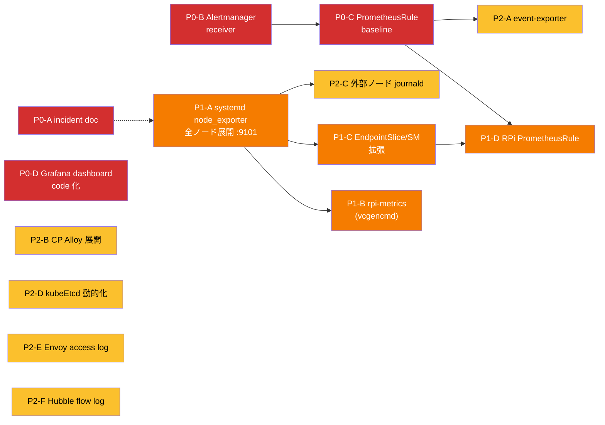

# 可観測性 拡充 実行プラン

`observability-map.md` で合意した 2 つの穴 (通知経路 / ホスト層統一) を埋めるための PR 単位の実行計画。
各 PR は**単独でマージ可能 / 単独で revert 可能**になるようスコープを切る。

---

## 方針

1. **観測を先に** — アラートで気付ける状態を作ってから、新しいものを足す
2. **非破壊** — 既存の DaemonSet / ServiceMonitor は**撤去しない**。追加のみで価値を出す
3. **影モード** — 新規エージェント (CP Alloy 等) は低リソース制限で 1〜2 週間観察後に本番化
4. **1 PR = 1 責務** — 複合変更は避け、revert 容易性を優先

---

## 依存関係サマリ

---

## Phase 0: 通知経路 + 検知基盤 (最優先)

### P0-A: 過去インシデント文書化

- **目的**: overlay で参照されているのに空の `docs/incidents/2026-04-13-observability-cascade.md` を実体化し、意思決定の根拠を永続化する
- **変更ファイル**: `docs/incidents/2026-04-13-observability-cascade.md` (新規)
- **内容**:
  - 事象のタイムライン (記憶ベースで OK)
  - 根本原因: fluent-bit/fluentd の apiserver log-follow による client-go throttle → cascade
  - 対処: Alloy へ移行 (ファイル tail) / Longhorn `nodeDownPodDeletionPolicy: do-nothing` / node-exporter は CP も残す / 重量コンポーネントは worker 固定
- **リスク**: なし (doc のみ)

### P0-B: Alertmanager receiver 開通

- **目的**: アラートを実際に届く状態にする
- **変更ファイル**:
  - `manifests/platform/kube-prometheus-stack/app/base/values.yaml` — `alertmanagerSpec.configSecret` を指定
  - `manifests/platform/kube-prometheus-stack/app/base/externalsecret-alertmanager.yaml` (新規)
  - 1Password 側に `alertmanager-webhook` Item を作成 (Discord Webhook URL 推奨 / ntfy topic でも可)
- **実装ポイント**:
  - receiver は 1 つから始める (Discord webhook 推奨)
  - `inhibit_rules` で重複抑制
  - `route.group_by: [alertname, namespace]`、`group_wait: 30s`, `repeat_interval: 4h`
- **検証**: `amtool check-config` + テスト用 `Watchdog` アラートが Discord に届くこと
- **リスク**: 低 (外向き通信のみ)

### P0-C: PrometheusRule 基盤

- **目的**: 最低限の検知ルールを入れて、アラートが飛ぶ状態にする
- **変更ファイル**:
  - `manifests/platform/kube-prometheus-stack/rules/base/` (新規ディレクトリ)
    - `kustomization.yaml`
    - `rule-cluster-health.yaml` — `TargetDown` / `Watchdog` / `PrometheusOutOfDiskSpace` / `KubeAPIDown`
    - `rule-workload.yaml` — `KubePodCrashLooping` / `KubePodNotReady` / `KubeNodeNotReady` / `KubeDeploymentReplicasMismatch`
    - `rule-storage.yaml` — `LonghornVolumeActualSpaceUsedCritical` / `LonghornDiskSpaceCritical` / `CNPGBackupFailed`
    - `rule-cert.yaml` — `CertManagerCertExpirySoon` / `CertManagerCertNotReady`
  - `manifests/clusters/prod/platform/kustomization.yaml` にリソース追加
- **方針**:
  - **`defaultRules.create: false` は維持** (k3s で合わないルールを個別除外するより、必要なものを明示的に書くほうがレビューしやすい)
  - PromQL は `kubernetes-mixin` / `longhorn-mixin` / `cnpg-mixin` を参照して写経
- **依存**: P0-B (先に通知先が無いとサイレントになる)
- **リスク**: 低 (ルールだけなのでクラスタ影響なし)

### P0-D: Grafana ダッシュボード code 化

- **目的**: 手動作成のダッシュボードをロストさせない & 初期立ち上げで即可視化
- **変更ファイル**:
  - `manifests/platform/grafana/app/base/values.yaml` — `sidecar.dashboards.enabled: true`, label selector `grafana_dashboard=1`
  - `manifests/platform/grafana/dashboards/base/` (新規ディレクトリ)
    - `kustomization.yaml`
    - `configmap-node-exporter-full.yaml` — Grafana.com ID 1860
    - `configmap-cilium.yaml` — ID 16611
    - `configmap-envoy-gateway.yaml` — 公式 dashboard
    - `configmap-loki.yaml` / `configmap-tempo.yaml`
    - `configmap-cnpg.yaml` — 公式
- **実装ポイント**:
  - ConfigMap 名は `grafana-dashboard-<name>`、label `grafana_dashboard=1`
  - JSON は `grafana.com/dashboards/<id>` の download URL を CI でキャッシュ、もしくは手動で scripts/fetch-dashboards.sh
- **リスク**: 低 (UI レイヤのみ)

**Phase 0 完了時点の到達姿**:
- アラートが Discord に届く
- 主要な障害は通知される
- ダッシュボードが git 管理
- incident 背景が doc 化

---

## Phase 1: ホスト層統一 + RPi メトリクス (Phase 0 完了後)

### P1-A: systemd node_exporter 全ノード展開 + collector 拡張

- **目的**: ホスト OS メトリクスを全 8 ノードで統一実装に。DaemonSet は**撤去しない** (observability-cascade 対策維持)
- **変更ファイル**:
  - `provisioner/playbooks/setup_monitoring_agent.yaml` — `hosts: gateway:external` → `hosts: all`
  - `provisioner/roles/monitoring_agent/defaults/main.yaml` — `port: 9100` → `port: 9101`
  - `provisioner/roles/monitoring_agent/templates/node_exporter.service.j2` — `--collector.hwmon --collector.thermal_zone --collector.textfile.directory=/run/node_exporter/textfile` を追加 / `RuntimeDirectory=node_exporter/textfile` を追加
  - `provisioner/roles/monitoring_agent/tasks/node_exporter.yaml` — tmpfs ディレクトリの準備は RuntimeDirectory に任せるので不要
- **ポート設計**: :9100 = DaemonSet (既存) / :9101 = systemd (新規) で**共存**
- **検証**:
  - `curl http://br-nodeN:9101/metrics | grep node_hwmon_temp_celsius` で温度取得
  - 既存 DaemonSet のスクレイプが継続していること
- **リスク**: 低 (追加のみ / ~30MB RSS per ノード / apiserver 依存なし)

### P1-B: rpi-metrics (textfile + vcgencmd)

- **目的**: node_exporter 内蔵で取れないスロットル / 実クロック / 電圧を textfile で埋める
- **変更ファイル**:
  - `provisioner/roles/monitoring_agent/templates/rpi-metrics.sh.j2` (新規)
  - `provisioner/roles/monitoring_agent/templates/rpi-metrics.service.j2` (新規)
  - `provisioner/roles/monitoring_agent/templates/rpi-metrics.timer.j2` (新規, 30s 周期)
  - `provisioner/roles/monitoring_agent/tasks/rpi_metrics.yaml` (新規)
  - `provisioner/roles/monitoring_agent/tasks/main.yaml` — include
- **rpi-metrics.sh の出力**:
  - `rpi_arm_clock_hertz <val>`
  - `rpi_core_volts <val>`
  - `rpi_throttled_state <hex>` (ビット展開は **Phase 1-D でルール書くときに判定**、メトリクスは raw の state でよい)
  - `rpi_throttled_undervoltage_now 0|1`
  - `rpi_throttled_freq_capped_now 0|1`
  - `rpi_throttled_throttled_now 0|1`
  - `rpi_throttled_undervoltage_occurred 0|1` など
- **atomic rename**: `.prom.$$` で書いて `mv` (node_exporter がファイル書き込み中に読むのを回避)
- **依存**: P1-A (textfile collector が有効化されている前提)
- **リスク**: 低

### P1-C: EndpointSlice / ServiceMonitor 拡張

- **目的**: systemd :9101 を Prometheus から可視化
- **変更ファイル**:
  - `manifests/platform/kube-prometheus-stack/externalnodes-monitoring/` を `host-monitoring/` に**改名** (git mv)
  - `host-monitoring/base/endpoints.yaml` — br-node1〜6 の IP を追加、`port: 9101`
  - `host-monitoring/base/service-monitor.yaml` — `job=node-exporter-host` を relabeling で固定
  - `host-monitoring/base/service.yaml` — port 9101
  - `manifests/clusters/prod/platform/kustomization.yaml` — パス更新
- **ラベル戦略**:
  - DaemonSet 側: `job=node-exporter` (既存)
  - systemd 側: `job=node-exporter-host` (新規) — **別 job 名で共存**、ダッシュボードもラベルで切替可能
  - `instance=<nodeName>` に統一
- **(将来) servers.yaml からの生成**: 本 PR では手書き、別 PR で generator 化
- **依存**: P1-A
- **リスク**: 低

### P1-D: RPi 固有 PrometheusRule

- **目的**: 温度・スロットル・電圧アラート
- **変更ファイル**: `manifests/platform/kube-prometheus-stack/rules/base/rule-rpi.yaml` (新規)
- **ルール**:
  - `NodeHighTemperature` — `max(node_hwmon_temp_celsius) by (instance) > 75` for 5m (warning)
  - `NodeCriticalTemperature` — `> 80` for 2m (critical)
  - `NodeUndervoltageNow` — `rpi_throttled_undervoltage_now == 1` for 1m (critical)
  - `NodeFreqCappedNow` — `rpi_throttled_freq_capped_now == 1` for 5m (warning)
  - `NodeThrottledNow` — `rpi_throttled_throttled_now == 1` for 5m (warning)
- **依存**: P1-B (メトリクスが生成されている前提), P0-C (rules/ ディレクトリが既にある)
- **リスク**: 低

**Phase 1 完了時点の到達姿**:
- 全 8 ノードで温度 / スロットル / 電圧が可視化
- RPi 固有障害が検知できる
- ホスト OS 層が単一 role (monitoring_agent) で管理される

---

## Phase 2: 観測穴埋め (Phase 1 完了後 / 優先度は状況次第)

- **P2-A**: `kubernetes-event-exporter` 導入 → K8s Events を Loki に流す (Pod 再起動理由の時系列化)
- **P2-B**: CP ノードに Alloy DaemonSet 展開 (影モード: `memory: 64Mi req / 192Mi limit` で 2 週間観察 → 本番化)
- **P2-C**: 外部ノード (gw / ext) に alloy systemd 版 → journald → Loki
- **P2-D**: kubeEtcd endpoints を servers.yaml から生成 or Service/EndpointSlice 化
- **P2-E**: Envoy Gateway アクセスログ → Loki (初手は 5xx のみサンプリング)
- **P2-F**: Hubble flow log → Loki (初手は drop 判定のみ)

Phase 2 は**どれも単独で価値があるので、優先度を 1 つずつ決めて個別着手**でよい。

---

## Phase 3: 将来検討 (保留)

- Thanos Sidecar (長期保存) — Garage S3 再利用
- Tempo metrics-generator (span metrics のみ有効化)
- kube-apiserver tracing (デバッグ時だけ有効化)
- Pyroscope (continuous profiling) — 後から on でよい
- Blackbox exporter — 家庭用途は優先度低

---

## リスク管理 (Phase 全体)

| Phase | 主なリスク | 緩和策 |
|---|---|---|
| P0 | Alertmanager 設定誤りでアラート flood | 初回は `route.group_wait: 5m`, `repeat_interval: 24h` から開始、慣れたら短く |
| P0 | PrometheusRule の PromQL ミスで false positive 多発 | 1 日以上 staging 相当 (どこかの namespace に絞って) 確認後に全体化 |
| P1 | :9101 port 競合 | Ansible `task: wait_for port 9101` で事前チェック |
| P1 | vcgencmd が非 RPi (将来 x86 追加) で死ぬ | `when: ansible_facts['machine_id'] matches pi` 的な条件付与 |
| P2-B | CP の Alloy が OOM → kubelet 圧迫 → cascade 再発 | **影モード運用を必ず挟む**。CP Alloy は logs のみ / OTLP receiver 無効 / 対象 namespace を絞る |
| P2-E/F | Loki ingestion 飽和 | 初手はサンプリング / drop 判定のみ。`loki.process` で filter してから送る |

---

## 進め方

1. **まず P0-A (doc だけ) と P0-B (通知開通) を同時に PR → マージ**
2. P0-C → P0-D を順に PR
3. **ここで 1 週間運用してアラート/ダッシュボードの落ち着きを確認**
4. P1-A → P1-B → P1-C → P1-D を順に PR (P1-A 完了後は個別にマージ可能)
5. Phase 2 は個別判断
