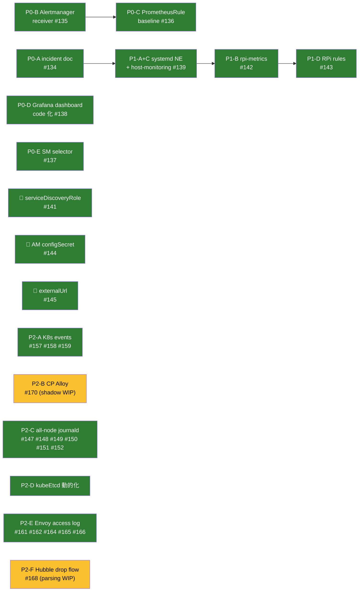

# 可観測性 拡充 実行プラン + 進捗

`observability-map.md` で合意した 2 つの穴 (通知経路 / ホスト層統一) を埋めるための PR 単位の実行計画。
**2026-04-23 時点で Phase 0 + Phase 1 + P2-A + P2-C + P2-E 完了、P2-B phase 1 / P2-F phase 1 が影モード稼働中**。以降は Phase 2 の残り + Phase 3 バックログ。

---

## 方針 (実装を通じて検証済)

1. **観測を先に** — アラートで気付ける状態を作ってから、新しいものを足す
2. **非破壊** — 既存の DaemonSet / ServiceMonitor は**撤去しない**。追加のみで価値を出す
3. **影モード** — 新規エージェント (CP Alloy 等) は低リソース制限で 1〜2 週間観察後に本番化
4. **1 PR = 1 責務** — 複合変更は避け、revert 容易性を優先

---

## 状態サマリ (2026-04-23)

---

## Phase 0: 通知経路 + 検知基盤 ✅ 完了

| ID | 内容 | PR |
|---|---|---|
| P0-A | incident post-mortem 文書化 (`docs/incidents/2026-04-13-observability-cascade.md`) | [#134](https://github.com/bright-room/br-cluster/pull/134) |
| P0-B | Alertmanager Discord receiver 開通 (1Password → ExternalSecret) | [#135](https://github.com/bright-room/br-cluster/pull/135) |
| P0-C | PrometheusRule baseline (cluster / node / workload / storage / cert — 18 alerts) | [#136](https://github.com/bright-room/br-cluster/pull/136) |
| P0-D | Grafana dashboard code 化 (sidecar + 公式 7 枚 + Cilium 内蔵 6 枚) | [#138](https://github.com/bright-room/br-cluster/pull/138) |
| P0-E | ServiceMonitor / PodMonitor / Rule の **selector broad 化** (10+ の dark SM を起こす) | [#137](https://github.com/bright-room/br-cluster/pull/137) |

### 🐛 Phase 0 運用中に発見したバグ

| ID | 何が起きたか | 修正 | PR |
|---|---|---|---|
| — | `host-nodes` EndpointSlice が dark (prometheus-operator の default 生成 scrape config が `role: endpoints` で classic v1 Endpoints を要求) | `Prometheus.spec.serviceDiscoveryRole: EndpointSlice` に opt-in | [#141](https://github.com/bright-room/br-cluster/pull/141) |

---

## Phase 1: ホスト層統一 + RPi メトリクス ✅ 完了

| ID | 内容 | PR |
|---|---|---|
| P1-A + P1-C | systemd node_exporter を全 8 ノードに展開 (port :9101, hwmon/thermal_zone/textfile) + `host-monitoring` Service/EndpointSlice/ServiceMonitor (job=node-exporter-host) | [#139](https://github.com/bright-room/br-cluster/pull/139) |
| P1-B | rpi-metrics textfile (vcgencmd 経由: throttle / ARM clock / core volts、60s 間隔、timeout 防御) | [#142](https://github.com/bright-room/br-cluster/pull/142) |
| P1-D | RPi-specific PrometheusRule (温度 / スロットル / 電圧、計 7 alerts) | [#143](https://github.com/bright-room/br-cluster/pull/143) |

### 🐛 Phase 1 運用中に発見したバグ

| 何が起きたか | 修正 | PR |
|---|---|---|
| **Discord に通知が一度も届いていなかった**。prometheus-operator v0.90.1 の `discordConfig` 型が `webhook_url_file` を未サポートで reconcile が 2 日以上失敗、旧デフォルト (null receiver) のまま稼働 | `alertmanagerSpec.configSecret` に切替 (operator の parser を迂回)。alertmanager.yaml 全体を ExternalSecret template で生成し webhook URL を template 時点で埋め込む | [#144](https://github.com/bright-room/br-cluster/pull/144) |
| Discord 通知内の Source / Silence URL が内部 Service を指していてクリックできない | `prometheusSpec.externalUrl = https://prometheus.b8m.app` / `alertmanagerSpec.externalUrl = https://alertmanager.b8m.app` を設定 | [#145](https://github.com/bright-room/br-cluster/pull/145) |
| vcgencmd の対話バースト呼び出しで **br-node1 (primary CP) が NotReady** に。etcd quorum 2/3 ギリギリ | 事後: 物理再起動で復旧。以降の実装で `timeout 3s` / `TimeoutStartSec=20s` / root + systemd 経由限定 / 60s 間隔 で防御 | (実装は #142 内) |

---

## Phase 2-C: 全 8 ノード journald → Loki ✅ 完了

元プランは「外部ノード (gateway / external) の journald → Loki」だったが、実装時にスコープを **全 8 ノード (k3s CP + worker + gateway + external) の systemd-journald 集約**に拡張した。ホスト systemd サービス (kubelet, containerd, sshd, kea-dhcp, nftables 等) が観測の空白地帯だったため。

| ID | 内容 | PR |
|---|---|---|
| P2-C (1) | internal Envoy Gateway + external-dns (coredns provider) を新設 — LAN 限定 VIP `172.22.10.71`, `*.cluster-internal.bright-room.net` listener、br-gateway1 の etcd (SkyDNS schema) に A/CNAME を書く経路 | [#147](https://github.com/bright-room/br-cluster/pull/147) |
| P2-C (2) | Loki HTTPRoute (`loki-push.cluster-internal.bright-room.net` → loki-gateway:80) | [#148](https://github.com/bright-room/br-cluster/pull/148) |
| P2-C (3) | CoreDNS hosts プラグインに `fallthrough` 追加 — 静的 hosts で止まっていたクエリを etcd plugin に渡す | [#149](https://github.com/bright-room/br-cluster/pull/149) |
| P2-C (4) | monitoring_agent role に Grafana Alloy 追加 (v1.15.1, systemd, 専用 user, ハードニング) + journal → Loki config | [#150](https://github.com/bright-room/br-cluster/pull/150) |
| P2-C (5) | ⚠️ Loki values の `${S3_*}` を Flux postBuild が空置換してしまう bug を修正 (`$${...}` エスケープ) | [#151](https://github.com/bright-room/br-cluster/pull/151) |
| P2-C (6) | Alloy push URL をグループ別に切替 — k3s ノードは localhost NodePort、非 k3s (gateway/external) はドメイン経由 | [#152](https://github.com/bright-room/br-cluster/pull/152) |

### 🐛 P2-C 運用中に発見した罠

| 何が起きたか | 原因 | 対処 |
|---|---|---|
| 既存の CoreDNS hosts プラグインに `fallthrough` 無く、etcd plugin が呼ばれず DNS 解決できない | PR #6 (2026-04-10) で internal-gateway を **WAN 側 DNAT** で使っていた名残。LAN 側の hosts block は fallthrough が無いまま残っていた | hosts block に fallthrough を 1 行追加 (#149) |
| Flux postBuild が Loki 値の `${S3_ACCESS_KEY_ID}` を空文字列に置換し、Loki が S3 資格情報空で起動 → HelmRelease Failed → 依存する alloy/otel が cascade で未 ready | postBuild.substituteFrom を後付けしたが、values.yaml には Loki の expand-env 用プレースホルダがあった | `$${...}` にエスケープ (#151) |
| **lease holder ノード自身からは LB IP (172.22.10.71) に接続できない** ("No route to host") | Cilium の socketLB は ClusterIP は redirect するが External/LB IP を redirect しない。lease holder の ARP responder は outbound 専用で自分宛に応答しない | k3s ノードは **localhost NodePort** (30800) 経由に切替 (#152)。非 k3s は lease holder になり得ないのでドメイン経由で OK |
| Alloy の systemd unit で `Group=systemd-journal` にすると、alloy ユーザーの primary group "alloy" が supplementary にも入らず `/etc/alloy/config.alloy` (0750 root:alloy) を stat できず起動失敗 | systemd の setgid + initgroups の挙動 | `Group=alloy` + `SupplementaryGroups=systemd-journal` (#150 内で修正) |
| **全 CP への Alloy install を同時実行したら br-node3 が NotReady、SSH 落ち、物理再起動が必要に** | Pi 4GB CP で zip DL + extract + binary copy + systemd daemon-reload + restart が同時集中 → 一時的リソース圧迫で kernel が応答不能に | 手動で物理再起動。follow-up で playbook に `serial: 1` を入れて CP は 1 台ずつ適用するようにしたい |

---

## Phase 2-A: K8s Events → Loki ✅ 完了

controller / kubelet / scheduler が emit する K8s Events (Pod OOMKilled / FailedScheduling / BackOff / FailedMount / ImagePullError 等) を Loki に永続化。etcd の 1h TTL を超えた事後調査が可能になった。

既存の \`grafana/alloy\` chart を流用し、専用 release (\`alloy-events\`) として 1 replica Deployment で稼働。Pod log tailing の DaemonSet とは独立。

| ID | 内容 | PR |
|---|---|---|
| P2-A (1) | alloy-events HelmRelease (Deployment, worker 限定, loki.source.kubernetes_events → loki.write) + ClusterRole (events get/list/watch) を明示 | [#157](https://github.com/bright-room/br-cluster/pull/157) |
| P2-A (2) | Grafana dashboard "Kubernetes Events" (Observability フォルダ) — hand-written、\`dashboards/custom/\` ディレクトリ新設 (base/ は fetch script 管理、custom/ は手書き) | [#158](https://github.com/bright-room/br-cluster/pull/158) |
| P2-A (3) | AlloyEventsDown PrometheusRule (kube_deployment_status_replicas_available ベース、10m) を monitoring-agent-health に追加 | [#159](https://github.com/bright-room/br-cluster/pull/159) |

### 派生した設計知見

- **Alloy chart 1 つで複数 release を併存させる**パターンが確立。今後「Alloy の別用途 (Span metric collection 等)」を追加する時も同じ構造で独立デプロイ可能
- **手書き Grafana dashboard の置き場所**が確立 (\`dashboards/custom/\`)。今後 br-cluster 固有 metric 向けの dashboard は全てここ
- \`loki.source.kubernetes_events\` の JSON label 抽出 + \`stage.labels\` で \`reason\` / \`type\` / \`namespace\` / \`involved_kind\` を low cardinality labels として index 化、\`involvedObject.name\` は structured metadata に留める設計が機能した

---

## 2026-04-23 時点で実現していること

- 🔔 **アラート → Discord 通知**が実際に届く (Watchdog / 他 rules / 手動テスト全て確認済)
- 🔗 **通知内 Source / Silence リンク**から OIDC 認証経由でブラウザに Prometheus / Alertmanager UI が開ける
- 🚨 **PrometheusRule 計 25 個** が `health=ok` で稼働 (cluster-health / node / workload / storage / cert / rpi-{temperature,power,since-boot})
- 📊 **Grafana 13 枚のダッシュボード** (Host / Kubernetes / Observability / Database / Storage / Cilium フォルダ) が code 管理で常に再現可能
- 📡 **ServiceMonitor / PodMonitor 30+** が全て `up=1` (alloy / cilium / hubble / longhorn / loki / tempo / otel / grafana / cnpg / cert-manager / external-dns / metrics-server / envoy-gateway / kubelet / etcd / kube-state-metrics / host-nodes…)
- 🌡️ 全 8 ノードの **CPU 温度 / ARM クロック / コア電圧 / スロットル状態** が Prometheus に入り、アラート閾値で検知可能
- 🛡️ 2026-04-13 cascade の原因と対処が `docs/incidents/` に永続化され、以降の設計判断 (worker pin / nodeDownPodDeletionPolicy / Alloy file tailing / GOMEMLIMIT / swap+reserve) の根拠が追える
- 📓 **全 8 ノードの systemd-journald ログ**が Loki に集約。kubelet / containerd / sshd / kea-dhcp / nftables / garage / chrony 等のホストサービスが `{job="systemd-journal", host="<name>", unit="<svc>"}` で検索可能
- 🛣️ **内部サービス公開基盤**として internal Envoy Gateway (`*.cluster-internal.bright-room.net`) + external-dns-coredns が稼働、将来の内部向け LAN サービス (event-exporter metrics、追加の API 等) は HTTPRoute 1 枚で公開可能
- 🧾 **K8s Events** (Pod OOMKilled / FailedScheduling / BackOff / ImagePullError 等) が Loki に集約、専用 dashboard (Observability フォルダの Kubernetes Events) で時系列 / reason / namespace フィルタ可能
- 📟 **monitoring-agent 系 (Alloy journal / Alloy events / node_exporter / rpi-metrics) の死活監視**が自己完結、silent failure しても Discord に飛んでくる
- 🛰️ **Envoy Gateway L7 観測**: cluster-proxy / internal-proxy の access log が OTLP JSON で Loki に集約 (`{service_name="envoy-access-log"}`, structured metadata で `response_code` / `authority` / `path` / `duration` 直接集計)、proxy の `/stats/prometheus` を `envoy-proxy` PodMonitor で scrape、`EnvoyHigh5xxRate` / `EnvoyProxyNoTraffic` アラート稼働、Observability フォルダの "Envoy Access Log" dashboard で 5xx / レイテンシ / top authority・path を即時可視化

---

## Phase 2: 観測穴埋め (次回以降の候補)

**Phase 2 はどれも単独で価値がある**。1 つずつ判断して着手すればよい。

### P2-B: CP ノードに Alloy DaemonSet 展開 (🚧 phase 1 稼働中 — PR #170 マージ済)

- **目的**: 現状 Alloy が worker のみ (`nodeSelector: node_type=worker`) のため CP (br-node1〜3) の Pod ログが拾えていない
- **設計**: 独立 HelmRelease `alloy-cp` (別 namespace / resource 枠) を追加。worker Alloy DS には一切手を入れず、削除で完全 rollback 可能
- **phase 1 (稼働中)**: br-node2 1 台限定、`64Mi req / 192Mi limit`、`nodeAffinity` で hostname 固定。OTLP receiver は持たず pod log file tailing のみ (app は CP に乗らない)
  - br-node1 (primary CP / etcd cluster-init) と br-node3 (P2-C で NotReady 実績) を避けて br-node2 選定
  - 1〜2 週間の OOM / CP etcd 安定性 / Loki ログ到達を観察
- **phase 2 (未着手)**: 問題なければ `nodeAffinity` を外して 3 CP 全台に展開。apply は他クラスタ変更と重ねず静かなタイミングで (cascade 教訓)
- **リスク**: 高 (cascade 再発懸念 — CP は Pi 4B 4GB でメモリ余裕が薄い)

| ID | 内容 | PR |
|---|---|---|
| P2-B (1) | 独立 HelmRelease `alloy-cp` を追加、br-node2 のみ影モード稼働 | [#170](https://github.com/bright-room/br-cluster/pull/170) |
| P2-B (2) | 3 CP 全台展開 (nodeAffinity 解除) | TODO (1〜2 週間観察後) |

## Phase 2-D: kubeEtcd endpoints 動的化 ✅ 完了

`kube-prometheus-stack/app/components/k3s/values.yaml` にハードコードされていた CP 3 IP を撤去し、`servers.yaml` (`k8s_role = primary|secondary`) + 1Password IP から `cluster-forge generate-manifests --env prod` が overlay の `etcd-endpoints.yaml` を生成する構造に変更。CP 追加/入替時は servers.yaml を編集して `make prod/generate-manifests` を回すだけで済む。

| ID | 内容 | PR |
|---|---|---|
| P2-D (1) | `cluster_forge.manifest_generator` を新設 (primary + secondary ノードを抽出して kubeEtcd.endpoints を生成)、`generate-manifests --env` CLI + `make prod/generate-manifests` target を追加。overlay 側で configMapGenerator + helm-patch を 2 本 valuesFrom に分岐 | TODO |

## Phase 2-E: Envoy Gateway アクセスログ + L7 監視 ✅ 完了

cluster-proxy (public) / internal-proxy (LAN) の access log を OTLP JSON 経路で Loki に集約、さらに Envoy proxy 自身の `/stats/prometheus` を PodMonitor でスクレイプして **5xx 比率ベースのアラート**を稼働させた。

| ID | 内容 | PR |
|---|---|---|
| P2-E (1) | cluster-proxy の access log を Text → OTLP JSON に切替、`service.name=envoy-access-log` 付与 | [#161](https://github.com/bright-room/br-cluster/pull/161) |
| P2-E (2) | internal-proxy に同等設定をミラー、経路統一 | [#162](https://github.com/bright-room/br-cluster/pull/162) |
| P2-E (3) | 量計測 (cluster-proxy 0.04 rps / internal 0.009 rps, 5xx ゼロ, ~2 MB/day) → **サンプリング不要** 判断、plan に記録 | [#163](https://github.com/bright-room/br-cluster/pull/163) |
| P2-E (4) | Grafana "Envoy Access Log" dashboard (8 panel: QPS / 5xx / duration quantiles / top authority / top path-by-5xx / top upstream-by-5xx / logs) | [#164](https://github.com/bright-room/br-cluster/pull/164) |
| P2-E (5) | ⚠️ OTLP JSON log は Loki body が空になる罠を logs panel の `line_format` で再構成 | [#165](https://github.com/bright-room/br-cluster/pull/165) |
| P2-E (6) | Envoy proxy の `:19001/stats/prometheus` を `envoy-proxy` PodMonitor でスクレイプ、`EnvoyHigh5xxRate` (10% かつ 0.5 rps 10m) + `EnvoyProxyNoTraffic` (scrape 欠損 10m) の PrometheusRule 追加 | [#166](https://github.com/bright-room/br-cluster/pull/166) |

### 派生した設計知見

- **OTLP JSON → Loki は body 空 + structured metadata** のマッピングになる (OTLP semantic convention 通り)。集計クエリ (`sum by (response_code) (rate(...))`, `| unwrap duration`) は parser 不要で素直になる反面、Grafana logs panel は body 描画なので `| line_format` での再構成が必須。次回 OTLP JSON log を Loki に通す時は、dashboard を書く前に `curl /loki/api/v1/query_range ... | limit=1` で body を確認するのが手戻り最小
- **Envoy Gateway の envoy proxy pod** は `:19001` に自動で `/stats/prometheus` を開いている。PodMonitor `selector.matchLabels.app.kubernetes.io/managed-by=envoy-gateway + component=proxy` で両 Gateway を一網打尽。relabeling で `gateway_name` / `gateway_namespace` を付けると dashboard / alert が書きやすい
- **低トラフィック環境でのレート系アラート**は divide-by-near-zero を避ける guard が必須。今回は `5xx ratio > 10% AND total rps > 0.5` の AND 条件で 1 件 5xx によるフラップを抑止

## Phase 2-F: Hubble drop flow → Loki (🚧 PR #168 マージ済、parsing は follow-up)

NetworkPolicy を書き始める前の**事前準備**として、drop verdict の flow を Loki に persist。policy 運用が本格化した瞬間から「誰が誰に何で denied か」が LogQL 一発で引ける状態を作る。

| ID | 内容 | PR |
|---|---|---|
| P2-F (1) | hubble-flow-exporter Deployment (1 replica, worker) — hubble-relay gRPC を `--verdict=DROPPED --follow -o json` でストリーム、stdout → 既存 Alloy DS → Loki。cilium image を再利用、hardening 済 (readOnlyRootFS / runAsNonRoot / drop ALL) | [#168](https://github.com/bright-room/br-cluster/pull/168) |
| P2-F (2) | loki.process で `verdict` / `drop_reason_desc` / source/destination namespace を structured metadata / 低カーディナリティ label に抽出 | TODO (24h 観測後) |
| P2-F (3) | Grafana dashboard + PrometheusRule | **NetworkPolicy 導入後まで deferral** (今の drop はノイズしか無いので dashboard / alert を書いても空振り) |

### 設計判断

| 項目 | 選択 | 理由 |
|---|---|---|
| flow 取得方式 | hubble-relay gRPC を 1 Deployment から叩く | relay が全ノードの flow を集約するので CP Alloy (P2-B) 未対応でも**全ノードカバー** |
| Loki 転送 | stdout → kubelet pod log → 既存 Alloy DS | 新規パイプライン無し。DS の worker nodeSelector と整合 |
| コンテナ image | `quay.io/cilium/cilium:v1.19.2` | 全 k3s ノードに既にキャッシュ済で追加 pull 無し、hubble CLI version も cilium と同期 |
| フィルタ位置 | CLI 側で `--verdict=DROPPED` | ingest 前に絞って Loki 負荷最小化 |
| TLS | plain gRPC | hubble-relay は `disable-server-tls: true` 設定済 |

### 現状の drop 実態 (platform オンリー段階)

ほぼ以下のノイズだけ:

- `UNSUPPORTED_L3_PROTOCOL` (drop_reason 139): ICMPv6 Router Solicitation — pod が veth 上の IPv6 neighbor discovery を投げて multicast 先で落ちる
- `UNSUPPORTED_L2_PROTOCOL` (drop_reason 166): Ethernet/ARP 系の L2 フレーム

想定通り。**NetworkPolicy を書き始めた瞬間から `policy-denied` が主成分になる**というのがこの PR の前提。

---

## Phase 3: 将来検討 (保留)

現時点で困っていないので、必要性が出てから着手:

| 項目 | 始める条件 |
|---|---|
| **Thanos Sidecar** (Prometheus 長期保存) | 14 日制限で困るトラブル分析が発生したとき |
| **Tempo metrics-generator (span metrics のみ)** | トレース上でサービスマップを見たくなったとき |
| **kube-apiserver tracing** | apiserver の遅延を深掘りするインシデントが起きたとき (デバッグ時限定 on) |
| **Pyroscope (Continuous Profiling)** | メモリ/CPU の特定アプリ深掘りが必要になったとき |
| **Blackbox exporter** (外形監視) | cloudflared が止まっても気付かないケースが発生したとき |
| **Loki ruler** (ログベースのアラート) | メトリクスでは捉えきれないログパターン (under-voltage in dmesg 等) を鳴らしたいとき |

---

## リスク管理 (運用で検証済)

| Phase | 主なリスク | 実証された緩和策 |
|---|---|---|
| P0 | アラート flood | `group_wait: 30s, repeat_interval: 4h` (Watchdog は 24h) で実害なし |
| P0 | rule PromQL ミス | kubernetes-mixin を参照、手元で smoke test してから apply |
| P1 | port 競合 | :9100 = DS, :9101 = systemd で明示共存、問題なし |
| P1 | vcgencmd ハング | **root + systemd + 60s 間隔 + timeout 3s** で 8 ノード 24h 運用して安定 |
| P2-B | CP Alloy OOM | 影モード運用ルールを明文化 |
| P2-C | CP Pi 同時大量プロビジョニングで SSH 断 | **新規 systemd install は `serial: 1`** を徹底 (follow-up で playbook に組み込み予定) |
| P2-C | Cilium L2 lease holder hairpin | k3s ノードは NodePort 経由、非 k3s はドメイン経由に経路分離。socketLB 拡張は follow-up で検討 |
| P2-E | Loki ingestion 飽和 | サンプリング前提 (量計測 0.05 rps で不要と判明) |
| P2-F | drop flow 量爆発 | `--verdict=DROPPED` を CLI 側で適用、ingest 前に絞る。NetworkPolicy 導入後は `--allowlist` で namespace 絞り検討 |

---

## 次回着手時の推奨順序

1. **P2-B phase 2 (3 CP 全台展開)** — br-node2 影モード (#170) が 1〜2 週間安定したら nodeAffinity を外す。他クラスタ変更と重ねない
2. **P2-F の残り (parsing + label 抽出)** — exporter は稼働中 (#168)。24h 観測後に loki.process で `verdict` / `drop_reason_desc` / src/dst namespace を structured metadata 化。dashboard / alert は NetworkPolicy 導入まで保留

### 観測系 follow-up (別 PR 候補)

- **Alloy 自体のメトリクス収集**: Alloy journal も events も現状 `serviceMonitor: false`。push failure rate / batch drop 等を集めると silent failure 検知が強化される。`127.0.0.1:12345` を公開するか textfile 経由で
- **~~Alloy journal の死活 PrometheusRule~~** ✅ #156
- **~~Alloy events の死活 PrometheusRule~~** ✅ #159
- **~~Provisioner playbook に `serial: 1`~~** ✅ #154 (setup_monitoring_agent のみ、他 playbook は未対応)
- **Cilium socketLB で LB IP hairpin を解決**: `bpf.hostRouting: true` or `loadBalancer.acceleration` 調整で lease holder 自身から LB IP 到達可能にする。成功すれば P2-C (6) の per-group URL 分岐を削除できる
- **internal Envoy Gateway の ServiceMonitor**: 既存 cluster-gateway と同様のメトリクス収集
- **external-dns-coredns の ServiceMonitor / monitoring overlay**: cloudflare instance のを mirror
- **hubble-flow-exporter の死活 PrometheusRule**: `kube_deployment_status_replicas_available{deployment="hubble-flow-exporter"}` ベース。alloy-events (#159) と同パターン。先に drop の baseline rate が見えてからでも可

### トポロジー情報の単一 source of truth 化 (P2-D follow-up)

P2-D で kubeEtcd endpoints は `cluster-forge generate-manifests` 経由で servers.yaml + 1Password に寄せたが、他の manifest には依然として IP / ホスト情報がハードコードされた場所がある。per-consumer に YAML fragment 生成を増やすと「新しい consumer を足すたびに cluster-forge の Python 側に生成関数を追加」コストが嵩むため、**個数固定のスカラー値は `cluster-settings.yaml` + Flux postBuild `${VAR}` に寄せる**路線で follow-up する。

想定する移行順:

1. **kubeEtcd endpoints を postBuild 化** — P2-D で per-consumer 生成にした `etcd-endpoints.yaml` を、`cluster-settings.yaml` の `BR_NODE{1,2,3}_IP` + `components/k3s/values.yaml` 内 `${BR_NODE1_IP}` に置換。CP 台数変更時は cluster-settings.yaml と values.yaml のリストを両方手で触ることになるが、変更頻度が低いので許容
2. **`cluster-settings.yaml` を `cluster-forge generate-manifests` 生成に寄せる** — servers.yaml + 1Password から `BR_*_IP` / `CLOUDFLARED_TUNNEL_ID` 等を自動生成。既存の固定値 (`CLUSTER_DOMAIN` / `TRUSTED_INTERNAL_POD_CIDR` 等) をどこに書くかは要設計 (servers.yaml か専用の `cluster-config.yaml` か)
3. **`host-monitoring/base/endpoints.yaml` の 8 host IP を整理** — リスト値なので postBuild では表現しきれない。cluster-forge の per-consumer 生成 (P2-D と同じパターン) か、`cluster_hosts.yaml` と共通化する kustomize plugin を検討
4. **`provisioner/inventories/base/group_vars/all/network.yaml` の `KUBE_VIP_ADDRESS` と `cluster-settings.yaml` の重複解消** — source of truth を片方に寄せ、もう片方は生成

---

## 関連ファイル

- **観測経路の現状図**: `docs/observability-map.md` (Phase 1 完了で "ギャップ" 節の大半が解消済、更新推奨)
- **原計画 (Zitadel 移行反映)**: `docs/observability.md`
- **設計検討履歴**: `docs/observability-proposal.md`
- **Phase 0 / 1 で追加された主な manifest / role**:
  - `manifests/platform/kube-prometheus-stack/rules/` (5 rule ファイル)
  - `manifests/platform/kube-prometheus-stack/host-monitoring/` (旧 externalnodes-monitoring から rename)
  - `manifests/platform/grafana/dashboards/` + `scripts/fetch-grafana-dashboards.sh`
  - `provisioner/roles/monitoring_agent/` (node_exporter + rpi-metrics timer)
- **P2-C で追加された主な manifest / role**:
  - `manifests/platform/envoy-gateway/config/base/internal-*.yaml` (内部 Gateway)
  - `manifests/platform/external-dns-coredns/` (内部向け DNS プロビジョナ)
  - `manifests/platform/loki/app/base/httproute-internal.yaml` (Loki push 経路)
  - `provisioner/roles/monitoring_agent/tasks/alloy_journal.yaml` + `templates/alloy*.j2`
- **P2-A で追加された主な manifest**:
  - `manifests/platform/alloy-events/` (K8s Events → Loki 専用 Alloy Deployment)
  - `manifests/platform/grafana/dashboards/custom/` (手書き dashboard 置き場、第一号 kubernetes-events.json)
  - `manifests/platform/kube-prometheus-stack/rules/base/rule-monitoring-agent.yaml` (monitoring-agent 自己監視)
- **P2-E で追加された主な manifest**:
  - `manifests/platform/envoy-gateway/config/base/envoy-proxy.yaml` + `internal-envoy-proxy.yaml` の `telemetry.accessLog` (OTLP JSON)
  - `manifests/platform/envoy-gateway/monitoring/base/pod-monitor.yaml` (envoy proxy :19001/stats/prometheus)
  - `manifests/platform/kube-prometheus-stack/rules/base/rule-envoy-gateway.yaml` (EnvoyHigh5xxRate / EnvoyProxyNoTraffic)
  - `manifests/platform/grafana/dashboards/custom/json/envoy-access-log.json`
- **P2-F で追加された主な manifest**:
  - `manifests/platform/hubble-flow-exporter/` (hubble-relay → stdout → Alloy DS → Loki, `--verdict=DROPPED` CLI filter)
- **P2-B (phase 1) で追加された主な manifest**:
  - `manifests/platform/alloy-cp/` (独立 HelmRelease、CP 限定影モード、br-node2 only)
- **過去インシデント**: `docs/incidents/2026-04-13-observability-cascade.md`
