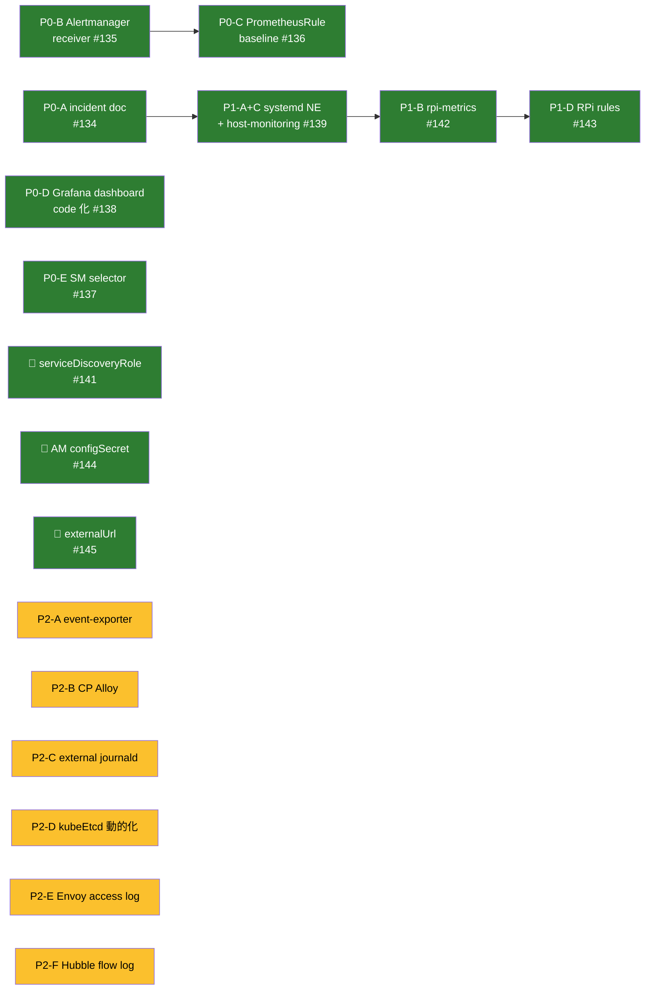

# 可観測性 拡充 実行プラン + 進捗

`observability-map.md` で合意した 2 つの穴 (通知経路 / ホスト層統一) を埋めるための PR 単位の実行計画。
**2026-04-23 時点で Phase 0 + Phase 1 完了**。以降は Phase 2 以降のバックログ。

---

## 方針 (実装を通じて検証済)

1. **観測を先に** — アラートで気付ける状態を作ってから、新しいものを足す
2. **非破壊** — 既存の DaemonSet / ServiceMonitor は**撤去しない**。追加のみで価値を出す
3. **影モード** — 新規エージェント (CP Alloy 等) は低リソース制限で 1〜2 週間観察後に本番化
4. **1 PR = 1 責務** — 複合変更は避け、revert 容易性を優先

---

## 状態サマリ (2026-04-23)

---

## Phase 0: 通知経路 + 検知基盤 ✅ 完了

| ID | 内容 | PR |
|---|---|---|
| P0-A | incident post-mortem 文書化 (`docs/incidents/2026-04-13-observability-cascade.md`) | [#134](https://github.com/bright-room/br-cluster/pull/134) |
| P0-B | Alertmanager Discord receiver 開通 (1Password → ExternalSecret) | [#135](https://github.com/bright-room/br-cluster/pull/135) |
| P0-C | PrometheusRule baseline (cluster / node / workload / storage / cert — 18 alerts) | [#136](https://github.com/bright-room/br-cluster/pull/136) |
| P0-D | Grafana dashboard code 化 (sidecar + 公式 7 枚 + Cilium 内蔵 6 枚) | [#138](https://github.com/bright-room/br-cluster/pull/138) |
| P0-E | ServiceMonitor / PodMonitor / Rule の **selector broad 化** (10+ の dark SM を起こす) | [#137](https://github.com/bright-room/br-cluster/pull/137) |

### 🐛 Phase 0 運用中に発見したバグ

| ID | 何が起きたか | 修正 | PR |
|---|---|---|---|
| — | `host-nodes` EndpointSlice が dark (prometheus-operator の default 生成 scrape config が `role: endpoints` で classic v1 Endpoints を要求) | `Prometheus.spec.serviceDiscoveryRole: EndpointSlice` に opt-in | [#141](https://github.com/bright-room/br-cluster/pull/141) |

---

## Phase 1: ホスト層統一 + RPi メトリクス ✅ 完了

| ID | 内容 | PR |
|---|---|---|
| P1-A + P1-C | systemd node_exporter を全 8 ノードに展開 (port :9101, hwmon/thermal_zone/textfile) + `host-monitoring` Service/EndpointSlice/ServiceMonitor (job=node-exporter-host) | [#139](https://github.com/bright-room/br-cluster/pull/139) |
| P1-B | rpi-metrics textfile (vcgencmd 経由: throttle / ARM clock / core volts、60s 間隔、timeout 防御) | [#142](https://github.com/bright-room/br-cluster/pull/142) |
| P1-D | RPi-specific PrometheusRule (温度 / スロットル / 電圧、計 7 alerts) | [#143](https://github.com/bright-room/br-cluster/pull/143) |

### 🐛 Phase 1 運用中に発見したバグ

| 何が起きたか | 修正 | PR |
|---|---|---|
| **Discord に通知が一度も届いていなかった**。prometheus-operator v0.90.1 の `discordConfig` 型が `webhook_url_file` を未サポートで reconcile が 2 日以上失敗、旧デフォルト (null receiver) のまま稼働 | `alertmanagerSpec.configSecret` に切替 (operator の parser を迂回)。alertmanager.yaml 全体を ExternalSecret template で生成し webhook URL を template 時点で埋め込む | [#144](https://github.com/bright-room/br-cluster/pull/144) |
| Discord 通知内の Source / Silence URL が内部 Service を指していてクリックできない | `prometheusSpec.externalUrl = https://prometheus.b8m.app` / `alertmanagerSpec.externalUrl = https://alertmanager.b8m.app` を設定 | [#145](https://github.com/bright-room/br-cluster/pull/145) |
| vcgencmd の対話バースト呼び出しで **br-node1 (primary CP) が NotReady** に。etcd quorum 2/3 ギリギリ | 事後: 物理再起動で復旧。以降の実装で `timeout 3s` / `TimeoutStartSec=20s` / root + systemd 経由限定 / 60s 間隔 で防御 | (実装は #142 内) |

---

## 2026-04-23 時点で実現していること

- 🔔 **アラート → Discord 通知**が実際に届く (Watchdog / 他 rules / 手動テスト全て確認済)
- 🔗 **通知内 Source / Silence リンク**から OIDC 認証経由でブラウザに Prometheus / Alertmanager UI が開ける
- 🚨 **PrometheusRule 計 25 個** が `health=ok` で稼働 (cluster-health / node / workload / storage / cert / rpi-{temperature,power,since-boot})
- 📊 **Grafana 13 枚のダッシュボード** (Host / Kubernetes / Observability / Database / Storage / Cilium フォルダ) が code 管理で常に再現可能
- 📡 **ServiceMonitor / PodMonitor 30+** が全て `up=1` (alloy / cilium / hubble / longhorn / loki / tempo / otel / grafana / cnpg / cert-manager / external-dns / metrics-server / envoy-gateway / kubelet / etcd / kube-state-metrics / host-nodes…)
- 🌡️ 全 8 ノードの **CPU 温度 / ARM クロック / コア電圧 / スロットル状態** が Prometheus に入り、アラート閾値で検知可能
- 🛡️ 2026-04-13 cascade の原因と対処が `docs/incidents/` に永続化され、以降の設計判断 (worker pin / nodeDownPodDeletionPolicy / Alloy file tailing / GOMEMLIMIT / swap+reserve) の根拠が追える

---

## Phase 2: 観測穴埋め (次回以降の候補)

**Phase 2 はどれも単独で価値がある**。1 つずつ判断して着手すればよい。

### P2-A: `kubernetes-event-exporter` 導入 (優先度: 中)

- **目的**: K8s Events (Pod 再起動 / ノード OOM / Pull エラー等) を Loki に流し、時系列でクエリ可能にする。
- **狙い**: 現状の Pod ログ収集 (Alloy) では拾えない「何があってその Pod が落ちたか」を可視化
- **構成**: `kubernetes-event-exporter` Deployment → Loki gateway に HTTP push
- **リスク**: 低 (read-only watcher)

### P2-B: CP ノードに Alloy DaemonSet 展開 (優先度: 中, 慎重)

- **目的**: 現状 Alloy が worker のみ (`nodeSelector: node_type=worker`) のため CP (br-node1〜3) の Pod ログが拾えていない
- **手順**: **影モード必須**
  - Phase 1: `memory: 64Mi req / 192Mi limit` + CP 限定で 1〜2 週間観察
  - Phase 2: 問題なければ本番化
- **リスク**: 高 (cascade 再発懸念 — CP は Pi 4B 4GB でメモリ余裕が薄い)

### P2-C: 外部ノード (gateway / external) の journald → Loki (優先度: 中)

- **目的**: nftables / kea-dhcp / sshd / garage 等 **systemd サービスのログ**を Loki へ
- **構成**: `grafana/alloy` 単体バイナリを systemd で `loki.source.journal`
- **実装箇所**: `monitoring_agent` role に alloy-journal タスクを同梱 (P1-A で既にインフラは整っている)
- **リスク**: 低

### P2-D: kubeEtcd endpoints 動的化 (優先度: 低)

- **目的**: 現在 `kube-prometheus-stack/app/components/k3s/values.yaml` に CP IP を 3 つハードコード。CP 追加/入替時に手動編集が必要
- **案**: `servers.yaml` → kustomize plugin or CI スクリプトで生成
- **リスク**: 低

### P2-E: Envoy Gateway アクセスログ → Loki (優先度: 中)

- **目的**: HTTP 5xx / L7 ルーティング問題の切り分け。Hubble flow は L3/4 のみ
- **構成**: `EnvoyProxy.telemetry.accessLog` で OTLP export → Alloy → Loki
- **サンプリング**: 初手は **5xx のみ** or **全件の 10%** で様子見
- **リスク**: 中 (高頻度リクエスト環境だと Loki ingestion を圧迫)

### P2-F: Hubble flow log → Loki (優先度: 低)

- **目的**: Pod 間通信の可否を時系列で調査可能に
- **サンプリング**: 初手は **drop 判定のみ** (deny された flow のみ)
- **リスク**: 中 (flow は秒間数百件のオーダー)

---

## Phase 3: 将来検討 (保留)

現時点で困っていないので、必要性が出てから着手:

| 項目 | 始める条件 |
|---|---|
| **Thanos Sidecar** (Prometheus 長期保存) | 14 日制限で困るトラブル分析が発生したとき |
| **Tempo metrics-generator (span metrics のみ)** | トレース上でサービスマップを見たくなったとき |
| **kube-apiserver tracing** | apiserver の遅延を深掘りするインシデントが起きたとき (デバッグ時限定 on) |
| **Pyroscope (Continuous Profiling)** | メモリ/CPU の特定アプリ深掘りが必要になったとき |
| **Blackbox exporter** (外形監視) | cloudflared が止まっても気付かないケースが発生したとき |
| **Loki ruler** (ログベースのアラート) | メトリクスでは捉えきれないログパターン (under-voltage in dmesg 等) を鳴らしたいとき |

---

## リスク管理 (運用で検証済)

| Phase | 主なリスク | 実証された緩和策 |
|---|---|---|
| P0 | アラート flood | `group_wait: 30s, repeat_interval: 4h` (Watchdog は 24h) で実害なし |
| P0 | rule PromQL ミス | kubernetes-mixin を参照、手元で smoke test してから apply |
| P1 | port 競合 | :9100 = DS, :9101 = systemd で明示共存、問題なし |
| P1 | vcgencmd ハング | **root + systemd + 60s 間隔 + timeout 3s** で 8 ノード 24h 運用して安定 |
| P2-B | CP Alloy OOM | 影モード運用ルールを明文化 |
| P2-E/F | Loki ingestion 飽和 | サンプリング前提 |

---

## 次回着手時の推奨順序

1. **P2-C (external journald → Loki)** が最も簡単 (P1-A で広げた `monitoring_agent` role を拡張するだけ、リスク低)
2. **P2-A (event-exporter)** — 導入容易 + 運用価値高い
3. **P2-E (Envoy access log)** — L7 可視化の効果が大きい
4. **P2-B (CP Alloy)** は 2 週間影モード運用が必要なので、余裕がある時に
5. **P2-F / P2-D** は需要が出てから

---

## 関連ファイル

- **観測経路の現状図**: `docs/observability-map.md` (Phase 1 完了で "ギャップ" 節の大半が解消済、更新推奨)
- **原計画 (Zitadel 移行反映)**: `docs/observability.md`
- **設計検討履歴**: `docs/observability-proposal.md`
- **Phase 0 / 1 で追加された主な manifest / role**:
  - `manifests/platform/kube-prometheus-stack/rules/` (5 rule ファイル)
  - `manifests/platform/kube-prometheus-stack/host-monitoring/` (旧 externalnodes-monitoring から rename)
  - `manifests/platform/grafana/dashboards/` + `scripts/fetch-grafana-dashboards.sh`
  - `provisioner/roles/monitoring_agent/` (node_exporter + rpi-metrics timer)
- **過去インシデント**: `docs/incidents/2026-04-13-observability-cascade.md`
