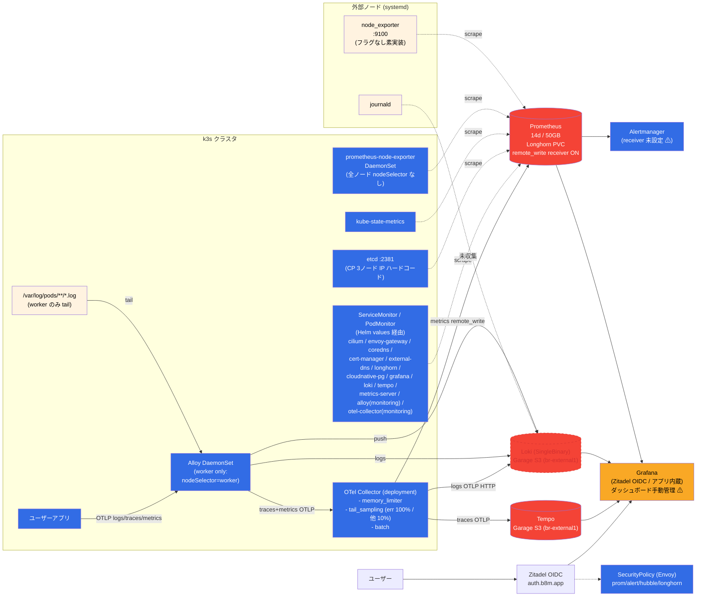
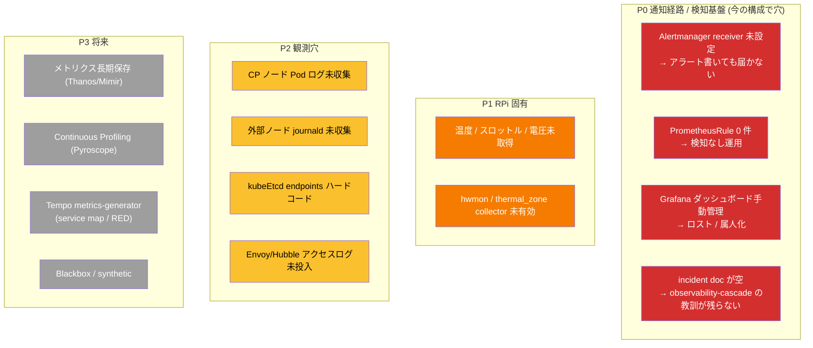
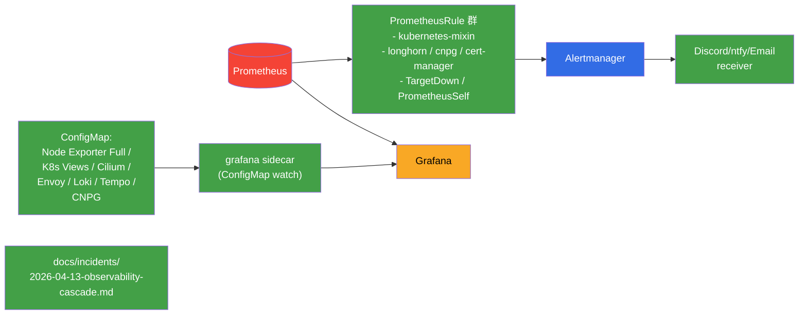
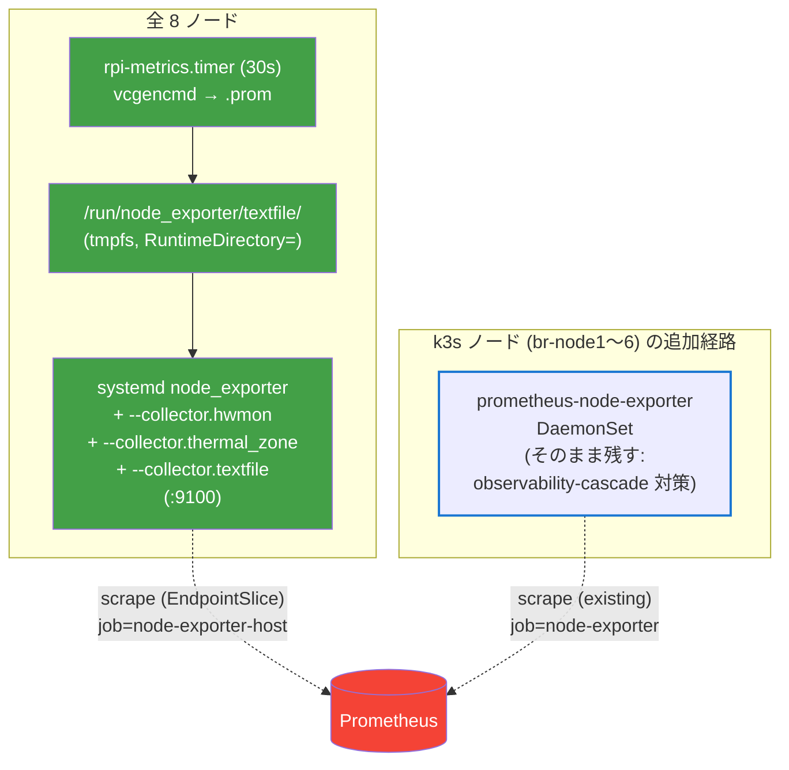
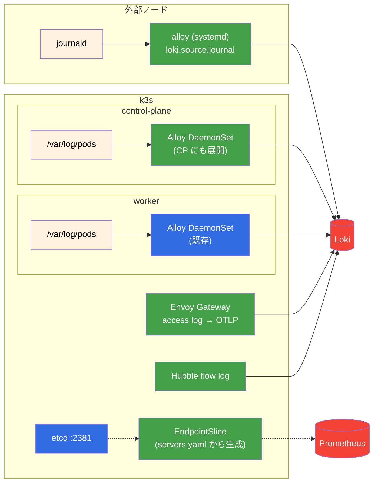
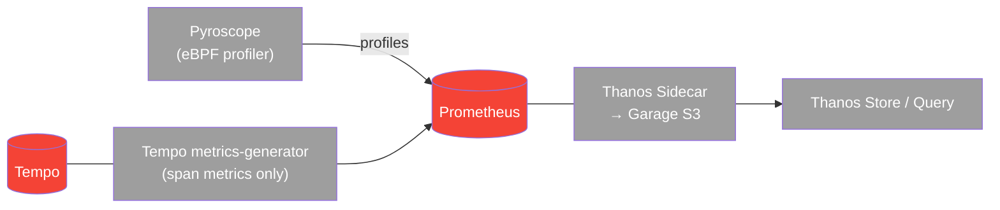

# 可観測性スタック 再設計プロポーザル

元 `docs/observability.md` のロードマップを、実装実態の再調査をもとに組み直した提案。議論用の別ファイル。

---

## 1. 現状 (実装から読み取った正)

### 1.1 シグナル経路の全体像

### 1.2 ホスト/ノード行列 (現実)

| ノード | ホスト OS メトリクス | k8s メトリクス | Pod ログ | アプリ OTLP | journald |
|---|---|---|---|---|---|
| br-gateway1 | systemd node_exporter (素) | — | — | — | **未収集** |
| br-external1 | systemd node_exporter (素) | — | — | — | **未収集** |
| br-node1〜3 (CP) | DaemonSet node-exporter + etcd `:2381` | kubelet / cilium | **未収集** (Alloy なし) | — | — |
| br-node4〜6 (worker) | DaemonSet node-exporter | kubelet / cilium + ServiceMonitor 群 | Alloy tail → Loki | OTLP 受信 | — |

### 1.3 実装から分かった意図的な設計判断

| 判断 | 背景 |
|---|---|
| DaemonSet node-exporter に nodeSelector を付けない | `incident-2026-04-13-observability-cascade.md` 参照 (ファイルは空)。**CP も監視経路を持つ**ため意図的にバラまく |
| Grafana だけ SecurityPolicy 非適用 | Envoy OIDC + Grafana OIDC で二重ログインになる。アプリ内蔵 OIDC のみ |
| Alloy は logs だけ Loki 直送、traces/metrics だけ Collector 経由 | `tail_sampling` を Collector に集約するため |
| OTel Collector は **logs/traces/metrics の 3 シグナル全部**を処理 | アプリ OTLP は全シグナル Collector を通過。元 doc はトレース専用に見える図だが違う |
| Tempo `metrics-generator` 無効 | Pi 制約。サービスマップ / RED は未導入 |
| kube-prometheus-stack `defaultRules.create: false` | k3s 前提でないルールを除外。**→ PrometheusRule は本当に 0 件** |

---

## 2. ギャップ (穴の地図)

---

## 3. 理想像

### 3.1 P0 完了時点の姿 (最小コストで「使える」状態)

### 3.2 P1 完了時点 (RPi 固有メトリクス)

**元 doc からの重要な変更点**: `prometheus-node-exporter` DaemonSet は**撤去しない**。systemd 側を全ノードに広げて textfile + vcgencmd を担わせ、**DaemonSet と systemd の二経路を両立** (observability-cascade 再発回避)。

- **systemd 経路**: 温度 (hwmon) / スロットル・電圧・実クロック (textfile+vcgencmd) を集約
- **DaemonSet 経路**: 今まで通り kubelet / cAdvisor と同じ観点で k3s ノード OS を見る
- **ラベル衝突回避**: systemd 側は別 `job` 名 (`node-exporter-host`) を relabeling で固定。ダッシュボードもラベルで切り替え
- ポート競合: DaemonSet は `hostNetwork: true` で :9100 を占有するので、systemd 側は **別ポート (例: :9101)** で上げる

### 3.3 P2 完了時点 (観測穴埋め)

### 3.4 P3 (将来要件が出たら)

---

## 4. フェーズ分け (優先度順)

### Phase 0: 通知経路 + 検知基盤 (最優先 / 実装コスト小)

| 作業 | 内容 |
|---|---|
| **incident doc 実体化** | `docs/incidents/2026-04-13-observability-cascade.md` を書き起こし。CP node-exporter を残した背景を永続化 |
| **Alertmanager receiver** | Discord webhook or ntfy + ExternalSecret で資格情報を注入。`alertmanagerSpec.configSecret` で 1Password 管理 |
| **PrometheusRule の土台** | kube-prom-stack の `defaultRules.create` を `true` に戻しつつ `disabled` で k3s に合わない項目のみ切る。加えて `TargetDown` / `PrometheusOutOfDisk` / `LonghornVolumeUsageCritical` / `CNPGBackupFailed` / `CertManagerCertExpirySoon` をカスタム追加 |
| **Grafana dashboard を code 化** | `sidecar.dashboards.enabled: true` + label selector `grafana_dashboard=1`。公式 ID (Node Exporter Full 1860, Cilium, Envoy, Loki, Tempo, CNPG) を ConfigMap として import |

### Phase 1: RPi 固有メトリクス (元 doc の主題、ただし非破壊化)

| 作業 | 内容 |
|---|---|
| **systemd node_exporter を全 8 ノードへ拡張** | `setup_monitoring_agent.yaml` の対象を `gateway:external:master:worker` に。**ポート :9101** を採用して DaemonSet (:9100) と共存 |
| **collector 有効化** | `--collector.hwmon --collector.thermal_zone --collector.textfile=...` を `node_exporter.service.j2` に追記。`RuntimeDirectory=node_exporter/textfile` で tmpfs ディレクトリを systemd 管理 |
| **rpi-metrics.{sh,service,timer}** | vcgencmd を叩いて `.prom.$$` へ書き atomic rename。30 秒周期 |
| **EndpointSlice 拡張** | `externalnodes-monitoring` を `host-node-exporter` (名称変更) に改名、br-node1〜6 も追加。**`servers.yaml` から kustomize plugin or CI で生成** |
| **ServiceMonitor relabel** | `job=node-exporter-host` / `instance=<nodeName>` で固定 (DaemonSet の `job=node-exporter` と衝突回避) |
| **PrometheusRule (RPi 固有)** | `NodeHighTemperature` (hwmon_temp > 75℃) / `NodeThrottled` (textfile メトリクスの bit ごとに別メトリクス化してスカラー比較) / `NodeUndervoltage` |

### Phase 2: 観測穴埋め

| 作業 | 内容 |
|---|---|
| **CP の Pod ログ** | Alloy の nodeSelector を撤去。CP 側は `resources.limits.memory=128Mi` 程度に絞る |
| **外部ノード journald** | `monitoring_agent` role に `grafana/alloy` 単体バイナリ (systemd) を同梱。`loki.source.journal` → Loki gateway |
| **kubeEtcd 動的化** | `servers.yaml` からの生成 or Service/EndpointSlice 方式。CP 入れ替え時に手動編集不要に |
| **Envoy Gateway アクセスログ** | EnvoyProxy CR の `telemetry.accessLog` で OTLP export → Alloy → Loki |
| **Hubble flow log** | hubble-relay → hubble-exporter (fluentd) もしくは直接 Loki push を検討 |

### Phase 3: 将来要件ベース

- Thanos Sidecar + Store (Garage 再利用)
- Tempo metrics-generator (span metrics のみ、service_graph は off)
- Pyroscope (eBPF profiling)
- Blackbox exporter (家庭用途は優先度低)

---

## 5. 元 doc からの主要な変更点サマリ

| 観点 | 元 doc | 本提案 |
|---|---|---|
| Phase 1 の目的 | 「node_exporter を systemd に統一」(DaemonSet 撤去) | **両経路を残したまま** systemd を全ノードに拡張 |
| node-exporter DaemonSet | 無効化する | **維持** (observability-cascade 対策) |
| 優先順位 | 温度メトリクスが Phase 1 | **通知経路 / PrometheusRule 基盤が先** (Phase 0) |
| Grafana 認証 | CF Access (古い) | **Zitadel OIDC** |
| ダッシュボード運用 | 言及なし | **sidecar + ConfigMap で code 化** |
| incident 参照 | 根拠不明 | **`docs/incidents/` に実体化** |
| 温度メトリクス取得方法 | textfile + vcgencmd 一括 | **温度は hwmon で、スロットル系のみ textfile** |
| ポート設計 | 暗黙的 | **:9100 = DaemonSet / :9101 = systemd** で明示共存 |

---

## 6. 非目標 (やらない)

- **Alloy → OTel Collector 置き換え**: Pi 制約下でメモリ +200〜400Mi 悪化、メリット小
- **rpi_exporter 導入**: 常駐 10〜20MB 無駄。textfile + hwmon で代替
- **Prometheus 水平分散**: 単一で十分
- **kube-proxy / kube-controller-manager / kube-scheduler の個別スクレイプ有効化**: k3s では 1 バイナリなので既に disabled が正解

---

## 7. 関連ファイル (再設計後に触る対象)

- `manifests/platform/kube-prometheus-stack/app/base/values.yaml` — defaultRules / alertmanagerSpec.configSecret
- `manifests/platform/kube-prometheus-stack/externalnodes-monitoring/` → リネーム (`host-monitoring` 等)
- `manifests/platform/grafana/app/base/values.yaml` — sidecar dashboards
- `manifests/platform/alloy/app/base/values.yaml` + overlays — nodeSelector 緩和 / CP 配布
- `provisioner/roles/monitoring_agent/` — systemd node_exporter フラグ追加 / rpi-metrics / alloy-journal
- `provisioner/playbooks/setup_monitoring_agent.yaml` — 対象ホストグループ拡張
- `docs/incidents/2026-04-13-observability-cascade.md` — 新規作成
- `servers.yaml` — EndpointSlice / kubeEtcd endpoints の生成元
