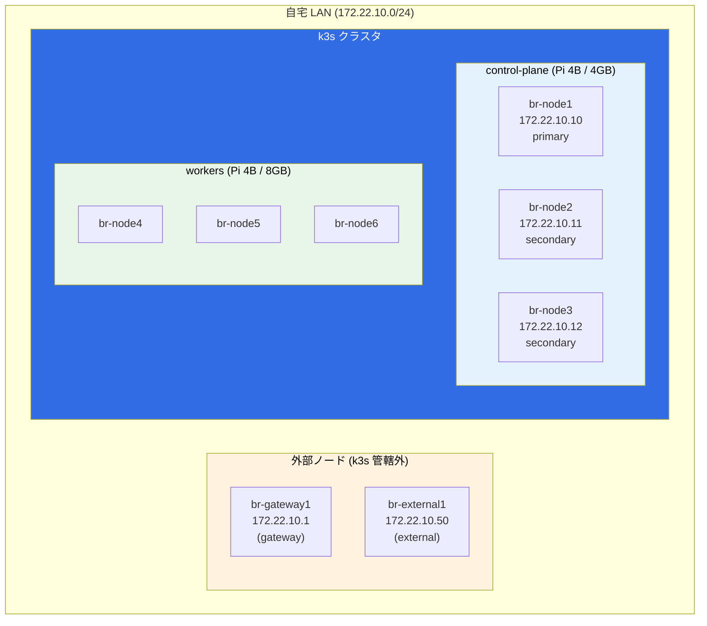
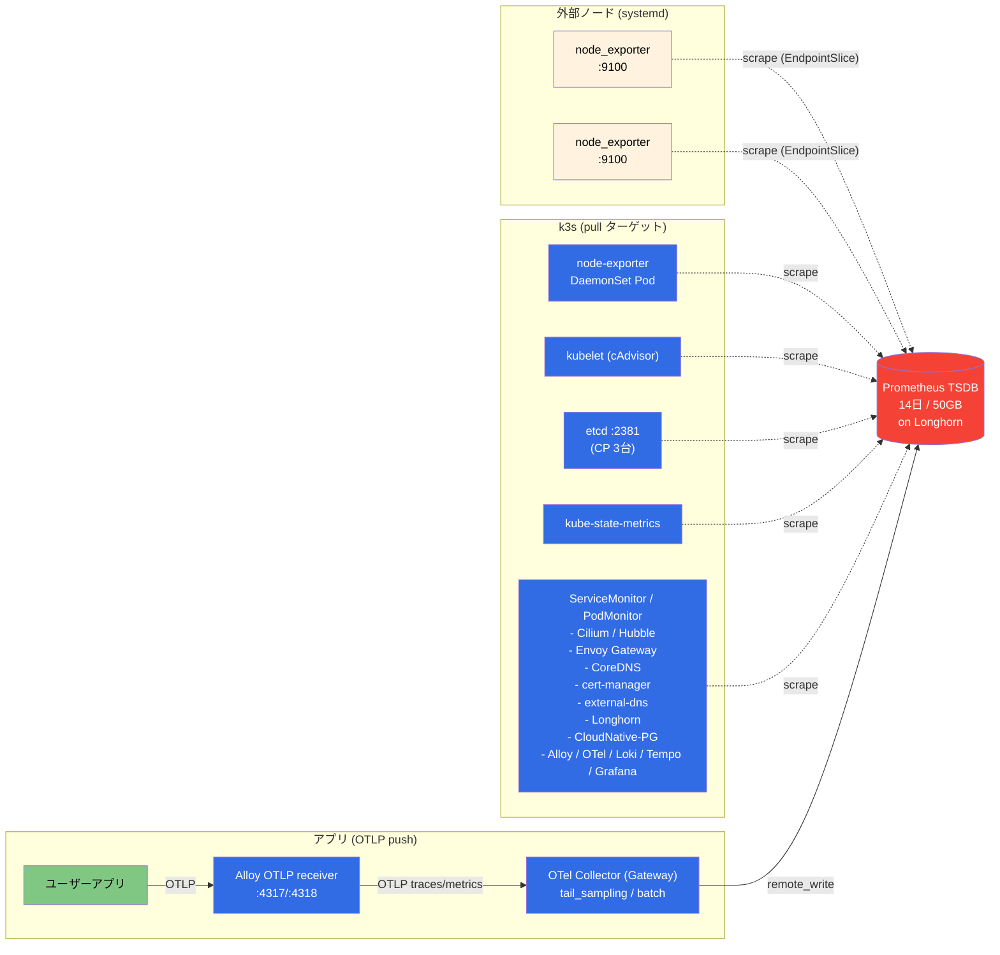
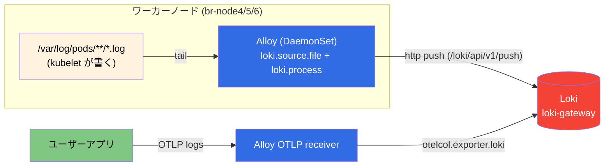
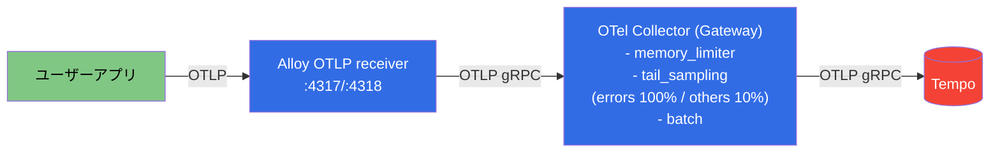
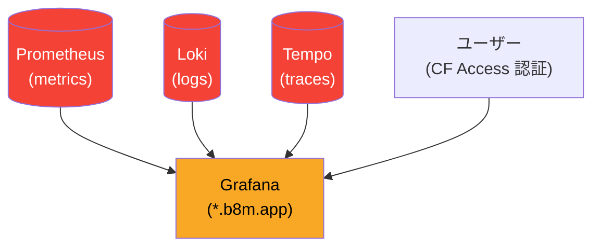

# 可観測性 (Observability) アーキテクチャ

クラスタ内外の各コンポーネントから **メトリクス / ログ / トレース** がどこで生まれ、誰が集めて、どこに保存されるかをまとめる。

## サーバー構成 (物理ノード)

- **stateful / 重量コンポーネント** (Prometheus, Alertmanager, Grafana, Loki, Tempo, Alloy 等) は `nodeSelector: node_type=worker` でワーカー固定
- **node-exporter DaemonSet と Cilium Agent** は例外的に全ノードで稼働（OS/ネットワーク層の可視化のため）

## 収集対象サマリ (どのノードから何が出るか)

| ノード | ホスト OS メトリクス | k8s メトリクス | ログ | トレース |
|---|---|---|---|---|
| br-gateway1 | systemd `node_exporter` | — | — | — |
| br-external1 | systemd `node_exporter` | — | — | — |
| br-node1〜6 | DaemonSet `node_exporter` Pod | kubelet / cilium / etc | Pod の stdout/stderr | アプリ→OTLP |
| br-node1〜3 (CP) | 上記 + **etcd** `:2381` | 上記 | ※ Alloy 不在（注記参照） | — |

---

## メトリクス (Metrics)

Prometheus が**プル型スクレイプ**で集めるのが基本。アプリ由来メトリクスだけ **OTLP プッシュ**経路を併用する。

### 現状の「温度」など RPi 固有メトリクス
**取得していない。** node_exporter は `--web.listen-address` のみで起動しており、thermal / hwmon / textfile collector が無効。

---

## ログ (Logs)

Alloy (DaemonSet) が各ワーカーの **`/var/log/pods/*/*/*.log` を直接 tail** して Loki に push する方式。

- **stdout/stderr の CRI ログ**を kubelet が `/var/log/pods/` に書き、Alloy がファイル tail（apiserver の log-follow は使わない = 過去インシデントの教訓）
- アプリ由来の **OTLP logs** も Alloy が受け取って直接 Loki に投げる（OTel Collector は経由しない＝ログ経路を単純化）

---

## トレース (Traces)

- Alloy はトレースを**直接 Tempo には送らない**。`tail_sampling` を1箇所に集約するため必ず Collector を経由
- 全エラーは保持、その他は 10% サンプリング

---

## 全体統合ビュー (Grafana)

---

## 注記 / 既知のギャップ

1. **RPi 固有メトリクス (温度 / スロットリング / 実クロック / コア電圧) 未取得**
   - node_exporter の textfile collector + `vcgencmd` で追加可能（別途検討中）

2. **PrometheusRule (アラート定義) 未作成**
   - kube-prometheus-stack 同梱のデフォルトルールは有効だが、温度/スロットリング用カスタムルールは未追加

3. **Alloy がワーカーのみにデプロイされている**
   - `controller.nodeSelector: node_type=worker` により **control-plane (br-node1〜3) 上の Pod ログは収集されていない**
   - 現状 CP 上は DaemonSet (node-exporter, cilium-agent) のみなので影響は限定的だが、障害時調査の盲点になりうる

4. **外部ノード (br-gateway1, br-external1) のログ / トレースは未収集**
   - メトリクスのみ（systemd node_exporter）。journald のログ集約は未実装

5. **長期保存 (Thanos / Mimir 等) 未導入**
   - Prometheus 14日保持のみ

---

## 関連ファイル

- `manifests/platform/kube-prometheus-stack/app/` — Prometheus / Alertmanager / node-exporter / kube-state-metrics
- `manifests/platform/kube-prometheus-stack/app/components/k3s/values.yaml` — kubelet / etcd スクレイプ設定
- `manifests/platform/kube-prometheus-stack/externalnodes-monitoring/` — 外部ノード ServiceMonitor + EndpointSlice
- `manifests/platform/alloy/app/base/values.yaml` — ログ収集パイプライン定義
- `manifests/platform/opentelemetry-collector/app/base/values.yaml` — トレース tail_sampling 設定
- `provisioner/roles/monitoring_agent/` — 外部ノード systemd node_exporter
