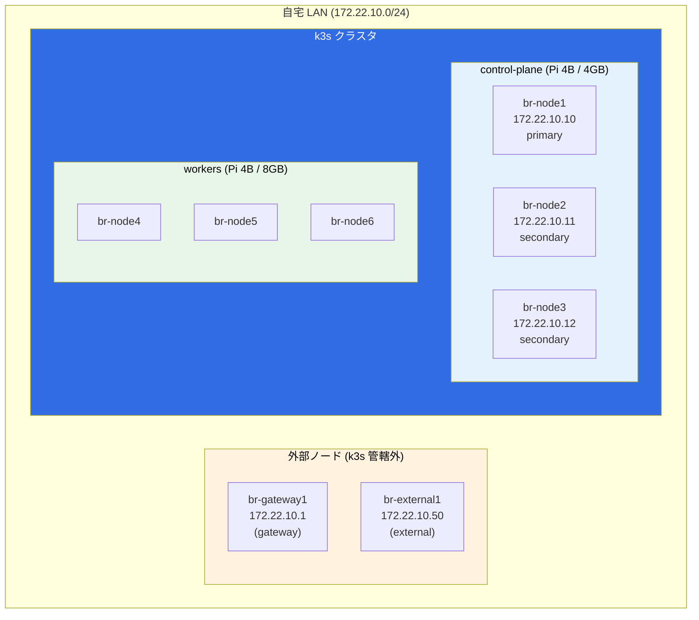
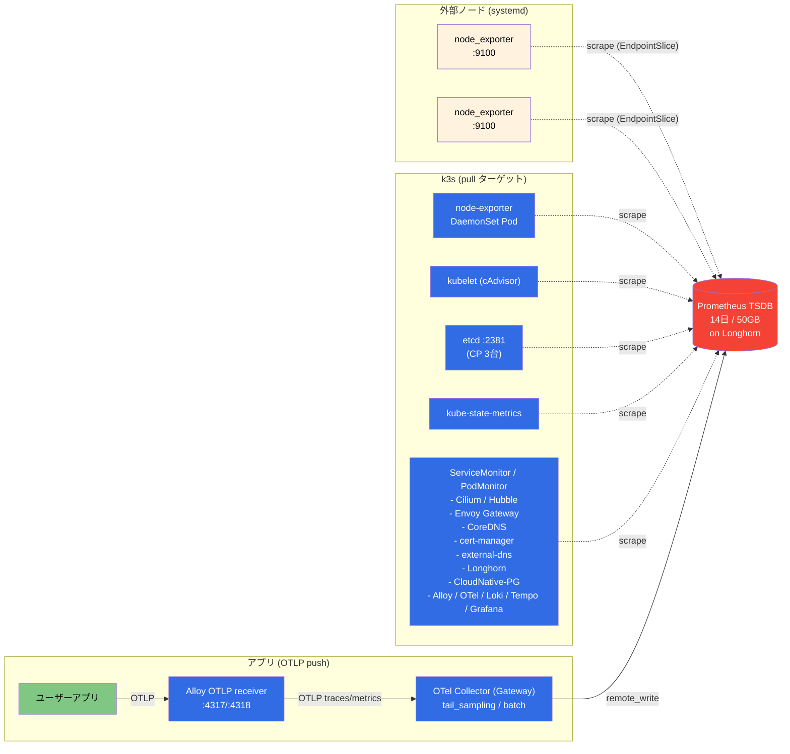
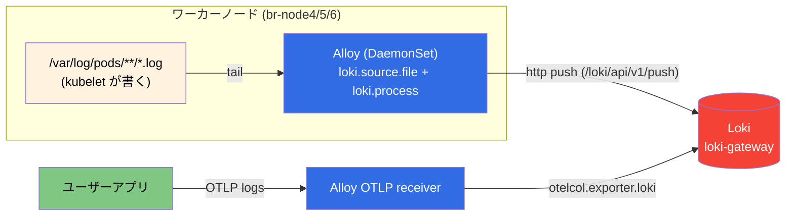
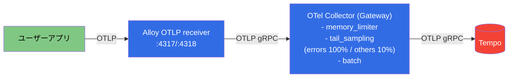
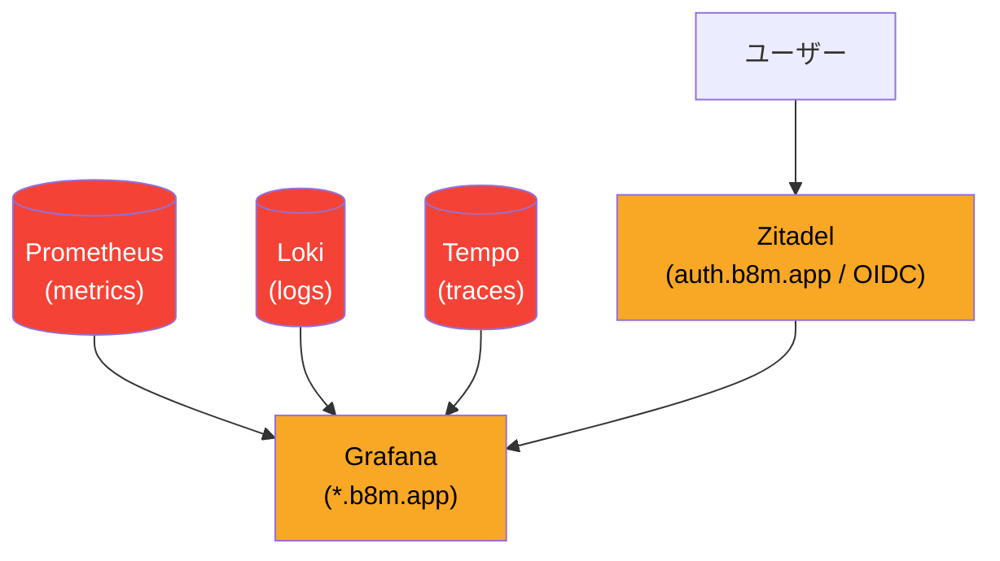
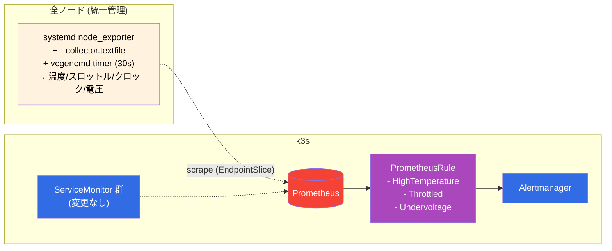

# 可観測性 (Observability) アーキテクチャ

クラスタ内外の各コンポーネントから **メトリクス / ログ / トレース** がどこで生まれ、誰が集めて、どこに保存されるかをまとめる。

## サーバー構成 (物理ノード)

- **stateful / 重量コンポーネント** (Prometheus, Alertmanager, Grafana, Loki, Tempo, Alloy 等) は `nodeSelector: node_type=worker` でワーカー固定
- **node-exporter DaemonSet と Cilium Agent** は例外的に全ノードで稼働（OS/ネットワーク層の可視化のため）

## 収集対象サマリ (どのノードから何が出るか)

| ノード | ホスト OS メトリクス | k8s メトリクス | ログ | トレース |
|---|---|---|---|---|
| br-gateway1 | systemd `node_exporter` | — | — | — |
| br-external1 | systemd `node_exporter` | — | — | — |
| br-node4〜6 (worker) | DaemonSet `node_exporter` Pod | kubelet / cilium / etc | Pod の stdout/stderr (Alloy tail) | アプリ→OTLP |
| br-node1〜3 (CP) | DaemonSet `node_exporter` Pod + **etcd** `:2381` | kubelet / cilium / etc | ※ Alloy 不在（注記参照） | — |

---

## メトリクス (Metrics)

Prometheus が**プル型スクレイプ**で集めるのが基本。アプリ由来メトリクスだけ **OTLP プッシュ**経路を併用する。

### 現状の「温度」など RPi 固有メトリクス
**取得していない。** node_exporter は `--web.listen-address` のみで起動しており、thermal / hwmon / textfile collector が無効。

---

## ログ (Logs)

Alloy (DaemonSet) が各ワーカーの **`/var/log/pods/*/*/*.log` を直接 tail** して Loki に push する方式。

- **stdout/stderr の CRI ログ**を kubelet が `/var/log/pods/` に書き、Alloy がファイル tail（apiserver の log-follow は使わない = 過去インシデントの教訓）
- アプリ由来の **OTLP logs** も Alloy が受け取って直接 Loki に投げる（OTel Collector は経由しない＝ログ経路を単純化）

---

## トレース (Traces)

- Alloy はトレースを**直接 Tempo には送らない**。`tail_sampling` を1箇所に集約するため必ず Collector を経由
- 全エラーは保持、その他は 10% サンプリング

---

## 全体統合ビュー (Grafana)

---

## 注記 / 既知のギャップ

1. **RPi 固有メトリクス (温度 / スロットリング / 実クロック / コア電圧) 未取得**
   - node_exporter の textfile collector + `vcgencmd` で追加可能（別途検討中）

2. **PrometheusRule (アラート定義) 未作成**
   - kube-prometheus-stack 同梱のデフォルトルールは有効だが、温度/スロットリング用カスタムルールは未追加

3. **Alloy がワーカーのみにデプロイされている**
   - `controller.nodeSelector: node_type=worker` により **control-plane (br-node1〜3) 上の Pod ログは収集されていない**
   - 現状 CP 上は DaemonSet (node-exporter, cilium-agent) のみなので影響は限定的だが、障害時調査の盲点になりうる

4. **外部ノード (br-gateway1, br-external1) のログ / トレースは未収集**
   - メトリクスのみ（systemd node_exporter）。journald のログ集約は未実装

5. **長期保存 (Thanos / Mimir 等) 未導入**
   - Prometheus 14日保持のみ

---

---

## 理想像 / ロードマップ

上記の「既知のギャップ」を段階的に解消する案。RPi クラスタのリソース制約を前提に、**既存の Alloy + OTel Collector 構成は維持**した上で、主にホスト OS 層の可観測性を強化する方針とする。

### 目指す全体像

### フェーズ分け

#### Phase 1: node_exporter を k3s 外に統一

| 項目 | 内容 |
|---|---|
| 目的 | 全 8 ノードを単一実装 (systemd + Ansible) に統合し、ホスト OS メトリクス経路の保守対象を 1 つに集約 |
| 変更範囲 | ホスト OS メトリクス層のみ。k8s ワークロード系 ServiceMonitor は**一切触らない** |
| 作業 | 1. `monitoring_agent` role を `br-node*` にも適用 (`setup_monitoring_agent.yaml` の対象を `gateway:external:master:worker` に拡張) 2. `externalnodes-monitoring` の EndpointSlice に `br-node1〜6` を追加 (`servers.yaml` から生成するのが理想) 3. ServiceMonitor の `relabelings` に **`job=node-exporter` / `instance=<node>:9100` を固定**する設定を追加 (既存 rules / ダッシュボード互換性の維持) 4. 切替え順序: **systemd 側を先に全ノードで up → EndpointSlice 追加 → Prometheus 側で両系ターゲット見えることを確認 → kube-prometheus-stack Helm values で `prometheus-node-exporter` を `enabled: false` に** (:9100 は `hostNetwork` 競合するので逆順厳禁) 5. DaemonSet 撤去後、`external-nodes` ServiceMonitor 名が全ノードを指すことになるので、内部統一のため名称を `node-exporter` 等に改名するかを判断 |
| 得るもの | ・保守対象が 1 経路 (systemd + Ansible) に集約 ・後続 Phase で hostPath マウント体操が不要 ・外部ノード / k3s ノードでホスト OS 系メトリクスのラベルが完全統一 |
| 注意点 | kube-prometheus-stack 同梱のデフォルト PrometheusRule は `job="node-exporter"` 前提で書かれているため、**作業 3 の relabel を欠かすと既存ルール / Node Exporter Full ダッシュボードが空になる**。Phase 1 の最重要作業はこの互換設定 |

#### Phase 2: RPi 固有メトリクス収集 (textfile collector + vcgencmd)

| 項目 | 内容 |
|---|---|
| 取得する値 | **温度** / **スロットリング状態** (`get_throttled`) / **実クロック** (`measure_clock arm`) / **コア電圧** (`measure_volts core`) |
| 手段の切り分け | 温度は **node_exporter 内蔵の `hwmon` / `thermal_zone` collector** (`node_hwmon_temp_celsius` / `node_thermal_zone_temp`) を有効化するだけで取れる。textfile + `vcgencmd` が必要なのは **スロットリング / 実クロック / コア電圧** の 3 種 |
| 手段 | **既存の node_exporter の内蔵機能** (`--collector.textfile` + `--collector.hwmon` / `--collector.thermal_zone`) に乗せる。別エクスポータ (rpi_exporter 等) は導入しない |
| 実装箇所 | `provisioner/roles/monitoring_agent/` 配下 ・`node_exporter.service.j2` に textfile / hwmon / thermal_zone フラグ追加 ・`systemd` unit に `RuntimeDirectory=node_exporter/textfile` を指定 (tmpfs, SD 摩耗回避 / パーミッション整備) ・`rpi-metrics.sh` (vcgencmd を叩いて `.prom.$$` に書いて `.prom` へ atomic rename) ・`rpi-metrics.service` + `rpi-metrics.timer` (30秒間隔) ・node_exporter と rpi-metrics でユーザが異なる場合は共通グループ or `umask 022` で read 可能化 |
| リソース影響 | 常駐プロセスなし。CPU 平均 < 0.3%、メモリ 0 (timer 起動時のみ一時数MB) |
| Phase 1 依存 | あり。Phase 1 完了後なら hostPath マウント設定が不要で最もシンプル |

#### Phase 3: PrometheusRule (アラート) 追加

現状 `PrometheusRule` は 0 件。RPi 運用で特に価値が高いルールを定義する:

| アラート名 | 条件 | 重大度 |
|---|---|---|
| `NodeHighTemperature` | `node_thermal_temperature_celsius > 75` for 5m | warning |
| `NodeCriticalTemperature` | `node_thermal_temperature_celsius > 80` for 2m | critical |
| `NodeThrottlingDetected` | `rpi_throttled_state != 0` for 1m | warning |
| `NodeUndervoltage` | `rpi_throttled_state & 0x1 == 1` for 1m | critical |
| `NodeFrequencyCapped` | `rpi_arm_clock_hertz < expected` for 5m | warning |

Phase 2 でメトリクスが出るようになってから追加。

### 将来的検討 (優先度低)

Pi クラスタの規模感では直近必須ではないもの:

- **外部ノード (br-gateway1, br-external1) の journald → Loki ログ収集**: `alloy` の systemd 版 or `promtail` 同等品を systemd で。Phase 1 で `monitoring_agent` role を全ノードに広げるので、同じロール内に後付けで同梱すると Ansible の往復が減る
- **control-plane の Pod ログ収集**: Alloy の `nodeSelector` を外すか、CP 専用の軽量 Alloy を配置
- **メトリクス長期保存**: Thanos / Mimir。現状 14 日保持で運用上問題なし
- **Blackbox exporter**: 外形監視。家庭内サービスなので優先度低

### 非目標 (やらないこと)

- **Alloy の OTel Collector への置き換え**: Pi 制約下ではメモリ +200〜400Mi 悪化、得るメリット小
- **rpi_exporter の導入**: 常駐 10〜20MB が無駄。textfile 方式で完全代替可能
- **Prometheus の水平分散**: 単一インスタンスで十分

---

## 関連ファイル

- `manifests/platform/kube-prometheus-stack/app/` — Prometheus / Alertmanager / node-exporter / kube-state-metrics
- `manifests/platform/kube-prometheus-stack/app/components/k3s/values.yaml` — kubelet / etcd スクレイプ設定
- `manifests/platform/kube-prometheus-stack/externalnodes-monitoring/` — 外部ノード ServiceMonitor + EndpointSlice
- `manifests/platform/alloy/app/base/values.yaml` — ログ収集パイプライン定義
- `manifests/platform/opentelemetry-collector/app/base/values.yaml` — トレース tail_sampling 設定
- `provisioner/roles/monitoring_agent/` — 外部ノード systemd node_exporter
