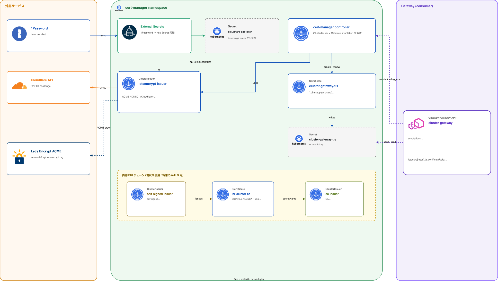

# Certificate Management

クラスタ内 / 外を問わず、X.509 証明書の発行と更新を扱うグループ。現状は **cert-manager** 1 本構成。

## このグループが解決する課題

- Envoy Gateway の `*.b8m.app` を **Let's Encrypt から自動発行・自動更新**する
- 自宅 LAN なので HTTP01 challenge は使えない → **DNS01 (Cloudflare)** で完結させる
- 内部用 CA (将来の mTLS / 内部 PKI 用途に備えた `br-cluster-ca`) を自己署名で生成
- Gateway API (`Gateway` リソース) のアノテーションで証明書を **宣言的に紐付け** (Ingress なしで完結)

## グループ全体構成



## グループ全体の設計判断

| 判断 | 採用 | 不採用 / 旧構成 | 理由 |
|---|---|---|---|
| ACME challenge        | DNS01 (Cloudflare API) | HTTP01 | 自宅 LAN なので HTTP01 用の :80 を Public に開けない |
| ワイルドカード        | `*.b8m.app` 1 枚 | 各サービスごとに発行 | サービス追加で発行ジョブが走らない、レート制限を踏まない |
| 証明書の参照方法      | **Gateway API annotation** (`cert-manager.io/cluster-issuer`) | 手動で `Certificate` リソースを書く | Envoy Gateway 用 `--enable-gateway-api` を入れて宣言的に。HTTPRoute 増えても Gateway 側 1 箇所で完結 |
| 内部 CA               | self-signed → `br-cluster-ca` (`ca-issuer`) を作っておく | 都度発行 | 将来の mTLS / 内部 PKI 用に「使えるようになっている」状態を維持 |
| 失敗時の可視化        | **無し** (ログ目視) | Prometheus rule (有効期限 / Ready / 更新エラー) | オブザーバビリティ基盤の全撤去に伴い、`monitoring` component (ServiceMonitor 生成) は prod overlay から外した。再構築は [後続のサブプロジェクト B](../proposals/2026-09-05-single-cp-rearch.md#後続のサブプロジェクト) の範囲 |

---

## cert-manager

### 概要

Kubernetes ネイティブな証明書管理コントローラ。**ClusterIssuer** で発行ポリシーを定義し、`Certificate` または **Gateway / Ingress の annotation** から動かす。

### ソース

- Helm: [`manifests/platform/cert-manager/app/`](../../manifests/platform/cert-manager/app/)
  - chart `cert-manager` v1.20.1 (OCIRepository, `oci://quay.io/jetstack/charts/cert-manager`)
  - components: `dns01` / `gateway-api` (`monitoring` component は定義のみ残存、prod overlay からは無効化)
- ClusterIssuers: [`manifests/platform/cert-manager/config/base/`](../../manifests/platform/cert-manager/config/base/) + [`components/acme-cloudflare/`](../../manifests/platform/cert-manager/config/components/acme-cloudflare/)
- Secrets: [`manifests/platform/cert-manager/secrets/base/`](../../manifests/platform/cert-manager/secrets/base/)

### Helm components の構成

`overlays/prod/kustomization.yaml` で以下の component を有効化:

| component        | 効果 |
|------------------|------|
| `dns01`          | `dns01RecursiveNameservers: 8.8.8.8:53,1.1.1.1:53` (`...Only: true`)。recursive が CF 側のキャッシュに引っかかった結果 self-check が失敗するのを避ける |
| `gateway-api`    | `--enable-gateway-api` で Gateway / HTTPRoute の annotation を解釈可能に |

`monitoring` component (Prometheus ServiceMonitor 生成) は [`components/monitoring/`](../../manifests/platform/cert-manager/app/components/monitoring/) にコード自体は残っているが、kube-prometheus-stack 撤去に伴い prod overlay からは外している。

### ClusterIssuer 一覧

| ClusterIssuer        | 種類 | 用途 |
|----------------------|------|------|
| `letsencrypt-issuer` | ACME (DNS01 / Cloudflare) | `*.b8m.app` 等の **本番証明書発行** |
| `self-signed-issuer` | self-signed | 下記 `br-cluster-ca` 発行用の bootstrap |
| `ca-issuer`          | CA (`secretName: root-secret`) | 将来の内部 PKI / mTLS 用。現状の利用先は無し |

### Let's Encrypt 設定

```yaml
# config/components/acme-cloudflare/cloudflare-issuer.yaml (抜粋)
spec:
  acme:
    server: https://acme-v02.api.letsencrypt.org/directory   # 本番
    email: ${ACME_EMAIL}
    privateKeySecretRef:
      name: letsencrypt-cloudflare-prod
    solvers:
      - dns01:
          cloudflare:
            apiTokenSecretRef:
              name: cloudflare-api-token
              key: api-token
```

| 項目 | 値 / 備考 |
|------|-----------|
| ACME server     | 本番 (`acme-v02.api.letsencrypt.org`) |
| `ACME_EMAIL`    | 1Password `cert-bot` item の `mail_address` を `cert-manager-substitution` Secret 経由で Flux Substitute |
| API Token       | 1Password `cert-bot` item の `cloudflare_api_token` を `cloudflare-api-token` Secret に同期 (`cert-manager` namespace) |

### 内部 CA (`br-cluster-ca`)

`self-signed-issuer` → `Certificate br-cluster-ca` (`isCA: true`, ECDSA P-256) → `ca-issuer` (`secretName: root-secret`) のチェーンで作っておく。利用箇所はまだないが、内部 mTLS や Webhook TLS に使える状態を維持。

### Gateway との連携

`cluster-gateway` の annotation 1 行で証明書取得 → Secret 作成 → Listener に紐付けまで自動:

```yaml
# manifests/platform/envoy-gateway/config/base/gateway.yaml
metadata:
  annotations:
    cert-manager.io/cluster-issuer: letsencrypt-issuer
spec:
  listeners:
    - name: https
      tls:
        mode: Terminate
        certificateRefs:
          - name: cluster-gateway-tls   # cert-manager が生成
```

### 監視

kube-prometheus-stack 撤去に伴い、証明書失効 / renewal エラーの自動 Alert は現状**無し**。`kubectl get certificate -A` / `cmctl status certificate` の目視確認に頼る。オブザーバビリティ基盤の再構築 ([後続のサブプロジェクト B](../proposals/2026-09-05-single-cp-rearch.md#後続のサブプロジェクト)) で `CertificateExpiringSoon` 等の Alert を再導入する想定。

### 依存

- 前提: External Secrets (Cloudflare API Token / ACME email)
- これに依存: `cluster-gateway` (`*.b8m.app`)、将来の内部 PKI 利用先

### 運用上の注意

- DNS01 self-check が時々遅延する。`dns01RecursiveNameservers` を 8.8.8.8 / 1.1.1.1 に固定しているのはそのため。**ローカル DNS (gateway1 CoreDNS) を使うと CF 反映遅延を `8.8.8.8` で見に行ってしまうので使わない**
- ACME staging に切り替えたい場合は `cloudflare-issuer.yaml` の `server` を `acme-staging-v02...` に変えるが、**privateKeySecretRef の名前も別 Secret に**しないとアカウントキーが混ざる
- Cloudflare API Token は **DNS:Edit** + zone scope (`b8m.app` のみ) に絞って発行 (Global API Key は使わない)
- Renewal は cert-manager のデフォルト (有効期限 2/3 経過時)。手動 renew は `cmctl renew <name> -n <ns>`

---

## 関連

- [`docs/platform/networking.md`](networking.md) — `cluster-gateway` の TLS Listener
- [`docs/platform/secrets.md`](secrets.md) — External Secrets / 1Password Connect
