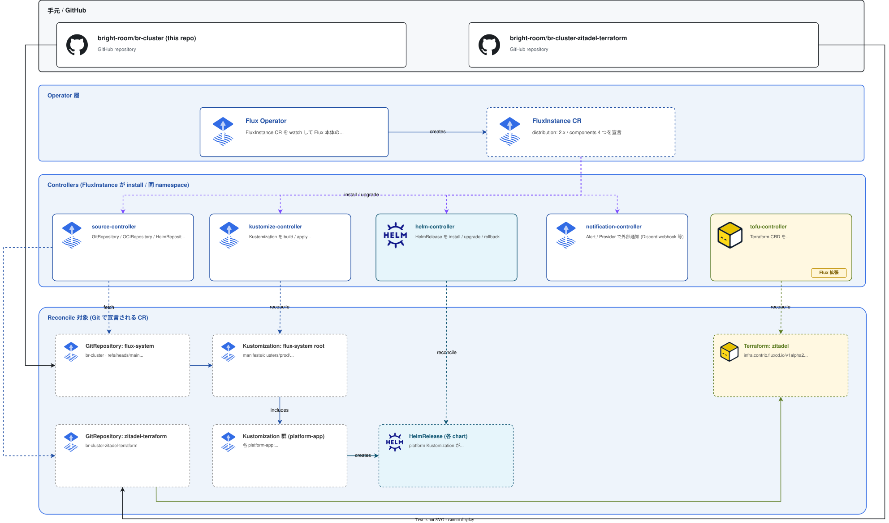

# GitOps

クラスタの **継続的同期** (Git → クラスタ) を担うグループ。Flux Operator が Flux 本体を宣言的に管理し、Flux 本体が `manifests/clusters/prod/` 以下を同期する。tofu-controller はこの群に同居して、Terraform / OpenTofu を Flux のリソースとして扱えるようにする。

## このグループが解決する課題

- Git をクラスタの **唯一の真実 (SoT)** として、`kubectl apply` を運用から排除する
- Flux 本体のバージョン更新も宣言的に行う (Flux Operator)
- Helm / Kustomize / Terraform を **同じ宣言モデル** (`HelmRelease` / `Kustomization` / `Terraform` CRD) で扱う
- Pod 内 controller が Git をポーリングするので、外部 CI ランナー / `kubectl` 認証が不要

## グループ全体構成

## グループ全体の設計判断

| 判断 | 採用 | 不採用 / 旧構成 | 理由 |
|---|---|---|---|
| Flux のインストール手順 | **Flux Operator** + FluxInstance CR | `flux bootstrap` CLI / Helm 直 | 本体の version up を宣言的に管理できる。`flux bootstrap` の手作業が消える |
| Flux 配布元              | OCIRepository (`ghcr.io/controlplaneio-fluxcd/charts/...`) | 通常 Helm Repo                  | OCI に統一して認証経路を 1 本化、operator も同 OCI に置かれている |
| 同期対象パス            | `manifests/clusters/prod/`                         | リポルート全体                   | 環境別ディレクトリ。dev 用は将来 `clusters/dev/` を切る想定 |
| Substitute              | `cluster-settings` ConfigMap (`postBuild.substituteFrom`) | 環境変数 / Helm values 直書き    | manifests に `${VAR}` を残しても Flux 段階で展開される。Git で読みやすい |
| Terraform 統合          | tofu-controller (Flux 拡張)                        | GitHub Actions / 手元 `tofu apply` | クラスタ内 controller が Git を見て plan/apply、state も k8s Secret に置ける |
| 起動順                   | bootstrap_cluster.yaml で **Flux Operator → 最上位 Kustomization** を Ansible 投入 | `flux install` を手動 | k3s ブート直後の自動化。詳細 → [`docs/provisioning.md`](../provisioning.md) |

---

## Flux Operator

### 概要

Flux 本体 (`source-controller` / `kustomize-controller` / `helm-controller` / `notification-controller`) を **`FluxInstance` CR** で宣言的に管理する controlplane.io 製のメタコントローラ。

### ソース

- Helm: [`manifests/platform/flux-operator/operator/base/`](../../manifests/platform/flux-operator/operator/base/)
  - chart `flux-operator` v0.45.1 (OCIRepository, `oci://ghcr.io/controlplaneio-fluxcd/charts/flux-operator`)
  - namespace: `flux-system`

### 設定の要点

| 項目 | 値 |
|------|----|
| chart 配布元    | OCI (controlplaneio-fluxcd) |
| 役割            | `FluxInstance` CR を watch して Flux 本体の Helm release を生成・更新 |
| upgrade.remediation | `rollback` retries=3 |

### 依存

- 前提: なし (Ansible bootstrap で最初に投入)
- これに依存: Flux 本体 (`FluxInstance` 経由)

---

## Flux Instance (= Flux 本体)

### 概要

`FluxInstance` CR が Flux Operator にインストールさせる **Flux 本体**。distribution は upstream `2.x`、components は 4 つ。

### ソース

- Helm: [`manifests/platform/flux-operator/instance/base/`](../../manifests/platform/flux-operator/instance/base/)
  - chart `flux-instance` v0.45.1
- prod overlay: [`overlays/prod/values.yaml`](../../manifests/platform/flux-operator/instance/overlays/prod/values.yaml)

### 設定の要点

| 項目 | 値 |
|------|----|
| `distribution.version`     | `2.x` (upstream Flux v2 の最新) |
| `distribution.registry`    | `ghcr.io/fluxcd` |
| components                 | `source-controller` / `kustomize-controller` / `helm-controller` / `notification-controller` |
| `cluster.networkPolicy`    | `false` (Pi 環境では NetworkPolicy 運用負荷を抑える) |
| `cluster.domain`           | `cluster.local` |
| sync 元                    | `https://github.com/bright-room/br-cluster` (`refs/heads/main`、path `manifests/clusters/prod`) |
| pullSecret                 | `flux-system` (GitHub App credentials) |
| provider                   | `github` |

### Components の役割

| Controller                  | 役割 |
|-----------------------------|------|
| source-controller           | `GitRepository` / `OCIRepository` / `HelmRepository` を fetch |
| kustomize-controller        | `Kustomization` を build / apply、`postBuild.substitute*` を解決 |
| helm-controller             | `HelmRelease` を install / upgrade / rollback |
| notification-controller     | `Alert` / `Provider` で外部通知 (現状未使用、将来 Discord 等を想定) |

### 依存

- 前提: Flux Operator、GitHub App credentials Secret (`flux-system` namespace)、cluster-settings ConfigMap
- これに依存: 全 platform Kustomization (`manifests/clusters/prod/platform/*-app.yaml`)

### 運用上の注意

- `distribution.version: 2.x` は **アップストリームの「最新 v2」を追従**する。固定したい場合は `2.7.1` のように pin
- GitHub App の secret (`flux-system` namespace の `flux-system` Secret) は **Ansible bootstrap で投入**。Flux 自身が自分の認証情報を取りに行く chicken-and-egg を避ける構造

---

## tofu-controller

### 概要

Flux IAC (`flux-iac/tofu-controller`) が提供する **Terraform / OpenTofu の controller**。`Terraform` CRD を `kustomize-controller` と同じ感覚で扱える。

### ソース

- Helm: [`manifests/platform/flux-operator/tofu-controller/base/`](../../manifests/platform/flux-operator/tofu-controller/base/)
  - chart `tofu-controller` v0.16.2 (`https://flux-iac.github.io/tofu-controller`)
  - namespace: `flux-system`

### 設定の要点

| 項目 | 値 / 備考 |
|------|-----------|
| `allowCrossNamespaceRefs: true` | `Terraform` CR から別 ns の `GitRepository` / `Secret` を参照可 |
| `runner.grpc.maxMessageSize: 20`| state / plan が大きい時の gRPC 制限 |

### 提供する CRD

| CRD | 用途 |
|-----|------|
| `Terraform`   | Plan / Apply のサイクルを宣言、ソースは `GitRepository` 等 |
| (Runner Pod) | tofu-controller が必要に応じて runner Pod を起動して `tofu plan/apply` を実行 |

### 現状の利用先

- `zitadel-terraform-app` (`infra.contrib.fluxcd.io/v1alpha2/Terraform`) — Zitadel リソースを `bright-room/br-cluster-zitadel-terraform` リポから管理。詳細 → [`docs/platform/identity.md`](identity.md)

### 依存

- 前提: Flux Instance (`source-controller`)
- これに依存: `zitadel-terraform-app`

### 運用上の注意

- runner Pod は Job ベースで使い捨て。runner ServiceAccount に余計な権限を持たせないこと (各 `Terraform` CR が `serviceAccountName` で別途 SA を指定する設計)
- state を k8s Secret に置く構成 (`backend-type: kubernetes` を tofu-controller が injection)。Secret サイズが etcd の 1MB 上限を超えるとアウトなので、巨大な state は別 backend を検討

---

## ブートストラップとの接続

ゼロからクラスタを立てるとき、Flux 自身を最初に入れる必要がある (chicken-and-egg)。流れは [`docs/provisioning.md`](../provisioning.md) の `bootstrap-cluster` Playbook が担う:

1. `bootstrap/secrets` — Flux に必要な Secret (`flux-system` GitHub App credentials、`onepassword-connect-token` 等) を `kubectl apply` で投入
2. `bootstrap/fluxcd` — Flux Operator を Helm CLI で install → `FluxInstance` CR 投入
3. ここから先は Flux が `manifests/clusters/prod/` を読み取り、自走

以降、Flux 本体の version up は `flux-instance` の values を変更するだけで良い (`flux bootstrap` 再実行は不要)。

## 関連

- [`docs/kubernetes.md`](../kubernetes.md) — `manifests/clusters/prod/` 配下の構造、`cluster-settings.yaml`
- [`docs/provisioning.md`](../provisioning.md) — Ansible 側のブートストラップ手順
- [`docs/platform/identity.md`](identity.md) — tofu-controller の唯一の利用者 (`zitadel-terraform-app`)
- [`docs/platform/secrets.md`](secrets.md) — GitHub App / 1Password Connect の Secret 投入経路
