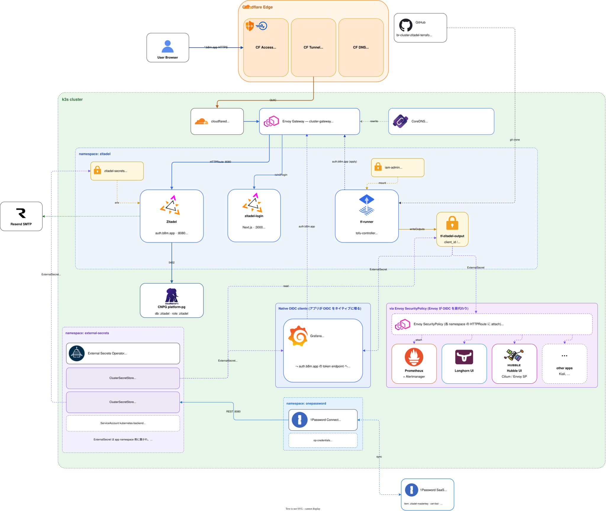

# Identity

クラスタ内の **OIDC IdP** と、Zitadel のテナント / アプリ / ロールを **IaC で管理する仕組み**を提供するグループ。

## このグループが解決する課題

- アプリ層の認証を一元化 (Cloudflare Access はネットワーク境界、Zitadel はアプリの user/role)
- ユーザー / プロジェクト / OIDC アプリ登録を **GitHub リポで宣言的に管理** (手動 console 操作からの脱却)
- クラスタ内クライアント (Envoy SecurityPolicy / tofu-controller) が CF Tunnel を経由せず Zitadel に到達できるようにする

## グループ全体構成



OIDC クライアント側の接続パターンには 2 種類ある:

| パターン | 例 | 仕組み |
|---|---|---|
| **Native OIDC** (アプリ自前) | Grafana | アプリが OIDC / OAuth2 をネイティブに喋る。`tf-zitadel-output` の `<app>_client_id` / `<app>_client_secret` を `ExternalSecret` で取り込み、`auth.b8m.app` の token endpoint に **直接** アクセスする。**`SecurityPolicy` は不要** |
| **Envoy SecurityPolicy** (Envoy 肩代わり) | Prometheus / Alertmanager / Hubble UI / Longhorn UI 等 | アプリは認証を喋れない / 共通化したい場合、HTTPRoute に `SecurityPolicy` を attach し Envoy が OIDC を肩代わり。未認証なら Zitadel にリダイレクトし、cookie で sidecar 化 |

どちらのパターンでも、Zitadel 側の OIDC アプリ宣言は **`br-cluster-zitadel-terraform` の `zitadel_application_oidc.platform`** に集約され、tofu-controller が apply した結果が `tf-zitadel-output` Secret に書き出される (一次元情報)。クライアント側 (br-cluster) はそれを読むだけ。

## グループ全体の設計判断

| 判断 | 採用 | 不採用 / 旧構成 | 理由 |
|---|---|---|---|
| OIDC IdP                | Zitadel (Go + Postgres) | Keycloak | JVM が Pi で重い、DB 運用コスト。Zitadel は CNPG (既存) に乗る |
| Zitadel リソース管理    | OpenTofu + tofu-controller (in-cluster) | console 手動 / GitHub Actions で apply | state を k8s Secret に置けばクラスタ寿命と同期。GitOps から外れない |
| クラスタ内 OIDC 解決経路 | CoreDNS で `auth.b8m.app` を Envoy VIP にリダイレクト | CF Tunnel を一周 | CF Access がクラスタ内クライアントの token endpoint を 403 で弾く問題を回避 |
| Envoy SecurityPolicy → Zitadel 参照 | `backendRefs` (Service 直指し) | `issuer` の DNS 解決まかせ | Envoy の c-ares リゾルバが in-cluster STRICT_DNS を取りこぼすことがあるため EDS 経由で確実化 |
| 旧 CF Access JWT 直検証 | **撤回** (Zitadel に移行) | 各アプリで JWKS 検証して auto-sign-up | アプリ単位の権限制御ができないため。CF Access はネットワーク層に役割を限定 |

---

## Zitadel

### 概要

Go 製の OIDC / OAuth2 / SAML IdP。`auth.b8m.app` で公開し、CNPG の `zitadel` データベースに永続化する。

### ソース

- Helm: [`manifests/platform/zitadel/app/base/`](../../manifests/platform/zitadel/app/base/)
  - chart `zitadel` v9.34.0 ([`helm.yaml`](../../manifests/platform/zitadel/app/base/helm.yaml))
- HTTPRoute: [`manifests/platform/zitadel/config/base/httproute.yaml`](../../manifests/platform/zitadel/config/base/httproute.yaml)
- ReferenceGrant: [`manifests/platform/zitadel/app/base/referencegrant.yaml`](../../manifests/platform/zitadel/app/base/referencegrant.yaml)

### 設定の要点

| 項目 | 値 / 備考 |
|------|-----------|
| 公開ドメイン            | `auth.b8m.app` (`ExternalDomain`) |
| クラスタ内 TLS          | Off (`TLS.Enabled: false`)。Envoy が TLS 終端し、Pod へは HTTP |
| データベース            | CNPG `platform-pg-rw.platform-pg.svc.cluster.local:5432` / database `zitadel`、ユーザー `zitadel` (DB owner) |
| 初期化                  | `initJob.command: zitadel` で **CNPG 側が作った DB / Role を再利用** (Helm 同梱の create を skip) |
| Master key / DB password | 1Password 経由で `zitadel-secrets` Secret に注入 (External Secrets) |
| SMTP                    | 現状未設定 (Resend 整備後に有効化予定) |
| Replica                 | 1 (Pi のリソース節約)、worker ノード固定 (`nodeSelector: node_type: worker`) |

### ルーティング (HTTPRoute)

`zitadel-b8m` ([`httproute.yaml`](../../manifests/platform/zitadel/config/base/httproute.yaml)):

| パス             | 振り先 Service          | 備考 |
|------------------|-------------------------|------|
| `/ui/v2/login`   | `zitadel-login:3000`    | v4 以降、ログイン UI が Next.js の独立 Pod に分離 |
| その他           | `zitadel:8080`          | console / OIDC endpoint / API |

### ReferenceGrant の用途

別 namespace の `SecurityPolicy` (`kube-prom-stack` / `kube-system` / `longhorn-system`) から `zitadel` Service を `backendRefs` で参照させるための許可。**Envoy の c-ares リゾルバが in-cluster STRICT_DNS で取りこぼす問題の回避策**として、DNS ではなく EDS で当てている。

### CoreDNS のショートカット

[`platform/coredns`](networking.md#coredns) の hosts プラグインに以下が入っている:

```text
${CLUSTER_GATEWAY_IP} auth.b8m.app
```

これにより、クラスタ内 Pod (tofu-controller、Envoy SecurityPolicy の OIDC discovery) は **CF Tunnel を経由せず**、Envoy Gateway VIP に直接当たる。

### 認証 (CF Access との関係)

| 経路 | CF Access policy |
|------|------------------|
| `auth.b8m.app/*` (一般) | WARP-only (ログインブロック無し) |
| `auth.b8m.app/ui/console*` (admin console) | 加えて admin allowlist |
| OIDC endpoints (`/oauth/v2/*` など) | CF Access **bypass** |

### 依存

- 前提: CNPG `platform-pg-cluster`、External Secrets、Envoy Gateway (`cluster-gateway`)、cert-manager (`*.b8m.app`)
- これに依存: 全 OIDC 保護アプリ (Grafana、Alertmanager、Hubble UI、Longhorn UI、Prometheus 等)

### 運用上の注意

- CNPG の `zitadel` ロール / DB は `platform-pg-cluster` の `bootstrap.initdb` で作成済み。Helm 側の init は **skip 前提** (`initJob.command: zitadel`)。両方走らせると失敗するので注意
- `masterkey` を再生成すると **既存の暗号化セッションが全部死ぬ**。1Password に厳重保管

---

## zitadel-terraform-app

### 概要

クラスタ内で **OpenTofu (terraform) を `infra.contrib.fluxcd.io/v1alpha2/Terraform` (tofu-controller) で実行**し、Zitadel のテナント / プロジェクト / OIDC アプリ / ロールを宣言的に管理する。

### ソース

- マニフェスト: [`manifests/platform/zitadel/terraform/base/`](../../manifests/platform/zitadel/terraform/base/)
  - `terraform.yaml` — `Terraform` リソース定義
  - `gitrepository.yaml` — 外部リポ `bright-room/br-cluster-zitadel-terraform` を Flux GitRepository として参照
  - `tf-runner.yaml` — runner Pod 用 ServiceAccount + Role + RoleBinding
- Terraform コード本体: **別リポ** [`bright-room/br-cluster-zitadel-terraform`](https://github.com/bright-room/br-cluster-zitadel-terraform)

### 動作モデル

| 項目 | 内容 |
|------|------|
| 実行サイクル          | `interval: 10m` で plan、`approvePlan: auto` で apply まで自動 |
| Terraform state       | tofu-controller が **k8s Secret として保持** (kubernetes backend)。クラスタ破棄と同期 |
| Provider 認証         | Helm が生成する `iam-admin` Secret (JWT profile JSON) を runner Pod に `/secrets/zitadel-admin/iam-admin.json` でマウント |
| Provider が呼ぶ host  | `auth.b8m.app` (CoreDNS のショートカットで Envoy VIP に解決) |
| 入力変数              | `zitadel_domain` を vars で渡す。`zitadel-smtp-creds` Secret を `varsFrom` で `TF_VAR_*` 化 |
| 出力                  | `tf-zitadel-output` Secret に `<app>_client_id` / `<app>_client_secret` を書き出し |
| Git アクセス          | 外部リポは GitHub App の secret (`flux-system`) を流用してクローン |

### 出力の使われ方

各アプリ namespace の `ExternalSecret` が `tf-zitadel-output` の値を `client-id` / `client-secret` に rename して `Secret` に同期。SecurityPolicy or アプリ自前の OIDC 設定はそれを参照する。

### 新規 OIDC 保護アプリの追加手順

1. **br-cluster** 側で HTTPRoute を追加 (`<name>.b8m.app`)
2. **br-cluster-zitadel-terraform** 側で `zitadel_application_oidc.platform` の `for_each` map にエントリ追加 → tofu-controller apply で `tf-zitadel-output` に `<name>_client_id` / `<name>_client_secret` が書かれる
3. **br-cluster** 側で
   - `ExternalSecret` (`store: kubernetes-backend`、`tf-zitadel-output` の 2 キーを `client-id` / `client-secret` に rename)
   - `SecurityPolicy` (`issuer: https://auth.b8m.app`、`backendRefs` で `zitadel` Service 指定、`redirectURL: https://<name>.b8m.app/oauth2/callback`)
4. **br-cluster** 側で `referencegrant.yaml` の `from` リストに対象 namespace を追加 (初回だけ)
5. **br-cloudflare-terraform** 側で `access_applications` map に `<name> = "<name>.b8m.app"` を追加 → CF Access (GitHub Org + WARP) が新ホストに効く

Grafana のように **アプリ自前の OIDC** を持つ場合は 3 の `SecurityPolicy` を付けず、アプリ側の generic OAuth 設定で client 情報を流し込む (実例: [`manifests/platform/grafana/app/base/values.yaml`](../../manifests/platform/grafana/app/base/values.yaml))。

### 依存

- 前提: Zitadel が起動済み、`iam-admin` Secret が存在、CoreDNS の `auth.b8m.app` ショートカット、GitHub App credentials Secret
- これに依存: 全 OIDC 保護アプリの client 情報供給元

### 運用上の注意

- `approvePlan: auto` のため、**外部リポへの merge が即 apply される**。レビューは PR 段階で完結させる
- state Secret は cluster ライフサイクルと同期 = **クラスタを reset すると Zitadel 側のリソースもドリフトする**。再構築時は state Secret も復元するか、import を覚悟する

---

## 関連

- [`docs/platform/networking.md`](networking.md) — Envoy SecurityPolicy / CoreDNS ショートカット / cluster-gateway
- [`docs/platform/microservice.md`](microservice.md) — CNPG / `platform-pg-cluster` (Zitadel の DB)
- [`docs/platform/secrets.md`](secrets.md) — External Secrets / 1Password Connect
- [`docs/platform/certificate.md`](certificate.md) — `*.b8m.app` 証明書
- [`docs/architecture.md`](../architecture.md) — 認証 2 層の設計判断
