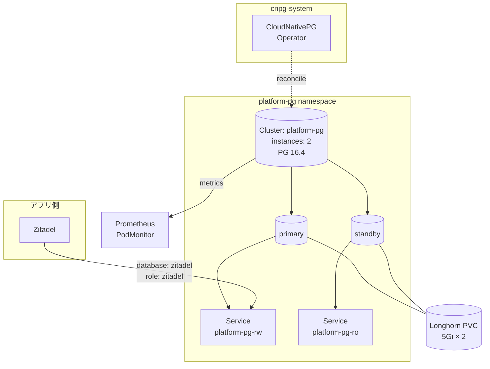

# MicroService

プラットフォーム上のアプリ (Zitadel など) が共有して使う **バックエンドサービス**を提供するグループ。現状は **CloudNativePG オペレータ** + **platform-pg クラスタ (PostgreSQL)** の組み合わせ 1 本。

## このグループが解決する課題

- アプリごとに DB Pod を立てると Pi のリソースが厳しい → **1 物理クラスタを論理 DB で共有**する
- HA / フェイルオーバー / バックアップ / モニタリングを **オペレータ任せ**にしてアプリ側のオペコストを下げる
- アプリ間のロール越境を防ぐため、**1 DB : 1 ロール**を強制する運用ルールを置く

## グループ全体構成



## グループ全体の設計判断

| 判断 | 採用 | 不採用 / 旧構成 | 理由 |
|---|---|---|---|
| DB 配置                  | **1 物理クラスタ + 複数論理 DB** (`platform-pg`)        | アプリごとに別 CNPG クラスタ                | Pi のリソース節約 (CNPG Pod の常駐コスト × アプリ数を避ける) |
| ロール設計               | **1 DB : 1 ロール、他 DB に privilege を持たせない**     | 1 superuser を共有                          | 漏えい時の被害局所化、Helm/initJob の動線も単純化 |
| DB 追加方法              | **CNPG `Database` CRD で追加** (将来分)                  | `bootstrap.initdb` を拡張                   | initdb は **初期化時 1 回しか走らない**。あとで足すと反映されない罠 |
| ストレージ               | Longhorn 5Gi × 2 instance                                | local-path / hostPath                       | レプリカ + スナップショットが Longhorn 側で取れる |
| Replica 数               | 2 (primary + standby)                                    | 1 (single) / 3                              | ノード障害で切替可能、3 にするほどの容量余裕は無い |
| Backup                   | Longhorn ボリュームレベル (br-external1 Garage)          | CNPG の Barman / `Backup` CRD               | Longhorn 側で統一的にバックアップ。CNPG 専用 backup は今のところ未導入 |
| `primaryUpdateStrategy`  | `unsupervised`                                           | `supervised`                                | Pi クラスタなら自動切替で十分。手動承認の運用負荷を避ける |

---

## CloudNativePG (Operator)

### 概要

PostgreSQL の Kubernetes オペレータ。`Cluster` / `Database` / `Backup` / `Pooler` などの CRD を提供し、HA・フェイルオーバー・スケーリングを宣言的に扱う。

### ソース

- Helm: [`manifests/platform/cloudnative-pg/app/`](../../manifests/platform/cloudnative-pg/app/)
  - chart `cloudnative-pg` v0.28.0 ([`helm.yaml`](../../manifests/platform/cloudnative-pg/app/base/helm.yaml))
  - namespace: `cnpg-system`
- monitoring overlay: [`manifests/platform/cloudnative-pg/monitoring/`](../../manifests/platform/cloudnative-pg/monitoring/) (`monitoring.podMonitorEnabled: true`)

### 設定の要点

| 項目 | 値 / 備考 |
|------|-----------|
| chart version  | `0.28.0` |
| namespace      | `cnpg-system` (Flux Kustomization の `targetNamespace`) |
| PodMonitor     | monitoring overlay で有効化 (`PodMonitor` CRD は kube-prometheus-stack 依存) |

### 依存

- 前提: なし (CRD は chart 同梱)
- これに依存: 全 `Cluster` / `Database` リソース (現状は `platform-pg` のみ)

### 運用上の注意

- **monitoring overlay は kube-prometheus-stack-app の後に Apply される必要がある** (Flux の `dependsOn` で順序保証済み)
- メジャー version up は CRD 互換性に注意。`upgrade.cleanupOnFail` + `rollback` retries=3 を設定済み

---

## platform-pg-cluster

### 概要

`cnpg-system` の Operator が `platform-pg` namespace に立てる **共有 PostgreSQL クラスタ**。複数アプリが論理 DB を間借りする前提。現状の論理 DB は `zitadel` のみだが、将来追加予定。

### ソース

- Cluster 定義: [`manifests/platform/cloudnative-pg/clusters/platform-pg/base/cluster.yaml`](../../manifests/platform/cloudnative-pg/clusters/platform-pg/base/cluster.yaml)
- ExternalSecret: [`manifests/platform/cloudnative-pg/clusters/platform-pg/base/externalsecret.yaml`](../../manifests/platform/cloudnative-pg/clusters/platform-pg/base/externalsecret.yaml)

### Cluster 設定

| 項目 | 値 |
|------|----|
| `instances`              | `2` (primary + standby) |
| `imageName`              | `ghcr.io/cloudnative-pg/postgresql:16.4` |
| `primaryUpdateStrategy`  | `unsupervised` (自動切替) |
| `storage.size` / `storageClass` | `5Gi` / `longhorn` |
| `monitoring.enablePodMonitor`   | `true` |
| `affinity.nodeSelector`         | `node_type: worker` |
| `affinity.topologyKey`          | `kubernetes.io/hostname` (ホスト分散) |
| `resources.requests`            | cpu `100m` / memory `256Mi` |
| `resources.limits`              | cpu `1000m` / memory `512Mi` |

### 初期 DB / ロール

`bootstrap.initdb` は **クラスタ作成時 1 回だけ**実行される。現在は Zitadel 用に以下を生成:

```yaml
bootstrap:
  initdb:
    database: zitadel
    owner: zitadel
    secret:
      name: platform-pg-zitadel
```

`platform-pg-zitadel` Secret は `kubernetes.io/basic-auth` 形式で、ExternalSecret が 1Password の `zitadel.db_password` を `password` キー、`zitadel` を `username` キーに同期する。

### 接続 Service

CNPG オペレータが 3 種類の Service を自動生成 ([CNPG ドキュメント参照](https://cloudnative-pg.io/documentation/)):

| Service                | 役割 |
|------------------------|------|
| `platform-pg-rw`       | primary に向いた read-write 用 (アプリは基本これを使う) |
| `platform-pg-ro`       | standby のみ (read-only ワークロード向け) |
| `platform-pg-r`        | 任意のレプリカ (read 全般) |

Zitadel は `platform-pg-rw.platform-pg.svc.cluster.local:5432` を参照。

### 新しい論理 DB を追加する手順 (将来用)

1. `cluster.yaml` の `bootstrap.initdb` は **触らない** (既に走っているので追記しても無視される)
2. CNPG の `Database` CRD (operator v1.25+) で新しい DB / owner を宣言
3. 1Password に該当アプリの `db_password` を追加
4. `ExternalSecret` を `kubernetes.io/basic-auth` 形式で作成 (`username` は新ロール名固定、`password` は 1Password から)
5. アプリ側の Helm/Manifest で `host: platform-pg-rw.platform-pg.svc.cluster.local` / `database: <name>` / 認証は新 Secret を参照

### 依存

- 前提: CloudNativePG Operator、Longhorn (`storageClass: longhorn`)、External Secrets、kube-prometheus-stack (`PodMonitor`)
- これに依存: Zitadel (将来は他のアプリも)

### 運用上の注意

- **`bootstrap.initdb` は再実行されない**。新規 DB 追加には `Database` CRD を使う (上記手順)
- HA fail-over は `unsupervised` なので primary 停止時に自動切替する。アプリは `platform-pg-rw` を見ていればよい
- バックアップは Longhorn ボリュームレベル (br-external1 Garage)。**CNPG の `Backup` CRD は未導入**。WAL アーカイブが必要になったら別途検討
- ストレージ拡張は `spec.storage.size` を増やすだけだが、Longhorn の online expansion が動くこと、PVC が `Bound` のまま再生成されないことを確認

---

## 関連

- [`docs/platform/storage.md`](storage.md) — Longhorn (PVC の元)
- [`docs/platform/secrets.md`](secrets.md) — External Secrets (DB password 注入)
- [`docs/platform/identity.md`](identity.md) — Zitadel (現状唯一の利用者)
- [`docs/platform/observability.md`](observability.md) — PodMonitor / Prometheus
