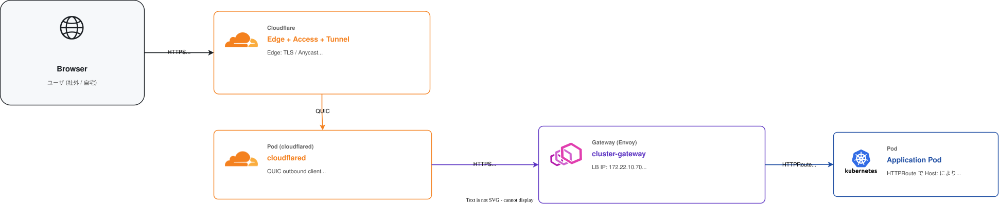
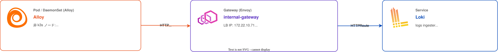
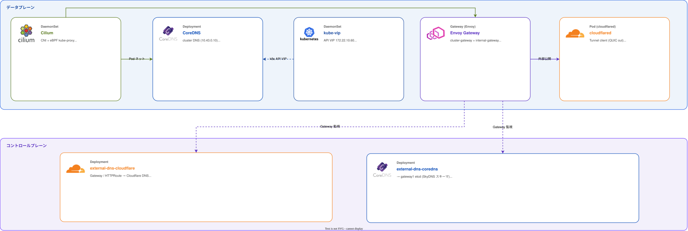
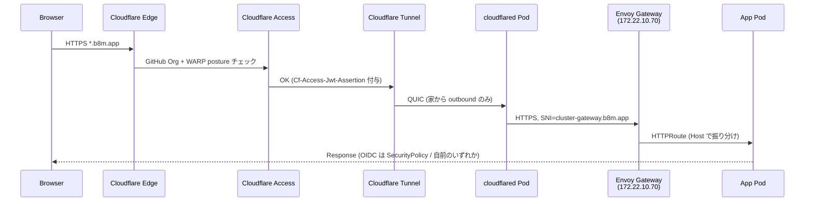

# Networking

クラスタの **CNI / クラスタ内 DNS / API VIP / Service LoadBalancer / Gateway / 外部公開 / DNS レコード反映** を担うコンポーネント群。物理 L2/L3 は [`docs/network.md`](../network.md) を参照。

## このグループが解決する課題

- Pod 間ルーティングと NetworkPolicy (`Cilium`)
- クラスタ内サービス名解決 (`CoreDNS`)
- k8s API VIP の高可用化 (`kube-vip`)
- LoadBalancer Service への IP 割当と LAN への ARP 広告 (`Cilium LB-IPAM` + `Cilium L2 Announcement` + `kube-vip svc_enable`)
- L7 ルーティング・TLS 終端・OIDC エッジ認可 (`Envoy Gateway` + Gateway API)
- 自宅ルーターのポート開放を回避した外部公開 (`cloudflared` Tunnel)
- Gateway/HTTPRoute から外部・内部 DNS への自動レコード反映 (`external-dns-cloudflare` / `external-dns-coredns`)

## グループ全体構成

外向き (HTTPS リクエスト) のフロー:



LAN 内サービス (Loki push 等) のフロー:



データプレーン / コントロールプレーンの依存関係:



## グループ全体の設計判断

| 判断 | 採用 | 不採用 / 旧構成 | 理由 |
|---|---|---|---|
| CNI | Cilium (eBPF) | flannel (k3s デフォルト) | NetworkPolicy / kube-proxy replacement / LB-IPAM を 1 本で完結。`disable-network-policy` も合わせて Cilium に集約 |
| LB IP 割当 | Cilium LB-IPAM annotation 固定 | k3s servicelb / `spec.externalIPs` 手書き | プール管理 + 宣言的 IP 指定。詳細 → [`#lb-ip-払い出し`](#lb-ip-払い出し) |
| ARP 広告 | Cilium L2 Announcement + kube-vip svc_enable の二重 | どちらか単独 | 2026-04-25 の grafana.b8m.app 502 で kube-vip svc_enable=false により VIP 未付与だった経緯から両方有効化 (`a71e010`) |
| Ingress | Envoy Gateway (Gateway API v1) | Traefik (k3s デフォルト) / Ingress (旧 API) | Gateway API + SecurityPolicy で OIDC をエッジ実装、HTTPRoute で namespace 越境を許可 |
| Gateway 本数 | 1 本に統合 (`cluster-gateway`) + LAN 用 1 本 (`internal-gateway`) | `public-gateway` / `internal-gateway` / `cluster-gateway` の 3 本構成 | Cloudflare Access で in/out が分かれるので外向き 1 本で済む |
| 外部公開 | Cloudflare Tunnel + Access | DDNS + ポート開放 | 家庭ルーターに inbound を開けない。outbound QUIC のみ |
| 外部 DNS 自動化 | external-dns v0.21.0 (Gateway API v1 native) | v0.20.x | v0.20.x は HTTPRoute v1 の annotation を読み落として A レコードが書かれていた事故あり |

---

## LB IP 払い出し

外部公開用 (`172.22.10.70` cluster-gateway) と LAN 内向け (`172.22.10.71` internal-gateway) は LB-IPAM プール `172.22.10.64/26` の中から、**自動割当ではなくサービスの annotation で明示固定** している。プール定義は [`CiliumLoadBalancerIPPool default-pool`](../../manifests/platform/cilium/config/base/) (Cilium 節参照)。

```yaml
# manifests/platform/envoy-gateway/config/base/envoy-proxy.yaml
envoyService:
  annotations:
    io.cilium/lb-ipam-ips: ${CLUSTER_GATEWAY_IP}   # 172.22.10.70
```

### ARP 広告 (二重で有効)

| IP                              | ARP 広告主体 |
|---------------------------------|--------------|
| `172.22.10.60` (k8s-api)        | kube-vip DaemonSet (`vip_arp: true`) |
| `172.22.10.70 / .71` (Service LB)| Cilium L2 Announcement Policy + kube-vip Service LB (`svc_enable: true`) |

`svc_enable: false` にすると LB IP がどこからも ARP されなくなり外部公開系が全滅する (2026-04-25 `grafana.b8m.app` 502 の経緯)。両方有効化を維持する ([kube-vip 節](#kube-vip) も参照)。

### LB IP を増やすとき

1. [`manifests/clusters/prod/config/cluster-settings.yaml`](../../manifests/clusters/prod/config/cluster-settings.yaml) に変数追加
2. Service 側で `io.cilium/lb-ipam-ips` annotation を設定
3. プール `172.22.10.64/26` の範囲内であることを確認

サブネット全体の IP 設計は [`docs/network.md#ホスト-ip--vip`](../network.md#ホスト-ip--vip) を参照。

---

## Cilium

### 概要

eBPF ベースの CNI。CNI 機能だけでなく **kube-proxy 代替**、**LB-IPAM**、**L2 Announcement**、**Hubble** を 1 つの DaemonSet にまとめている。

### ソース

- Helm values: [`manifests/platform/cilium/app/base/values.yaml`](../../manifests/platform/cilium/app/base/values.yaml)
- 追加 CRD: [`manifests/platform/cilium/config/base/`](../../manifests/platform/cilium/config/base/)
  - `CiliumLoadBalancerIPPool` `default-pool` (172.22.10.64/26)
  - `CiliumL2AnnouncementPolicy` `default-l2-announcement-policy` (eth0、externalIPs / loadBalancerIPs 両方有効)

### 設定の要点

| 項目                              | 値 / 備考 |
|-----------------------------------|-----------|
| `kubeProxyReplacement: true`      | k3s 側で `disable-kube-proxy: true` と組み合わせ |
| `k8sServiceHost / k8sServicePort` | `127.0.0.1:6444` (k3s が VIP を経由せず loopback で API に当てるための local-proxy) |
| `devices: eth0`                   | 外部 LB トラフィックを物理 NIC で受けるため eBPF を eth0 にアタッチ |
| `ipam.operator.clusterPoolIPv4PodCIDRList` | `10.42.0.0/16` |
| `l2announcements.enabled: true` / `externalIPs.enabled: true` | LoadBalancer の ARP / externalIPs を有効化 |
| `operator.replicas: 1`            | Pi のリソース節約。Operator は SPOF 許容 |

### 依存

- 前提: なし (これが先頭、Helm CLI で先入れ)
- 依存される側: 全 Pod、CoreDNS、kube-vip 以外のすべて

### 運用上の注意

- ARP 広告ノードが切り替わると `arp` キャッシュが古い MAC を保持する可能性がある。LB IP 切替後の疎通テストは複数台から
- `--kube-api-qps` を上げる必要がある場合がある (Operator が Pi の API を絞られる)

---

## CoreDNS

### 概要

クラスタ内 DNS。k3s 同梱の CoreDNS は無効化せずそのまま使うが、values は **当リポで上書き**して `auth.b8m.app` を Envoy Gateway に向ける hosts エントリを差し込んでいる。

### ソース

- Helm values: [`manifests/platform/coredns/app/base/values.yaml`](../../manifests/platform/coredns/app/base/values.yaml) + `overlays/prod/values.yaml`
- ClusterIP: `10.43.0.10` (k3s デフォルト固定)

### 設定の要点

| 項目 | 値 / 備考 |
|------|-----------|
| `replicaCount: 2`                | HA |
| `hosts` プラグイン (`auth.b8m.app` → `${CLUSTER_GATEWAY_IP}`) | クラスタ内クライアント (tofu-controller / Envoy SecurityPolicy の OIDC discovery) が **Cloudflare Access を経由せず** Envoy にショートカットするため |
| `kubernetes` プラグイン           | `cluster.local` 解決 |
| `forward . /etc/resolv.conf`      | クラスタ外は systemd-resolved 経由 (= gateway1 の CoreDNS) |
| ノードセレクタ                    | control-plane に配置 (`tolerations`) |

### 依存

- 前提: Cilium (Pod ネット)、k8s API
- 依存される側: ほぼ全 Pod、Envoy SecurityPolicy の OIDC discovery、tofu-controller

### 運用上の注意

- `auth.b8m.app` の hosts エントリを消すと **Cilium の OIDC discovery が外向き** に出ようとして遅延・失敗するケースあり (chicken-egg を避ける構造)

---

## kube-vip

### 概要

control-plane ノード上の DaemonSet で、**k8s API VIP `172.22.10.60` の ARP 広告**と、**Service LoadBalancer の ARP 広告**の 2 役を担う。

### ソース

- Helm values: [`manifests/platform/kube-vip/app/base/values.yaml`](../../manifests/platform/kube-vip/app/base/values.yaml) + `overlays/prod/values.yaml`

### 設定の要点

| 項目 | 値 |
|------|----|
| `config.address`         | `${KUBE_VIP_ADDRESS}` (= `172.22.10.60`) |
| `cp_enable: "true"`      | Control plane VIP を有効化 |
| `svc_enable: "true"` / `svc_election: "true"` | **Service LB の ARP も有効** |
| `vip_arp: "true"`        | L2 (ARP) モード (BGP ではない) |
| `vip_interface: "eth0"`  | prod overlay で明示 |
| 配置                      | control-plane node のみ (`nodeAffinity`) |
| Prometheus exporter      | `:2112` |

### 依存

- 前提: なし (Cilium と並行して Helm CLI で先入れ)
- これに依存: secondary control-plane の join (API VIP 経由)、Service LB 全般

### 運用上の注意

- `svc_enable: false` にすると LB IP がどこからも ARP されなくなり、外部公開系が全滅する。2026-04-25 の grafana.b8m.app 502 がこのパターン
- ARP は Cilium L2 Announcement とも重複するが、両方あった方が VIP の付与状態が見やすいため両方有効化

---

## Envoy Gateway

### 概要

Gateway API v1 の実装。**外部公開用 `cluster-gateway`** と **LAN 内向け `internal-gateway`** の 2 本を運用。SecurityPolicy で OIDC をエッジ実装する。

### ソース

- Helm: [`manifests/platform/envoy-gateway/app/`](../../manifests/platform/envoy-gateway/app/)
- リソース: [`manifests/platform/envoy-gateway/config/base/`](../../manifests/platform/envoy-gateway/config/base/)
  - `gateway-class.yaml` / `gateway.yaml` / `envoy-proxy.yaml` (cluster 用)
  - `internal-gateway-class.yaml` / `internal-gateway.yaml` / `internal-envoy-proxy.yaml` (internal 用)

### Gateway 一覧

| Gateway          | IP             | listener           | TLS                          | 用途 |
|------------------|----------------|--------------------|------------------------------|------|
| `cluster-gateway`| `172.22.10.70` | HTTPS:443 `*.b8m.app` | cert-manager (`letsencrypt-issuer`、`*.b8m.app`) | 外部公開、Cloudflare Tunnel origin |
| `internal-gateway`| `172.22.10.71` | HTTP:80 `*.cluster-internal.bright-room.net` | なし (LAN クローズド) | 非 k3s ノードからの Loki push 等 |

### `internal-gateway` の使い分け

LAN 内クローズドな経路で、Cloudflare Tunnel を経由しない。クライアントによって in-cluster サービスへの到達手段を分けている:

| クライアント | 経路 | 理由 |
|--------------|------|------|
| 非 k3s ノード (gateway1 / external1) の Alloy | `internal-gateway` (`172.22.10.71`) → HTTPRoute → Loki 等 | クラスタ外からは Service ClusterIP を引けないので Gateway 経由が必要 |
| k3s ノード自身 (DaemonSet Alloy など) | `localhost:30800` (NodePort) → Loki | Cilium eBPF kube-proxy replacement が自ノードで NodePort を backend に変換するため、自ノードが L2 lease holder でなくても通る。Gateway を 1 ホップ減らせる |

### LB IP 固定

Service の annotation `io.cilium/lb-ipam-ips: ${CLUSTER_GATEWAY_IP}` で Cilium LB-IPAM プールから IP を pin する ([`envoy-proxy.yaml`](../../manifests/platform/envoy-gateway/config/base/envoy-proxy.yaml))。

### `EnvoyProxy` での観測性 / DNS 設定

- アクセスログを **OpenTelemetry Collector** に投げる (`accessLog.settings[].sinks[].openTelemetry`)
- トレース 100% サンプリング → OTel Collector
- DNS resolver は `getaddrinfo` (c-ares ではなく) に差し替え、in-cluster Service 解決を安定化 (`spec.bootstrap`)

### 依存

- 前提: Cilium (LB-IPAM)、cert-manager (`*.b8m.app` Certificate)、external-dns (Gateway annotation)、cloudflared
- これに依存: 全外部公開アプリ (HTTPRoute で接続)

### 運用上の注意

- `*.b8m.app` 証明書の更新失敗で全停する。`platform/certificate.md` の監視を要確認
- HTTPRoute は別 namespace 配置可だが、`internal-gateway` の場合は `ReferenceGrant` で許可が必要

---

## cloudflared

### 概要

Cloudflare Tunnel のクライアント。Pod として起動し、Cloudflare Edge と **outbound QUIC** で接続する。

### ソース

- Deployment / ConfigMap / ExternalSecret: [`manifests/platform/cloudflared/app/base/`](../../manifests/platform/cloudflared/app/base/)

### 設定の要点

```yaml
# configmap-br-cluster.yaml (抜粋)
tunnel: ${CLOUDFLARED_TUNNEL_ID}
protocol: quic
ingress:
  - hostname: "*.${CLUSTER_DOMAIN}"
    service: https://${CLUSTER_GATEWAY_IP}:443
    originRequest:
      noTLSVerify: true
      originServerName: cluster-gateway.${CLUSTER_DOMAIN}
  - service: http_status:404
```

| 項目 | 値 / 備考 |
|------|-----------|
| Tunnel ID / credentials | 1Password Connect → External Secrets で `credentials.json` を Pod に注入 |
| 転送先     | `https://172.22.10.70:443` (cluster-gateway VIP) |
| `originServerName` | Envoy Gateway の strict SNI match に合わせて `cluster-gateway.b8m.app` を明示 |
| `noTLSVerify`      | 内部接続なので証明書の SAN 検証は不要 |
| メトリクス         | `:2000` |

### 依存

- 前提: Envoy Gateway (`cluster-gateway`)、External Secrets (Tunnel credentials)、`CLUSTER_GATEWAY_IP` 解決可能
- これに依存: Cloudflare 側の Tunnel 設定 (リポジトリ `br-cloudflare-terraform` で IaC 管理)

### 運用上の注意

- Tunnel ID / CNAME は `cluster-settings.yaml` の `CLOUDFLARED_TUNNEL_ID` / `CLOUDFLARED_TUNNEL_CNAME` を更新すれば全ての参照が追従する
- 家庭ルーターでは UDP/QUIC を block しないこと

---

## external-dns-cloudflare

### 概要

`Gateway` / `HTTPRoute` の annotation を監視し、Cloudflare DNS に **CNAME** を書き込む。

### ソース

- Helm values: [`manifests/platform/external-dns-cloudflare/app/base/values.yaml`](../../manifests/platform/external-dns-cloudflare/app/base/values.yaml)

### 設定の要点

| 項目              | 値 |
|-------------------|----|
| provider          | `cloudflare` |
| sources           | `gateway-httproute` |
| domainFilters     | `b8m.app` |
| image.tag         | **`v0.21.0` を pin** (chart 1.20.0 同梱の v0.20.0 は v1 HTTPRoute の annotation を読み落とす) |
| policy            | `upsert-only` |
| txtOwnerId        | `br-cluster-prod` |
| `--kube-api-qps=50 / --kube-api-burst=100` | Pi の API throttling 対策 (デフォルトだと初回 list-watch が 1 分でタイムアウトしてクラッシュ) |

### 依存

- 前提: External Secrets で `externaldns-cloudflare-token` を作成
- これに依存: Cloudflare DNS の `b8m.app` ゾーン (`br-cloudflare-terraform`)

### 運用上の注意

- v0.21.0 → v0.22 以降に上げる際は **gateway-api source の挙動を回帰テスト**。v0.20 系の不具合があったので image pin している
- `policy: upsert-only` を `sync` に上げると stale レコードが消えるが、誤検知時に巻き戻せないので保留中

---

## external-dns-coredns

### 概要

同じく external-dns。こちらは provider が `coredns`、書き込み先は **gateway1 の etcd (SkyDNS スキーマ)**。CoreDNS の `etcd` プラグインがそれを配信する。

### ソース

- Helm values: [`manifests/platform/external-dns-coredns/app/base/values.yaml`](../../manifests/platform/external-dns-coredns/app/base/values.yaml)

### 設定の要点

| 項目              | 値 |
|-------------------|----|
| provider          | `coredns` (community-maintained alpha) |
| sources           | `gateway-httproute` |
| domainFilters     | `cluster-internal.bright-room.net` |
| image.tag         | `v0.21.0` (cloudflare 側と揃える) |
| `ETCD_URLS`       | `${COREDNS_ETCD_URL}` = `http://172.22.10.1:2379` (LAN 内、認証なし) |
| txtOwnerId        | `br-cluster-prod-internal` (cloudflare 側と分離) |

### 依存

- 前提: gateway1 の etcd 到達性 (nftables `in_pod_tcp_accept` で Pod CIDR から `:2379` 許可済み)
- これに依存: 内部ゾーンの動的レコード (例: `internal-gateway` 配下のサービス名)

### 運用上の注意

- `coredns` provider は external-dns 内で **alpha** 扱い。将来削除されたら、SkyDNS スキーマを直接書く軽量コントローラに置換する想定 (CoreDNS の etcd プラグイン自体は安定)
- etcd は **LAN 限定 / 認証なし**。nftables で Pod CIDR からのみ許可している前提なので、ファイアウォールを緩めないこと

---

## 外部公開フロー (`https://<svc>.b8m.app`)

ブラウザから Pod までの一気通貫フロー。本グループの cloudflared / Envoy Gateway / external-dns-cloudflare / cert-manager (別グループ) が連携する。



ポイント:

- **家庭ルーターのポート開放は不要**。outbound QUIC のみで全部成立 ([cloudflared](#cloudflared) 節)
- TLS 終端は Envoy で実施 (`*.b8m.app` を cert-manager + Let's Encrypt DNS01 で自動発行 → [`platform/certificate.md`](certificate.md))
- 認証は 2 層: Cloudflare Access (ネットワーク層) + Zitadel OIDC (アプリ層、Envoy SecurityPolicy で実装)
- DNS レコード (`<svc>.b8m.app` → Cloudflare Tunnel CNAME) は [external-dns-cloudflare](#external-dns-cloudflare) が HTTPRoute から自動生成
- 設計判断 (なぜ Cloudflare Tunnel か等) は [`docs/architecture.md`](../architecture.md)

---

## 関連

- [`docs/kubernetes.md`](../kubernetes.md) — クラスタ全体概要・k3s 設定
- [`docs/network.md`](../network.md) — L2/L3、VIP 一覧、nftables
- [`docs/architecture.md`](../architecture.md) — 認証 2 層、Gateway 統合の設計判断
- [`docs/platform/certificate.md`](certificate.md) — `*.b8m.app` 証明書の発行
- [`docs/platform/identity.md`](identity.md) — Zitadel OIDC (Envoy SecurityPolicy が参照)
- [`docs/platform/observability.md`](observability.md) — Envoy アクセスログ / トレースの送り先
