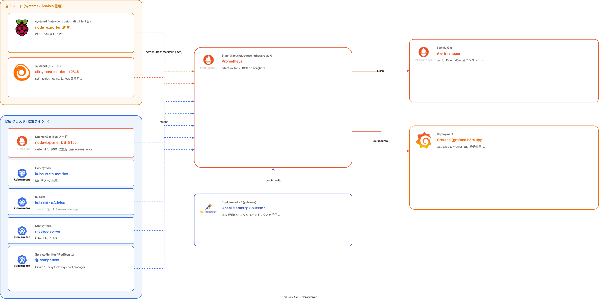
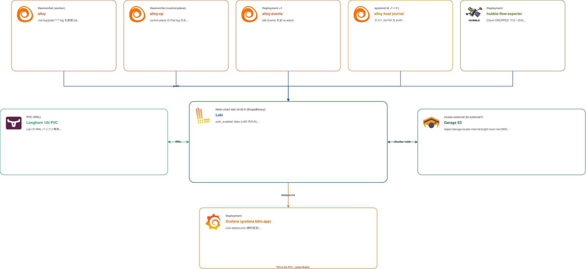
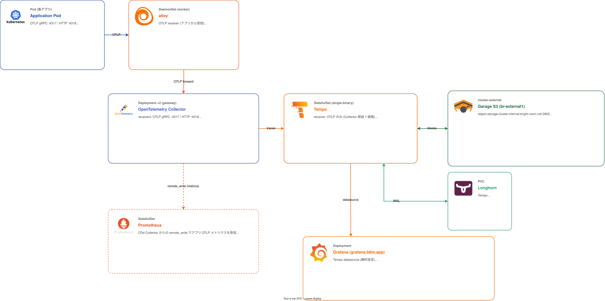

# Observability

クラスタの **メトリクス / ログ / トレース** を収集・保存・可視化するグループ。Prometheus / Loki / Tempo / Grafana を中心に、収集側に Alloy (3 系統) と OpenTelemetry Collector を据える。

物理ノード側 (gateway / external / 全 k3s ノード) で動く systemd サービス (`node_exporter` + `alloy`) は **Ansible role `monitoring_agent`** が担当 ([`docs/provisioning.md`](../provisioning.md))。本ドキュメントはクラスタ内コンポーネントとデータフローに絞る。

## このグループが解決する課題

- 全 8 ノード (gateway1 / external1 / k3s 6 台) のホスト OS メトリクスを **同一 job ラベル**で集める
- k8s ワークロードのメトリクス / Pod ログ / OTLP トレース / k8s イベント / Cilium Hubble フローを 1 つの統合ビューで見る
- ログ・トレースを Pi の Longhorn 容量で抱え込まずに **`br-external1` の Garage S3** に逃がす
- 2026-04-13 の observability cascade incident の教訓を取り込み、**1 経路ダウンで全可視化が落ちないよう冗長性を確保**する

## グループ全体構成

メトリクス / ログ / トレースで経路が異なるので 3 つに分けて図示する。

### メトリクス

### ログ

### トレース

## グループ全体の設計判断

| 判断 | 採用 | 不採用 / 旧構成 | 理由 |
|---|---|---|---|
| メトリクススタック    | kube-prometheus-stack (Prometheus Operator)         | 単独 Prometheus + 手書き SM      | ServiceMonitor / PodMonitor / PrometheusRule を CRD で扱える、CRD の定番セット |
| ホスト node_exporter  | systemd 管理を **全 8 ノード**で常駐 + k3s ノードでは DS も並走 | DS のみ                          | 2026-04-13 cascade で DS が unhealthy になった時に gateway/external の OS 状態が見えない事故を回避 |
| Pod ログ収集          | Alloy DS が **`/var/log/pods/*/*/*.log` を直接 tail** | `loki.source.kubernetes` (apiserver log-follow) | apiserver QPS スロットリングで http2 が落ち、tailer 再起動でループした旧構成の教訓 |
| Alloy のロール分割    | `alloy` (worker) / `alloy-cp` (control-plane) / `alloy-events` (Deploy) の **3 リリース** | 1 DS で兼務                      | リソース上限を独立に持てる (CP は 4GB)、CP 側だけ rollout を止められる、events は 1 レプリカで十分 |
| ログ経路              | **Alloy → Loki 直接** (Collector を通さない)          | Alloy → OTel → Loki              | ログ経路を単純化、Collector が落ちてもログだけは生き残る |
| トレース経路          | **Alloy → OTel Collector → Tempo**                   | Alloy → Tempo 直接                | tail_sampling / batch を 1 箇所 (Collector) に集約 |
| Loki / Tempo storage  | **`br-external1` の Garage S3** (cluster-external)   | Longhorn フル / クラウド S3       | Pi の容量を圧迫せず、クラスタ全体障害でもデータが残る場所に置く |
| Grafana 認証          | アプリ自前の `auth.generic_oauth` (Zitadel)           | Envoy SecurityPolicy を被せる     | 二重 OIDC ダンスを避ける |
| サンプリング          | Tail-based、エラー 100% / その他 10%                  | Head-based                       | エラー側の取りこぼしを防ぐ。コストは Collector 側の memory_limiter で制御 |
| Prometheus retention  | 14 日 / 50GB                                          | Thanos / Mimir で長期保存         | 学習環境では十分。長期保存は将来検討 |

---

## kube-prometheus-stack

### 概要

Prometheus Operator + Prometheus + Alertmanager + node-exporter DS + kube-state-metrics の **チャートまとめ**。Grafana は別個に管理 (chart 同梱は無効化、`components/disable-grafana`)。

### ソース

- Helm: [`manifests/platform/kube-prometheus-stack/app/`](../../manifests/platform/kube-prometheus-stack/app/)
  - chart `kube-prometheus-stack` v83.4.0 (OCIRepository, `oci://ghcr.io/prometheus-community/charts/kube-prometheus-stack`)
  - components: `disable-grafana` / `k3s` (kubelet / etcd 用 SM)
- 追加リソース:
  - [`prometheus-operator-crds/`](../../manifests/platform/kube-prometheus-stack/prometheus-operator-crds/) — CRD を別管理 (Helm `install.crds: Skip`)
  - [`host-monitoring/`](../../manifests/platform/kube-prometheus-stack/host-monitoring/) — 全 8 ホストの `node_exporter:9101` / `alloy:12345` を EndpointSlice + ServiceMonitor で scrape
  - [`rules/`](../../manifests/platform/kube-prometheus-stack/rules/) — PrometheusRule 8 ファイル

### 設定の要点

| 項目 | 値 / 備考 |
|------|-----------|
| Prometheus retention      | 14 日 / 50GB / WAL compression |
| Storage                   | Longhorn 10Gi PVC |
| `enableRemoteWriteReceiver: true` | OTel Collector からの metrics push を受ける |
| `serviceDiscoveryRole: EndpointSlice` | 手動 EndpointSlice (host-monitoring) を拾うため |
| `*SelectorNilUsesHelmValues: false` | 全 ns / 全 SM・PM・Rule を拾う (chart 同梱の SM が release ラベル無しで dark になる対策) |
| `externalUrl`             | `https://prometheus.b8m.app` / `alertmanager.b8m.app` (受信機の generatorURL 用) |
| Alertmanager config       | `configSecret: alertmanager-config` (ExternalSecret テンプレートで Discord webhook を埋め込み、operator schema validation を回避) |

### PrometheusRule 一覧

[`rules/base/`](../../manifests/platform/kube-prometheus-stack/rules/base/):

| ファイル                  | カバー範囲 |
|--------------------------|-----------|
| `rule-cert.yaml`          | 証明書 (有効期限 / Ready / 更新エラー) |
| `rule-cluster-health.yaml`| etcd / API server / control-plane 健全性 |
| `rule-envoy-gateway.yaml` | Envoy Gateway / HTTPRoute |
| `rule-monitoring-agent.yaml` | host-side node_exporter / alloy |
| `rule-node.yaml`          | ノード CPU / Memory / Disk |
| `rule-rpi.yaml`           | Pi 固有 (温度 / スロットリング / 電圧) |
| `rule-storage.yaml`       | Longhorn / PVC |
| `rule-workload.yaml`      | Pod CrashLoop / OOM / 等 |

### host-monitoring の役割

systemd 版 `node_exporter` (`:9101`) と `alloy` (`:12345`) を **k3s 外から** scrape する経路。EndpointSlice で全 8 ノードを列挙し、ServiceMonitor で `job=node-exporter-host` / `job=alloy-host` のラベルを付与。

これにより:
- gateway1 / external1 (k3s 外) も含めた**全 8 ノード**のホスト OS メトリクスが揃う
- k3s ノードでは **DS の `:9100` と systemd の `:9101` が並走**。片方落ちても継続観測できる (cascade resilience)

### 依存

- 前提: prometheus-operator-crds、Longhorn (PVC)、External Secrets (Alertmanager config)
- これに依存: ほぼすべての監視対象 (ServiceMonitor / PodMonitor を生やしているコンポーネント)

### 運用上の注意

- Helm `install/upgrade.crds: Skip` 設定済み。CRD は `prometheus-operator-crds` Kustomization で別管理 (chart 更新時の CRD 衝突回避)
- `serviceMonitorSelectorNilUsesHelmValues: false` を使っているので、無関係な SM を増やすと Prometheus に拾われる。namespace / label でフィルタしたければ `serviceMonitorSelector` を再宣言

---

## Grafana

### 概要

可視化 UI。`grafana.b8m.app` で公開、Zitadel OIDC (アプリ自前の `auth.generic_oauth`) で認証。

### ソース

- Helm: [`manifests/platform/grafana/app/`](../../manifests/platform/grafana/app/)
  - chart `grafana` v10.5.15
- ダッシュボード: [`manifests/platform/grafana/dashboards/`](../../manifests/platform/grafana/dashboards/) (`scripts/fetch-grafana-dashboards.sh` で取得)
- HTTPRoute / ExternalSecret: [`config/`](../../manifests/platform/grafana/config/)

### 設定の要点

| 項目 | 値 / 備考 |
|------|-----------|
| 認証              | `auth.generic_oauth` で Zitadel に直接接続。Envoy `SecurityPolicy` は **付けない** (二重 OIDC を避ける) |
| OIDC client       | tofu-controller 出力 → `kubernetes-backend` 経由で `grafana-oidc` Secret に注入 |
| ロール            | OIDC でサインインした全員が **Org Admin** (運用者 1 名想定) |
| break-glass admin | local admin 維持 (`grafana-admin-secret`)、`kubectl port-forward` で到達 |
| Datasource        | Prometheus / Loki / Tempo を `values.yaml` で静的宣言 (sidecar discovery は使わない) |
| Dashboard 取り込み | sidecar が ConfigMap (`grafana_dashboard=1` ラベル) を全 ns watch、`grafana_folder` annotation でフォルダ振り分け |

### 依存

- 前提: Prometheus / Loki / Tempo (datasource)、Zitadel + tofu 出力 + External Secrets (OIDC)、cert-manager / Envoy Gateway (公開)
- これに依存: 運用者 (人間)

### 運用上の注意

- ダッシュボードを Git で管理したい場合は `dashboards/` 配下に JSON を置き、`scripts/fetch-grafana-dashboards.sh` で更新
- Grafana を **`SecurityPolicy` で被らない**ことが重要。被ると `/login/generic_oauth` にループする

---

## Loki

### 概要

ログ保管。SingleBinary mode で動かし、**チャンク・インデックス・ruler を `br-external1` の Garage S3** に置く。Longhorn は WAL バッファ (1Gi) としてのみ利用。

### ソース

- Helm: [`manifests/platform/loki/app/`](../../manifests/platform/loki/app/)
  - chart `loki` v6.55.0

### 設定の要点

| 項目 | 値 |
|------|----|
| `deploymentMode`        | `SingleBinary` |
| 認証                    | `auth_enabled: false` (LAN 内のみ、Pod から直接書き込み) |
| Storage                 | S3 / `https://object-storage.cluster-internal.bright-room.net:3900` (br-external1 Garage) |
| バケット                | `loki` (chunks / ruler 共用) |
| Schema                  | TSDB v13、24h period |
| Retention               | 168h (7 日) |
| OTLP support            | `allow_structured_metadata: true` + `service.name`/`service.namespace`/`k8s.namespace.name` を index_label 化 |
| WAL                     | Longhorn 1Gi PVC |
| S3 認証                 | `S3_ACCESS_KEY_ID` / `S3_SECRET_ACCESS_KEY` を env で注入 (Loki 自身が `-config.expand-env=true` で展開、`$$` で Flux substitute を回避) |

### 依存

- 前提: br-external1 Garage が `loki` バケットを払い出し済み、External Secrets で `loki-s3-secret` を注入、Longhorn (WAL)
- これに依存: Alloy (push 元)、Grafana (datasource)

### 運用上の注意

- Garage が落ちると **書き込みが詰まる**。WAL が満杯になる前に復旧が必要
- Retention は Loki 側 7 日。Garage 側のオブジェクトもそれに合わせて compactor が削除する
- Garage の TLS 証明書は `br-external1` の certbot で発行。証明書更新失敗で Loki が S3 アクセス不能になるので certbot 監視を要

---

## Tempo

### 概要

トレース保管。single-binary chart で運用、ストレージは Loki と同じ Garage S3 (バケットだけ別)。

### ソース

- Helm: [`manifests/platform/tempo/app/`](../../manifests/platform/tempo/app/)
  - chart `tempo` v2.0.0

### 設定の要点

| 項目 | 値 |
|------|----|
| Receiver              | OTLP gRPC `:4317` / HTTP `:4318` (OTel Collector からの 1 経路のみ受信) |
| Storage               | S3 / `object-storage.cluster-internal.bright-room.net:3900` |
| バケット              | `tempo` |
| WAL                   | Longhorn (`storageClassName: longhorn`) |
| S3 認証               | `S3_ACCESS_KEY_ID` / `S3_SECRET_ACCESS_KEY` を env で注入 |
| `reportingEnabled`    | `false` (アップストリームに使用統計を送らない) |

### 依存

- 前提: br-external1 Garage `tempo` バケット、External Secrets (`tempo-s3-secret`)、Longhorn (WAL)
- これに依存: OTel Collector (push 元)、Grafana (datasource)

---

## OpenTelemetry Collector

### 概要

**Gateway モード**の集約 Collector。Alloy から OTLP で受け、tail_sampling と batch 処理を 1 箇所で行い、Tempo / Prometheus に振り分ける。**ログは通さない** (Alloy → Loki 直経路を維持)。

### ソース

- Helm: [`manifests/platform/opentelemetry-collector/app/`](../../manifests/platform/opentelemetry-collector/app/)
  - chart `opentelemetry-collector` v0.150.0
  - image: `otel/opentelemetry-collector-contrib` (tail_sampling 用)
- replicas: 2 (deployment mode)

### 設定の要点

| 項目 | 値 |
|------|----|
| mode                    | `deployment` |
| presets.* / 既定 receiver | **全 disable** (明示パイプラインのみ使う) |
| receivers               | OTLP gRPC `:4317` / HTTP `:4318` のみ |
| processors              | `memory_limiter` (80%) → `tail_sampling` (errors 100% / others 10%) → `batch` |
| exporters               | Tempo (traces) / Prometheus remote_write (metrics) |

### 依存

- 前提: Tempo、Prometheus (`enableRemoteWriteReceiver: true`)
- これに依存: Alloy (DS) からの OTLP 流入

### 運用上の注意

- contrib distribution を pin。upstream `opentelemetry-collector` (core) には tail_sampling が無いので戻すと壊れる
- `memory_limiter` を最初に置くこと (順序重要)。OOM 連鎖を防ぐ

---

## Alloy (3 リリース)

### 概要

旧 fluent-bit + fluentd を置き換えた **新エージェント**。3 つの Helm リリースで役割分担:

| リリース      | controller   | 配置        | 役割 |
|---------------|--------------|-------------|------|
| `alloy`       | DaemonSet    | worker      | pod log tail (`/var/log/pods/`)、OTLP receive (アプリから)、Logs→Loki 直送、Traces→OTel Collector |
| `alloy-cp`    | DaemonSet    | control-plane | pod log tail のみ。OTLP receiver なし (CP に app は無いため) |
| `alloy-events`| Deployment×1 | worker      | k8s Events を全 ns watch して Loki に送信 |

### ソース

- Helm chart `alloy` v1.7.0 を 3 リリースとも使う:
  - [`manifests/platform/alloy/app/`](../../manifests/platform/alloy/app/)
  - [`manifests/platform/alloy-cp/app/`](../../manifests/platform/alloy-cp/app/)
  - [`manifests/platform/alloy-events/app/`](../../manifests/platform/alloy-events/app/)

### 設計上の要点

- **`/var/log/pods/*/*/*.log` を直接 tail** する (`loki.source.kubernetes` の apiserver log-follow を使わない)
- worker DS と CP DS を **分離した理由**: リソース上限を独立、CP 側だけ rollout を止められる、cascade 2026-04-13 で worker DS が落ちた時に CP 側の独立性が効いた
- `alloy-events` は Deployment 1 レプリカ (event は cluster-wide イベントなので重複送信したくない)
- ホスト側 systemd `alloy` (journal 専用) は別系統 (`provisioner/roles/monitoring_agent/`)

### 依存

- 前提: Loki (push 先)、OTel Collector (traces 転送)
- これに依存: 全 Pod ログの可視化、k8s events の検索

### 運用上の注意

- リリースが 3 本あるので **アップグレードは 1 本ずつ**。chart は同じ v1.7.0 で揃える
- `alloy-cp` の rollout を止めれば、cascade 時に CP 側だけ静止できる ([incident 2026-04-13](../incidents/2026-04-13-observability-cascade.md) 参照)

---

## Hubble Flow Exporter

### 概要

Cilium Hubble の **DROPPED フロー**を `hubble observe` で読んで Loki に流す **自作 Deployment**。Helm chart ではない。

### ソース

- マニフェスト: [`manifests/platform/hubble-flow-exporter/app/base/`](../../manifests/platform/hubble-flow-exporter/app/base/)
- image: `quay.io/cilium/cilium:v1.19.2` (CLI 同梱、Cilium 本体とバージョン揃え)

### 設定の要点

| 項目 | 値 |
|------|----|
| controller   | Deployment, replicas=1, `Recreate` strategy |
| 配置         | worker (`nodeSelector: node_type: worker`) |
| 起動コマンド | `hubble observe --server=hubble-relay.kube-system.svc:80 --verdict=DROPPED --follow` |

### 依存

- 前提: Cilium Hubble Relay (`hubble-relay.kube-system`)、Loki (push 先)
- これに依存: NetworkPolicy debug、外部疎通不能の調査

### 運用上の注意

- Cilium chart のバージョンを上げる時は **image tag も追従**させる (CLI と server のミスマッチを避ける)
- DROPPED 以外の verdict (`FORWARDED` 等) を取り始めるとログ量が爆発する

---

## metrics-server

### 概要

`kubectl top` / HPA 用の標準メトリクスサーバ。

### ソース

- Helm: [`manifests/platform/metrics-server/app/`](../../manifests/platform/metrics-server/app/)
  - chart `metrics-server` v3.13.0
- ServiceMonitor 有効

### 依存

- 前提: なし
- これに依存: `kubectl top`、HPA、Grafana ダッシュボードの一部

---

## 関連

- [`docs/incidents/2026-04-13-observability-cascade.md`](../incidents/2026-04-13-observability-cascade.md) — 設計判断の元になった事故
- [`docs/provisioning.md`](../provisioning.md) — 全ノードの systemd `node_exporter` / `alloy` を入れる Ansible role
- [`docs/platform/storage.md`](storage.md) — Longhorn (Prometheus / Alertmanager の PVC、Loki/Tempo の WAL)
- [`docs/platform/networking.md`](networking.md) — Envoy アクセスログ → OTel Collector
- [`docs/platform/identity.md`](identity.md) — Grafana / Alertmanager / Prometheus / Hubble UI / Longhorn UI の OIDC
