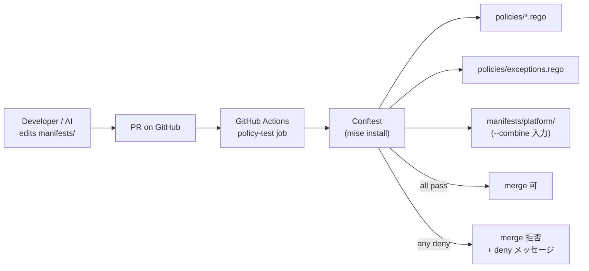

# Policy as Code

`manifests/platform/` への変更を **CI で機械的に検査** するガードレール。AI / 人間問わず CLAUDE.md の暗黙ルールから外れた PR を merge 前に弾く。Phase 1 は **Conftest (CI のみ)** で稼働、Phase 2 以降で Gatekeeper (admission) に昇格させる段階導入。

## このグループが解決する課題

- CLAUDE.md / 各 docs に積み上がった「暗黙の規約」(LB IP 固定、Secret は 1Password 経由、HelmRelease の version pin など) を **実行可能な形に落として** 機械的に強制する
- AI が新しい manifest を提案する場面でも、規約違反を **PR レビューに到達する前に CI で止める** (レビュー疲弊の主因対策)
- Pi クラスタ負荷ゼロ — Conftest は CI 上だけで動き、k3s 上に常駐 Pod を増やさない

## グループ全体構成



## グループ全体の設計判断

| 判断 | 採用 | 不採用 / 旧構成 | 理由 |
|---|---|---|---|
| ツール選定                | **Conftest (Phase 1)** + Gatekeeper (Phase 2) | Gatekeeper 単独 / kyverno | Conftest は CI 専用で Pi 負荷ゼロ。policy が安定してから admission に昇格 |
| 入力モード                | `--combine` (全 yaml を 1 入力に集約)         | per-file                 | sourceRef → HelmRepository / OCIRepository の cross-resource 検査が必要 |
| Rego の package           | 全 policy を `package main` に同居             | policy ごとに別 package  | conftest のデフォルト namespace が `main`、`deny` を素直に拾える |
| ライブラリ層              | `package lib.k8s` (`policies/lib/k8s.rego`)    | helper を各 policy 内に重複 | `--combine` 入力から resource を取り出す処理を集約 |
| 例外管理                  | `package exceptions` 単一ファイル              | policy ごとに分散        | 例外は **常に少数** で運用するため、一覧性を優先 |
| 実行経路                  | `make policy/test` → `mise exec -- conftest …` | bare `conftest`          | 新規インストール直後に shell PATH へ反映されないため、`mise exec` で確実に拾う |
| CI worker                 | `jdx/mise-action@v2` + `make policy/test`      | conftest 公式 action     | `instrumenta/conftest-action` は archive 済。mise 経由で local と CI のバージョンを統一 |
| 既存 `_:latest`/`resources` policy | Phase 2 (Gatekeeper) に持ち越し             | Phase 1 で実装           | raw Deployment 2 / HelmRelease 26 で、static manifest 検査では実質 dead code |

---

## Phase 1: Conftest

### 概要

[Open Policy Agent](https://www.openpolicyagent.org/) の Rego を **静的 yaml に対して** 評価する CLI。`policies/` 配下の `*.rego` を読み込み、`deny[msg]` ルールにマッチした manifest があれば exit code 2 で落ちる。

### ソース

| パス | 内容 |
|------|------|
| [`policies/lib/k8s.rego`](../../policies/lib/k8s.rego)                   | `--combine` 入力 (`[{path, contents}, ...]`) から resource を取り出す helper |
| [`policies/exceptions.rego`](../../policies/exceptions.rego)             | 例外集約 (Phase 1 は空) |
| [`policies/helmrelease_version_pinned.rego`](../../policies/helmrelease_version_pinned.rego)     | policy 1 (chart version pin) |
| [`policies/helmrelease_source_defined.rego`](../../policies/helmrelease_source_defined.rego)     | policy 2 (sourceRef / chartRef は repo 内定義のみ) |
| [`policies/secret_no_plaintext.rego`](../../policies/secret_no_plaintext.rego)                   | policy 3 (平文 Secret 禁止) |
| [`policies/lb_service_pinned.rego`](../../policies/lb_service_pinned.rego)                       | policy 4 (LB IP 固定 annotation 必須) |
| `policies/*_test.rego`                                                                          | 各 policy の Rego unit test (31 ケース) |

### 設定の要点

| 項目 | 値 |
|------|----|
| conftest version    | `0.62.0` (`mise.toml` で固定) |
| OPA version         | 1.6.0 (conftest 同梱) |
| Rego モード         | v1 (`import rego.v1`、OPA 1.x のデフォルト) |
| 検査対象            | `manifests/platform/` (`manifests/clusters/` は対象外) |
| 入力モード          | `--combine` (cross-resource 検査用) |
| ローカル実行        | `make policy/test` (= `policy/verify` + `policy/test`) |
| CI                  | `.github/workflows/ci.yaml` の `policy-test` job |

### 依存

- 前提: なし (CI 上で完結)
- これに依存: `manifests/platform/` 配下の YAML を変更する全ての PR

---

## Phase 1 の policy 4 本

各 policy は `package main` で `deny contains msg if {…}` 形式。例外は `data.exceptions.<policy_key>` を参照して allow する。

### policy 1: HelmRelease の chart version pin

| 項目 | 内容 |
|------|------|
| ファイル | [`policies/helmrelease_version_pinned.rego`](../../policies/helmrelease_version_pinned.rego) |
| 例外キー | `exceptions.helmrelease_version_pinned` |
| 検査対象 | `kind: HelmRelease` 全て |
| ルール   | (a) `spec.chart.spec.version` が pin されている (HelmRepository style) **か** (b) `spec.chartRef` が指す `OCIRepository.spec.ref.tag` または `.digest` が pin されている (OCIRepository style) |
| floating 判定 | `""`, `*`, `x` を含む, `^` / `~` / `>` / `<` 始まり |
| 違反例 | `version: "*"` / `version: "^1.2"` / OCIRepository の `ref.tag: latest` |

OCIRepository style では HelmRelease 自身に version が無いので、参照先 OCIRepository を辿って判定する点に注意。

### policy 2: HelmRelease の source は repo 内定義のみ

| 項目 | 内容 |
|------|------|
| ファイル | [`policies/helmrelease_source_defined.rego`](../../policies/helmrelease_source_defined.rego) |
| 例外キー | `exceptions.helmrelease_source_defined` |
| 検査対象 | `kind: HelmRelease` 全て (`spec.chart.spec.sourceRef` または `spec.chartRef`) |
| ルール   | sourceRef.kind が `HelmRepository` または `OCIRepository` のとき、同名・同 namespace の resource が `manifests/` 内に定義されていること。`namespace` 省略時は HelmRelease 自身の namespace で resolve |
| 違反例 | typo (`name: grafanaa`) / 別 PR で source 定義を消した状態 |

外部 chart を新規追加する PR では、HelmRepository/OCIRepository の YAML も同 PR に含める必要がある (動的 allowlist)。

### policy 3: 平文 Secret 直 commit 禁止

| 項目 | 内容 |
|------|------|
| ファイル | [`policies/secret_no_plaintext.rego`](../../policies/secret_no_plaintext.rego) |
| 例外キー | `exceptions.secret_no_plaintext` |
| 検査対象 | `kind: Secret` で `data` または `stringData` を持つもの |
| ルール   | `data` / `stringData` 直書きを禁止。Secret は **ExternalSecret (1Password Connect 経由) / cert-manager** で生成する想定 |
| 違反例   | `kubectl create secret generic ... -o yaml > foo.yaml` を commit |

`kind: Secret` でも `data` を持たない skeleton (annotations / labels だけの placeholder) は許容。SOPS / SealedSecrets を導入する場合は別 proposal。

### policy 4: LoadBalancer Service の IP 固定

| 項目 | 内容 |
|------|------|
| ファイル | [`policies/lb_service_pinned.rego`](../../policies/lb_service_pinned.rego) |
| 例外キー | `exceptions.lb_service_pinned` |
| 検査対象 | `kind: Service` で `spec.type: LoadBalancer` |
| ルール   | `metadata.annotations["lb-ipam.cilium.io/ips"]` が空でない値で設定されていること |
| 違反例   | annotation 抜けで Cilium LB-IPAM の自動採番に流れる |

詳細は [`docs/network.md`](../network.md) の「LB IP の払い出し方式」を参照。自動採番に流すと DNS / nftables と不整合になる。

---

## 例外管理 (`policies/exceptions.rego`)

Rego 内では `data.exceptions.<policy_key>` (set of strings) を参照し、resource の `Kind/namespace/name` 形式の文字列がマッチした場合 deny をスキップする。

```rego
# 例 (Phase 1 では未使用):
secret_no_plaintext := {"Secret/some-ns/legacy-thing"}
```

| 例外を入れるときのルール | 内容 |
|------------------------|------|
| 命名形式               | `Kind/namespace/name`。namespace を持たない cluster-scoped resource は `_` を使う |
| commit message         | 例外を追加する PR には **理由** をコミットメッセージに必ず書く |
| 棚卸し                 | proposal 上では半年ごとの棚卸しを想定 (Phase 1 で例外発生したら都度 review) |
| 修正可なら exception を入れない | manifest 側を直す方が筋。例外は最終手段 |

---

## CI 統合

`.github/workflows/ci.yaml` の `policy-test` job が PR 作成時 / `main` への push 時に発火。

| step | 内容 |
|------|------|
| `actions/checkout@v6`              | repo を取得 |
| `jdx/mise-action@v2` (cache 有効)  | `mise.toml` を読んで `conftest 0.62.0` をインストール |
| `make policy/test`                 | `policy/verify` (Rego unit tests) → `policy/test` (`--combine` で `manifests/platform/` を検査) |

違反があれば exit code 2 で job が落ち、PR がブロックされる。

---

## 段階導入の現在地

| Phase | 内容 | 状態 |
|-------|------|------|
| **Phase 0** | proposal 作成 ([`docs/proposals/policy-as-code.md`](../proposals/policy-as-code.md)) | 完了 |
| **Phase 1** | Conftest + 最小 4 policy + CI 組み込み                                                    | **完了 (本 doc)** |
| **Phase 2** | Gatekeeper を `manifests/platform/` に追加。Phase 1 policy + Pod spec 系 (`:latest` 禁止 / `resources` 必須) を ConstraintTemplate 化、`enforcementAction: warn` で投入 | 未着手 |
| **Phase 3** | warn → deny 昇格、Conftest と二重チェック体制                                             | 未着手 |
| **Phase 4** | GitOps 経由縛り (Deployment/Pod/Job の create/update を Flux SA に限定)。break-glass admin allowlist 設計込み | 別 proposal を切る |

Phase 2 以降は本 doc を更新ではなく、新規 proposal → 実装 → 本 doc 追記の流れで進める。

## 関連

- [`docs/proposals/policy-as-code.md`](../proposals/policy-as-code.md) — 設計判断と段階導入計画
- [`CLAUDE.md`](../../CLAUDE.md) — 「Policy as Code (Conftest)」セクションに利用者向けサマリ
- [`docs/platform/gitops.md`](gitops.md) — 検査対象の `manifests/platform/` を apply している Flux
- [`docs/platform/secrets.md`](secrets.md) — policy 3 が前提とする ExternalSecret / 1Password 経路
- [`docs/network.md`](../network.md) — policy 4 が要求する LB IP 固定方式の根拠
