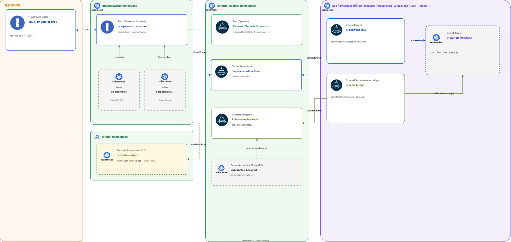

# Secrets

クラスタ内に **1Password の値を Secret として供給する**仕組みと、**クラスタ内 Secret を別 namespace にコピー / rename する**仕組みのグループ。

## このグループが解決する課題

- Secret を Git にコミットしないまま GitOps ループに乗せる (External Secrets が `Secret` を生成、`ExternalSecret` だけ commit)
- 1Password Vault `br-cluster-{env}` を **クラスタ内 proxy 経由で Pod から参照可能にする** (1Password Connect)
- tofu-controller が `writeOutputsToSecret` で吐く Secret のキー名を、消費側 (Envoy SecurityPolicy / アプリ Helm) の期待形に **rename して再注入する** (Kubernetes provider for ExternalSecret)

## グループ全体構成



## グループ全体の設計判断

| 判断 | 採用 | 不採用 / 旧構成 | 理由 |
|---|---|---|---|
| Secret 供給元           | **1Password SaaS** (in-cluster Connect proxy 経由)        | Sealed Secrets / SOPS                       | 既に 1Password を組織で運用済み。鍵管理を別系統に増やしたくない |
| 取得経路                | Connect (REST API) を **クラスタ内 Pod 化**                | ホストの `op` CLI を使う / external 直接続    | クラスタ起動後の Pod は外から `op` を叩けないので in-cluster proxy が必須 |
| Secret 同期方式         | External Secrets Operator (`ExternalSecret` CRD)          | 1Password Operator / 自作スクリプト          | provider が豊富 (1Password だけでなく **Kubernetes provider** で in-cluster 再投影もできる) |
| ストア定義              | `ClusterSecretStore` (cluster-wide)                       | namespace-local `SecretStore`                 | 同じ Vault を全 namespace から参照する運用なので共有が楽 |
| Vault パス命名          | `br-cluster-{env}` 配下、item title をキーに使う          | namespace ベース                              | 1Password 側の検索性 / 環境分離 |
| クラスタ内再投影        | Kubernetes provider (`kubernetes-backend`)                | tofu-controller の出力 Secret を直接参照       | 出力キー名が消費側の期待と合わない (例: Envoy が `client-id` を欲しいが tf 出力は `<app>_client_id`) ので **rename レイヤー**を挟む |

---

## 1Password Connect

### 概要

1Password SaaS の Vault をクラスタ内から REST API で叩けるようにする proxy。`connect-api` と `connect-sync` の 2 Pod 構成 (chart 同梱)。

### ソース

- Helm: [`manifests/platform/onepassword-connect/app/`](../../manifests/platform/onepassword-connect/app/)
  - chart `connect` v2.4.1 (`https://1password.github.io/connect-helm-charts`)
  - namespace: `onepassword`

### 設定の要点

| 項目 | 値 / 備考 |
|------|-----------|
| credentials Secret    | `op-credentials` の `1password-credentials.json` (Connect の Vault 暗号化キー) |
| operator token Secret | `onepassword-connect-token` の `token` (External Secrets が叩く Bearer Token) |
| Vault                 | `br-cluster-prod` (prod 環境) |
| Service               | `onepassword-connect.onepassword:8080` (`ClusterSecretStore` から参照) |

### 初期 Secret の供給

Connect は最初に **`op-credentials` と `onepassword-connect-token` が無いと起動できない** chicken-and-egg 関係にある。これらは `bootstrap_cluster.yaml` の `bootstrap/secrets` ロールが Ansible 経由で初回投入する。Flux 同期前に存在している前提なので、Helm install 時には既にある。

### 依存

- 前提: Ansible bootstrap で `op-credentials` / `onepassword-connect-token` Secret 投入済み、外向きインターネット (1Password SaaS と通信)
- これに依存: 全 `ExternalSecret` (`onepassword-backend` ClusterSecretStore 経由)

### 運用上の注意

- credentials JSON / Token は **1Password 側で再発行可**だが、再発行すると既存 Pod は読めなくなるので Secret を更新→Pod restart が必要
- Connect の Vault 暗号化キーが入った `op-credentials` を失うと、その Connect インスタンスから Vault は開けなくなる (Vault の中身は無事、新しい Connect で再セットアップは可能)

---

## External Secrets Operator

### 概要

外部 secret store (1Password / Kubernetes / Vault / AWS SM など) から `ExternalSecret` CRD で値を引っ張り、対応する `Secret` を生成・同期するオペレータ。**現状の利用バックエンドは 2 系統**。

### ソース

- Helm: [`manifests/platform/external-secrets/app/`](../../manifests/platform/external-secrets/app/)
  - chart `external-secrets` v2.3.0
  - namespace: `external-secrets`
  - `installCRDs: true`
- ClusterSecretStore: [`manifests/platform/external-secrets/config/base/`](../../manifests/platform/external-secrets/config/base/)

### ClusterSecretStore 一覧

| 名前                  | provider             | 使い道 |
|-----------------------|----------------------|--------|
| `onepassword-backend` | 1Password (Connect)  | 1Password Vault `br-cluster-prod` の値を取得する **本流の経路** |
| `kubernetes-backend`  | Kubernetes           | クラスタ内の **既存 Secret を別 namespace に rename しつつコピー**する用 (例: tofu-controller 出力の rename bridge) |

### `onepassword-backend` 設定

```yaml
spec:
  provider:
    onepassword:
      connectHost: http://onepassword-connect.onepassword:8080
      vaults:
        br-cluster-prod: 1     # vault name -> priority
      auth:
        secretRef:
          connectTokenSecretRef:
            name: onepassword-connect-token
            namespace: onepassword
            key: token
```

`ExternalSecret` 例:

```yaml
spec:
  secretStoreRef:
    name: onepassword-backend
    kind: ClusterSecretStore
  data:
    - secretKey: api-token
      remoteRef:
        key: cert-bot                  # 1Password item title
        property: cloudflare_api_token # field label
```

### `kubernetes-backend` 設定

ServiceAccount `kubernetes-backend` (`external-secrets` namespace) に **`zitadel` namespace の Secret を get/list/watch** する ClusterRole を付与し、以下の `ClusterSecretStore` で読み出し許可。

```yaml
spec:
  provider:
    kubernetes:
      remoteNamespace: zitadel
      server:
        caProvider:
          type: ConfigMap
          name: kube-root-ca.crt
          namespace: external-secrets
          key: ca.crt
      auth:
        serviceAccount:
          name: kubernetes-backend
          namespace: external-secrets
```

### `kubernetes-backend` の典型的な使われ方

tofu-controller が `tf-zitadel-output` Secret に書き出すキー (`<app>_client_id` / `<app>_client_secret`) は、Envoy SecurityPolicy が期待する `client-id` / `client-secret` と名前が違う。`ExternalSecret` で `kubernetes-backend` から読み、`secretKey` を rename して **アプリ側 namespace に再投影**する。

```yaml
# 例: アプリ namespace の ExternalSecret
spec:
  secretStoreRef:
    name: kubernetes-backend
    kind: ClusterSecretStore
  target:
    name: <app>-oidc-client
  data:
    - secretKey: client-id
      remoteRef:
        key: tf-zitadel-output
        property: <app>_client_id
    - secretKey: client-secret
      remoteRef:
        key: tf-zitadel-output
        property: <app>_client_secret
```

### 依存

- 前提 (`onepassword-backend`): 1Password Connect が動いている
- 前提 (`kubernetes-backend`): RBAC が `zitadel` namespace で許可されている (現状 `remoteNamespace: zitadel` 固定)
- これに依存: 全 namespace の `ExternalSecret` 利用者 (cert-manager / cloudflared / Zitadel / CNPG / Loki / Tempo …)

### 運用上の注意

- `kubernetes-backend` は **`remoteNamespace: zitadel` に固定**。他 namespace の Secret を bridge したい場合は新しい SA + ClusterSecretStore を増やす
- `ExternalSecret` の `refreshInterval` を短くしすぎると Connect / API が叩かれすぎる。デフォルト 1h で十分なケースが多い
- 1Password 側の item を rename / 削除すると `ExternalSecret` が `SecretSyncedError` になる。Vault 側の操作は GitOps の外なので、変更時は事前に対応 PR を merge する流れにする

---

## 関連

- [`docs/platform/identity.md`](identity.md) — tofu-controller (`tf-zitadel-output` の発生源)
- [`docs/platform/certificate.md`](certificate.md) — Cloudflare API Token / ACME email を 1Password から取得
- [`docs/provisioning.md`](../provisioning.md) — Ansible 側で `op-credentials` / `onepassword-connect-token` を初期投入する流れ
