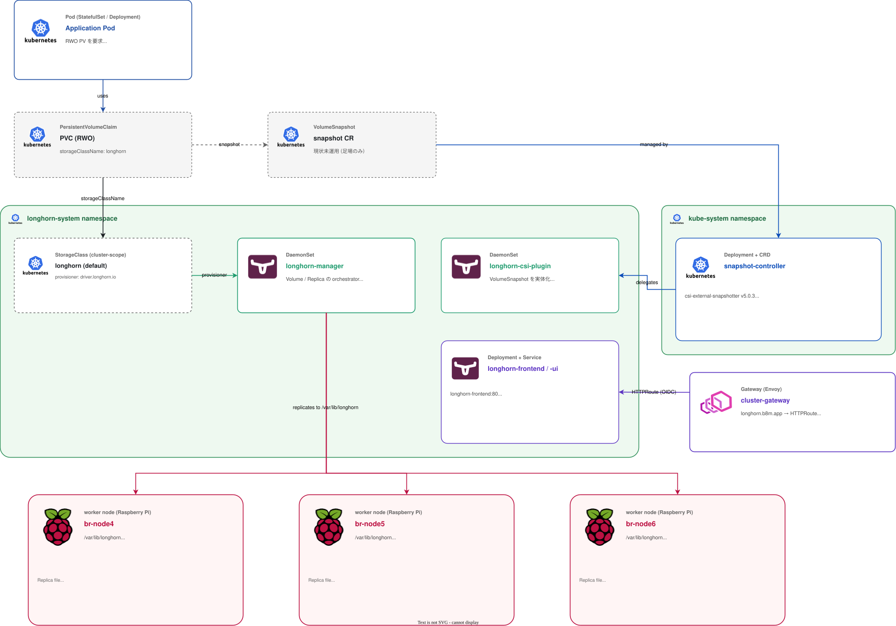

# Storage

クラスタの **永続ボリューム (PV)** とその **スナップショット**を提供するグループ。Longhorn が分散ブロックストレージとして全 PV を引き受け、csi-external-snapshotter が VolumeSnapshot CRD を提供する。

## このグループが解決する課題

- StatefulSet / Operator が要求する RWO PV を、Pod 配置先と独立して提供する
- ノード障害時にデータが失われないようにする (レプリケーション)
- アプリ整合性スナップショットの取得 (オフクラスタバックアップは現状無し、後述)
- Longhorn の管理 UI を OIDC (Zitadel) で保護する

## グループ全体構成

## グループ全体の設計判断

| 判断 | 採用 | 不採用 / 旧構成 | 理由 |
|---|---|---|---|
| ストレージドライバ        | Longhorn 1.11.1                         | local-path-provisioner / OpenEBS                       | レプリケーション + Web UI + バックアップが揃って Pi に乗る軽量さ |
| データ配置先              | worker 専用 ext4 (`/var/lib/longhorn`)  | OS と同居                                              | I/O 競合とディスクフル巻き込みを避ける ([`docs/hardware.md`](../hardware.md)) |
| オフクラスタバックアップ  | **無し** (PVC は ephemeral 扱い)         | Garage / クラウド S3                                    | 学習環境のため PVC 内容は再現可能 (Git からの再構築前提)。2026-04-13 に意図的に撤去 (commit `41f3782`) |
| ノード Down 時の挙動      | `nodeDownPodDeletionPolicy: do-nothing` | `delete-deployment-pod` / `delete-statefulset-pod`     | 2026-04-13 の observability cascade で、control-plane 不安定中に Pod 削除がレプリカ rebuild storm を誘発した経緯 |
| スナップショット CRD     | csi-external-snapshotter (snapshot-controller 5.0.3) | k3s 同梱なし | Longhorn 自体が VolumeSnapshot CRD を必要とするので外部から導入 |
| Snapshotter の chart 出所 | piraeus.io chart (`snapshot-controller`)  | 公式 sig-storage manifest 直接                           | Helm で揃えると Flux 管理が楽 |
| UI 認証                   | Envoy Gateway `SecurityPolicy` (OIDC, Zitadel) | 自前 OIDC / Basic 認証                                   | Longhorn UI は認証機構を持たないので Gateway 層で強制 |

---

## Longhorn

### 概要

CNCF の分散ブロックストレージ。各ノードに `longhorn-manager` / `longhorn-csi-plugin` DaemonSet が居て、PVC を作ると `/var/lib/longhorn` の中にレプリカファイルを切り出して RWO ボリュームとして提供する。

### ソース

- Helm: [`manifests/platform/longhorn/app/`](../../manifests/platform/longhorn/app/)
  - chart `longhorn` v1.11.1 (`https://charts.longhorn.io`)
  - namespace: `longhorn-system`
- 設定 (UI 公開 + OIDC): [`manifests/platform/longhorn/config/base/`](../../manifests/platform/longhorn/config/base/)
- monitoring overlay: [`manifests/platform/longhorn/monitoring/`](../../manifests/platform/longhorn/monitoring/)

### 設定の要点

| 項目 | 値 / 備考 |
|------|-----------|
| `defaultDataPath`              | `/var/lib/longhorn` (worker の ext4 マウント) |
| `nodeDownPodDeletionPolicy`    | **`do-nothing`** (rebuild storm 回避) |
| ServiceMonitor                 | monitoring overlay で有効 (CRD 順序保証のため別 Kustomization) |
| StorageClass                   | `longhorn` (デフォルト) |

### UI 公開と OIDC 保護

| 経路 | 値 |
|------|----|
| 外部ホスト   | `longhorn.b8m.app` |
| HTTPRoute   | [`config/base/httproute.yaml`](../../manifests/platform/longhorn/config/base/httproute.yaml) (`cluster-gateway` 配下、`longhorn-frontend:80` へ) |
| 認証        | `SecurityPolicy longhorn-oidc` ([securitypolicy-longhorn.yaml](../../manifests/platform/longhorn/config/base/securitypolicy-longhorn.yaml)) で Zitadel OIDC を強制 |
| client 情報 | tofu-controller 出力 (`tf-zitadel-output`) を `kubernetes-backend` 経由で `longhorn-oidc` Secret に rename して注入 ([externalsecret-longhorn-oidc.yaml](../../manifests/platform/longhorn/config/base/externalsecret-longhorn-oidc.yaml)) |

### バックアップ

**現状、オフクラスタへのバックアップは設定していない**。2026-04-13 の commit `41f3782` で Garage stack と Longhorn の `defaultBackupStore` を撤去。学習環境のため PVC 内容は ephemeral とみなし、再構築は Git からの再 apply で行う前提。

スナップショット機能 (Longhorn 内の snapshot, VolumeSnapshot CRD 経由) は使える状態のまま残してある。将来オフクラスタ退避が必要になったら、`defaultBackupStore` と backup credential の Secret を復活させる。

### 依存

- 前提: csi-external-snapshotter (VolumeSnapshot CRD)、External Secrets (UI OIDC 用)、Envoy Gateway + cert-manager (UI 公開)、worker ノードの ext4 マウント
- これに依存: 全 StatefulSet / 永続データを持つアプリ (Zitadel が使う `platform-pg-cluster` / Loki / Tempo / Grafana / Prometheus 等)

### 運用上の注意

- **`nodeDownPodDeletionPolicy: do-nothing` は意図的な選択**。ノード復帰前提で待つので、長時間ノード喪失する場合は手動で Pod 退避
- レプリカは worker 3 台に分散される。`br-node4-6` のいずれか 1 台喪失は許容、2 台同時は危険
- ボリューム拡張 (`spec.storage.size` 変更) はオンライン可能だが、PVC `Bound` 状態で実行する。一旦 `Released` になると再 expand に手間がかかる
- 定期的な **engine image / manager image 更新**は UI から実施。chart 更新の前に最新の compatibility matrix を確認
- VolumeSnapshot を使ったバックアップ運用は現状未稼働。アプリのデータ消失は Git からの再構築で復旧する想定

---

## csi-external-snapshotter

### 概要

Kubernetes 公式の **snapshot-controller** をデプロイし、`VolumeSnapshot` / `VolumeSnapshotClass` / `VolumeSnapshotContent` CRD を提供する。Longhorn の CSI plugin がこの CRD を消費してスナップショットを実体化する。

### ソース

- Helm: [`manifests/platform/csi-external-snapshotter/app/`](../../manifests/platform/csi-external-snapshotter/app/)
  - chart `snapshot-controller` v5.0.3 (`https://piraeus.io/helm-charts/`)
  - namespace: `kube-system`
  - `installCRDs: true`

### 設定の要点

| 項目 | 値 |
|------|----|
| chart 出所     | piraeus.io (sig-storage の reference 実装をそのまま Helm 化したもの) |
| CRD インストール | `installCRDs: true` (chart に同梱) |
| namespace      | `kube-system` |

### 依存

- 前提: なし (CRD は chart 同梱)
- これに依存: Longhorn (CSI plugin 経由)

### 運用上の注意

- chart 更新で **CRD のバージョンが変わる**場合があるので、major up は事前確認
- VolumeSnapshot を使ったバックアップは現状未運用 (Longhorn の Backup Target 経由で取っている)。将来 application-consistent snapshot を取りたい場合の足場として残している

---

## 関連

- [`docs/hardware.md`](../hardware.md) — `/var/lib/longhorn` のディスク配置 (worker の ext4)
- [`docs/platform/networking.md`](networking.md) — `cluster-gateway` (Longhorn UI 公開)
- [`docs/platform/identity.md`](identity.md) — Zitadel OIDC + tofu 出力
- [`docs/platform/secrets.md`](secrets.md) — `kubernetes-backend` (rename bridge)
- [`docs/incidents/`](../incidents/) — 2026-04-13 observability cascade (`nodeDownPodDeletionPolicy` 設定の根拠)
