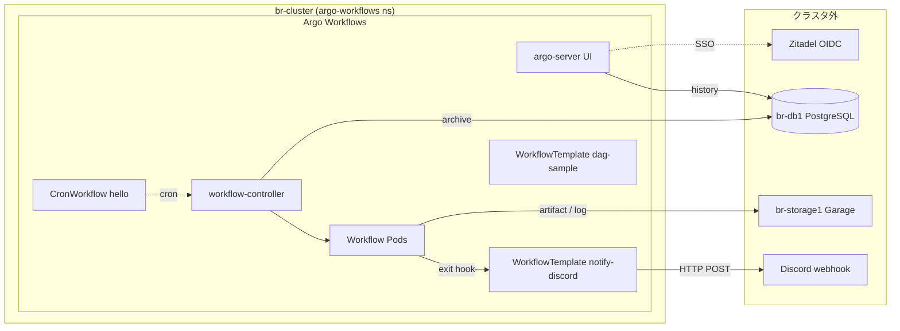

# Workflow Automation

クラスタ内で **ジョブネット相当** (定期実行 + ジョブ間依存 + 並列) を回すためのレイヤ。Argo Workflows 本体 (Workflow controller / argo-server UI) のみを運用する。CD は Flux 続投、Argo Workflows は **ジョブ実行レイヤ専用** として責務分離する。

Argo Events (EventBus / EventSource / Sensor) は撤去済み。実利用は Workflow 完了通知 (Discord) と HTTP webhook トリガのリファレンス実装の 2 つだけで、いずれも常駐コストの大半 (NATS JetStream 3 レプリカ) に見合わなかった。詳細は spec の [Argo Workflows は存続、Argo Events は撤去](../proposals/2026-09-05-single-cp-rearch.md#argo-workflows-は存続argo-events-は撤去) を参照。

## このグループが解決する課題

- 素の `CronJob` / `Job` では表現できない以下を宣言的に書けるようにする:
  - ジョブ間の **依存関係** (A → B、A → B/C 並列、最後に D)
  - **並列ファンアウト** (項目数が動的なバッチ処理)
  - **再実行 / 条件分岐 / リトライ戦略** の統一的な記述
- Workflow の **完了 / 失敗通知** を全ジョブで横断的に仕込む (個別 onExit を書かない)
- Workflow 履歴 (ログ・成果物) を **Pod 退役後も参照可能** にする

## グループ全体構成



## グループ全体の設計判断

| 判断 | 採用 | 不採用 / 旧構成 | 理由 |
|---|---|---|---|
| ジョブネット基盤 | Argo Workflows | Airflow / Tekton / 素の CronJob | k8s ネイティブ、YAML 定義、Flux と相性良。Airflow は DSL + DB が Pi に重い、Tekton は CI 寄り、CronJob は依存・並列・通知が組めない |
| イベント駆動レイヤ | **撤去** (workflowDefaults の exit hook で代替) | Argo Events (EventBus + EventSource + Sensor) | 常駐コストの大半 (NATS JetStream 3 レプリカ) を Argo Events が占めていたが、実利用は完了通知と webhook サンプルの 2 つだけで、いずれも Argo Events なしで代替可能。詳細は [不採用の代替候補比較](../proposals/2026-09-05-single-cp-rearch.md#argo-workflows-は存続argo-events-は撤去) |
| Workflow archive | `br-db1` の PostgreSQL に `argo_workflows` DB を作成 | platform-pg (CNPG) に Database CRD で別 DB | CloudNativePG 撤去に伴い、PostgreSQL 利用者を `br-db1` の単一インスタンスに集約 |
| Artifact storage | Garage S3 (`br-storage1`) | Longhorn PVC | Pod 退役後もログ・成果物が残る。Longhorn 撤去後の唯一の永続化経路 |
| UI 公開 | HTTPRoute + argo-server `--auth-mode=sso` (Zitadel) | Envoy SecurityPolicy + アプリ自前 OIDC の二段重ね | Grafana と同型。二重 OIDC ダンスを避ける、CF Access が外側で GitHub org + WARP を担当 |
| Workflow Pod RBAC | chart の `workflow.serviceAccount.create: true` で `argo-workflow` SA を作成、`workflowDefaults.spec.serviceAccountName` で強制 | default SA (無権限) | wait コンテナが workflowtaskresults を書き込む権限が要る |
| 完了通知 | `controller.workflowDefaults.spec.hooks.exit` の `templateRef` から notify-discord WorkflowTemplate を起動 → curl で Discord embed | Argo Events の resource EventSource → Sensor 経由 / Workflow 個別の onExit | `spec.onExit` は同一 Workflow 内の template 名しか取れず WorkflowTemplate を参照できないため、`LifecycleHook` の `templateRef` を使う。DRY で全 Workflow に一括適用できる当初の狙いはそのまま満たせる |

---

## Argo Workflows

### 概要

Workflow 定義 (CRD `Workflow` / `WorkflowTemplate` / `CronWorkflow`) を `workflow-controller` が reconcile して Pod を起動する。`argo-server` は UI / REST API。

### ソース

- Helm: [`manifests/platform/argo-workflows/app/`](../../manifests/platform/argo-workflows/app/)
  - chart `argo-workflows` 1.0.14 (HelmRepository, `https://argoproj.github.io/argo-helm`)
- 設定:
  - [`values-workflows.yaml`](../../manifests/platform/argo-workflows/app/base/values-workflows.yaml) — controller / server / persistence / artifactRepository / sso
  - [`overlays/prod/values-workflows.yaml`](../../manifests/platform/argo-workflows/app/overlays/prod/values-workflows.yaml) — Pi 向け resource limits

### 設定の要点

| 項目 | 値 / 備考 |
|---|---|
| `controller.parallelism` | 6 (Pi 向け、同時生成抑制) |
| `controller.workflowDefaults.spec.serviceAccountName` | `argo-workflow` (Workflow Pod の SA を強制) |
| `controller.workflowDefaults.spec.ttlStrategy` | 成功 1 日 / 失敗 3 日で k8s 上の Workflow CR を GC |
| `controller.workflowDefaults.spec.podGC.strategy` | `OnWorkflowSuccess` (失敗時の Pod は残す) |
| `controller.workflowDefaults.spec.hooks.exit` | `templateRef: notify-discord/post` を全 Workflow に強制適用 ([完了通知](#完了通知-notify-discord) 節) |
| `controller.persistence.archive` | `true`、`rdbms.prod.internal-service.bright-room.net` の `argo_workflows` DB へ |
| `controller.persistence.archiveTTL` | `30d` |
| `artifactRepository.s3` | Garage `argo-workflows` bucket (`object-storage.prod.internal-service.bright-room.net:3900`) |
| `artifactRepository.archiveLogs` | `true` (pod log も S3 へ) |
| `server.secure` | `false` (Envoy で TLS 終端) |
| `server.extraArgs` | `--auth-mode=sso` |
| `server.sso.enabled` | `true` (chart default は false。**忘れると issuer empty で server crash**) |
| `server.sso.rbac.enabled` | `false` (単一オペレーター運用、SSO 認証された全ユーザに admin 権限) |
| `workflow.serviceAccount.create` | `true` (chart default は false。**忘れると workflowtaskresults forbidden で wait コンテナ死亡**) |
| `workflow.rbac.artifactGC` | `true` (S3 artifact GC pod 用) |

### UI

- URL: [`https://argo-workflows.b8m.app`](https://argo-workflows.b8m.app)
- 認証: CF Access (GitHub org + WARP) → argo-server SSO (Zitadel)
- HTTPRoute + BackendTrafficPolicy: [`config/`](../../manifests/platform/argo-workflows/config/)
  - SSE エンドポイント (`/api/v1/workflow-events`) を維持するため `BackendTrafficPolicy.timeout.http` を 1h 設定 (Envoy default は idle 切断するため)

### 投入方法

```bash
# 1 回限りの Workflow を WorkflowTemplate から
argo submit -n argo-workflows --from workflowtemplate/dag-sample --watch

# CronWorkflow を強制 1 回起動
argo submit -n argo-workflows --from cronworkflow/hello --watch

# UI から "Submit New Workflow" → entrypoint / parameters を入力
```

---

## 完了通知 (notify-discord)

### フロー

1. Workflow が完了 (Succeeded / Failed / Error) すると `controller.workflowDefaults.spec.hooks.exit` により `notify-discord` WorkflowTemplate が起動する ([`values-workflows.yaml`](../../manifests/platform/argo-workflows/app/base/values-workflows.yaml))
2. exit hook の `arguments.parameters` が Argo の workflow 変数 (`{{workflow.name}}` 等) から 7 パラメータを埋めて渡す。旧 Argo Events の Sensor がイベントペイロードから埋めていたのと同じ項目
3. WorkflowTemplate が curl で Discord webhook に embed カードを POST

### ソース

- [`workflowtemplate-discord.yaml`](../../manifests/platform/argo-workflows/app/base/workflowtemplate-discord.yaml)

### embed 文言のカスタマイズ

[`workflowtemplate-discord.yaml`](../../manifests/platform/argo-workflows/app/base/workflowtemplate-discord.yaml) の `templates[0].script.source` の sh ブロックを編集する。phase ごとの emoji / color、fields の項目はここで完結。

---

## サンプル

[`samples/`](../../manifests/platform/argo-workflows/samples/) に proposal 受け入れ基準を満たすリファレンス実装が常駐:

| ファイル | 受け入れ基準 | 検証方法 |
|---|---|---|
| `cronworkflow-hello.yaml` | 定期実行 | default で suspended、`argo submit --from cronworkflow/hello` で 1 回実行 |
| `workflowtemplate-dag.yaml` | DAG 並列 + artifact 永続化 | `argo submit --from workflowtemplate/dag-sample` で A → B/C 並列 → D、artifact が S3 に出る |

HTTP webhook トリガのリファレンス実装 (`eventsource-webhook.yaml` + `sensor-webhook.yaml`) は Argo Events 撤去に伴い削除。外部公開しておらず実利用もなかったため、将来 HTTP トリガが必要になった時点で Argo Events を戻すか別手段を検討する。

---

## 運用 / トラブルシュート

### Workflow が動かない / 完了しない時

```bash
# 全リソースの状態
kubectl get wf,wt,cwf -n argo-workflows

# controller / server のログ
stern -n argo-workflows -l app.kubernetes.io/name=argo-workflows-workflow-controller --tail=50

# Workflow Pod の wait/main ログ
argo logs -n argo-workflows <workflow-name> --follow
```

### Discord 通知が来ない時

1. 対象 Workflow の exit hook が起動したか (`kubectl get wf -n argo-workflows -l workflows.argoproj.io/completed=true` で完了 Workflow を確認、`argo get -n argo-workflows <workflow-name>` で hook ステップの状態を見る)
2. notify-discord Workflow (hook が生成する子 Workflow) の curl 出力 (`argo logs -n argo-workflows <workflow-name>-notify-discord-post` 相当)
3. `argo-workflows-discord` Secret (webhook URL) が存在するか

### UI に "Failed to connect" が出る

argo-server の SSE ストリームが Envoy で切られている。`BackendTrafficPolicy` の timeout 設定 ([`config/base/backendtrafficpolicy.yaml`](../../manifests/platform/argo-workflows/config/base/backendtrafficpolicy.yaml)) を確認。1h で足りないようなら延長する。

### chart upgrade 時の確認ポイント

argo-workflows は chart の値構造 / CRD schema が破壊的に変わることがある (例: v3 → v4 で `CronWorkflow.spec.schedule` が `schedules: []` に変更)。bump 後は:

1. `make manifests/build` が通る
2. `kubectl get wf,cwf,wt -n argo-workflows` がエラーなく Apply される
3. サンプル Workflow が走る (`argo submit --from cronworkflow/hello --watch`)
4. `workflowDefaults.hooks.exit.templateRef` が新バージョンでも有効なことを確認 (chart / Workflow controller のマイナー更新で `LifecycleHook` の仕様が変わることがある)

を確認する。
