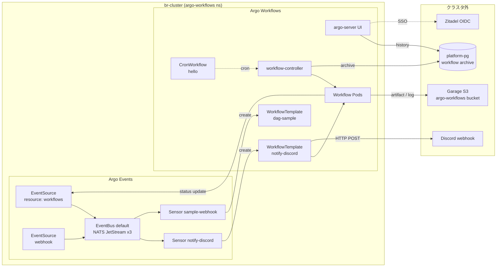

# Workflow Automation

クラスタ内で **ジョブネット相当** (定期実行 + 外部トリガ + ジョブ間依存 + 並列) を回すためのレイヤ。Argo Workflows 本体 (Workflow controller / argo-server UI) と Argo Events (EventBus / EventSource / Sensor) を一組で運用する。CD は Flux 続投、Argo Workflows は **ジョブ実行レイヤ専用** として責務分離する。

## このグループが解決する課題

- 素の `CronJob` / `Job` では表現できない以下を宣言的に書けるようにする:
  - ジョブ間の **依存関係** (A → B、A → B/C 並列、最後に D)
  - **外部トリガ** (HTTP webhook で起動)
  - **並列ファンアウト** (項目数が動的なバッチ処理)
  - **再実行 / 条件分岐 / リトライ戦略** の統一的な記述
- Workflow の **完了 / 失敗通知** を全ジョブで横断的に仕込む (個別 onExit を書かない)
- Workflow 履歴 (ログ・成果物) を **Pod 退役後も参照可能** にする

## グループ全体構成



## グループ全体の設計判断

| 判断 | 採用 | 不採用 / 旧構成 | 理由 |
|---|---|---|---|
| ジョブネット基盤 | Argo Workflows | Airflow / Tekton / 素の CronJob | k8s ネイティブ、YAML 定義、Flux と相性良。Airflow は DSL + DB が Pi に重い、Tekton は CI 寄り、CronJob は依存・並列・通知が組めない |
| イベント駆動 | Argo Events (同 Project) | Knative Eventing | Workflows と同じ Argo Project、CRD 完結、Knative は依存が広すぎ |
| EventBus | NATS JetStream 3 replica | NATS Streaming (deprecated) | JetStream は永続化 / 重複配送あり (at-least-once) |
| Workflow archive | platform-pg (CNPG) に Database CRD で別 DB | 専用 PG / SQLite | 既存 CNPG 流用、SQLite は Pod 再起動で消える |
| Artifact storage | Garage S3 (br-external1) | Longhorn PVC | Pod 退役後もログ・成果物が残る、Loki/Tempo と同じバックエンド (user/bucket は分離) |
| UI 公開 | HTTPRoute + argo-server `--auth-mode=sso` (Zitadel) | Envoy SecurityPolicy + アプリ自前 OIDC の二段重ね | Grafana と同型。二重 OIDC ダンスを避ける、CF Access が外側で GitHub org + WARP を担当 |
| Workflow Pod RBAC | chart の `workflow.serviceAccount.create: true` で `argo-workflow` SA を作成、`workflowDefaults.spec.serviceAccountName` で強制 | default SA (無権限) | wait コンテナが workflowtaskresults を書き込む権限が要る |
| 完了通知 | resource EventSource → Sensor → notify-discord WorkflowTemplate → curl で Discord embed | Workflow 個別の onExit | DRY、横断的に統一、UI へのリンクや embed 整形は WorkflowTemplate script で集中 |
| 再帰トリガ防止 | EventSource の `filter.labels` で `notify.b8m.app/skip != "true"` を除外 | Sensor data/expr filter | argo-events filter は path 不在で event 全体 discard する仕様、k8s label selector は不在を「不一致」扱いするため使える |

---

## Argo Workflows

### 概要

Workflow 定義 (CRD `Workflow` / `WorkflowTemplate` / `CronWorkflow`) を `workflow-controller` が reconcile して Pod を起動する。`argo-server` は UI / REST API。

### ソース

- Helm: [`manifests/platform/argo-workflows/app/`](../../manifests/platform/argo-workflows/app/)
  - chart `argo-workflows` 1.0.13 (HelmRepository, `https://argoproj.github.io/argo-helm`)
- 設定:
  - [`values-workflows.yaml`](../../manifests/platform/argo-workflows/app/base/values-workflows.yaml) — controller / server / persistence / artifactRepository / sso
  - [`overlays/prod/values-workflows.yaml`](../../manifests/platform/argo-workflows/app/overlays/prod/values-workflows.yaml) — Pi 向け resource limits

### 設定の要点

| 項目 | 値 / 備考 |
|---|---|
| `controller.parallelism` | 6 (Pi 向け、同時生成抑制) |
| `controller.workflowDefaults.spec.serviceAccountName` | `argo-workflow` (Workflow Pod の SA を強制) |
| `controller.workflowDefaults.spec.ttlStrategy` | 成功 1 日 / 失敗 3 日で k8s 上の Workflow CR を GC |
| `controller.workflowDefaults.spec.podGC.strategy` | `OnWorkflowSuccess` (失敗時の Pod は残す) |
| `controller.persistence.archive` | `true`、`platform-pg-rw.platform-pg` の `argo_workflows` DB へ |
| `controller.persistence.archiveTTL` | `30d` |
| `artifactRepository.s3` | Garage `argo-workflows` bucket (`object-storage.cluster-internal.bright-room.net:3900`) |
| `artifactRepository.archiveLogs` | `true` (pod log も S3 へ) |
| `server.secure` | `false` (Envoy で TLS 終端) |
| `server.extraArgs` | `--auth-mode=sso` |
| `server.sso.enabled` | `true` (chart default は false。**忘れると issuer empty で server crash**) |
| `server.sso.rbac.enabled` | `false` (単一オペレーター運用、SSO 認証された全ユーザに admin 権限) |
| `workflow.serviceAccount.create` | `true` (chart default は false。**忘れると workflowtaskresults forbidden で wait コンテナ死亡**) |
| `workflow.rbac.artifactGC` | `true` (S3 artifact GC pod 用) |

### UI

- URL: [`https://argo-workflows.b8m.app`](https://argo-workflows.b8m.app)
- 認証: CF Access (GitHub org + WARP) → argo-server SSO (Zitadel)
- HTTPRoute + BackendTrafficPolicy: [`config/`](../../manifests/platform/argo-workflows/config/)
  - SSE エンドポイント (`/api/v1/workflow-events`) を維持するため `BackendTrafficPolicy.timeout.http` を 1h 設定 (Envoy default は idle 切断するため)

### 投入方法

```bash
# 1 回限りの Workflow を WorkflowTemplate から
argo submit -n argo-workflows --from workflowtemplate/dag-sample --watch

# CronWorkflow を強制 1 回起動
argo submit -n argo-workflows --from cronworkflow/hello --watch

# UI から "Submit New Workflow" → entrypoint / parameters を入力
```

---

## Argo Events

### 概要

イベント駆動で Workflow を起動する仕組み。`EventSource` がイベント源 (k8s リソース watch / webhook 等) を扱い、`EventBus` (NATS JetStream) を経由して `Sensor` がトリガを実行。

### ソース

- Helm: [`manifests/platform/argo-workflows/app/`](../../manifests/platform/argo-workflows/app/) (chart `argo-events` 2.4.21、同じ Flux Kustomization)
- 設定:
  - [`values-events.yaml`](../../manifests/platform/argo-workflows/app/base/values-events.yaml) — JetStream version / image (`metricsExporterImage` **必須**)
- EventBus: [`eventbus.yaml`](../../manifests/platform/argo-workflows/app/base/eventbus.yaml) — `default` JetStream 3 replica / Longhorn 1Gi PVC

### EventBus / Sensor の挙動の落とし穴

| 落とし穴 | 仕様 / 対処 |
|---|---|
| at-least-once 配送 | leader election や Sensor 再起動で Workflow が複数回起動し得る。**Sensor から起動する Workflow は冪等前提で書く** (deterministic name で create 409 にする等) |
| filter `data` / `expr` の path 不在 | path が無い event は filter 全体が error で discard される。「ラベルがある時だけ除外」のような分岐は **EventSource の `filter.labels` (k8s label selector)** に逃がす |
| HTTP trigger の url に Secret 直接参照不可 | webhook URL を Secret に置きたい場合は **Workflow trigger 経由 (Pod env from Secret)** が筋。HTTP trigger は in-cluster な相手向け |

---

## 完了通知 (notify-discord)

### フロー

1. argo-workflows ns 内の Workflow が status 更新 → `EventSource notify-workflow` (resource type) が UPDATE を捕捉
2. EventSource の `filter.labels` で `notify.b8m.app/skip != "true"` の Workflow だけを EventBus に publish (notify-discord 自身が再帰しないため)
3. `Sensor notify-discord` が `phase == Succeeded / Failed / Error` を判定し、`notify-discord` WorkflowTemplate を起動
4. WorkflowTemplate が curl で Discord webhook に embed カードを POST

### ソース

- [`notify/`](../../manifests/platform/argo-workflows/notify/) サブコンポーネント
  - `eventsource-workflow.yaml` / `sensor-discord.yaml` / `workflowtemplate-discord.yaml` / `rbac.yaml` / `externalsecret-discord.yaml`

### 通知抑止

特定の Workflow を通知させたくない場合は `metadata.labels."notify.b8m.app/skip": "true"` を付ける。EventSource レイヤで弾かれる。

### embed 文言のカスタマイズ

[`workflowtemplate-discord.yaml`](../../manifests/platform/argo-workflows/notify/base/workflowtemplate-discord.yaml) の `templates[0].script.source` の sh ブロックを編集する。phase ごとの emoji / color、fields の項目はここで完結。

---

## サンプル

[`samples/`](../../manifests/platform/argo-workflows/samples/) に proposal 受け入れ基準 1〜4 を満たすリファレンス実装が常駐:

| ファイル | 受け入れ基準 | 検証方法 |
|---|---|---|
| `cronworkflow-hello.yaml` | 1 (定期実行) | default で suspended、`argo submit --from cronworkflow/hello` で 1 回実行 |
| `workflowtemplate-dag.yaml` | 3 (DAG 並列) + 4 (artifact 永続化) | `argo submit --from workflowtemplate/dag-sample` で A → B/C 並列 → D、artifact が S3 に出る |
| `eventsource-webhook.yaml` + `sensor-webhook.yaml` | 2 (外部トリガ) | クラスタ内 curl で `http://sample-webhook-eventsource-svc:12000/sample` に POST |

---

## 運用 / トラブルシュート

### Workflow が動かない / 完了しない時

```bash
# 全リソースの状態
kubectl get wf,wt,cwf,sensor,eventsource,eventbus -n argo-workflows

# controller / server / events のログ
stern -n argo-workflows -l app.kubernetes.io/name=argo-workflows-workflow-controller --tail=50
stern -n argo-workflows -l sensor-name --tail=50
stern -n argo-workflows -l eventsource-name --tail=50

# Workflow Pod の wait/main ログ
argo logs -n argo-workflows <workflow-name> --follow
```

### Discord 通知が来ない時

1. EventSource `notify-workflow` が Ready か (`kubectl get eventsource -n argo-workflows`)
2. `kubectl logs -n argo-workflows -l sensor-name=notify-discord --tail=50 | grep -E "filter|trigger|error"` で reject 理由を確認
3. notify-discord Workflow が立っているか (`kubectl get wf -n argo-workflows -l notify.b8m.app/skip=true`)
4. notify-discord Workflow の curl 出力 (`argo logs -n argo-workflows notify-discord-xxx`)

### UI に "Failed to connect" が出る

argo-server の SSE ストリームが Envoy で切られている。`BackendTrafficPolicy` の timeout 設定 ([`config/base/backendtrafficpolicy.yaml`](../../manifests/platform/argo-workflows/config/base/backendtrafficpolicy.yaml)) を確認。1h で足りないようなら延長する。

### EventBus が NotReady

`kubectl describe eventbus -n argo-workflows default` で StatefulSet 作成エラーを確認。`metricsExporterImage` の設定漏れが頻出。

### chart upgrade 時の確認ポイント

argo-workflows は chart の値構造 / CRD schema が破壊的に変わることがある (例: v3 → v4 で `CronWorkflow.spec.schedule` が `schedules: []` に変更)。bump 後は:

1. `make manifests/build` が通る
2. `kubectl get wf,cwf,wt,sensor -n argo-workflows` がエラーなく Apply される
3. サンプル Workflow が走る (`argo submit --from cronworkflow/hello --watch`)

を確認する。
