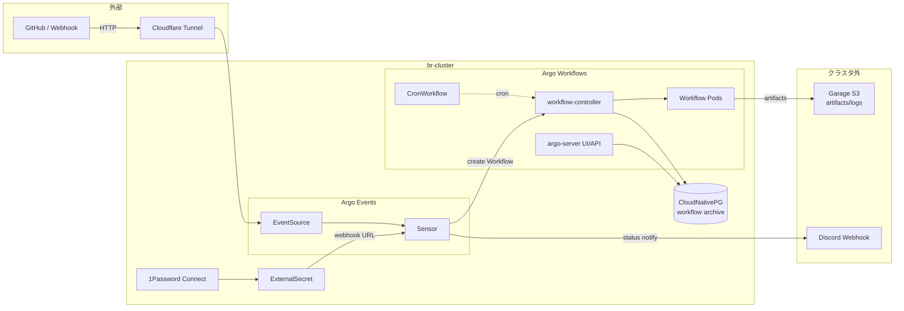

# 提案: Argo Workflows / Argo Events の導入

> **ステータス: Phase 1 着地済 (2026-04-30)**
>
> 受け入れ基準 1〜6 達成、基準 7 (既存 CronJob 1 本置換) は対象不在で N/A。
> 詳細は [Phase 1 着地まとめ](#phase-1-着地まとめ-2026-04-30) 参照。
> 仕様 doc は [`docs/platform/workflows.md`](../platform/workflows.md) に集約。

> **この提案の位置づけ**
>
> クラスタ内で「ジョブネット相当」(定期実行 + 外部トリガ + ジョブ間依存 +
> 並列) を回すための基盤を Argo Workflows + Argo Events で整える。
> CD は Flux 続投、Argo Workflows は **ジョブ実行レイヤ専用** として
> 責務を分離する。

## Phase 1 着地まとめ (2026-04-30)

### 受け入れ基準の達成状況

| # | 機能 | 達成 PR / 備考 |
|---|---|---|
| 1 | 定期実行 | #246 (`samples/cronworkflow-hello.yaml`) |
| 2 | 外部トリガ | #246 (`samples/eventsource-webhook.yaml` + `samples/sensor-webhook.yaml`) |
| 3 | DAG / 並列 | #246 (`samples/workflowtemplate-dag.yaml`) |
| 4 | アーティファクト永続化 | #243 (Garage S3 `argo-workflows` bucket) |
| 5 | Discord 通知 | #251 + #257 (Workflow trigger + embed カード) |
| 6 | UI SSO | #244 (HTTPRoute + argo-server `--auth-mode=sso`) |
| 7 | 既存 CronJob 1 本置換 | **N/A** — Phase 1 着手時点でクラスタに `CronJob` リソース 0 件、置換対象なし |

### merged PR (Phase 1 全体)

| PR | 内容 |
|---|---|
| #241 | step 1: argo-workflows + argo-events 最小導入 |
| #242 | step 2: workflow archive (platform-pg) |
| #243 | step 3: artifact repository (Garage S3) |
| #244 | step 4: UI SSO (HTTPRoute + Zitadel) |
| #245 | fix: `server.sso.enabled` 必須 |
| #246 | step 5: sample 一式 + EventBus |
| #247 | fix: `CronWorkflow.spec.schedules` (v4 syntax) |
| #248 | chore: argo CLI を mise に追加 |
| #249 | fix: Workflow Pod SA + RBAC |
| #250 | fix: EventBus `metricsExporterImage` |
| #251 | step 6: Discord 通知 (HTTP trigger) |
| #252 / #253 | fix: substituteFrom Secret の ns (`flux-system`) |
| #255 | fix: skip filter を一旦削除 |
| #256 | fix: UI SSE timeout 延長 |
| #257 | step 6 改修: embed カード化 (Workflow trigger 経由) |
| #258 | fix: skip 除外を EventSource labelSelector に移動 |

外部リポ並行 PR:

- bright-room/br-cluster-zitadel-terraform#14 (OIDC application)
- bright-room/br-cloudflare-terraform#17 (CF Access application)

### 設計変更 (proposal からの逸脱)

| 項目 | proposal | 実装 | 理由 |
|---|---|---|---|
| UI 認証層 | Envoy SecurityPolicy + argo-server SSO の二段重ね | argo-server SSO のみ (Envoy SecurityPolicy 無し) | Grafana の `app_grafana.tf` コメント (二重 OIDC ダンス回避) と同型に揃えた |
| 通知トリガ | HTTP trigger 直叩き | k8s create Workflow trigger 経由で curl | Discord embed `color` が integer 必須 / argo-events HTTP trigger payload は文字列のみ。Workflow trigger なら curl で自由に JSON 整形 + webhook URL を Pod env (Secret) で持てる |
| skip ラベル除外 | Sensor data filter | EventSource `filter.labels` (k8s label selector) | argo-events の data/expr filter は path 不在で event 全体 discard する仕様。k8s label selector は不在を「不一致」として扱うため使える |
| EventBus | values-events.yaml に jetstream version のみ | `metricsExporterImage` も明示必須 | chart は受理するが controller が StatefulSet 生成時に `containers[2].image: Required value` で失敗 |
| Workflow Pod SA | (proposal 未言及) | `workflow.serviceAccount.create: true` + `workflowDefaults.spec.serviceAccountName: argo-workflow` 強制 | chart default では SA 不在で wait コンテナが workflowtaskresults を作れず失敗 |

### 学び (CI 強化に反映)

Phase 1 の段階導入で **6 系統の hot-fix が連発** したため、CI 強化を別 proposal に切り出した: [`manifests-ci-hardening.md`](manifests-ci-hardening.md)。

- 静的解析 (CRD schema / postBuild Secret) で防げる層は機械化 → Phase 1 で実装
- chart 値マージ後 / controller 側生成で発覚する層は kind smoke test で受ける → Phase 2 で別 proposal 化

### 運用フォロー (2026-05-25 目安)

merge から 4 週間後に Phase 2 着手判断。確認項目は本 proposal の「[Phase 1 の運用フォロー](#phase-1-の運用フォロー-2026-05-25-目安)」参照。

### Phase 2 以降のスコープ

- **Phase 2**: 既存 CronJob 棚卸し → 個別 proposal で議論。Phase 1 着地時点では `CronJob` リソース 0 件のため、新規ジョブが追加された段階で発火する
- **Phase 3**: 順次メンテナンス系ジョブ (例: 複数ノード跨ぎの段階処理) を Workflows DAG + semaphore で実装
- **Phase 4**: バックアップ / DR 系ジョブの Workflows 化

## 設計時の記録 (アーカイブ)

以下は Phase 1 着手前の設計時の記録。コードと食い違った場合は
[`docs/platform/workflows.md`](../platform/workflows.md) と manifest を正とする。

## 背景・動機

現状クラスタには素の `CronJob` / `Job` しかなく、以下が表現できない:

- ジョブ間の **依存関係** (A 完了後に B、A 後に B/C 並列、最後に D)
- **外部トリガ** (GitHub webhook / Cloudflare 経由イベント等で起動)
- **並列ファンアウト** (項目数が動的なバッチ処理)
- **再実行 / 手動承認 / リトライ戦略** の統一的な記述
- **完了/失敗通知** を全ジョブで横断的に仕込む

今後想定されるユースケース:

| 例 | 必要な機能 |
|---|---|
| Longhorn snapshot → Garage S3 への export | 依存 + リトライ + 通知 |
| Zitadel / CoreDNS rewrite 等の周期的 health check & 自動修復 | 定期実行 + 条件分岐通知 |
| 外部 webhook を受けてクラスタ内整備バッチを起動 | 外部トリガ |
| 複数ノードに跨る順次メンテナンスバッチ (例: 全 CP の順次処理) | 依存 + 排他制御 (semaphore) |

これらを「都度 CronJob を生やす」運用は限界がある。順次実行が必要な
ジョブも、Workflows の DAG + `synchronization` で表現すれば一元化できる。

## ゴール / 非ゴール

| | 内容 |
|---|------|
| ゴール | (1) `manifests/platform/argo-workflows/` で Argo Workflows + Argo Events を Flux 経由で導入。(2) 定期実行 / 外部トリガ / DAG / 並列 / 通知 の 5 機能を Phase 1 で動作確認。(3) 既存 CronJob 1 本を Argo Workflows で書き直してリファレンス実装にする |
| 非ゴール | (1) 既存 `CronJob` の全面置換 (移行は個別判断)。(2) Argo CD 導入 (CD は Flux 続投)。(3) Kubeflow / Argo Rollouts。(4) マルチクラスタ実行 (今は単一クラスタ) |

## 採用 / 不採用 / 理由

| 論点 | 採用 | 理由 |
|------|------|------|
| ジョブネット基盤 | **Argo Workflows** | K8s ネイティブ、YAML 定義、Flux と相性良。Airflow は Python DSL + 別 DB が重くて Pi に過剰 |
| イベント駆動 | **Argo Events** (同梱導入) | Workflows と同じ Argo Project、CRD で完結。Knative Eventing は依存が広すぎる |
| CD との関係 | **Flux 続投、Argo CD は入れない** | CD とジョブ実行はレイヤが違う。Argo Workflows 自体も Flux で HelmRelease として deploy する |
| 配置 | `manifests/platform/argo-workflows/` (新設) | 他 platform component と同列。WorkflowTemplate / CronWorkflow / Sensor 等もここに集約 |
| アーティファクトリポジトリ | **Garage S3** (br-external1) | Loki / Tempo と同じバックエンド。クラスタ外なので Workflows Pod 退役後もログ・成果物が残る |
| Workflow 履歴永続化 | **CloudNativePG (新規 DB)** | 既に CNPG が稼働。SQLite/インメモリは Pod 再起動で消える、外部 PG を別建てするほどでもない |
| UI 公開 | `argo-workflows.b8m.app` (Envoy Gateway 経由 + Zitadel OIDC) | 他 UI (Grafana / Hubble) と同方式。SecurityPolicy 必須は `*.b8m.app` 共通規約に準拠 |
| 認証 | **Zitadel OIDC (Argo Server SSO)** + RBAC | UI のみ局所認証は二重管理。クラスタ内 OIDC を SoT にする |
| 通知 | **Argo Events Sensor → Discord Webhook** で集約 | Workflow ごとに `onExit` を書くと DRY でない。Workflow リソース監視 → 一元通知が運用しやすい |
| Discord webhook URL 管理 | **1Password → ExternalSecret** | 平文 Secret 禁止 (CLAUDE.md / policy 3) |
| 並列度上限 | controller `parallelism` を **クラスタ全体で 6** から開始 | Pi 4 ノード構成、Pod 同時生成のリソース圧を抑制。実績見て調整 |
| 完了 Workflow の GC | `ttlStrategy.secondsAfterCompletion: 86400` (1 日) + Archive で履歴保持 | etcd 肥大化を避ける。履歴は PG Archive 側で参照 |

### 検討したが採らなかった案

| 案 | 不採用理由 |
|---|-----------|
| Apache Airflow | Web / Scheduler / Worker / DB と常駐 Pod が多く Pi に重い。DAG が Python ファイルで Flux 管理しづらい |
| Tekton Pipelines | CI/CD 寄りの抽象 (Pipeline → Task → Step) で、定期実行や外部トリガは別途 Tekton Triggers が必要。Argo Workflows + Events の方が用途に直接フィット |
| 素の `CronJob` 継続 | DAG / 並列ファンアウト / 統一通知が表現できない (=動機の裏返し) |
| Knative Eventing | イベントソースは充実だが Workflows との橋渡しに別実装が必要。Argo Events の方が一気通貫 |
| Workflow Archive を SQLite | Pod 再起動で消える。external PG を立てるなら CNPG に乗せた方が運用が一本化 |

## アーキテクチャ概要



## Phase 1 で動かすもの (受け入れ基準)

| # | 機能 | 検証方法 |
|---|------|---------|
| 1 | **定期実行** | サンプル `CronWorkflow` (毎時 echo) が cron schedule で起動 |
| 2 | **外部トリガ** | webhook EventSource に curl POST → Sensor 経由で Workflow が起動 |
| 3 | **DAG / 並列** | A → (B, C 並列) → D の Workflow が想定順序で完了、UI で DAG が可視化 |
| 4 | **アーティファクト永続化** | Workflow 内で生成したファイルが Garage S3 に保存され、UI からダウンロード可 |
| 5 | **Discord 通知** | Workflow Succeeded / Failed が Discord チャンネルに embed で投稿される |
| 6 | **UI SSO** | `argo-workflows.b8m.app` に Zitadel OIDC でログイン、自分の OIDC group が RBAC で反映 |
| 7 | **既存 CronJob 1 本の置換** | 候補から 1 本 (例: `cloudflared` 周辺の保守 job 等、Phase 1 着手時に選定) を WorkflowTemplate 化 |

## 段階導入計画

| Phase | 内容 | 完了条件 |
|-------|------|---------|
| **Phase 0** | この proposal で合意 | レビュー approval |
| **Phase 1** | Argo Workflows + Argo Events 導入。受け入れ基準 1〜7 を満たす | サンプル CronWorkflow / Sensor / WorkflowTemplate が main で動作、Discord 通知到達 |
| **Phase 2** | 既存 CronJob 群の棚卸し → Workflows 化 candidate を proposal で個別議論 | 別 proposal 起票 |
| **Phase 3** | 順次メンテナンス系ジョブ (例: 複数ノード跨ぎの段階処理) を Workflows DAG + semaphore で実装 | 別 proposal で詳細化 |
| **Phase 4** | バックアップ / DR 系ジョブの Workflows 化 | 別 proposal |

Phase 2 以降は本 proposal のスコープ外。Phase 1 が安定運用に入ってから
個別 proposal を起こす。

## Phase 1 の運用フォロー (2026-05-25 目安)

Phase 1 を merge してから 4 週間後に運用実績を振り返る。

### 振り返り項目

| 項目 | 確認方法 |
|------|---------|
| Workflow 実行成功率 | `argo list --completed` / Grafana ダッシュボード (workflow-controller の Prometheus metrics) |
| Discord 通知の取りこぼし数 | Discord チャンネルログと Workflow archive を突合 |
| controller / argo-server / events-controller の Pod リソース実消費 | `kubectl top pod -n argo-workflows` 平均値 |
| etcd / CNPG 容量増分 | `ttlStrategy` が効いているか確認 |
| RBAC / SSO の動作 | 別 OIDC group ユーザでログインして UI 操作範囲を確認 |

### Phase 2 着手判断の閾値 (目安)

| 状況 | 判断 |
|------|------|
| 受け入れ基準 7 項目すべて safe + 4 週間障害なし | Phase 2 (既存 CronJob 棚卸し proposal) 着手 |
| Pi リソース圧迫が顕著 (controller が常時 CPU > 200m / Mem > 512Mi 等) | resource limit 見直し / `parallelism` 調整、Phase 2 は延期 |
| Discord 通知が落ちる / SSO が不安定 | 該当部分の修正 proposal を先に切る |

## 構成要素 (Phase 1)

### (A) 配置

```text
manifests/platform/argo-workflows/
├── kustomization.yaml
├── namespace.yaml
├── helmrepository.yaml             # argoproj.github.io
├── argo-workflows-helmrelease.yaml # chart: argo-workflows
├── argo-events-helmrelease.yaml    # chart: argo-events
├── postgres-cluster.yaml           # CNPG Cluster (workflow archive 用)
├── externalsecret-archive.yaml     # PG 接続情報 (1Password)
├── externalsecret-discord.yaml     # Discord webhook URL (1Password)
├── externalsecret-artifact-s3.yaml # Garage S3 認証情報 (1Password)
├── httproute.yaml                  # argo-workflows.b8m.app
├── securitypolicy.yaml             # Zitadel OIDC (b8m.app 共通規約)
├── service-loadbalancer.yaml       # (UI を LB で出す場合のみ。基本は HTTPRoute 経由なので不要)
├── samples/
│   ├── cronworkflow-hello.yaml         # 受け入れ基準 1
│   ├── workflowtemplate-dag-sample.yaml# 受け入れ基準 3
│   ├── eventsource-webhook.yaml        # 受け入れ基準 2
│   └── sensor-webhook-trigger.yaml     # webhook → Workflow
└── notify/
    ├── eventsource-workflow-resource.yaml  # Workflow status を監視
    └── sensor-discord.yaml                 # Discord webhook へ POST
```

`clusters/prod/platform/kustomization.yaml` にエントリ追加 (CLAUDE.md 規約)。

### (B) HelmRelease の pin (policy 1, 2 準拠)

- `helmrepository.yaml` で `https://argoproj.github.io/argo-helm` を allowlist
- `chart.spec.version` は固定 (Renovate で更新)
- `policies/exceptions.rego` への追加は **想定しない** (規約通り通せる構成)

### (C) controller / server リソース上限 (Pi 制約)

| component | requests | limits | 備考 |
|-----------|----------|--------|------|
| workflow-controller | 100m / 256Mi | 500m / 512Mi | `parallelism: 6`、`workflowDefaults.spec.ttlStrategy` を values で固定 |
| argo-server | 50m / 128Mi | 200m / 256Mi | UI + REST。負荷低い |
| events-controller | 50m / 128Mi | 200m / 256Mi | |
| events-webhook | 50m / 64Mi | 100m / 128Mi | |

実測で見直し前提 (運用フォローで確認)。

### (D) Workflow Default

values で全 Workflow に強制適用するデフォルト:

```yaml
workflowDefaults:
  spec:
    ttlStrategy:
      secondsAfterCompletion: 86400
      secondsAfterSuccess: 86400
      secondsAfterFailure: 259200      # 失敗は 3 日残す
    podGC:
      strategy: OnWorkflowSuccess      # 成功時 Pod 即削除、失敗は残す
    activeDeadlineSeconds: 7200        # デフォルト 2h タイムアウト (各 Workflow で上書き可)
```

### (E) Discord 通知 (Argo Events 集約方式)

- `EventSource` (kind: `resource`) で `Workflow` の `status.phase` 変化を購読
- `Sensor` で `Succeeded` / `Failed` を分岐、`http` トリガで Discord webhook へ POST
- ペイロードは embed 形式 (色: 成功緑 / 失敗赤、タイトル: workflow name、本文: duration / failures)
- Workflow ごとの `onExit` 通知は **書かない** (DRY、横断的に統一)
- 「特定 Workflow だけ通知抑止したい」場合は Workflow に label `notify.b8m.app/skip: "true"` を付け、Sensor 側でフィルタ

### (F) UI / SSO

- `HTTPRoute` で `argo-workflows.b8m.app` を Envoy Gateway 経由で公開
- `SecurityPolicy` で Zitadel OIDC を必須化 (`*.b8m.app` 共通規約 / `docs/platform/identity.md`)
- argo-server は `--auth-mode=sso` で起動、SSO config は ExternalSecret 経由
- Zitadel 側に Application 追加、`role:argo-admin` / `role:argo-viewer` を group claim に

### (G) Renovate

`renovate.json` の HelmRelease ルールが既存と同じ仕組みで効く想定 (Phase 1
着手時に dry-run で確認)。

## 期待効果

- **ジョブ間依存・並列・外部トリガが宣言的に書ける** — 都度 CronJob を量産しなくて済む
- **完了/失敗通知の一元化** — Workflow 単位で通知ロジックを書かなくても Discord に届く
- **UI でリラン・ステップ単位再実行** — オペレーション工数の削減
- **ジョブ履歴の永続化** — Pod 退役後も実行履歴・ログ・成果物が参照可能
- **Phase 3 で想定する順次メンテナンス系ジョブの安全な実行** — semaphore で排他制御

## リスク・注意

| リスク | 対処 |
|--------|------|
| **Pi リソース圧迫** (controller / server 常駐) | `parallelism` と limits を控えめに、運用フォローで実測 |
| **etcd 肥大化** (大量 Workflow CR が残る) | `ttlStrategy` 必須、Archive で履歴は PG 側に逃がす |
| **Discord webhook URL 漏洩** | 1Password → ExternalSecret 経由のみ。`policies/` 準拠 |
| **外部 webhook EventSource の DoS** | Cloudflare Tunnel 経由のみ受ける、Sensor 側で payload validation |
| **SSO 障害時に UI ロックアウト** | argo-server `--auth-mode=server` のフォールバック手順を doc 化 (障害時のみ kubectl で patch) |
| **Workflow が apiserver / etcd に load をかける** | `podGC` で完了 Pod 即削除、watch 数を controller 設定で抑制 |
| **学習コスト** (DAG / WorkflowTemplate / Sensor の概念) | `docs/platform/workflows.md` にチートシート + samples をリファレンス化 |
| **既存 CronJob と並走時の二重実行** | Phase 2 で個別移行する際、移行 PR で旧 CronJob を必ず suspend → 削除 |
| **CNPG に Workflow archive が乗ることでの blast radius 拡大** | DB 名 / user を専用化、他アプリと schema を分ける |

## 作業範囲 (Phase 1)

- `manifests/platform/argo-workflows/` 新規作成 (上記 (A))
- `clusters/prod/platform/kustomization.yaml` にエントリ追加
- 1Password に項目追加:
  - Argo Workflow archive PG 接続情報
  - Discord webhook URL (Argo 通知専用チャンネル)
  - Garage S3 access key / secret (artifact 用、既存 Loki/Tempo とは別 user 推奨)
  - Zitadel OIDC client ID / secret (argo-server SSO 用)
- Zitadel に Application 追加 (`br-cluster-zitadel-terraform` 側 PR)
- Cloudflare Tunnel ルート追加 (webhook 受け口、`br-cloudflare-terraform` 側 PR)
- DNS: `argo-workflows.b8m.app` (`br-cloudflare-terraform` 側 PR)
- CoreDNS rewrite 検討: クラスタ内から `argo-workflows.b8m.app` を引く必要があるか (基本不要、UI のみクラスタ外から)
- サンプル: CronWorkflow / WorkflowTemplate / EventSource / Sensor 各 1 本
- Discord 通知 EventSource + Sensor
- 既存 CronJob 1 本の Workflows 化 (候補は Phase 1 着手時に選定)
- **ドキュメント (実装後にまとめて作る)**:
  - `docs/platform/workflows.md` (新規 — Argo Workflows / Events の解説、運用 / トラブルシュート)
  - `docs/assets/drawio/workflows.drawio` + `docs/assets/workflows.drawio.svg`
    (アーキ図、構成要素アイコン: Argo Workflows / Events / Flux / Helm / CNPG / Garage / Zitadel / Discord)
  - `docs/README.md` の「プラットフォームコンポーネント」表に Argo Workflows 行追加
  - `CLAUDE.md` に「ジョブを追加するときは Argo Workflows を優先、CronJob を新設する場合は理由を明記」セクション追加

## 未決事項 / 要確認

- Helm chart のバージョン (Phase 1 着手時に最新 stable を pin)
- 既存 CronJob 棚卸しリストと、Phase 1 で置換する 1 本の選定
- `parallelism: 6` が Pi 4 ノードで妥当か (実測で調整)
- Garage S3 の bucket 構成 (`workflow-artifacts` を新設、既存 Loki/Tempo bucket とは分離)
- CNPG cluster を専用に立てるか、既存 cluster に DB を追加するか (バックアップ要件次第)
- Workflow archive の保持期間 (PG 側 retention をどう持つか、運用フォローで決定)
- Sensor の Discord ペイロードフォーマット (Phase 1 で叩き台 → 運用しながら改善)
- webhook EventSource の認証方式 (HMAC 共有鍵か、Cloudflare Access service token 経由か)

## 更新履歴

- 2026-04-27 初版
