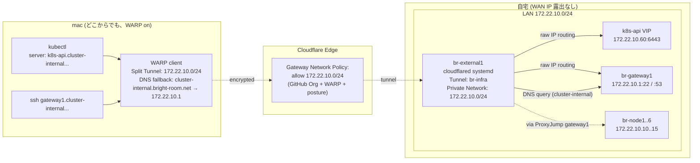
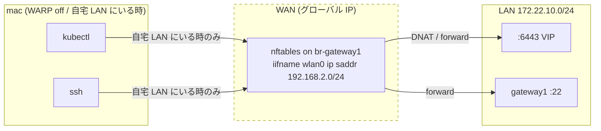

# 提案: Cloudflare WARP private network routing による kubectl / SSH 外部公開

> **この提案の位置づけ**
>
> 現状 kubectl (k3s API) と br-gateway1 SSH は **WAN port 開放 + DNAT** に頼って
> おり、自宅グローバル IP が露出している。`*.b8m.app` が既に Cloudflare Tunnel
> + Access (GitHub Org + WARP) で WAN IP 露出ゼロ運用できているので、同じ仕組み
> を **WARP private network routing** で kubectl / SSH にも広げる。
>
> Cloudflare Tunnel TCP ingress + `cloudflared access tcp` daemon 案も検討した
> が、kubeconfig や ssh config を **「LAN 内にいる時と完全同じ」** に保てるのは
> WARP private network 方式のみ。詳細は後述「採用 / 不採用」。
>
> ただし Cloudflare 側障害時に詰むのを避けるため、**WAN DNAT は廃止せず source IP
> 制限を被せて温存** する二重化方針を採る。
>
> Tunnel は既存 `br-cluster` (k3s 内 DaemonSet) には相乗りせず、**`br-external1` 上に
> 新設** する (理由は後述「Tunnel 配置」)。

## 背景・動機

### 現状の到達経路

| 経路 | 用途 | 認証 | WAN IP 露出 |
|------|------|------|-------------|
| `https://*.b8m.app` → CF Tunnel (`br-cluster`) → cluster-gateway 172.22.10.70 | grafana / prometheus / longhorn / hubble / argo / zitadel | Cloudflare Access (GitHub Org + WARP) → Zitadel OIDC | なし ✅ |
| `https://k8s-api…:6443` (LAN) | kubectl from 172.22.10.0/24 | k3s mTLS (kubeconfig) | なし |
| **WAN tcp/6443 → DNAT → 172.22.10.60:6443** | kubectl from mac (192.168.2.0/24) | k3s mTLS のみ | **あり ❌** |
| **WAN tcp/22 → forward → 172.22.10.0/24:22** | SSH to br-gateway1 / nodes | SSH 鍵 | **あり ❌** |

### 何が困っているか

- mac (192.168.2.0/24) が自宅 LAN の外に出ると kubectl / SSH が一切使えない
- WAN port 22 / 6443 を Source ANY で開けているので、グローバル IP がスキャン対象
  になる
- 一方で WAN 側の DNAT を完全に閉じると、Cloudflare 障害時に kubectl で復旧操作
  できなくなる

### 既存資産でカバーできるところ

- **Cloudflare Zero Trust** (`bright-room.cloudflareaccess.com`)
  - IdP: GitHub OAuth、device posture: WARP 起動チェック
  - WARP は既に mac に enroll 済み (`*.b8m.app` 利用のため)
- **`cloudflared` バイナリ**: 既に k3s 内で稼働中、systemd 版を別ホストに足すだけ
- **既存内部 DNS**: `cluster-internal.bright-room.net` ゾーンが gateway1 の CoreDNS で配信中

→ **新規導入ゼロ**。Ansible で external1 に cloudflared systemd 追加 + CF Dash で
private network route と Gateway Network Policy 設定 + WARP Device Profile 調整
+ nftables 微修正で実現できる。

## ゴール / 非ゴール

| | 内容 |
|---|------|
| ゴール | (1) mac (任意のネットワーク) から kubectl / SSH を Cloudflare 認証越しで叩ける。(2) WAN グローバル IP を実質的に露出しない (LAN フォールバックのみ残す)。(3) Cloudflare 障害時のフォールバック経路を維持。(4) k3s / br-gateway1 の障害時にも復旧用 SSH/kubectl が機能する。(5) **kubeconfig / ssh config は LAN 内利用時と同一** に保つ (cluster-internal hostname 直叩き) |
| 非ゴール | (1) Tailscale / WireGuard 等 別 VPN の導入 (将来の独立フォールバック案として記録のみ)。(2) br-node1〜6 個別 SSH の特別対応 (gateway1 経由 ProxyJump で十分)。(3) k3s API クライアント証明書の発行手順変更 |

## 採用 / 不採用 / 理由

### 接続方式 (重要論点)

| 候補 | 採否 | 理由 |
|------|------|------|
| **(E) WARP private network routing** (採用) | ✅ | (1) kubeconfig/ssh config は cluster-internal hostname 直叩き、`tls-server-name` 上書きや `ProxyCommand` 不要。(2) `cluster-external` の新規ドメイン不要 (内部名のまま外から到達)。(3) クライアント側 daemon 常駐不要、launchd plist 不要。(4) WARP は既に mac で稼働中 |
| (A) TCP ingress + `cloudflared access tcp` daemon | ❌ | kubectl は `localhost:6443` 向けの kubeconfig + launchd 常駐が必要。`tls-server-name` を override する追加設定。「LAN 内 vs 外で kubeconfig が変わる」が発生 |
| (B) TCP ingress + on-demand wrapper | ❌ | 起動レイテンシ毎回、競合リスク |

### Tunnel 配置

| 候補 | 採否 | 理由 |
|------|------|------|
| 既存 `br-cluster` Tunnel に相乗り (k3s DaemonSet) | ❌ | **k3s が落ちると tunnel も落ちる**。本提案の主用途のひとつが「k3s 障害時の復旧 kubectl」であり、復旧対象と同じ場所に復旧経路を置くのは循環依存 |
| **新 Tunnel `br-infra` を `br-external1` に systemd で立てる** | ✅ | (1) k3s と独立: cluster 障害時も生存。(2) gateway1 と独立: gateway1 障害時の SSH 復旧経路として機能。(3) external1 はもともと「クラスタ外の補助ホスト」枠で、infra tunnel の責務がここに集約されるのが自然 |
| 新 Tunnel を `br-gateway1` に systemd で立てる | ❌ | gateway1 は既に nftables / DHCP / DNS / etcd / CoreDNS と責務過多。さらに `gateway1 自身への SSH 経路` を gateway1 上の cloudflared に依存させると **gateway1 障害時に同時に死ぬ循環依存** が発生する |

### その他の論点

| 論点 | 採用 | 理由 |
|------|------|------|
| 認可 | **CF Gateway Network Policy** (CIDR `172.22.10.0/24` への到達を GitHub Org + WARP + device posture で gate) | WARP private network はホスト名単位の Access Application ではなく、CIDR/port 単位の Gateway Policy で認可するモデル。selector に GitHub Org / WARP / device posture が使えるので考え方は既存 `allow_github_warp` と同等 |
| 内部 DNS 解決 | **WARP Device Profile の Local Domain Fallback で `cluster-internal.bright-room.net` → 172.22.10.1 (gateway1 CoreDNS) に forward** | mac から `k8s-api.cluster-internal…` を解決させるため。これがないと private network route が IP 直打ちでしか機能しない |
| WAN DNAT 扱い | **削除せず Source IP 制限を被せて温存** | Cloudflare 障害 / WARP 不調時に kubectl で復旧できる経路を残す。Source を `192.168.2.0/24` (自宅 LAN) のみに絞れば WAN scan からは reject |
| Source 制限の判定箇所 | **nftables forward / input の `iifname $wan_interface` 行に `ip saddr` 条件を追加** | DNAT 自体は残し、forward 段で絞る。NAT prerouting に saddr 条件を入れると返り経路でハマるので forward filter で落とすのがセオリー |
| credentials 保管 | **1Password CLI で external1 に直接配布** (Ansible が lookup) | external1 は k3s 外。既存の 1Password CLI ベースの secret 配布パターンに乗せる |
| 観測性 | cloudflared の Prometheus exporter (systemd unit に metrics endpoint) + Gateway audit log | 既存 `prometheus-node-exporter` パターンに揃える |
| `cluster-external.bright-room.net` 新設 | **しない** | (E) では不要。kubectl/SSH は cluster-internal 名を直接使う |

## 構成図

### 全体フロー (WARP on)



### フォールバック (Cloudflare / WARP 障害時)



ポイント: **WAN 側 nftables は「自宅 LAN (192.168.2.0/24) からのみ accept」** に絞る。
mac が外出中で Cloudflare も死んでいる極端ケースは諦める (該当ケースは「自宅に帰る」で解決可能)。

### 障害時の経路有効性マトリクス

| 障害シナリオ | WARP 経路 | WAN フォールバック | LAN 直接 |
|------------|----------|-------------------|---------|
| 平常時 | ✅ どこからでも (mac) | ✅ 自宅 LAN のみ (mac) | ✅ ノード間 |
| k3s クラスタ全停止 | ✅ kubectl で復旧操作可 / SSH ✅ | 同上 | — |
| br-gateway1 停止 | SSH ✅ (gateway1 自身は不可、他ノードは可)、kubectl ✅、ただし **DNS 解決停止** で Local Domain Fallback が機能せず IP 直打ち必要 | ❌ NAT 経路ごと死ぬ | ノード間は IP 直で可 |
| br-external1 停止 | ❌ tunnel ダウン | ✅ 自宅 LAN から | ✅ |
| Cloudflare 障害 | ❌ | ✅ 自宅 LAN から | ✅ |
| 完全停電 | ❌ | ❌ | ❌ |

## 実装詳細

### 1. cloudflared on br-external1 (Ansible)

`provisioner/roles/external/tasks/cloudflared.yaml` (新設) で:

- `cloudflared` apt パッケージ install (Cloudflare 公式 repo)
- `/etc/cloudflared/config.yaml`:
  ```yaml
  tunnel: ${CLOUDFLARED_BR_INFRA_TUNNEL_ID}
  credentials-file: /etc/cloudflared/credentials.json
  protocol: quic
  metrics: 127.0.0.1:2000
  no-autoupdate: true
  warp-routing:
    enabled: true
  ```
  (TCP ingress 行は不要。`warp-routing.enabled: true` で raw IP routing が有効になる)
- `credentials.json` は 1Password から `community.general.onepassword` lookup で配布 (mode 0600, owner cloudflared)
- `systemctl enable --now cloudflared.service`

### 2. CF Tunnel + Private Network route (`br-cloudflare-terraform/terraform/`)

```hcl
resource "cloudflare_zero_trust_tunnel_cloudflared" "br_infra" {
  account_id = var.account_id
  name       = "br-infra"
  config_src = "local"
}

resource "cloudflare_zero_trust_tunnel_route" "br_infra_lan" {
  account_id = var.account_id
  tunnel_id  = cloudflare_zero_trust_tunnel_cloudflared.br_infra.id
  network    = "172.22.10.0/24"
  comment    = "br-cluster LAN private network"
}
```

### 3. Gateway Network Policy (`br-cloudflare-terraform/terraform/zero_trust/`)

```hcl
resource "cloudflare_zero_trust_gateway_policy" "allow_lan_kubectl_ssh" {
  account_id  = var.account_id
  name        = "allow_br_cluster_lan"
  description = "GitHub Org + WARP + posture を満たす端末から 172.22.10.0/24 への到達を許可"
  enabled     = true
  action      = "allow"
  filters     = ["l4"]
  precedence  = 100
  traffic     = "net.dst.ip in {172.22.10.0/24}"
  identity    = "any(identity.groups.name[*] in {\"bright-room\"})"
  device_posture = "any(device_posture.checks.passed[*] in {<warp-posture-uid>})"
}
```

(具体的な式構文は CF 公式 Gateway expression doc に従って調整)

### 4. WARP Device Profile (`br-cloudflare-terraform/terraform/zero_trust/`)

既存 Device Profile に以下を追加:

- **Split Tunnel**: モード "Include IPs"、`172.22.10.0/24` を include (or "Exclude IPs" モードならそのまま)
- **Local Domain Fallback**: `cluster-internal.bright-room.net` → DNS server `172.22.10.1`

```hcl
resource "cloudflare_zero_trust_device_custom_profile" "default" {
  account_id = var.account_id
  name       = "default"
  match      = "any(identity.email[*] == \"<owner email>\")"

  include {
    address = "172.22.10.0/24"
    description = "br-cluster LAN via WARP"
  }

  fallback_domain {
    suffix      = "cluster-internal.bright-room.net"
    dns_server  = ["172.22.10.1"]
    description = "Internal CoreDNS via WARP tunnel"
  }
}
```

### 5. mac クライアント設定 — **変更不要**

これが (E) の最大の利点。

- `~/.kube/config`: 既存の `server: https://k8s-api.cluster-internal.bright-room.net:6443` のまま
- `~/.ssh/config`: 既存の `Host br-gateway1 / HostName gateway1.cluster-internal.bright-room.net` のまま、ProxyJump も無修正
- WARP を on にすれば Split Tunnel + DNS fallback で自動的に経路解決
- WARP を off にすれば自宅 LAN 直 / WAN DNAT (フォールバック) に自動で戻る

### 6. nftables の Source IP 制限 (`provisioner/inventories/base/host_vars/br-gateway1.yaml`)

現状 (抜粋):

```yaml
220 ssh from wan:
  - iifname $wan_interface oifname $lan_interface ip daddr $lan_network tcp dport ssh ct state new accept
250 k8s api from wan:
  - iifname $wan_interface oifname $lan_interface ip daddr {{ ... k8s-api ... }} tcp dport 6443 ct state new accept
```

変更案:

```yaml
220 ssh from wan (home lan only):
  - iifname $wan_interface ip saddr $home_lan_network oifname $lan_interface ip daddr $lan_network tcp dport ssh ct state new accept
250 k8s api from wan (home lan only):
  - iifname $wan_interface ip saddr $home_lan_network oifname $lan_interface ip daddr {{ ... }} tcp dport 6443 ct state new accept
```

`nft_define` に追加:

```yaml
home lan network:
  name: home_lan_network
  value: "192.168.2.0/24"
```

input 側 (WAN tcp ssh / domain) も同様に saddr 制限を被せる。
DNAT (`prerouting`) はそのまま残す — forward で落ちる構造。

### 7. external1 → cluster の到達確認

| 経路 | 既存ルール | 追加要否 |
|------|-----------|---------|
| external1 (172.22.10.50) → 任意の 172.22.10.0/24 ホスト | LAN 内 L2 直結 | 不要 |
| external1 → CF Edge (QUIC/443, 7844) | gateway1 forward `forward_tcp_accept` に https / 7844 含む | 不要 |
| external1 が代理する DNS query (mac → 172.22.10.1:53) | gateway1 input `in_tcp_accept` / `in_udp_accept` に domain 含む | 不要 |

→ **nftables 変更は WAN 側 source 制限のみ**。external1 周辺は変更なし。

## 段階導入計画

| Phase | 内容 | 完了条件 |
|-------|------|---------|
| **Phase 0** | この proposal で合意 | レビュー approval |
| **Phase 1a** | Terraform で `br-infra` Tunnel + Tunnel Route (172.22.10.0/24) + Gateway Network Policy + WARP Device Profile (Split Tunnel + Local Domain Fallback) を作成 | `terraform apply` green、CF Dash で全リソース visible、credentials を 1Password に格納 |
| **Phase 1b** | Ansible で external1 に cloudflared systemd 配備 (`warp-routing.enabled: true`)、credentials 配布 | `cloudflared tunnel info br-infra` で 4 connection active |
| **Phase 1c** | mac で WARP on にして kubectl / SSH 疎通確認 | mac WiFi を tether に切り替えても `kubectl get nodes` / `ssh br-gateway1` が通る |
| **Phase 1d** | nftables の WAN DNAT/SSH に Source IP 制限 (`192.168.2.0/24`) を被せる。Ansible apply | 自宅 LAN から WAN IP 直叩きが通る、外部から WAN port-scan で reject |
| **Phase 2** | Cloudflare Access for SSH (短期証明書 CA) 導入を別 proposal 化 | 別 proposal |
| **Phase 3** | フォールバック経路を Tailscale / WireGuard に移行検討 (Cloudflare に依存しない VPN) | 別 proposal |

Phase 2 / 3 は本 proposal のスコープ外。Phase 1 が安定してから別途切る。

## リスク・注意点

| リスク | 緩和策 |
|--------|--------|
| WARP off の状態で外出中に kubectl / SSH したくなった時に動かない | これは仕様。外出時は WARP on が前提。WARP 自体の障害は珍しいが、その場合は (Phase 1d の WAN フォールバック経路に頼れず) 諦める |
| Local Domain Fallback の DNS 解決が macOS の他のクエリと干渉 | `cluster-internal.bright-room.net` という限定 suffix なので影響範囲は閉じている。問題が出たら WARP profile 側で挙動調整 |
| `cloudflared access tcp` 不要になった反面、WARP profile 管理という新概念 | Device Profile は Terraform で IaC 化するので変更履歴は追える。学習コストは初回のみ |
| Gateway Network Policy の expression 構文ミス | `terraform plan` 時点では検出されず、適用後に WARP 経由で疎通失敗して気付くパターン。Phase 1c の疎通確認を必ず WARP on/off 両方で実施 |
| WARP 経路は CIDR 単位で開けるので、172.22.10.0/24 全体に到達可能 | Gateway Network Policy で port 制限 (`net.dst.port in {22, 6443}` 等) を後段で追加可能。Phase 1 は CIDR-only で開け、運用で必要なら絞る |
| br-gateway1 停止時に WARP 側 DNS fallback が解決失敗 | IP 直打ち (172.22.10.60:6443 / 172.22.10.10:22 等) で復旧操作可。kubeconfig に予備 context を用意しておく |
| Source IP 制限漏れで WAN 直叩きが残る | Phase 1d 完了後、外部 VPS から `nmap -p 6443,22 <wan-ip>` で reject 確認 (受け入れ基準) |
| Cloudflare 障害 + 自宅外 mac の同時発生 | 諦める (proposal 範囲外) |

## 受け入れ基準

Phase 1 完了時点で全部 green:

1. mac を tether (4G/5G) + WARP on の状態で `kubectl get nodes` が返る
2. 同状態で `ssh br-gateway1` および `ssh br-node1` (ProxyJump 経由) が成功する
3. mac で `dscacheutil -q host -a name k8s-api.cluster-internal.bright-room.net` が `172.22.10.60` を返す (Local Domain Fallback 動作確認)
4. CF Gateway audit log に WARP 経由のアクセスが記録されている
5. 外部 VPS から `nc -zv <home-wan-ip> 6443` および `... 22` が **timeout または reject**
6. mac の WARP を off にした上で自宅 LAN に居る時、`kubectl --server=https://172.22.10.60:6443 get nodes` が引き続き成功 (フォールバック経路維持)
7. external1 の `cloudflared` systemd unit が `active (running)`、`cloudflared tunnel info br-infra` で 4 connection active
8. external1 を `systemctl stop cloudflared` した時に WARP 経由 kubectl が即座に失敗、`start` で復旧することを確認

## 参考資料

- 既存 cloudflared (k3s 内) 構成: [`manifests/platform/cloudflared/app/base/configmap-br-cluster.yaml`](../../manifests/platform/cloudflared/app/base/configmap-br-cluster.yaml)
- 既存 Access Application (HTTPS 用): `br-cloudflare-terraform/terraform/zero_trust/access_applications.tf`
- nftables 現行: [`provisioner/inventories/base/host_vars/br-gateway1.yaml`](../../provisioner/inventories/base/host_vars/br-gateway1.yaml)
- ネットワーク全体: [`docs/network.md`](../network.md)
- Cloudflare Tunnel Private Network 公式: <https://developers.cloudflare.com/cloudflare-one/connections/connect-networks/private-net/cloudflared/>
- WARP Device Profile / Local Domain Fallback: <https://developers.cloudflare.com/cloudflare-one/connections/connect-devices/warp/configure-warp/route-traffic/local-domains/>
- Gateway Network Policy: <https://developers.cloudflare.com/cloudflare-one/policies/gateway/network-policies/>
- Cloudflare Access for Infrastructure (SSH 短期証明書, Phase 2 用): <https://developers.cloudflare.com/cloudflare-one/connections/connect-networks/use-cases/ssh/>
