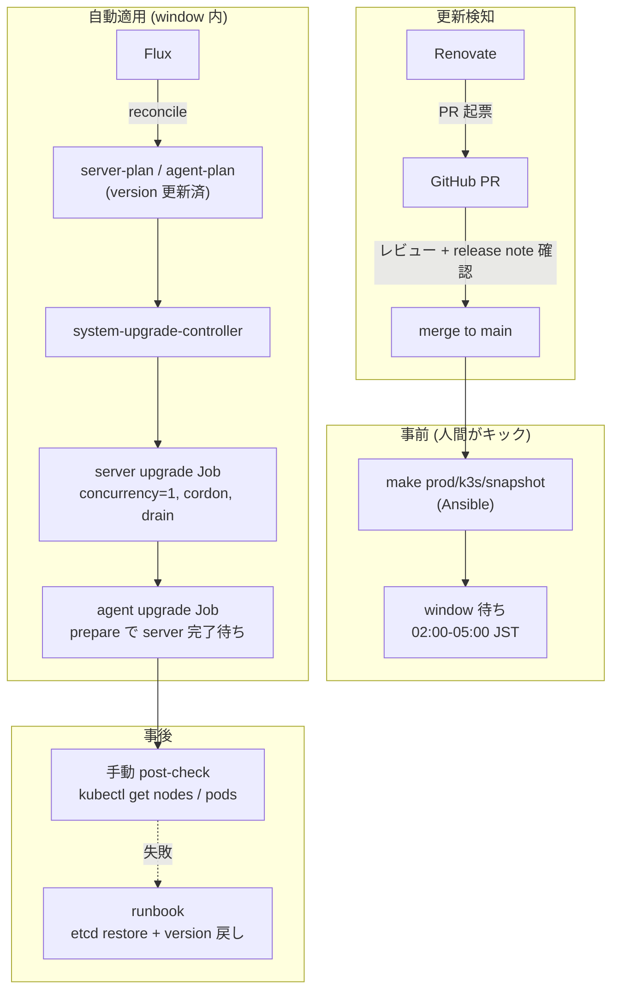

# 提案: k3s クラスタアップグレードの整備

> **この提案の位置づけ**
>
> 現状 k3s のバージョンは Ansible 変数 `versions.k3s` に手書きされ、
> アップグレードは「変数を書き換えて Ansible を流す」を全ノードに対して
> 暗黙の順序でやるしかない。Renovate も `versions.yaml` を見ていないため、
> **更新追跡 / 安全な順序で適用 / ロールバック手順** が個人の頭の中にある状態。
>
> k3s 公式が推奨する [Automated Upgrades with system-upgrade-controller](https://docs.k3s.io/upgrades/automated)
> (以下 SUC) を Flux 経由で導入し、`Plan` CRD で control-plane → worker の
> 順序 / time window / concurrency / cordon を宣言的に管理する。
> ただし etcd snapshot 取得は SUC に組み込まれていないため、
> **snapshot 取得だけ Ansible に残す** 二段構えにする。
>
> 別 proposal `ubuntu-auto-update.md` (OS パッケージ自動更新) とはスコープを
> 完全に分ける。

## 背景・動機

現状の k3s バージョン管理:

| 項目 | 状態 | 場所 |
|------|------|------|
| バージョンの SoT | `versions.k3s: "v1.35.3+k3s1"` | `provisioner/inventories/base/group_vars/all/versions.yaml:3` |
| インストール方法 | `https://get.k3s.io` を `INSTALL_K3S_VERSION` 環境変数付きで実行 | `provisioner/roles/k3s/tasks/install_master.yaml` / `install_worker.yaml` |
| 適用順序の保証 | `install_master.yaml` の secondary は `throttle: 1` で 1 台ずつ。worker は並列 | 同上 |
| Renovate での追跡 | **無し** (`versions.yaml` 用の customManager が未定義) | `renovate.json` |
| Rollback 手順 | **未文書化** | — |
| etcd snapshot 取得 | **手動** | — |
| アップグレード時のドレイン | **無し** | — |

問題点:

- 新しいパッチ版が出ても気付けない (Renovate 対象外)
- 全 CP ノードを `throttle: 1` で順番に再 install するので 1 台が失敗すると quorum 喪失リスク
- アップグレード前に etcd snapshot を取らないと rollback 時にデータ不整合
- worker は並列再 install で Pod 同時退避が起きる
- minor / major 跨ぎ時の breaking change チェックリストが無い

学習目的の homelab とはいえ、k3s が中核なので最低限の安全策と手順を整える。

## ゴール / 非ゴール

| | 内容 |
|---|------|
| ゴール | (1) **system-upgrade-controller を Flux 経由で導入** し、`Plan` CRD で server / agent の順次アップグレードを宣言的に管理。(2) **Renovate で `Plan` の `version` を追跡** し PR が自動で立つ。(3) **アップグレード前の etcd snapshot 取得** を Ansible playbook で別経路から実行できるようにする。(4) **rollback runbook** を `docs/runbooks/k3s-upgrade.md` に整備。(5) **minor upgrade チェックリスト** を runbook に明文化 |
| 非ゴール | (1) **完全自動 (channel-based)** — `version` pin で運用し PR レビューを必ず挟む。(2) k3s 周辺コンポーネント (cert-manager / Cilium / Flux 等) の更新自動化 (Renovate 既存ルールで別管理)。(3) HA control-plane を 5 台に増やす等の構成変更。(4) PR merge と同時に自動 apply (Plan は Flux で apply されるが、`window` で時間帯を絞ることで人間が観察可能な時間帯に限定) |

## 採用 / 不採用 / 理由

| 論点 | 採用 | 理由 |
|------|------|------|
| アップグレード方式 | **system-upgrade-controller (SUC)** | k3s 公式推奨。`Plan` CRD で declarative、Flux/GitOps と相性良。time window / concurrency / cordon / prepare 順序 / version skew 保護が組み込み済 |
| バージョン指定 | **`version` フィールドで pin** (channel ではない) | channel は新版が出たら **window 内で勝手に走る**。homelab では release note を読んで判断する工程を挟みたい |
| バージョン追跡 | **Renovate `customManager`** で `Plan` YAML の `version:` 行を datasource=`github-releases` (`k3s-io/k3s`) で監視 | 既存 Renovate と同じ仕組みで PR レビュー → merge → Flux が apply → SUC が window 内で実行 |
| 適用順序 | **server-plan → agent-plan** (agent plan に `prepare` で server-plan 待ち合わせ) | 公式パターン通り。CP 完了後に worker が動く |
| concurrency | **server: 1 / agent: 1** | quorum 維持 + Pod 退避を直列化 |
| cordon | **`cordon: true`** (両 Plan) | drain は SUC 既定 (k3s-upgrade image が処理) |
| time window | **`window` で 02:00-05:00 JST に限定** | 利用が無い時間帯。`ubuntu-auto-update.md` の kured (02:00-05:00) と被るが、k3s upgrade 時に Renovate 他 PR を merge しないルールで吸収 |
| etcd snapshot | **SUC ではなく Ansible で取得** (`make prod/k3s/snapshot`) | SUC は snapshot 取得を組み込んでいない。`Plan` の `prepare` に snapshot job を入れる方式もあるが、ホスト側 `k3s etcd-snapshot save` の方が単純 |
| Plan の merge トリガ | **PR merge と同時に Flux が `Plan` を apply** | window で時間帯が絞られるので深夜まで実行は始まらない。merge は人間が release note 確認後に行う |
| 配置 | `manifests/platform/system-upgrade-controller/` (新設) | 他 platform component と同列 |
| controller の deploy 方式 | **公式 `system-upgrade-controller.yaml` を kustomize で取り込み** (Helm chart 提供なし) | k3s 公式は `kubectl apply -f` 前提。`HelmRelease` 制約 (policy 1, 2) は kustomize に来ないが、ref pin (tag) は明示する |
| Rollback | **etcd snapshot restore + `Plan` の `version` を旧版に戻す** を runbook 化 | 完全自動 rollback は副作用が大きい |
| 既存 Ansible install パス | **温存** (新規プロビ / 個別ノード復旧用) | 新規ノード追加や 1 台だけ復旧する時は Ansible の方が直接的 |

### 検討したが採らなかった案

| 案 | 不採用理由 |
|---|-----------|
| **Ansible playbook で rolling upgrade 自作** (旧版の本 proposal 案) | SUC が公式・declarative・Flux 相性◎。自作は二重管理・rollback / window / version skew を全部自前実装になる |
| **SUC の `channel` で完全自動** | 新版直後に勝手に走るリスク。release note を読まずに上げて事故った時の損害が大きい。`version` pin + Renovate PR で判断工程を挟む |
| **kured で reboot 経由の upgrade** | kured は OS reboot 用。k3s バイナリ差し替えは別軸 (`ubuntu-auto-update.md` 参照) |
| **Renovate automerge で SUC `Plan` を自動更新** | k3s 中核すぎる。`automerge: false` 維持 |
| **完全手動 (現状維持)** | 動機の裏返し |
| **HelmRelease で k3s を入れる** | k3s は OS systemd サービス。Helm 管理対象外 |

## アーキテクチャ概要



## Phase 1 で動かすもの (受け入れ基準)

| # | 機能 | 検証方法 |
|---|------|---------|
| 1 | **SUC が動作** | `kubectl get pods -n system-upgrade` で controller Running、`kubectl get plans -A` で server-plan / agent-plan が見える |
| 2 | **Renovate が `Plan` の `version` を検知して PR を出す** | server-plan の `version` を 1 つ古いパッチに戻し、Renovate dry-run で PR が立つこと |
| 3 | **server → agent の順で進行** | `kubectl get jobs -n system-upgrade -w` で server-plan の Job が完了してから agent-plan の Job が起動 |
| 4 | **concurrency=1 が効く** | 同一 Plan 内で複数ノード Job が同時に走らない |
| 5 | **window が効く** | window 外で `Plan` を更新しても upgrade が走らず、次の window で開始 |
| 6 | **`make prod/k3s/snapshot` が全 CP で snapshot を取る** | `/var/lib/rancher/k3s/server/db/snapshots/` に当日のスナップショットが 3 ノード分 |
| 7 | **rollback runbook が手順通り動く** | 任意 1 worker で 1 つ古いパッチに戻す手順を実機で実行 |
| 8 | **既存 `setup_node` / `bootstrap_cluster` が壊れていない** | `make prod/provision/lint` 通過、新規プロビジョン経路で同じ k3s 版が入る |

## 段階導入計画

| Phase | 内容 | 完了条件 |
|-------|------|---------|
| **Phase 0** | この proposal で合意 | レビュー approval |
| **Phase 1** | SUC を Flux で導入 + `Plan` 2 本 + Renovate customManager + snapshot 用 Ansible playbook + runbook | 受け入れ基準 1〜8 |
| **Phase 2** | 1〜2 回のパッチ更新を実機で回し、運用フォロー (実所要時間 / 障害有無 / window 設定の妥当性) | 別 PR (proposal 不要) |
| **Phase 3** | minor 跨ぎを 1 回経験 → チェックリスト拡充。channel-based に切り替えるかの判断 | 別 PR or proposal |

## Phase 1 の運用フォロー (2026-05-30 目安)

Phase 1 を merge し、最初のパッチ更新を回してから 4 週間後を目安に振り返る。

### 振り返り項目

| 項目 | 確認方法 |
|------|---------|
| 1 ノードあたりの所要時間 | `kubectl get jobs -n system-upgrade` の completion time |
| アップグレード中の Pod 影響 | Loki で対象時間帯のエラー率、Longhorn rebuild 履歴 |
| etcd snapshot サイズ | `du -sh /var/lib/rancher/k3s/server/db/snapshots/` |
| API / Cilium / kube-vip の挙動 | アップグレード中の `kubectl get nodes` の Ready ↔ NotReady 遷移 |
| window の妥当性 | window 内に server + agent が完了するか (Pi 6 ノードで 3h 余裕があるか) |
| controller のリソース消費 | `kubectl top pod -n system-upgrade` |

### Phase 3 (channel-based 化) 着手判断の閾値 (目安)

| 状況 | 判断 |
|------|------|
| Phase 1〜2 で安定 + minor 跨ぎを 1 回 release note 読まずに済んでいる感覚 | 引き続き `version` pin (channel には切り替えない) |
| パッチ更新が安定運用できていて release note 確認も毎回問題なし | channel-based を **検討**、別 proposal で議論 |
| 不安定 / 事故あり | `version` pin 維持、原因対処を優先 |

## 構成要素 (Phase 1)

### (A) Manifests: `manifests/platform/system-upgrade-controller/`

```text
manifests/platform/system-upgrade-controller/
├── kustomization.yaml
├── namespace.yaml                        # system-upgrade
├── controller.yaml                       # 公式 system-upgrade-controller.yaml を ref tag で取り込み
├── crd.yaml                              # 公式 crd.yaml を ref tag で取り込み
├── server-plan.yaml                      # control-plane 向け Plan
└── agent-plan.yaml                       # worker 向け Plan
```

`clusters/prod/platform/kustomization.yaml` にエントリ追加 (CLAUDE.md 規約)。

#### controller / crd の取り込み方

公式は Helm chart を提供していないため、kustomize の `resources:` で
GitHub release の生 YAML を tag pin で参照する:

```yaml
# kustomization.yaml
resources:
  - https://github.com/rancher/system-upgrade-controller/releases/download/v0.16.0/crd.yaml
  - https://github.com/rancher/system-upgrade-controller/releases/download/v0.16.0/system-upgrade-controller.yaml
  - namespace.yaml
  - server-plan.yaml
  - agent-plan.yaml
```

policy 1, 2 (HelmRelease pin) の対象外だが、tag pin は厳守。Renovate の
`kustomize` manager で追跡される想定 (既存 `renovate.json` の `kustomize` 設定が効く)。

#### `server-plan.yaml` (要点)

```yaml
apiVersion: upgrade.cattle.io/v1
kind: Plan
metadata:
  name: server-plan
  namespace: system-upgrade
spec:
  concurrency: 1
  cordon: true
  nodeSelector:
    matchExpressions:
      - { key: node-role.kubernetes.io/control-plane, operator: In, values: ["true"] }
  serviceAccountName: system-upgrade
  # renovate: datasource=github-releases depName=k3s-io/k3s versioning=loose
  version: "v1.35.3+k3s1"
  upgrade:
    image: rancher/k3s-upgrade
  window:
    days: [monday, tuesday, wednesday, thursday, friday, saturday, sunday]
    startTime: "02:00"
    endTime:   "05:00"
    timeZone:  "Asia/Tokyo"
```

#### `agent-plan.yaml` (要点)

```yaml
apiVersion: upgrade.cattle.io/v1
kind: Plan
metadata:
  name: agent-plan
  namespace: system-upgrade
spec:
  concurrency: 1
  cordon: true
  nodeSelector:
    matchExpressions:
      - { key: node-role.kubernetes.io/control-plane, operator: DoesNotExist }
  serviceAccountName: system-upgrade
  # renovate: datasource=github-releases depName=k3s-io/k3s versioning=loose
  version: "v1.35.3+k3s1"
  prepare:
    image: rancher/k3s-upgrade
    args: [prepare, server-plan]
  upgrade:
    image: rancher/k3s-upgrade
  window:
    days: [monday, tuesday, wednesday, thursday, friday, saturday, sunday]
    startTime: "02:00"
    endTime:   "05:00"
    timeZone:  "Asia/Tokyo"
```

`prepare` で `server-plan` 完了を待つのが公式パターン。

### (B) Renovate: `Plan` の `version` 用 customManager

`renovate.json` に追記:

```json
{
  "customManagers": [
    {
      "customType": "regex",
      "managerFilePatterns": [
        "/manifests/platform/system-upgrade-controller/.+-plan\\.ya?ml$/"
      ],
      "matchStrings": [
        "# renovate: datasource=(?<datasource>.*?) depName=(?<depName>.*?)( versioning=(?<versioning>.*?))?\\n\\s*version:\\s*\"(?<currentValue>.*?)\""
      ],
      "versioningTemplate": "{{#if versioning}}{{versioning}}{{else}}loose{{/if}}"
    }
  ]
}
```

server-plan と agent-plan が **同じ version で同期** されるよう、Renovate の
`groupName` で 1 PR にまとめる:

```json
{
  "matchPackageNames": ["k3s-io/k3s"],
  "groupName": "k3s"
}
```

### (C) Ansible: snapshot 取得 playbook

```text
provisioner/playbooks/k3s_snapshot.yaml         # 新規
provisioner/roles/k3s/tasks/etcd_snapshot.yaml  # 新規
```

`k3s_snapshot.yaml`:

```yaml
- name: Take etcd snapshot on all CP nodes
  hosts: master
  serial: 1
  become: true
  tasks:
    - name: k3s etcd-snapshot save
      command: k3s etcd-snapshot save --name pre-upgrade-{{ ansible_date_time.iso8601_basic_short }}
```

### (D) Make ターゲット

`Makefile` に追加:

```makefile
prod/k3s/snapshot:
	uv run cluster-forge ansible prod -- \
	  ansible-playbook playbooks/k3s_snapshot.yaml
```

(既存 `make {env}/...` 規約に合わせる、CLAUDE.md)

### (E) `versions.yaml` との関係

- `versions.yaml` の `versions.k3s` は **新規プロビジョンのみ** で使われる扱いに変える
- アップグレードの SoT は `manifests/platform/system-upgrade-controller/{server,agent}-plan.yaml` の `version`
- 両者がズレないよう、`versions.yaml` の k3s 行も Renovate で同じ `groupName: k3s` に乗せる
- どちらも更新する PR を Renovate がまとめて作る想定

### (F) Runbook

`docs/runbooks/k3s-upgrade.md` 新規:

- 通常手順:
  1. Renovate PR (k3s グループ) のレビュー (release note を確認)
  2. `make prod/k3s/snapshot` で事前 snapshot
  3. PR merge → Flux が `Plan` を apply
  4. window (02:00-05:00 JST) 内に SUC が server → agent の順で実行
  5. 翌朝に `kubectl get nodes` / `kubectl get pods -A` で post-check
- minor upgrade チェックリスト (release note の breaking、CRD 変更、kubelet skew、Cilium 互換、Flux 互換、Longhorn 互換)
- Rollback 手順:
  1. `Plan` の `version` を旧版に戻す PR を出す (k3s-upgrade image は downgrade を拒否するので、SUC 経由では戻らない点に注意)
  2. SUC で戻せない場合は **Ansible で旧版を再 install** + 必要なら etcd snapshot restore (`k3s server --cluster-reset --cluster-reset-restore-path=<snapshot>`)
- 個別ノード復旧 (1 台だけ古いまま残った場合 / cordon が外れない場合)
- API 不通時の障害対応フロー (kube-vip / Cilium 起因の切り分け含む)
- SUC のセキュリティ前提 (Job が host IPC/NET/PID + `CAP_SYS_BOOT` で動くこと)

`docs/README.md` の運用セクションにリンク追加。

## 期待効果

- **更新の取りこぼしが無くなる** — Renovate が PR を立てる
- **アップグレードが宣言的** — `Plan` を見れば現在の target が分かる
- **適用順序 / window / drain が公式実装** — 自作の order / drain ロジックを保守しなくて済む
- **rollback が再現できる** — etcd snapshot + runbook
- **Ansible 経路は新規プロビ / 個別復旧で温存** — 役割分担が明確

## リスク・注意

| リスク | 対処 |
|--------|------|
| **SUC controller が動かないと upgrade も止まる** | controller が落ちる程度では in-flight の Job は完走する (Job は host namespace で動く)。controller 自体は Flux が再 reconcile |
| **k3s-upgrade image が downgrade を拒否** | `Plan` の `version` を戻しても SUC では戻せない。rollback は Ansible 経由 + snapshot restore (runbook 化) |
| **drain が PDB で詰まる** | k3s-upgrade image の drain 設定は限定的。詰まったら Pod を手動退避 → Job 再実行 |
| **primary CP の upgrade で kube-vip リーダーが移らず API 断** | concurrency=1 で 1 台ずつ、kube-vip のリーダー選出に任せる。実機で初回 upgrade 試験 |
| **secondary CP 1 台目で失敗すると quorum 2/3 → 0/3 に近づく** | concurrency=1 厳守 + 失敗時は Job が cordon を残す → window 終了で停止 → 翌朝に runbook 対応 |
| **worker drain で Longhorn replica が同時退避** | concurrency=1 で 1 台ずつ。Longhorn `nodeDownPodDeletionPolicy: do-nothing` 前提 (`docs/platform/storage.md`) |
| **kubelet ↔ apiserver の skew (k3s minor 跨ぎ)** | k3s 公式: "ensure plan does not skip intermediate minor versions"。Renovate PR レビュー時に必ず確認、minor は 1 段ずつ |
| **`window` に終わらない場合の挙動** | 公式: window 内に作られた Job は window 終了後も走り続ける。Pi 6 ノードなら 3h 余裕の想定だが Phase 2 で実測 |
| **etcd snapshot を取り忘れて merge** | runbook の通常手順で先に `make prod/k3s/snapshot` を踏む。将来は Plan の `prepare` に snapshot job を組み込む余地 |
| **SUC Job のセキュリティ** | host IPC/NET/PID + `CAP_SYS_BOOT` + `/host` rw。`system-upgrade` namespace を `policies/exceptions.rego` 等で隔離 (今は無いが Phase 2 で必要なら追加) |
| **アップグレード中に Renovate が他の HelmRelease PR を merge** | 運用ルール: k3s upgrade window の前後 24h は他の PR を merge しない (runbook 明記) |

## 作業範囲 (Phase 1)

- Manifests
  - `manifests/platform/system-upgrade-controller/` 新規 (上記 (A))
  - `clusters/prod/platform/kustomization.yaml` にエントリ追加
- Renovate
  - `renovate.json` に customManager 追記 ((B))
  - `versions.yaml` の `k3s:` 行も同じ `groupName` に乗せる調整
- Ansible
  - `provisioner/playbooks/k3s_snapshot.yaml` 新規
  - `provisioner/roles/k3s/tasks/etcd_snapshot.yaml` 新規
  - 既存 `install_master.yaml` / `install_worker.yaml` は触らない
- Makefile
  - `prod/k3s/snapshot` ターゲット追加
- 検証
  - `make prod/provision/lint` / `make policy/test` 通過
  - SUC を一旦 deploy → 任意 1 worker で patch upgrade を実機試行 (Phase 1 完了の必須条件)
  - server-plan / agent-plan の順序、concurrency=1、window が効くことを実機確認
- ドキュメント (実装後)
  - `docs/runbooks/k3s-upgrade.md` 新規
  - `docs/README.md` の運用セクションにリンク追加
  - `CLAUDE.md` の「非自明な設計判断」表に「k3s upgrade は SUC + window、snapshot は Ansible」を追記

## 未決事項 / 要確認

- SUC のバージョン (Phase 1 着手時に最新 stable を tag pin、`v0.16.0` は仮)
- Renovate の `versioning` (`loose` で `vX.Y.Z+k3sN` を扱えるか dry-run で確認、ダメなら `regex` versioning に切替)
- `version` pin と `versions.yaml` の同期を Renovate の `groupName` でまとめられるか dry-run 確認
- window を 02:00-05:00 にするか (kured と被るがほぼ不問の想定)
- minor 跨ぎ時の手順 — Plan の `version` を 1 minor ずつ段階更新する運用ルール
- `prepare` 段階に etcd snapshot job を組み込む案 (Phase 2 で再検討)
- `system-upgrade` namespace のセキュリティ境界 (Phase 2 で必要なら policy 追加)
- channel-based に切り替える場合の判断基準 (Phase 3)

## 更新履歴

- 2026-04-30 初版 (Ansible 自作 rolling 案で書き始めたが、k3s 公式 [Automated Upgrades](https://docs.k3s.io/upgrades/automated) を再評価し SUC 採用に切替)
