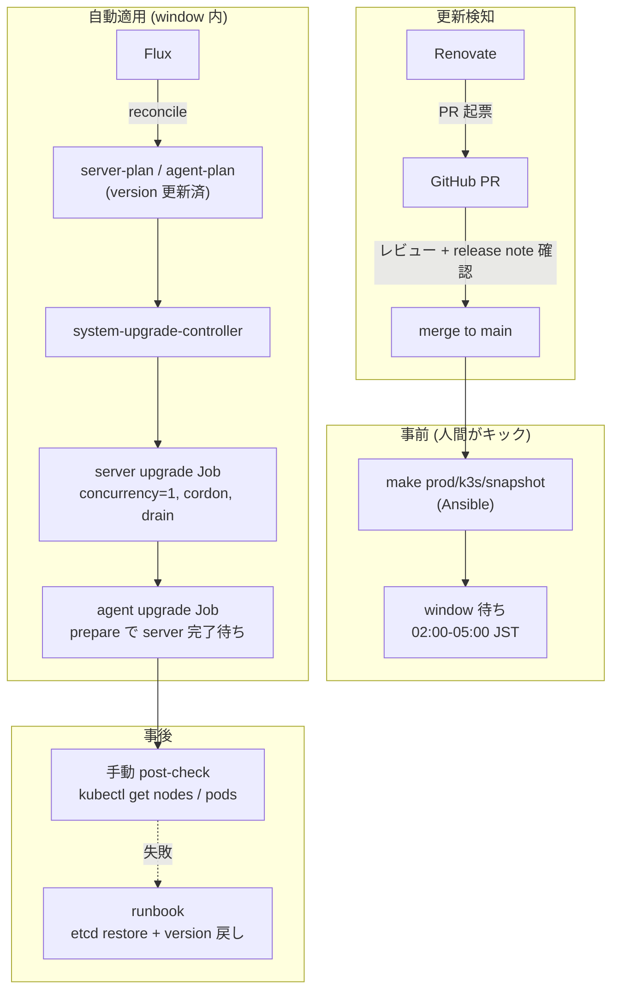

# 提案: k3s クラスタアップグレードの整備

> **この提案の位置づけ**
>
> 現状 k3s のバージョンは Ansible 変数 `versions.k3s` に手書きされ、
> アップグレードは「変数を書き換えて Ansible を流す」を全ノードに対して
> 暗黙の順序でやるしかない。Renovate も `versions.yaml` を見ていないため、
> **更新追跡 / 安全な順序で適用 / ロールバック手順** が個人の頭の中にある状態。
>
> k3s 公式が推奨する [Automated Upgrades with system-upgrade-controller](https://docs.k3s.io/upgrades/automated)
> (以下 SUC) を Flux 経由で導入し、`Plan` CRD で control-plane → worker の
> 順序 / time window / concurrency / cordon を宣言的に管理する。
> ただし etcd snapshot 取得は SUC に組み込まれていないため、
> **snapshot 取得だけ Ansible に残す** 二段構えにする。
>
> 別 proposal `ubuntu-auto-update.md` (OS パッケージ自動更新) とはスコープを
> 完全に分ける。
>
> また、**provisioner (Ansible) 領域の作業 — etcd snapshot playbook / Make
> ターゲット / `versions.yaml` 同期 — は別 proposal に切り出す**。本 proposal
> は manifests + Renovate + runbook の k8s 側完結スコープに絞る。

## 背景・動機

現状の k3s バージョン管理:

| 項目 | 状態 | 場所 |
|------|------|------|
| バージョンの SoT | `versions.k3s: "v1.35.3+k3s1"` | `provisioner/inventories/base/group_vars/all/versions.yaml:3` |
| インストール方法 | `https://get.k3s.io` を `INSTALL_K3S_VERSION` 環境変数付きで実行 | `provisioner/roles/k3s/tasks/install_master.yaml` / `install_worker.yaml` |
| 適用順序の保証 | `install_master.yaml` の secondary は `throttle: 1` で 1 台ずつ。worker は並列 | 同上 |
| Renovate での追跡 | **無し** (`versions.yaml` 用の customManager が未定義) | `renovate.json` |
| Rollback 手順 | **未文書化** | — |
| etcd snapshot 取得 | **手動** | — |
| アップグレード時のドレイン | **無し** | — |

問題点:

- 新しいパッチ版が出ても気付けない (Renovate 対象外)
- 全 CP ノードを `throttle: 1` で順番に再 install するので 1 台が失敗すると quorum 喪失リスク
- アップグレード前に etcd snapshot を取らないと rollback 時にデータ不整合
- worker は並列再 install で Pod 同時退避が起きる
- minor / major 跨ぎ時の breaking change チェックリストが無い

学習目的の homelab とはいえ、k3s が中核なので最低限の安全策と手順を整える。

## ゴール / 非ゴール

| | 内容 |
|---|------|
| ゴール | (1) **system-upgrade-controller を Flux 経由で導入** し、`Plan` CRD で server / agent の順次アップグレードを宣言的に管理。(2) **Renovate で `Plan` の `version` を追跡** し PR が自動で立つ。(3) **rollback runbook** を `docs/runbooks/k3s-upgrade.md` に整備。(4) **minor upgrade チェックリスト** を runbook に明文化 |
| 非ゴール | (1) **完全自動 (channel-based)** — `version` pin で運用し PR レビューを必ず挟む。(2) k3s 周辺コンポーネント (cert-manager / Cilium / Flux 等) の更新自動化 (Renovate 既存ルールで別管理)。(3) HA control-plane を 5 台に増やす等の構成変更。(4) PR merge と同時に自動 apply (Plan は Flux で apply されるが、`window` で時間帯を絞ることで人間が観察可能な時間帯に限定)。(5) **provisioner (Ansible) 領域の作業** — etcd snapshot playbook / `make prod/k3s/snapshot` / `versions.yaml` との同期 — は別 proposal で扱う |

## 採用 / 不採用 / 理由

| 論点 | 採用 | 理由 |
|------|------|------|
| アップグレード方式 | **system-upgrade-controller (SUC)** | k3s 公式推奨。`Plan` CRD で declarative、Flux/GitOps と相性良。time window / concurrency / cordon / prepare 順序 / version skew 保護が組み込み済 |
| バージョン指定 | **`version` フィールドで pin** (channel ではない) | channel は新版が出たら **window 内で勝手に走る**。homelab では release note を読んで判断する工程を挟みたい |
| バージョン追跡 | **Renovate `customManager`** で **(a) `Plan` YAML の `version:` 行** を datasource=`github-releases` (`k3s-io/k3s`) で監視、**(b) `base/kustomization.yaml` の release-asset URL** を `rancher/system-upgrade-controller` で監視 | Renovate の `kustomize` manager は Git ref 形式 (`?ref=<tag>`) しか自動検知しない。release asset URL 形式は customManager regex でしか拾えないため、Plan version と同じ customManager にまとめる |
| 適用順序 | **server-plan → agent-plan** (agent plan に `prepare` で server-plan 待ち合わせ) | 公式パターン通り。CP 完了後に worker が動く |
| concurrency | **server: 1 / agent: 1** | quorum 維持 + Pod 退避を直列化 |
| cordon | **`cordon: true`** (両 Plan) | drain は SUC 既定 (k3s-upgrade image が処理) |
| time window | **`window` で 02:00-05:00 JST に限定** | 利用が無い時間帯。`ubuntu-auto-update.md` の kured (02:00-05:00) と被るが、k3s upgrade 時に Renovate 他 PR を merge しないルールで吸収 |
| etcd snapshot | **SUC ではなく Ansible で取得** (`make prod/k3s/snapshot`) | SUC は snapshot 取得を組み込んでいない。`Plan` の `prepare` に snapshot job を入れる方式もあるが、ホスト側 `k3s etcd-snapshot save` の方が単純。**実装は別 proposal (provisioner 領域)** |
| Plan の merge トリガ | **PR merge と同時に Flux が `Plan` を apply** | window で時間帯が絞られるので深夜まで実行は始まらない。merge は人間が release note 確認後に行う |
| 配置 | `manifests/platform/system-upgrade-controller/` (新設) | 他 platform component と同列 |
| controller の deploy 方式 | **公式 `system-upgrade-controller.yaml` を kustomize で取り込み** (Helm chart 提供なし) | k3s 公式は `kubectl apply -f` 前提。`HelmRelease` 制約 (policy 1, 2) は kustomize に来ないが、ref pin (tag) は明示する |
| Rollback | **etcd snapshot restore + `Plan` の `version` を旧版に戻す** を runbook 化 | 完全自動 rollback は副作用が大きい |
| 既存 Ansible install パス | **温存** (新規プロビ / 個別ノード復旧用) | 新規ノード追加や 1 台だけ復旧する時は Ansible の方が直接的 |

### 検討したが採らなかった案

| 案 | 不採用理由 |
|---|-----------|
| **Ansible playbook で rolling upgrade 自作** (旧版の本 proposal 案) | SUC が公式・declarative・Flux 相性◎。自作は二重管理・rollback / window / version skew を全部自前実装になる |
| **SUC の `channel` で完全自動** | 新版直後に勝手に走るリスク。release note を読まずに上げて事故った時の損害が大きい。`version` pin + Renovate PR で判断工程を挟む |
| **kured で reboot 経由の upgrade** | kured は OS reboot 用。k3s バイナリ差し替えは別軸 (`ubuntu-auto-update.md` 参照) |
| **Renovate automerge で SUC `Plan` を自動更新** | k3s 中核すぎる。`automerge: false` 維持 |
| **完全手動 (現状維持)** | 動機の裏返し |
| **HelmRelease で k3s を入れる** | k3s は OS systemd サービス。Helm 管理対象外 |
| **`upgrade.image` のタグに k3s バージョンを埋め込んで Renovate docker manager で自動検知** | customManager を書かずに済むが、`rancher/k3s-upgrade` のタグが k3s release と同期しているという暗黙依存に乗る形になる。k3s 中核なのでこの依存は避け、`# renovate:` コメント + customManager regex で k3s release を直接 datasource にする (proposal 案 (B)) |

## アーキテクチャ概要



## Phase 1 で動かすもの (受け入れ基準)

Phase 1 は 1a / 1b に分割する。**1a が本 proposal の実装スコープ**、1b は provisioner 別 proposal の決着後に着地する。

### Phase 1a (本 proposal でやり切る範囲)

| # | 機能 | 検証方法 | 状況 |
|---|------|---------|------|
| 1 | **SUC が動作** | `kubectl get pods -n system-upgrade` で controller Running、`kubectl get plans -A` で server-plan / agent-plan が見える | ✅ PR1/2 で確認 |
| 2 | **Renovate が `Plan` の `version` を検知して PR を出す** | PR3 merge 後、次の Renovate run で k3s 新版への bump PR が `groupName: k3s` で起票されること | ⏳ 起票待ち (土曜 9am or 手動 trigger) |
| 3 | **テスト worker 1 台で patch upgrade が走る** | nodeSelector を `kubernetes.io/hostname=br-node5` に絞った状態で、Renovate 経由 (or 手動) で `version` を 1 段上げて Job が走り完了 | △ no-op Job 実走確認済、本物の patch は #2 の Renovate PR merge 時に達成見込み |
| 4 | **concurrency=1 が効く** | Job 構造で複数 Job が同時起動しないこと (Phase 1a は 1 ノード限定なので並列衝突は未観察、Phase 1b で実観察) | ✅ Job 構造で確認 |
| 5 | **prepare による server → agent 待ち合わせが機能** | server-plan の Job 完了後に agent-plan の prepare Job が走ることを `kubectl get jobs -n system-upgrade -w` で確認 | ✅ PR2 reconcile 時に server 完了 17:42:05 → agent 完了 17:42:16 で順序確認 |
| 6 | **rollback runbook (snapshot 抜きの手順) が手順通り動く** | k3s-upgrade image が downgrade を拒否することの記述 + Ansible 経由戻しの手順記述 | ✅ PR4 で記述 |

### Phase 1b (manifests 側を本 PR で着地、provisioner 側は別 proposal 継続)

| # | 機能 | 検証方法 | 状況 |
|---|------|---------|------|
| 7 | **nodeSelector を本番並びに解放** | server-plan = `node-role.kubernetes.io/control-plane In ["true"]`、agent-plan = 同 `DoesNotExist` に切替、prod CP 3 台 + worker 3 台で初回 upgrade | ✅ manifest 着地 (実 upgrade は人間判断で別途) |
| 8 | **`window` を 02:00-05:00 JST に絞る** | window 外で `Plan` を更新しても upgrade が走らず、次の window で開始 | ✅ manifest 着地 |
| 9 | **`make prod/k3s/snapshot` が全 CP で snapshot を取る** | `/var/lib/rancher/k3s/server/db/snapshots/` に当日のスナップショットが 3 ノード分 | ⏳ provisioner 別 proposal。当面は k3s 組み込み自動 snapshot (12h) をベースラインに使う (`kubectl get etcdsnapshotfile` で確認) |
| 10 | **rollback runbook (snapshot あり) が手順通り動く** | 事前 snapshot → upgrade → snapshot restore 経路を実機で 1 周 | ✅ runbook 整備 (自動 snapshot を restore 元に利用)。実機 1 周は未実施 |
| 11 | **既存 `setup_node` / `bootstrap_cluster` が壊れていない** | `make prod/provision/lint` 通過、新規プロビジョン経路で同じ k3s 版が入る | ⏳ provisioner 別 proposal |

## 段階導入計画

| Phase | 内容 | 完了条件 | 状況 |
|-------|------|---------|------|
| **Phase 0** | この proposal で合意 | レビュー approval | ✅ |
| **Phase 1a** | SUC を Flux で導入 + `Plan` 2 本 (テスト worker 限定 nodeSelector、`window` は動作確認のため広め) + Renovate customManager + 限定 runbook (snapshot 抜き) | 受け入れ基準 1〜6 | ✅ 着地 (PR1〜4 / `#232`〜`#235`)、Renovate 起票待ちのみ残 |
| **Phase 1b** | nodeSelector 本番並び + `window` 02:00-05:00 JST + runbook 完成 (snapshot は k3s 自動取得をベースラインに利用)。provisioner 側 (`make prod/k3s/snapshot` / `versions.yaml` 同期 = #9 / #11) は別 proposal で継続 | 受け入れ基準 7・8・10 (manifests/runbook) | ✅ manifests 着地 (#9・#11 は provisioner 別 proposal 継続) |
| **Phase 2** | 1〜2 回のパッチ更新を実機で回し、運用フォロー (実所要時間 / 障害有無 / window 設定の妥当性) | 別 PR (proposal 不要) | — |
| **Phase 3** | minor 跨ぎを 1 回経験 → チェックリスト拡充。channel-based に切り替えるかの判断 | 別 PR or proposal | — |

## Phase 1 の運用フォロー (2026-05-30 目安)

Phase 1 を merge し、最初のパッチ更新を回してから 4 週間後を目安に振り返る。

### 振り返り項目

| 項目 | 確認方法 |
|------|---------|
| 1 ノードあたりの所要時間 | `kubectl get jobs -n system-upgrade` の completion time |
| アップグレード中の Pod 影響 | Loki で対象時間帯のエラー率、Longhorn rebuild 履歴 |
| etcd snapshot サイズ | `du -sh /var/lib/rancher/k3s/server/db/snapshots/` |
| API / Cilium / kube-vip の挙動 | アップグレード中の `kubectl get nodes` の Ready ↔ NotReady 遷移 |
| window の妥当性 | window 内に server + agent が完了するか (Pi 6 ノードで 3h 余裕があるか) |
| controller のリソース消費 | `kubectl top pod -n system-upgrade` |

### Phase 3 (channel-based 化) 着手判断の閾値 (目安)

| 状況 | 判断 |
|------|------|
| Phase 1〜2 で安定 + minor 跨ぎを 1 回 release note 読まずに済んでいる感覚 | 引き続き `version` pin (channel には切り替えない) |
| パッチ更新が安定運用できていて release note 確認も毎回問題なし | channel-based を **検討**、別 proposal で議論 |
| 不安定 / 事故あり | `version` pin 維持、原因対処を優先 |

## 構成要素 (Phase 1)

### (A) Manifests: `manifests/platform/system-upgrade-controller/`

本リポは `manifests/platform/<name>/{app,...}/overlays/{base,prod}` 構造 +
`manifests/clusters/prod/platform/<name>-app.yaml` で Flux `Kustomization`
を別ファイルに切る規約 (`manifests/platform/cert-manager/` および
`manifests/clusters/prod/platform/cert-manager-app.yaml` 参照)。
SUC もこれに揃える:

```text
manifests/platform/system-upgrade-controller/
└── app/
    └── overlays/
        ├── base/
        │   ├── kustomization.yaml
        │   ├── namespace.yaml            # system-upgrade
        │   ├── controller.yaml           # 公式 system-upgrade-controller.yaml を URL + tag で取り込み
        │   ├── crd.yaml                  # 公式 crd.yaml を URL + tag で取り込み
        │   ├── server-plan.yaml          # control-plane 向け Plan
        │   └── agent-plan.yaml           # worker 向け Plan
        └── prod/
            └── kustomization.yaml        # base を参照、prod 固有 patch があればここ

manifests/clusters/prod/platform/
└── system-upgrade-controller-app.yaml    # Flux Kustomization (path: ./manifests/platform/system-upgrade-controller/app/overlays/prod)
```

`manifests/clusters/prod/platform/kustomization.yaml` に
`system-upgrade-controller-app.yaml` を追加 (CLAUDE.md 規約)。

#### controller / crd の取り込み方

公式は Helm chart を提供していないため、`base/kustomization.yaml` の `resources:` で
GitHub release の生 YAML を tag pin で参照する:

```yaml
# app/overlays/base/kustomization.yaml
resources:
  - https://github.com/rancher/system-upgrade-controller/releases/download/v0.16.0/crd.yaml
  - https://github.com/rancher/system-upgrade-controller/releases/download/v0.16.0/system-upgrade-controller.yaml
  - namespace.yaml
  - server-plan.yaml
  - agent-plan.yaml
```

policy 1, 2 (HelmRelease pin) の対象外だが、tag pin は厳守。Renovate の
`kustomize` manager で追跡される想定 (既存 `renovate.json` の `kustomize` 設定が効く)。

#### `server-plan.yaml` (要点)

```yaml
apiVersion: upgrade.cattle.io/v1
kind: Plan
metadata:
  name: server-plan
  namespace: system-upgrade
spec:
  concurrency: 1
  cordon: true
  nodeSelector:
    matchExpressions:
      - { key: node-role.kubernetes.io/control-plane, operator: In, values: ["true"] }
  serviceAccountName: system-upgrade
  # renovate: datasource=github-releases depName=k3s-io/k3s versioning=loose
  version: "v1.35.3+k3s1"
  upgrade:
    image: rancher/k3s-upgrade
  window:
    days: [monday, tuesday, wednesday, thursday, friday, saturday, sunday]
    startTime: "02:00"
    endTime:   "05:00"
    timeZone:  "Asia/Tokyo"
```

#### `agent-plan.yaml` (要点)

```yaml
apiVersion: upgrade.cattle.io/v1
kind: Plan
metadata:
  name: agent-plan
  namespace: system-upgrade
spec:
  concurrency: 1
  cordon: true
  nodeSelector:
    matchExpressions:
      - { key: node-role.kubernetes.io/control-plane, operator: DoesNotExist }
  serviceAccountName: system-upgrade
  # renovate: datasource=github-releases depName=k3s-io/k3s versioning=loose
  version: "v1.35.3+k3s1"
  prepare:
    image: rancher/k3s-upgrade
    args: [prepare, server-plan]
  upgrade:
    image: rancher/k3s-upgrade
  window:
    days: [monday, tuesday, wednesday, thursday, friday, saturday, sunday]
    startTime: "02:00"
    endTime:   "05:00"
    timeZone:  "Asia/Tokyo"
```

`prepare` で `server-plan` 完了を待つのが公式パターン。

#### Phase 1a 段階での暫定値 (2026-04-30 着地)

上記は Phase 1b の最終形。Phase 1a では以下に差し替えて導入した:

- `nodeSelector` を `kubernetes.io/hostname: br-node5` に絞る (両 Plan、prod 影響を遮断)
- `window` は **未指定 (24h いつでも)** で動作確認、Phase 1b で 02:00-05:00 JST に絞る
- `version` は現行 `versions.k3s` と同値 (`v1.35.3+k3s1`) で初導入

**test-worker = br-node5 を選んだ理由**:

| worker | Pod 総数 | PVC mount Pod 数 | Longhorn replica |
|---|---|---|---|
| br-node4 | 18 | 4 (stateful あり) | 7 |
| **br-node5** | **43** | **0 (stateless のみ)** | 7 |
| br-node6 | 20 | 3 (stateful あり) | 7 |

Pod 数は多いが全部 stateless なので drain → reschedule が軽い。
stateful Pod のある br-node4/6 は Longhorn detach/reattach + replica rebuild
リスクが乗るため避ける。Longhorn replica は 3 worker 均等 (7/7/7) で
br-node5 一時離脱でも冗長性確保。

**観察された挙動 (Phase 1a 実装で判明)**:

- `nodeSelector: kubernetes.io/hostname=br-node5` は role label を問わず
  hostname だけで match する。**server-plan も br-node5 で Job を起こす**
  (worker でも k3s-upgrade image はバイナリ checksum 比較で no-op exit)。
  Phase 1b で server-plan を control-plane label の selector に書き換える際は、
  この差を意識して切り替える
- `cordon: true` は **no-op upgrade (バイナリ書き換え skip) でも drain を実行する**。
  br-node5 上の Pod 43 個が drain → 別 worker に再配置 → uncordon 後に戻る
  動きが発生した。Phase 1b で `window` を有効化する根拠が裏付けられた
- agent-plan の `prepare: { args: [prepare, server-plan] }` は server-plan の
  Job 完了を待つ。実機で server-plan 完了 17:42:05 → agent-plan 完了 17:42:16
  の順序を確認

### (B) Renovate: SUC controller / Plan の version 用 customManager

`renovate.json` に追記する customManager は **2 種類のバージョン参照を 1 つの regex manager で拾う**形にする:

- (a) `Plan` の `spec.version` 行 — k3s 本体のバージョン
- (b) `base/kustomization.yaml` の release asset URL — SUC controller のバージョン

```json
{
  "customManagers": [
    {
      "customType": "regex",
      "managerFilePatterns": [
        "/manifests/platform/system-upgrade-controller/.+\\.ya?ml$/"
      ],
      "matchStrings": [
        "# renovate: datasource=(?<datasource>.*?) depName=(?<depName>.*?) versioning=(?<versioning>.*?)\\n\\s*-\\s*https://github\\.com/[^/]+/[^/]+/releases/download/(?<currentValue>v[0-9.]+)/",
        "# renovate: datasource=(?<datasource>.*?) depName=(?<depName>.*?) versioning=(?<versioning>.*?)\\n\\s*version:\\s*\"(?<currentValue>.*?)\""
      ]
    }
  ]
}
```

`versioning=` は必須にして既存 imager 用 customManager の慣習に合わせる
(k3s は `loose`、SUC は `semver`)。

`packageRules` で:

- `k3s-io/k3s` → `groupName: k3s` (server-plan + agent-plan を 1 PR にまとめる)
- `rancher/system-upgrade-controller` → `groupName: system-upgrade-controller` (crd.yaml + system-upgrade-controller.yaml の 2 URL を 1 PR にまとめる)

### (C) provisioner 領域 (別 proposal)

以下は **本 proposal のスコープ外** とし、別 proposal で扱う:

- Ansible snapshot playbook (`provisioner/playbooks/k3s_snapshot.yaml` / `roles/k3s/tasks/etcd_snapshot.yaml`)
- `make prod/k3s/snapshot` ターゲット
- `versions.yaml` の `versions.k3s` を「新規プロビジョン専用」に再定義し、`Plan` の `version` と Renovate `groupName: k3s` で同期させる調整

Phase 1a の runbook では snapshot 取得ステップを「(別 proposal で実装予定)」のプレースホルダに留め、Phase 1b で実体化する。

### (D) Runbook

`docs/runbooks/k3s-upgrade.md` 新規:

- 通常手順:
  1. Renovate PR (k3s グループ) のレビュー (release note を確認)
  2. `make prod/k3s/snapshot` で事前 snapshot **(Phase 1b で実体化、1a 時点では skip 注記)**
  3. PR merge → Flux が `Plan` を apply
  4. window (02:00-05:00 JST、Phase 1b 適用) 内に SUC が server → agent の順で実行
  5. 翌朝に `kubectl get nodes` / `kubectl get pods -A` で post-check
- minor upgrade チェックリスト (release note の breaking、CRD 変更、kubelet skew、Cilium 互換、Flux 互換、Longhorn 互換)
- Rollback 手順:
  1. `Plan` の `version` を旧版に戻す PR を出す (k3s-upgrade image は downgrade を拒否するので、SUC 経由では戻らない点に注意)
  2. SUC で戻せない場合は **Ansible で旧版を再 install** + 必要なら etcd snapshot restore (`k3s server --cluster-reset --cluster-reset-restore-path=<snapshot>`)
- 個別ノード復旧 (1 台だけ古いまま残った場合 / cordon が外れない場合)
- API 不通時の障害対応フロー (kube-vip / Cilium 起因の切り分け含む)
- SUC のセキュリティ前提 (Job が host IPC/NET/PID + `CAP_SYS_BOOT` で動くこと)

`docs/README.md` の運用セクションにリンク追加。

## 期待効果

- **更新の取りこぼしが無くなる** — Renovate が PR を立てる
- **アップグレードが宣言的** — `Plan` を見れば現在の target が分かる
- **適用順序 / window / drain が公式実装** — 自作の order / drain ロジックを保守しなくて済む
- **rollback が再現できる** — etcd snapshot + runbook
- **Ansible 経路は新規プロビ / 個別復旧で温存** — 役割分担が明確

## リスク・注意

| リスク | 対処 |
|--------|------|
| **SUC controller が動かないと upgrade も止まる** | controller が落ちる程度では in-flight の Job は完走する (Job は host namespace で動く)。controller 自体は Flux が再 reconcile |
| **k3s-upgrade image が downgrade を拒否** | `Plan` の `version` を戻しても SUC では戻せない。rollback は Ansible 経由 + snapshot restore (runbook 化) |
| **drain が PDB で詰まる** | k3s-upgrade image の drain 設定は限定的。詰まったら Pod を手動退避 → Job 再実行 |
| **primary CP の upgrade で kube-vip リーダーが移らず API 断** | concurrency=1 で 1 台ずつ、kube-vip のリーダー選出に任せる。実機で初回 upgrade 試験 |
| **secondary CP 1 台目で失敗すると quorum 2/3 → 0/3 に近づく** | concurrency=1 厳守 + 失敗時は Job が cordon を残す → window 終了で停止 → 翌朝に runbook 対応 |
| **worker drain で Longhorn replica が同時退避** | concurrency=1 で 1 台ずつ。Longhorn `nodeDownPodDeletionPolicy: do-nothing` 前提 (`docs/platform/storage.md`) |
| **kubelet ↔ apiserver の skew (k3s minor 跨ぎ)** | k3s 公式: "ensure plan does not skip intermediate minor versions"。Renovate PR レビュー時に必ず確認、minor は 1 段ずつ |
| **`window` に終わらない場合の挙動** | 公式: window 内に作られた Job は window 終了後も走り続ける。Pi 6 ノードなら 3h 余裕の想定だが Phase 2 で実測 |
| **etcd snapshot を取り忘れて merge** | runbook の通常手順で先に `make prod/k3s/snapshot` を踏む。将来は Plan の `prepare` に snapshot job を組み込む余地 |
| **SUC Job のセキュリティ** | host IPC/NET/PID + `CAP_SYS_BOOT` + `/host` rw。`system-upgrade` namespace を `policies/exceptions.rego` 等で隔離 (今は無いが Phase 2 で必要なら追加) |
| **アップグレード中に Renovate が他の HelmRelease PR を merge** | 運用ルール: k3s upgrade window の前後 24h は他の PR を merge しない (runbook 明記) |
| **`cordon: true` は no-op upgrade でも drain を実行する** (Phase 1a で観察) | `version` 一致でバイナリ書き換えは skip されるが、cordon → drain → uncordon の流れは走る。Phase 1b で `window` を有効化することで影響時間帯を制御する |
| **hostname 限定 nodeSelector は role label を見ない** (Phase 1a で観察) | Phase 1a の Plan は `kubernetes.io/hostname=br-node5` だけで絞っているため、server-plan も worker (br-node5) に Job を起こす (k3s-upgrade image はバイナリ checksum で no-op exit するので実害無し)。Phase 1b で本番 selector に切り替える際の挙動差として留意 |

## 作業範囲

### Phase 1a (本 proposal で実装)

- Manifests
  - `manifests/platform/system-upgrade-controller/app/overlays/{base,prod}/` 新規 (上記 (A))
  - `manifests/clusters/prod/platform/system-upgrade-controller-app.yaml` 新規 (Flux Kustomization)
  - `manifests/clusters/prod/platform/kustomization.yaml` にエントリ追加
  - `Plan` 2 本 — nodeSelector はテスト worker 1 台限定、window 未指定
- Renovate
  - `renovate.json` に customManager + `groupName: k3s` 追記 ((B))
- 検証
  - `make policy/test` 通過
  - SUC を deploy → controller Running / CRD 認識を確認
  - テスト worker 1 台で patch upgrade を実機試行 (Phase 1a 完了の必須条件)
  - server-plan / agent-plan の prepare 待ち合わせ、concurrency=1 を実機確認
- ドキュメント
  - `docs/runbooks/k3s-upgrade.md` 新規 (snapshot 抜き、Phase 1b で補強する旨を注記)
  - `docs/README.md` の運用セクションにリンク追加
  - `CLAUDE.md` の「非自明な設計判断」表に「k3s upgrade は SUC + window (Phase 1b 以降)」を追記

### Phase 1b (provisioner 別 proposal 決着後)

- Plans の nodeSelector を control-plane / worker 本番並びに解放、window を 02:00-05:00 JST に
- Renovate `groupName: k3s` に `versions.yaml` の `versions.k3s` 行も合流 (provisioner 別 proposal 側で実装)
- runbook の snapshot 取得ステップを実体化、rollback 手順 (snapshot restore) を完成
- `make prod/provision/lint` 通過確認

## 未決事項 / 要確認

- Renovate の `versioning=loose` で `vX.Y.Z+k3sN` を扱えるか — Phase 1a で設定済、最初の Renovate 起票 (`k3s` group) で実証 (起票待ち)
- `version` pin と `versions.yaml` の同期を Renovate の `groupName: k3s` でまとめられるか — provisioner 別 proposal 側で `versions.yaml` の k3s 行に同 groupName を付ける時に検証
- window を 02:00-05:00 にするか (kured と被るがほぼ不問の想定) — Phase 1b 着手時に最終決定
- `prepare` 段階に etcd snapshot job を組み込む案 (Phase 2 で再検討)
- `system-upgrade` namespace のセキュリティ境界 (Phase 2 で必要なら policy 追加)
- channel-based に切り替える場合の判断基準 (Phase 3)
- Phase 1a 観察事項を Phase 1b に持ち越し:
  - `cordon: true` の no-op 時 drain 挙動が運用上どこまで許容できるか (Phase 1b で `window` 有効化する前提)
  - server-plan の本番 selector 切替 (`kubernetes.io/hostname` → `node-role.kubernetes.io/control-plane: "true"`) を、稼働中 cluster で安全に実施する手順

### 解決済 (Phase 1a で着地)

- ~~SUC のバージョン (`v0.16.0` は仮)~~ → `v0.19.2` (PR1)
- ~~minor 跨ぎ時の手順~~ → runbook の minor チェックリストに記載 (PR4)

## 更新履歴

- 2026-06-15 Phase 1b (manifests 側) 着地:
  - `server-plan` の nodeSelector を `node-role.kubernetes.io/control-plane In ["true"]`、`agent-plan` を同 `DoesNotExist` に解放 (テスト worker `br-node5` 限定から本番並びへ)
  - 両 Plan に `window` 02:00-05:00 JST を有効化、`version` を `v1.36.1+k3s1` に更新 (1.35→1.36 の単一 minor、CP→worker 順で skew 回避)
  - runbook を Phase 1b 反映: 事前 snapshot を k3s 組み込み自動取得 (12h) ベースラインに、`kubectl get etcdsnapshotfile` での確認手順、window 有効化、初回ライブ観察の注記を追加
  - 受け入れ基準 #9 (`make prod/k3s/snapshot`) / #11 (provisioner lint) は provisioner 別 proposal 継続。実 upgrade の実行は人間判断で別途
- 2026-04-30 初版 (Ansible 自作 rolling 案で書き始めたが、k3s 公式 [Automated Upgrades](https://docs.k3s.io/upgrades/automated) を再評価し SUC 採用に切替。provisioner (Ansible) 領域 — etcd snapshot playbook / Make ターゲット / `versions.yaml` 同期 — は別 proposal に切り出し、Phase 1 は 1a (本 proposal で実装) / 1b (provisioner 別 proposal 決着後) に分割する形で着地)
- 2026-04-30 Phase 1a 着地 (PR `#232`〜`#235`) を反映:
  - **(B) Renovate 節**: customManager は **Plan の `version:` 行と `base/kustomization.yaml` の release-asset URL の 2 種を 1 manager で拾う**形に修正 (`kustomize` manager は Git ref 形式しか自動検知しないため URL 側にも customManager 必須)。`packageRules` で k3s / SUC 各々を `groupName` でまとめる形に
  - **採用/不採用 行 (バージョン追跡)**: 上記に合わせて修正
  - **Phase 1a 暫定値**: test-worker = `br-node5` (PVC mount 0 / stateless 集中) を選定理由つきで明記
  - **Phase 1a 観察事項を追記**: hostname 限定 selector は server-plan も match して Job を起こす / `cordon: true` は no-op でも drain を実行する
  - **リスク表**: 上記 2 観察を行追加
  - **Phase 1a 受け入れ基準**: 達成状況列を追加 (1, 4, 5, 6 ✅ / 2 起票待ち / 3 no-op 確認、本物 patch は Renovate PR で達成見込み)
  - **段階導入計画**: Phase 1a を ✅ 着地マーク
  - **未決事項**: 解決済 (`v0.16.0` 仮、minor 跨ぎ手順) を整理、Phase 1b 持ち越し観察事項を追加
