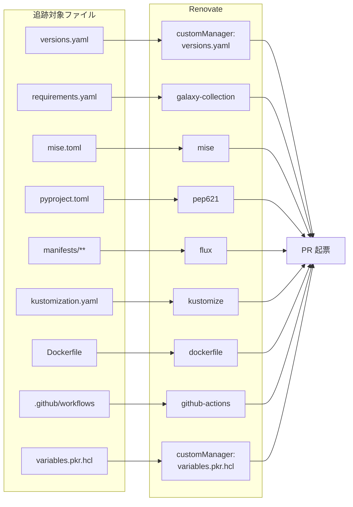

# 提案: Renovate カバレッジの拡充

> **この提案の位置づけ**
>
> 現状 Renovate は Helm / kustomize / mise / Dockerfile / GitHub Actions /
> Ansible Galaxy / pep621 (Python) / Packer の `ubuntu_version` を追跡している。
> 一方で **`provisioner/inventories/base/group_vars/all/versions.yaml`** に
> 列挙されている k3s / kubectl / helm / garage / restic / etcd / coredns /
> certbot / node_exporter / alloy のバイナリ群は **完全に追跡対象外**。
> ここを customManager で乗せて、新版検知 → PR レビュー → Ansible/SUC 経由で
> 適用、の流れに統一する。
>
> 関連 proposal:
> - `k3s-upgrade.md` (SUC 経由の k3s 更新) — 本 proposal の `versions.yaml` 追跡が前提
> - `ubuntu-auto-update.md` (OS パッケージ) — スコープ別

## 背景・動機

`gh pr list --label "Kind: Dependencies"` で実際の Renovate PR を確認した
現状のカバレッジ:

### 追跡できている (確認済)

| マネージャ | 対象 | 確認した PR 例 |
|---|---|---|
| **flux** | `manifests/**/*.ya?ml` の HelmRelease / HelmRepository / OCIRepository | #188 opentelemetry-collector, #187 envoyproxy/gateway-helm |
| **kustomize** | `manifests/**/kustomization.ya?ml` | (本 proposal とは独立) |
| **github-actions** | `.github/workflows/*.ya?ml` (digest pin) | #190 setup-uv, #213 major bump |
| **dockerfile** | `docker/Dockerfile` | #225 python docker tag, #69 |
| **mise** | `mise.toml` の `[tools]` (registry にあるもの) | #224 flux2, #226 kubeconform, #210 patch group, #212 helm major |
| **pep621** (auto) | `pyproject.toml` の Python deps | (lock 経由で #214/#227) |
| **galaxy-collection** (auto) | `provisioner/requirements.yaml` の collections | **#189 community.general v12.6.0** で稼働確認済 |
| **lockFileMaintenance** | `uv.lock` 週次 | #214, #227 |
| **customManager (regex)** | `imager/variables.pkr.hcl` の `ubuntu_version` | 既存設定 |

### 追跡できていない

| ファイル | 追跡されていない項目 | 影響 |
|---|---|---|
| **`provisioner/inventories/base/group_vars/all/versions.yaml`** | `k3s` / `kubectl` / `helm` / `garage` / `restic` / `etcd` / `coredns` / `certbot` / `node_exporter` / `alloy` | Ansible が `get_url` で取りに行くバイナリ群が **全部手動**。新版検知ができない |
| `mise.toml` の `"pipx:ansible-lint"` | mise pipx backend が Renovate 認識外の可能性 | mise PR に上がっているか dry-run 確認、ダメなら素の `ansible-lint` (mise registry) に切替 |
| `provisioner/requirements.yaml` の `roles:` | Renovate `galaxy` manager が role ( `ipr-cnrs.nftables` ) を拾うか未確認 | collections は #189 で確認済。roles 用 PR が立った実績は未確認 |
| 将来の kustomize `resources:` の **GitHub release URL 直参照** (k3s-upgrade proposal で SUC を取り込む際に出る) | `https://github.com/.../releases/download/vX.Y.Z/foo.yaml` 形式 | kustomize manager が拾うはずだが、要 dry-run |

## ゴール / 非ゴール

| | 内容 |
|---|------|
| ゴール | (1) `versions.yaml` の **全エントリを customManager で追跡** し、各エントリに対応する Renovate PR が立つこと。(2) `mise.toml` の `pipx:ansible-lint` が追跡されているかを確認し、未追跡なら素の `ansible-lint` に切替。(3) `requirements.yaml` の roles も追跡されているかを確認 |
| 非ゴール | (1) Renovate の `automerge` を有効化。(2) `versions.yaml` のエントリを mise.toml に統合 (役割が違う: ローカル CLI vs ノードに入るバイナリ)。(3) Helm chart の major 自動 bump (既存 `automerge: false` 維持) |

## 採用 / 不採用 / 理由

| 論点 | 採用 | 理由 |
|------|------|------|
| `versions.yaml` の追跡方式 | **customManager (regex) を 1 つ**、各行に `# renovate:` コメント注釈 | 既存 `imager/variables.pkr.hcl` と同じ書式に揃える |
| datasource | 各エントリ個別 (k3s: `github-releases`, garage: `github-releases`, restic: `github-releases`, etcd: `github-releases`, coredns: `docker` (`coredns/coredns`), certbot: `pypi`, node_exporter: `github-releases`, alloy: `github-releases`, kubectl: `github-releases` (`kubernetes/kubernetes`), helm: `github-releases` (`helm/helm`)) | 各 OSS の release 形態に合わせる |
| versioning | k3s は `loose` (`vX.Y.Z+k3sN` 形式)、他は `semver` 既定 | k3s 特有の `+k3sN` suffix を loose で吸収 |
| グルーピング | k3s 関連 (`versions.yaml:k3s` + 将来の SUC `Plan.version`) は `groupName: k3s` で 1 PR に | k3s-upgrade proposal の前提 |
| `ansible-lint` の置き場 | **mise registry の素の `ansible-lint`** に変更 (`pipx:` を外す) | mise の pipx backend が Renovate 認識外なら最小変更で乗せ替え |
| `pipx:ansible-lint` 維持案 | **不採用** | Renovate のサポートが薄いため、追跡が確実な経路に寄せる |
| マルチエントリの 1 customManager | **1 customManager で `versions.yaml` 全部** をカバー | regex の `matchStrings` を複数書くより、`# renovate:` コメント駆動で柔軟 |
| `automerge` | **無効維持** | k3s / kubelet / etcd は中核すぎる。レビュー必須 |

### 検討したが採らなかった案

| 案 | 不採用理由 |
|---|-----------|
| `versions.yaml` の各エントリを別 customManager に分割 | 設定が冗長。`# renovate:` コメント駆動なら 1 つで済む |
| `versions.yaml` を mise.toml に統合 | 役割が違う (ローカル CLI vs ノードに入るバイナリ)。Ansible が `versions.k3s` を参照している事実を変えたくない |
| Renovate Dependency Dashboard issue で済ませる (PR を立てない) | 検知はできても **適用フローに乗らない** ため意味が薄い |
| `automerge: true` (patch のみ) | k3s 含む中核バイナリで自動 merge は事故リスク。`minimumReleaseAge` 既存 7 日と組み合わせても、homelab で深夜に静かに上がるのは怖い |

## アーキテクチャ概要



## Phase 1 で動かすもの (受け入れ基準)

| # | 機能 | 検証方法 |
|---|------|---------|
| 1 | `versions.yaml` の全エントリに `# renovate:` 注釈が付いている | grep で 10 行 (k3s/kubectl/helm/garage/restic/etcd/coredns/certbot/node_exporter/alloy) すべてに注釈 |
| 2 | customManager が各行を datasource 通りに解釈 | 各エントリを 1 つ古い版に戻し、Renovate dry-run (CLI または PR comment `@renovatebot recheck`) で対応する PR が出る |
| 3 | k3s だけは `versioning=loose` で `+k3sN` を扱える | `v1.34.x+k3s1` → `v1.35.x+k3s1` の差分が PR で正しく出る |
| 4 | k3s の version は `groupName: k3s` で k3s-upgrade proposal の Plan と 1 PR に集約 | k3s-upgrade proposal が Phase 1 着手後に dry-run で確認 |
| 5 | `mise.toml` の `pipx:ansible-lint` の追跡可否を確定 | 過去 PR (`gh pr list`) と Dependency Dashboard で確認、未追跡なら素の `ansible-lint` に置換 |
| 6 | `requirements.yaml` の roles (`ipr-cnrs.nftables`) も追跡されているか確認 | Dependency Dashboard で `galaxy` manager が roles を捕捉しているか確認、未追跡なら別 customManager 検討 |
| 7 | 既存の追跡対象 (Helm / kustomize / mise / Dockerfile / GHA / pep621 / galaxy-collection) が壊れていない | Renovate の dry-run で既存 PR と同等の検出が出る |

## 段階導入計画

| Phase | 内容 | 完了条件 |
|-------|------|---------|
| **Phase 0** | この proposal で合意 | レビュー approval |
| **Phase 1** | `versions.yaml` の customManager 追加 + `# renovate:` 注釈 + `pipx:ansible-lint` の確認 / 必要なら置換 + `requirements.yaml` roles の確認 | 受け入れ基準 1〜7 |
| **Phase 2** | 1〜2 サイクルの Renovate 実行で実際に PR が出ることを観察、datasource 誤りの修正、`groupName` 調整 | 別 PR (proposal 不要) |
| **Phase 3** | `versions.yaml` で追跡できないものが見つかったら追加 (例: 将来の SUC controller の release URL を kustomize で参照する場合の確認) | 別 PR |

## 構成要素 (Phase 1)

### (A) `renovate.json` 追記

```json
{
  "customManagers": [
    {
      "customType": "regex",
      "managerFilePatterns": [
        "/imager/variables\\.pkr\\.hcl$/"
      ],
      "matchStrings": [
        "# renovate: datasource=(?<datasource>.*?) depName=(?<depName>.*?) versioning=(?<versioning>.*?)\\n.*?default\\s*=\\s*\"(?<currentValue>.*?)\""
      ]
    },
    {
      "customType": "regex",
      "managerFilePatterns": [
        "/provisioner/inventories/base/group_vars/all/versions\\.ya?ml$/"
      ],
      "matchStrings": [
        "# renovate: datasource=(?<datasource>.*?) depName=(?<depName>.*?)( versioning=(?<versioning>.*?))?\\n\\s*[a-z_]+:\\s*\"(?<currentValue>.*?)\""
      ],
      "versioningTemplate": "{{#if versioning}}{{versioning}}{{else}}semver{{/if}}"
    }
  ],
  "packageRules": [
    {
      "matchPackageNames": ["k3s-io/k3s"],
      "groupName": "k3s"
    }
  ]
}
```

### (B) `versions.yaml` への注釈付与 (案)

各エントリの datasource は事前調査が必要 (Phase 1 着手時に確定):

```yaml
versions:
  # renovate: datasource=github-releases depName=k3s-io/k3s versioning=loose
  k3s: "v1.35.3+k3s1"
  # renovate: datasource=github-releases depName=kubernetes/kubernetes
  kubectl: "v1.35.0"
  # renovate: datasource=github-releases depName=helm/helm
  helm: "v4.0.0"
  # renovate: datasource=github-releases depName=deuxfleurs-org/garage
  garage: "v2.2.0"
  # renovate: datasource=github-releases depName=restic/restic
  restic: "0.18.1"
  # renovate: datasource=github-releases depName=etcd-io/etcd
  etcd: "v3.6.0"
  # renovate: datasource=docker depName=coredns/coredns
  coredns: "1.14.2"
  # renovate: datasource=pypi depName=certbot
  certbot: "5.4.0"
  # renovate: datasource=github-releases depName=prometheus/node_exporter
  node_exporter: "1.11.0"
  # renovate: datasource=github-releases depName=grafana/alloy
  alloy: "1.15.1"
```

注: `helm` の `versions.yaml` 値 (`v4.0.0`) は Ansible が install するバイナリ用で、
`mise.toml` の `helm = "4.1.4"` (ローカル CLI 用) とは別レーン。Renovate には
両方の PR が並走で立つ想定だが、レビュー側で文脈を判断する。

### (C) `mise.toml` の `pipx:ansible-lint` 確認

| 確認結果 | アクション |
|---|---|
| 過去に `ansible-lint` の Renovate PR が立った実績あり | 維持 |
| 立っていない / Dashboard で未追跡 | `"pipx:ansible-lint" = "26.4.0"` → `ansible-lint = "26.4.0"` に置換 (mise registry にあるか先に確認) |
| mise registry に無い | `pyproject.toml` の `[dependency-groups] dev` に `ansible-lint>=26` を追加して uv 管理に寄せる |

### (D) `requirements.yaml` の roles 確認

| 確認結果 | アクション |
|---|---|
| `ipr-cnrs.nftables` が Renovate Dashboard に出ている | 維持 |
| 出ていない | 個別 customManager を追加するか、untracked で許容 (role は collections より更新頻度が低いため許容も可) |

### (E) Renovate Dependency Dashboard

`config:recommended` が Dashboard issue を自動作成する。Phase 1 PR で
明示的に `dependencyDashboard: true` を `renovate.json` に書いて意図を残す。

## 期待効果

- **`versions.yaml` の更新が滞らない** — k3s / etcd / alloy / Loki agent などの新版が PR で見える
- **k3s upgrade proposal の前提条件が揃う** — `versions.yaml:k3s` と SUC `Plan.version` が同 PR でレビューできる
- **追跡できていないものが Dashboard に集約される** — 漏れ検知のセンサーが明文化
- **Ansible が install するバイナリの version 管理が SoT 化** — 個人メモから外れる

## リスク・注意

| リスク | 対処 |
|--------|------|
| **datasource 指定ミスで PR が立たない / 誤った版が立つ** | Phase 1 完了の必須条件として「全 10 エントリで PR が出ることを 1 つ古い版に戻して dry-run 確認」 |
| **`+k3sN` などの非 semver を `loose` で扱う** | k3s だけ `versioning=loose` を明示。他は semver |
| **PR 数が一気に増えて運用負荷** | 既存 `prConcurrentLimit: 0` / `prHourlyLimit: 0` は維持しつつ、`groupName` で関連物をまとめる (k3s / mise tools / 等) |
| **`coredns` を `docker` datasource で取ると Ansible install 経路と乖離** | 必要に応じて `github-releases` (`coredns/coredns`) に切替。Phase 1 でどちらが適切か実地確認 |
| **`certbot` の `pypi` datasource が Ansible install 方式 (snap or apt) と一致しない** | install 経路 (snap / apt / pip) を確認し、合致する datasource に揃える。Phase 1 で要確認 |
| **`helm` バイナリ (versions.yaml) と `helm` CLI (mise.toml) の二重 PR** | レビュー時にコメントで役割を明示。グルーピングは敢えてしない (上げるタイミングが違う) |
| **`mise.toml` から `pipx:` 外しで CI / dev 環境に影響** | `mise install` を CI と手元で再実行して動作確認 |
| **Renovate の Dashboard が読まれない** | runbook / `docs/operations/` に「週次で Dashboard を見る」を明記 |

## 作業範囲 (Phase 1)

- `renovate.json` に customManager 追記 + `packageRules` (k3s grouping) 追記
- `provisioner/inventories/base/group_vars/all/versions.yaml` に `# renovate:` 注釈 10 行追加
- `mise.toml` の `pipx:ansible-lint` を確認 → 必要なら置換
- `provisioner/requirements.yaml` の roles 追跡確認 → 必要なら customManager 追加
- 検証
  - 各エントリを 1 つ古い版に一時的に戻し、Renovate dry-run で 10 件分の PR が起票されることを確認 (実機ではなく Renovate App の log / dashboard)
  - 既存 PR が引き続き立つことを確認
- ドキュメント (実装後)
  - `docs/operations/renovate.md` 新規 (どのファイルが追跡対象か / Dashboard の見方 / 新しい依存を追跡したい時の追加方法)
  - `docs/README.md` 運用セクションにリンク追加

## 未決事項 / 要確認

- 各 datasource の正確な指定 (特に `coredns` / `certbot` / `helm` バイナリ — install 経路次第)
- `kubectl` を `github-releases (kubernetes/kubernetes)` で追跡する場合、k3s に bundle されている kubelet/kubectl との版ズレ運用方針
- `mise.toml` の `pipx:ansible-lint` を維持できるか / 置換するか (実調査)
- `requirements.yaml` の roles (`ipr-cnrs.nftables`) が `galaxy` manager に拾われているか (実調査)
- Phase 1 着手後、PR 数が増えすぎる場合の `groupName` ポリシー
- `lockFileMaintenance` の頻度 (週次のままで OK か、versions.yaml 追加で混雑するか)

## 更新履歴

- 2026-04-30 初版
