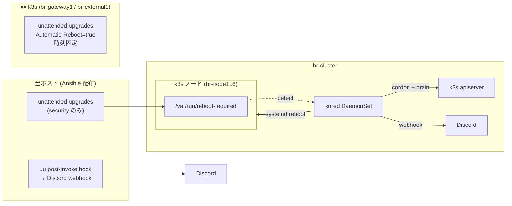

# 提案: Ubuntu パッケージ更新の自動化

> **ステータス: ✅ Phase 1 完了 (2026-04-30) / Phase 2 タスク #1, #5 着地 (2026-05-03)。残りは 4 週間 soak (5/28 目安) → 観察結果に基づく改善。**
>
> 新規セッションでこの doc を開く場合は **「Phase 1 着地まとめ」** と **「Phase 2 残課題」** だけ読めば現状把握できる。
> 後段の "設計時の記録" セクションは Phase 1 着手前の検討資料 (なぜ kured を採用したか等) で、再着手は不要。

## Phase 1 着地まとめ (2026-04-30)

### 完了状況

| | |
|---|---|
| 着地日 | **2026-04-30** |
| Merged PRs | [#237](https://github.com/bright-room/br-cluster/pull/237) (Ansible / unattended-upgrades + Discord hook) / [#238](https://github.com/bright-room/br-cluster/pull/238) (kured を Flux 経由で導入) / [#239](https://github.com/bright-room/br-cluster/pull/239) (kured `blockingPodSelector` を空に修正) |
| 受け入れ基準 (1〜7) | すべて実機確認済 (br-node3 / br-node5 で reboot demo 完了) |

### 現在の cluster / ホスト状態

- **全ホスト**で `unattended-upgrades` が稼働、毎日 security pocket のみ自動適用
- **k3s ノード (br-node1〜6)** は `automatic_reboot: false` → reboot は **kured** に委ねる
- **gateway (br-gateway1)** は **03:00 JST** に自動 reboot (kured 管理外)
- **external (br-external1)** は **04:00 JST** に自動 reboot (kured 管理外)
- **kured** は `kube-system` で DaemonSet 稼働。窓 **01:00–02:30 JST** / `concurrency: 1` / `blockingPodSelector: []` (空)
- 通知は Discord `#br-cluster-prod-maintenance` に集約 (uu: 変更があった日のみ embed / kured: reboot 発火時に embed 青)
- 1Password Item: `discord-webhook-cluster-maintenance` の `webhook_url` 1 Field を uu / kured で共有 (kured 用は ESO の sprig template で shoutrrr 形式に変換)

### Phase 1 で発見された設計修正

PR-2 実機検証中に **`--blocking-pod-selector longhorn.io/component=instance-manager` が永続ブロックを引き起こす** ことが判明。

- 原因: Longhorn の `instance-manager` は DaemonSet で全 k3s ノードに常駐するため、このセレクタは **常にマッチ** → kured が一切 reboot を走らせない状態になる
- 修正 (PR #239): `blockingPodSelector: []` (空) にし、drain 安全性は Longhorn 側の PDB / drain 挙動に委ねる
- 後続: 2026-05-03 に **alert ベース抑止** (`--alert-filter-regexp` + Prometheus alert `LonghornVolumeRebuilding` = robustness==2 短期検知) を追加し、rebuild 中の reboot を防ぐ仕組みを復元

---

## Phase 2 残課題

**着手目安: 2026-05-28 (Phase 1 merge から 4 週間)**。それまでは観察期間。

### 観察フェーズで見るもの

| 項目 | 確認方法 | 判定 |
|------|---------|------|
| security update の取りこぼし | 全ノードで `unattended-upgrade --dry-run` を流して "0 upgraded" になるか | 取りこぼしがあれば原因深堀 |
| reboot による Pod 再配置の影響 | Loki / Grafana で kured 発火日のアプリエラー率、Longhorn volume rebuild 履歴 | 安定しないアプリがあれば PDB 整備 |
| etcd quorum が崩れていないか | `kubectl get nodes` で同時 NotReady が 1 台以下に収まっているか | 同時落ちが起きたら `concurrency` / window 設定を再確認 |
| Discord 通知の S/N 比 | "毎日 0 件更新" の通知がノイズなら頻度を週次集約に切替 | uu hook を週次サマリ化 |
| kured 自体のリソース消費 | `kubectl top pod -n kube-system -l app.kubernetes.io/name=kured` | 想定外なら values 調整 |
| `k3s-leader-restart` の safety net 発火頻度 | `journalctl -u k3s-leader-restart` で `"uptime ...d > 30d: force restart"` のログ件数。kured が月数回 reboot するようになっていれば 0 件のはず | 0 件継続なら leader-restart 撤去 / 頻度ダウンを別 PR で検討 |
| gateway 自動 reboot の体感影響 | reboot 時の通信断時間、Cloudflare Tunnel 再接続タイミング | 想定外なら `automatic_reboot: false` に切り替え + 手動運用 |

### Phase 2 で実施するタスク

| # | タスク | 起票条件 |
|---|------|---------|
| 1 | ~~**alert ベース抑止の実装** (`--alert-filter-regexp` + Prometheus alert `LonghornVolumeRebuilding`)~~ ✅ **2026-05-03 着地** | — |
| 2 | **PDB 整備** (drain で詰まるアプリの洗い出し → PodDisruptionBudget 追加) | 観察で Pod eviction 起因の障害が出たら |
| 3 | **uu 通知の頻度見直し** (毎日 → 週次サマリ等) | Discord 通知ノイズが多ければ |
| 4 | **`k3s-leader-restart` の safety net 観察結果反映** | 30 日 uptime 発火が 0 件継続なら頻度ダウン or 撤去 |
| 5 | ~~**rollback 手順の runbook 化** ([`docs/runbooks/auto-update-rollback.md`](../runbooks/auto-update-rollback.md))~~ ✅ **2026-05-03 着地** (regression 発生前に予防的に整備) | — |
| 6 | **`tasks/update.yaml` の整理** (unattended-upgrades と役割重複している部分の刈り込み) | Phase 2 後半で別 PR |
| 7 | **ドキュメント整備** (`docs/operations/auto-update.md` 新規 / `CLAUDE.md` 「非自明な設計判断」表に kured / uu 追記) | 観察期間が落ち着いたら |

### Phase 2 着手判断の閾値 (目安)

| 状況 | 判断 |
|------|------|
| 受け入れ基準 7 項目 safe + 4 週間障害なし | そのまま観察継続。タスク #1 (alert ベース) は単独で別 PR 化 |
| Pod eviction で安定しないアプリが出る | タスク #2 (PDB 整備) を先に着手 |
| 通知ノイズが多い | タスク #3 (週次集約化) を先に着手 |

---

## Phase 3 (将来検討)

| 内容 | 起票条件 |
|---|---|
| feature update への自動適用拡張 | Phase 2 が安定運用に入り、homelab に常時監視が増えたら |
| `apt-listchanges` 連携で Discord 通知に changelog を含める | uu 通知の情報量を増やしたい場合 |
| Argo Events 経由で uu / kured / SUC 通知を集約 | 通知元が増えてバラついたら |
| Pi firmware / EEPROM 更新の自動化 | Phase 2 では非ゴール、年次手動を維持 |

---

## 設計時の記録 (アーカイブ)

> 以下は Phase 1 着手前の検討資料。**新規セッションで再着手する必要はない**。
> 既に着地済の設計判断 (なぜ kured を採用したか、なぜ窓を 01:00–02:30 JST にしたか等) を後から参照したいときのために残す。

### 背景・動機

着手前の状態 (2026-04-30 時点):

| 項目 | 状態 |
|------|------|
| `unattended-upgrades` | **未導入** (`install_packages` に無し) |
| cloud-init での `package_upgrade` | **無効** (`user-data.j2` に指定なし) |
| `needrestart` | **明示的に uninstall** (`provisioner/roles/common/defaults/main.yaml`) |
| 手動 (Ansible) での `apt dist-upgrade` | `provisioner/tasks/update.yaml` を `setup_node` / `setup_gateway` / `setup_external` から `include_tasks` |
| カーネル更新後の reboot | `update.yaml` 内で `/var/run/reboot-required` 検知時のみ実行 |

→ **playbook を回さない限り security update も入らない** 状態で、homelab という性質上、月単位で更新が遅延する事故が起きやすい。
ただし「全部自動で `dist-upgrade` + reboot」をやると複数 CP ノードが同時に reboot して **etcd quorum 喪失** / `br-gateway1` 再起動中の DNS / NTP 停止 / `br-external1` 再起動中の Loki / Tempo 書き込み先消失 / Pi の `apt dist-upgrade` 中の I/O バーストで Longhorn health check が落ちる懸念があるため、**更新の自動取得** と **reboot のオーケストレーション** を分けて設計した。

### ゴール / 非ゴール

| | 内容 |
|---|------|
| ゴール | (1) 全ノード (k3s + gateway + external) で security update を毎日自動適用。(2) 再起動が必要な更新時、k3s ノードは kured が cordon/drain 込みで 1 台ずつ reboot。(3) 非 k3s ノード (`br-gateway1` / `br-external1`) は個別の固定スケジュールで reboot。(4) 更新結果と reboot を Discord で観測可能にする |
| 非ゴール | (1) feature/non-security update の自動適用 (Phase 1 では security のみ)。(2) Helm / k8s app の自動更新 (Renovate 担当)。(3) k3s 自身のバージョン更新 (別管理)。(4) Pi firmware / EEPROM 更新の自動化 (年次手動を維持) |

### 採用 / 不採用 / 理由

| 論点 | 採用 | 理由 |
|------|------|------|
| パッケージ自動更新 | **`unattended-upgrades`** | Debian/Ubuntu 標準。security pocket のみに絞れる。Pi 負荷も小さい |
| 適用対象 | **`${distro_id}:${distro_codename}-security` のみ (Phase 1)** | feature update を巻き込むと API 仕様変更で Ansible 冪等性が崩れるリスク |
| reboot 自動化 (k3s ノード) | **kured (Kubernetes Reboot Daemon)** | `/var/run/reboot-required` を検知 → cordon/drain → 1 台ずつ reboot。etcd quorum を壊さない |
| reboot 自動化 (非 k3s) | **`unattended-upgrades` の `Automatic-Reboot=true` + 時間帯指定** | kured は k3s 前提。gateway / external は単純に時間で再起動 |
| reboot 時刻 | **k3s: kured を 01:00–02:30 JST**、**gateway: 03:00 JST**、**external: 04:00 JST** | 利用が無い時間帯 + `k3s-leader-restart.timer` (03:00 / 04:00 / 05:00 JST + 15 min jitter) と被らないように分離。gateway → external の順で重ならせない |
| `needrestart` | **引き続き uninstall** | Pi で重い + 対話プロンプトで Ansible が刺さる過去事例 |
| 設定の SoT | **Ansible role `common` 配下に `unattended_upgrades` task 追加** | provisioner で完結、cloud-init は触らない。再プロビ時も再現される |
| kured の deploy | **`manifests/platform/kured/` を Flux 経由** | 他 platform component と同列。HelmRelease で pin |
| 通知 | **kured の shoutrrr → Discord webhook** + **`unattended-upgrades` の post-invoke hook → Discord webhook** | reboot は kured が、apt 結果は uu が出す |
| Discord webhook 管理 | **1Password → ExternalSecret** (kured 用) / **1Password CLI で `.env` 配布** (uu 用、Ansible で配置) | uu はホスト側スクリプトなので k8s Secret は使えない |
| reboot 抑止フラグ | **Phase 1 では `--blocking-pod-selector` を空** にする (実機検証で `longhorn.io/component=instance-manager` 指定だと DaemonSet が常駐してマッチし続け永遠に reboot されないことを確認したため)。Phase 2 で alert ベース抑止 (`--alert-filter-regexp` + Prometheus alert) に置き換え | drain 安全性は Longhorn 側 PDB / drain 挙動に委ねる |

### 検討したが採らなかった案

| 案 | 不採用理由 |
|---|-----------|
| `apt-dater` / `apticron` | メール前提でリッチ通知が組みづらい。`unattended-upgrades` で十分 |
| Ansible Pull (`ansible-pull`) を timer で回す | playbook 全部を回すのは過剰。security update は `apt` で十分速く、Ansible の冪等処理コストが毎日かかる |
| `kured` の代わりに自作の cordon/drain スクリプト | quorum 認識 / lock / Prometheus alert 連携を自前で書くと bug の温床 |
| feature update も自動 | 起動失敗時の影響が大きく、homelab で監視が薄い時間に踏むのは怖い。Phase 1 では security 限定 |
| systemd-timer で `apt upgrade` 直叩き | unattended-upgrades と同等のことを自作する意味がない |
| Renovate 等で OS パッケージ管理 | OS パッケージは Renovate のスコープ外 |

### アーキテクチャ概要



### 受け入れ基準 (Phase 1 検証用、すべて達成済)

| # | 機能 | 検証方法 |
|---|------|---------|
| 1 | security update が毎日自動適用される | 任意ノードで `/var/log/unattended-upgrades/unattended-upgrades.log` に当日のエントリ。`apt-config dump` で `Unattended-Upgrade::Allowed-Origins` が security のみ |
| 2 | k3s ノードは kured で 1 台ずつ reboot | テスト用に `touch /var/run/reboot-required` を 2 ノードで実行 → 同時 reboot されず、片方ずつ cordon/drain → reboot される |
| 3 | kured が指定時間帯のみ動く | `--start-time` / `--end-time` (01:00–02:30 JST) 外で `reboot-required` を作っても reboot されない |
| 4 | kured が Discord に通知する | テストで reboot 発火 → Discord に "Draining ..." / "Rebooting ..." / "rebooted & uncordoned" |
| 5 | gateway / external は時刻指定で reboot | `Automatic-Reboot-Time` が `03:00` / `04:00` で設定済 |
| 6 | uu の結果が Discord に届く | hook スクリプト + `unattended-upgrade --dry-run` 相当で発火確認 |
| 7 | 既存 `tasks/update.yaml` 手動更新は引き続き動く | `make prod/provision/setup-*` を流して既存挙動が壊れていないこと |

### リスク・注意 (Phase 1 着手時に整理したもの)

| リスク | 対処 |
|--------|------|
| `unattended-upgrades` が apt lock を握り Ansible が刺さる | `tasks/update.yaml` 冒頭で `apt-daily.timer` / `apt-daily-upgrade.timer` を停止 → upgrade 後に restart (PR #237 で実装) |
| `needrestart` を入れない方針との整合 | 入れない方針は維持。reboot 判断は `/var/run/reboot-required` のみに統一 |
| **kured が DaemonSet を blockingPodSelector で永続ブロック** | **PR #239 で `blockingPodSelector: []` に修正済。Phase 2 で alert ベース抑止に再設計予定** |
| CP ノード reboot 中に kube-vip の VIP がフラップ | `concurrency: 1` 必須。kube-vip のリーダー選出に任せる。実機で reboot 試験済 (kubectl が一瞬切れて自動再接続) |
| Pi で apt の I/O がバースト → Longhorn replica の health check が落ちる | Phase 2 観察項目。問題が出るなら uu の `Acquire::http::Dl-Limit` で帯域制御 |
| gateway 再起動で DNS / NTP が止まる | 03:00 JST 固定 + DNS は systemd-resolved の cache + ノード側の `FallbackDNS` で短時間断は吸収。Phase 2 観察項目 |
| external 再起動で Loki / Tempo の書き込みが詰まる | 04:00 JST 固定。Loki / Tempo は ingester がバッファするので分単位の断は許容 |
| security pocket でも稀に regression | rollback 手順 (`apt install pkg=ver`) を Phase 2 で `docs/runbooks/` に整備 |
| Discord webhook URL 漏洩 | 1Password → ExternalSecret (kured) / Ansible secrets (uu)。`policies/` 準拠 |
| kured の HelmRelease が壊れて reboot されない | `unattended-upgrades.log` と Discord で「reboot-required が積み上がっている」を観測可能に |
| `k3s-leader-restart.timer` と kured reboot の時刻衝突 | 別役割 (前者は k3s プロセス restart で leader 偏り解消、後者は OS reboot)。kured 窓を 01:00–02:30 JST、leader-restart は 03:00 / 04:00 / 05:00 JST に固定して分離 |

### 構成要素 (Phase 1 実装内容のスナップショット)

#### (A) Ansible: `common` ロールの `unattended_upgrades.yaml` (PR #237)

```text
provisioner/roles/common/
├── defaults/main.yaml          # unattended_upgrades_* 変数追加
├── tasks/
│   ├── main.yaml               # include_tasks: unattended_upgrades.yaml
│   └── unattended_upgrades.yaml
└── templates/
    ├── 50unattended-upgrades.j2
    ├── 20auto-upgrades.j2
    ├── apt-daily-upgrade-discord-hook.conf.j2  # systemd drop-in
    ├── uu-discord-hook.env.j2                   # webhook URL 配置
    └── uu-discord-hook.sh.j2                    # post-run hook
```

通知 hook の発火経路は **DPkg::Post-Invoke ではなく `apt-daily-upgrade.service` の `ExecStartPost` drop-in**。Ansible 経由の手動 apt では通知させないため。

`group_vars/{base/gateway,base/external}.yaml` で `automatic_reboot: true` と `automatic_reboot_time` を override。

#### (B) kured を `manifests/platform/kured/` (PR #238 + #239)

```text
manifests/platform/kured/app/
├── base/
│   ├── helm.yaml                # HelmRepository + HelmRelease (chart 5.11.0 pin)
│   ├── values.yaml              # window / concurrency / blockingPodSelector など
│   ├── externalsecret.yaml      # raw URL → shoutrrr 形式に変換 (sprig template)
│   ├── kustomization.yaml
│   └── kustomizeconfig.yaml
└── overlays/prod/
    └── kustomization.yaml       # namespace: kube-system
```

`manifests/clusters/prod/platform/kured-app.yaml` で Flux Kustomization 登録。

`KURED_NOTIFY_URL` env var で notify-url を Secret 経由で渡す (chart の挙動: `KURED_<UPPER_SNAKE>` で全 flag を上書き可)。

#### (C) Discord 通知

- 送信先チャンネル: `#br-cluster-prod-maintenance` (Notification カテゴリ)
- Webhook URL は kured / uu で共有 (1Password エントリ 1 個)
- uu hook: 状態に応じて embed の左ライン色を変える (緑 = 通常成功 / 黄 = reboot-required / 赤 = エラー)
- kured: shoutrrr の `?color=3447003` で青固定 (uu と区別)

#### (D) `tasks/update.yaml` との関係

- 残す。プロビジョン時の "今すぐ最新化" に必要
- 冒頭で `apt-daily{,-upgrade}.timer` を停止 → fuser で apt lock 待ち → upgrade → 末尾で timer 再開、で衝突回避

---

## 更新履歴

- 2026-04-30 初版
- 2026-04-30 kured 窓を 01:00–02:30 JST に変更 (k3s-leader-restart.timer と分離)。`k3s-leader-restart` との役割分担と Phase 2 観察項目を追記
- 2026-04-30 Discord 通知を `#br-cluster-prod-maintenance` (新規) に集約、webhook 共有、uu は「変更があった日のみ」、ESM origin は allowlist に含めたまま、blocking-pod-selector 初期値を Longhorn instance-manager のみで確定
- 2026-04-30 PR-2 実機検証で `blocking-pod-selector: longhorn.io/component=instance-manager` が DaemonSet 常駐により永続ブロックを引き起こすと判明 → 空に変更。Phase 2 で alert ベース抑止に再設計予定
- 2026-04-30 Phase 1 完了 (#237, #238, #239 merge)。proposal を「Phase 1 着地まとめ」「Phase 2 残課題」「設計時の記録 (アーカイブ)」の 3 段構造に再編
- 2026-05-03 Phase 2 タスク #1 (alert ベース抑止: `LonghornVolumeRebuilding` + kured `alertFilterRegexp`) と #5 (rollback runbook) を soak 待たずに先行着地
