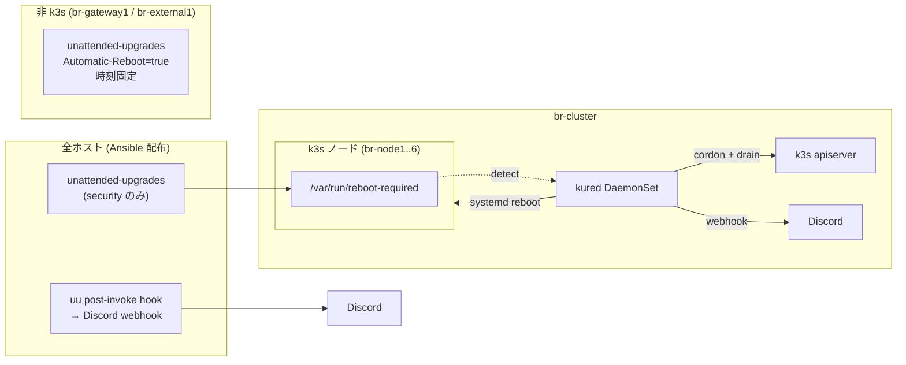

# 提案: Ubuntu パッケージ更新の自動化

> **この提案の位置づけ**
>
> 現状 Ubuntu の OS / パッケージ更新は Ansible playbook を手動で回した時しか
> 走らない。homelab 運用で更新がしばしば数ヶ月単位で滞るため、
> `unattended-upgrades` を中心にした自動化基盤を入れる。
> 同時に k3s クラスタ特有の "全ノード同時 reboot 禁止" 要件を満たすため、
> reboot 制御は **kured** に分離する。

## 背景・動機

現状の更新まわりは以下の通り (調査済み):

| 項目 | 状態 |
|------|------|
| `unattended-upgrades` | **未導入** (`install_packages` に無し) |
| cloud-init での `package_upgrade` | **無効** (`user-data.j2` に指定なし) |
| `needrestart` | **明示的に uninstall** (`provisioner/roles/common/defaults/main.yaml:5`) |
| 手動 (Ansible) での `apt dist-upgrade` | `provisioner/tasks/update.yaml` を `setup_node` / `setup_gateway` / `setup_external` から `include_tasks` |
| カーネル更新後の reboot | `update.yaml` 内で `/var/run/reboot-required` 検知時のみ実行 |

つまり **playbook を回さない限り security update も入らない** 状態で、
homelab という性質上、月単位で更新が遅延する事故が起きやすい。

ただし「全部自動で `dist-upgrade` + reboot」をやると以下のリスクがある:

- 複数 CP ノードが同時に reboot して **etcd quorum 喪失**
- `br-gateway1` 再起動中はクラスタ DNS / NTP が止まる
- `br-external1` 再起動中は Loki / Tempo の書き込み先 (Garage S3) が消える
- Pi の `apt dist-upgrade` 中に I/O が詰まり Longhorn の health check が落ちる懸念

→ **更新の自動取得** と **reboot のオーケストレーション** を分けて設計する。

## ゴール / 非ゴール

| | 内容 |
|---|------|
| ゴール | (1) 全ノード (k3s + gateway + external) で **security update を毎日自動適用**。(2) 再起動が必要な更新時、**k3s ノードは kured が cordon/drain 込みで 1 台ずつ reboot**。(3) 非 k3s ノード (`br-gateway1` / `br-external1`) は **個別の固定スケジュール** で reboot。(4) 更新結果と reboot を Discord で観測可能にする |
| 非ゴール | (1) feature/non-security update の自動適用 (Phase 1 では security のみ)。(2) Helm / k8s app の自動更新 (Renovate 担当)。(3) k3s 自身のバージョン更新 (別管理)。(4) Pi firmware / EEPROM 更新の自動化 (年次手動を維持) |

## 採用 / 不採用 / 理由

| 論点 | 採用 | 理由 |
|------|------|------|
| パッケージ自動更新 | **`unattended-upgrades`** | Debian/Ubuntu 標準。security pocket のみに絞れる。Pi 負荷も小さい |
| 適用対象 | **`${distro_id}:${distro_codename}-security` のみ (Phase 1)** | feature update を巻き込むと API 仕様変更で Ansible 冪等性が崩れるリスク |
| reboot 自動化 (k3s ノード) | **kured (Kubernetes Reboot Daemon)** | `/var/run/reboot-required` を検知 → cordon/drain → 1 台ずつ reboot。etcd quorum を壊さない |
| reboot 自動化 (非 k3s) | **`unattended-upgrades` の `Automatic-Reboot=true` + 時間帯指定** | kured は k3s 前提。gateway / external は単純に時間で再起動 |
| reboot 時刻 | **k3s: kured を 01:00–02:30 JST**、**gateway: 03:00 JST**、**external: 04:00 JST** | 利用が無い時間帯 + `k3s-leader-restart.timer` (03:00 / 04:00 / 05:00 JST + 15 min jitter) と被らないように分離。gateway → external の順で重ならせない |
| `needrestart` | **引き続き uninstall** | Pi で重い + 対話プロンプトで Ansible が刺さる過去事例。代わりに kured / 時間 reboot で吸収 |
| 設定の SoT | **Ansible role `common` 配下に `unattended_upgrades` task 追加** | provisioner で完結、cloud-init は触らない。再プロビ時も再現される |
| kured の deploy | **`manifests/platform/kured/` を Flux 経由** | 他 platform component と同列。HelmRelease で pin |
| 通知 | **kured の Slack/Webhook 通知 → Discord webhook** + **`unattended-upgrades` の `Mail` を Discord webhook に転送するシェル** | reboot は kured が、apt 結果は uu が出す。集約は将来 Argo Events に寄せる余地あり |
| Discord webhook 管理 | **1Password → ExternalSecret** (kured 用) / **1Password CLI で `.env` 配布** (uu 用、Ansible で配置) | `policies/` 平文 Secret 禁止に準拠。uu はホスト側スクリプトなので k8s Secret は使えない |
| reboot 抑止フラグ | Phase 1 では `--blocking-pod-selector` を **空** にする (実機検証で `longhorn.io/component=instance-manager` 指定だと DaemonSet が常駐してマッチし続け永遠に reboot されないことを確認したため)。Phase 2 で `--alert-filter-regexp` + Prometheus alert (LonghornVolumeRebuilding 等) に置き換える | drain 安全性は Longhorn 側 PDB / drain 挙動に委ねる |

### 検討したが採らなかった案

| 案 | 不採用理由 |
|---|-----------|
| `apt-dater` / `apticron` | メール前提でリッチ通知が組みづらい。`unattended-upgrades` で十分 |
| Ansible Pull (`ansible-pull`) を timer で回す | playbook 全部を回すのは過剰。security update は `apt` で十分速く、Ansible の冪等処理コストが毎日かかる |
| `kured` の代わりに自作の cordon/drain スクリプト | quorum 認識 / lock / Prometheus alert 連携を自前で書くと bug の温床 |
| feature update も自動 | 起動失敗時の影響が大きく、homelab で監視が薄い時間に踏むのは怖い。Phase 1 では security 限定 |
| systemd-timer で `apt upgrade` 直叩き | unattended-upgrades と同等のことを自作する意味がない |
| Renovate 等で OS パッケージ管理 | OS パッケージは Renovate のスコープ外 |

## アーキテクチャ概要



## Phase 1 で動かすもの (受け入れ基準)

| # | 機能 | 検証方法 |
|---|------|---------|
| 1 | **security update が毎日自動適用される** | 任意ノードで `/var/log/unattended-upgrades/unattended-upgrades.log` に当日のエントリ。`apt-config dump` で `Unattended-Upgrade::Allowed-Origins` が security のみ |
| 2 | **k3s ノードは kured で 1 台ずつ reboot** | テスト用に `touch /var/run/reboot-required` を 2 ノードで実行 → 同時 reboot されず、片方ずつ cordon/drain → reboot されることをログ + `kubectl get nodes` で確認 |
| 3 | **kured が指定時間帯のみ動く** | `--start-time` / `--end-time` (01:00–02:30 JST) 外で `reboot-required` を作っても reboot されない |
| 4 | **kured が Discord に通知する** | テストで reboot 発火 → Discord に "rebooting node X" / "rebooted" が届く |
| 5 | **gateway / external は時刻指定で reboot** | `unattended-upgrades` の `Automatic-Reboot-Time` が `03:00` / `04:00` で設定済。`/etc/apt/apt.conf.d/50unattended-upgrades` を Ansible で確認 |
| 6 | **uu の結果が Discord に届く** | hook スクリプトを設置し、`unattended-upgrade --dry-run` で発火 → Discord に成果サマリが届く |
| 7 | **既存 `tasks/update.yaml` 手動更新は引き続き動く** | `make prod/provision` を流して既存挙動が壊れていないこと |

## 段階導入計画

| Phase | 内容 | 完了条件 |
|-------|------|---------|
| **Phase 0** | この proposal で合意 | レビュー approval |
| **Phase 1** | Ansible に `unattended_upgrades` task 追加 (全ホスト) + kured を `manifests/platform/` に追加 + Discord 通知 | 受け入れ基準 1〜7 |
| **Phase 2** | 1 ヶ月運用観察。Pod eviction で困った PDB / アプリの洗い出し、kured の `--blocking-pod-selector` 等を調整 | 別 PR (proposal 不要) |
| **Phase 3** | 必要なら feature update への拡張、apt-listchanges 連携、Argo Events 経由の通知集約 | 別 proposal |

## Phase 1 の運用フォロー (2026-05-28 目安)

Phase 1 を merge してから 4 週間後に振り返る。

### 振り返り項目

| 項目 | 確認方法 |
|------|---------|
| security update の取りこぼし | 全ノードで `unattended-upgrade --dry-run` を流して "0 upgraded" になるか |
| reboot による Pod 再配置の影響 | Loki / Grafana で kured 発火日のアプリエラー率、Longhorn volume rebuild 履歴 |
| etcd quorum が崩れていないか | `kubectl get nodes` で同時 NotReady が 1 台以下に収まっているか |
| Discord 通知の S/N 比 | "毎日 0 件更新" の通知がノイズなら頻度を週次集約に切替 |
| kured 自体のリソース消費 | `kubectl top pod -n kube-system -l app=kured` |
| `k3s-leader-restart` の safety net (`force_restart_uptime_days: 30`) 発火頻度 | `journalctl -u k3s-leader-restart` で "uptime ...d > 30d: force restart" のログ件数。kured が月数回 reboot するようになっていれば 0 件のはず → Phase 3 で leader-restart の頻度ダウン or 撤去を検討 |

### Phase 2 着手判断の閾値 (目安)

| 状況 | 判断 |
|------|------|
| 受け入れ基準 7 項目 safe + 4 週間障害なし | そのまま観察継続、必要に応じて feature update 拡張を proposal |
| Pod eviction で安定しないアプリが出る | `--blocking-pod-selector` / PDB 整備の小 PR を切る (proposal 不要) |
| 通知ノイズが多い | uu hook を週次集約に変更 |

## 構成要素 (Phase 1)

### (A) Ansible: `common` ロールに `unattended_upgrades.yaml` 追加

```text
provisioner/roles/common/
├── defaults/main.yaml          # 既存 + unattended_upgrades_* 変数追加
├── tasks/
│   ├── main.yaml               # include_tasks: unattended_upgrades.yaml を追加
│   ├── unattended_upgrades.yaml  # 新規
│   └── ...
└── templates/
    ├── 50unattended-upgrades.j2  # 新規
    ├── 20auto-upgrades.j2        # 新規
    └── uu-discord-hook.sh.j2     # 新規 (post-invoke hook)
```

#### `defaults/main.yaml` 追加分 (例)

```yaml
unattended_upgrades:
  allowed_origins:
    - "${distro_id}:${distro_codename}-security"
    - "${distro_id}ESMApps:${distro_codename}-apps-security"
    - "${distro_id}ESM:${distro_codename}-infra-security"
  package_blacklist:
    - "k3s"          # 念のため (apt 経由ではないが防御的に)
    - "k3s-selinux"
  # k3s ノードは kured が reboot を担当 → uu 自身は reboot しない
  automatic_reboot: false
  automatic_reboot_time: "03:00"   # 非 k3s でのみ使用
  download_timeout: 300
```

`group_vars/gateway.yaml` / `group_vars/external.yaml` で
`automatic_reboot: true` と `automatic_reboot_time: "03:00"` (gateway) /
`"04:00"` (external) を override する。

#### `unattended_upgrades.yaml` (要点)

- `apt: name=unattended-upgrades state=present`
- `template` で `50unattended-upgrades` / `20auto-upgrades` を配置
- `template` で `/etc/apt/apt.conf.d/99-discord-hook` (Post-Invoke で hook 起動) と hook 本体 `/usr/local/sbin/uu-discord-hook.sh` を配置
- Discord webhook URL は `secrets` ロール (1Password 経由) で `/etc/default/uu-discord-hook` に書く
- `systemctl enable --now apt-daily.timer apt-daily-upgrade.timer`

### (B) kured を `manifests/platform/kured/`

```text
manifests/platform/kured/
├── kustomization.yaml
├── namespace.yaml              # kube-system に置くなら不要
├── helmrepository.yaml         # https://kubereboot.github.io/charts
├── helmrelease.yaml            # chart: kured (version pin)
└── externalsecret-discord.yaml # kured 用 Discord webhook URL
```

`clusters/prod/platform/kustomization.yaml` にエントリ追加 (CLAUDE.md 規約)。

#### kured values の要点

```yaml
configuration:
  rebootDays: [mo, tu, we, th, fr, sa, su]
  # k3s-leader-restart.timer (master idx 0/1/2 が 03:00 / 04:00 / 05:00 JST に
  # 最大 15 min jitter で発火) と完全に分離する。kured の reboot 中に
  # leader-restart の `systemctl restart k3s` が走ると drain がリトライに
  # なるため、窓を 01:00–02:30 JST に固定する。
  startTime: "01:00"
  endTime:   "02:30"
  timeZone:  "Asia/Tokyo"
  rebootSentinel: /var/run/reboot-required
  # 同時 reboot 上限 (k3s CP の quorum を壊さないため必ず 1)
  concurrency: 1
  # CP node で先に reboot されないようにラベルでガード (任意)
  blockingPodSelector:
    - "longhorn.io/component=instance-manager"  # rebuild 中は止める
  notifyUrl: ${DISCORD_WEBHOOK}  # ExternalSecret から
```

### (C) HelmRelease の pin (policy 1, 2 準拠)

- `helmrepository.yaml` で `https://kubereboot.github.io/charts` を allowlist
- `chart.spec.version` は固定 (Renovate で更新)
- `policies/exceptions.rego` への追加は **想定しない**

### (D) Discord 通知

**送信先チャンネル:** `#br-cluster-prod-maintenance` (新規 / Notification カテゴリ)。
正常系 (uu / kured 両方) を 1 本に集約する。alert チャンネル (`#br-cluster-prod-alert`)
には Phase 2 で Prometheus alert (例: `reboot-required` が長期間滞留) を分離する余地を残す。
将来 system-upgrade-controller 経由の k3s upgrade 通知もこのチャンネルに寄せる前提で
"maintenance" 命名にしている。

**Webhook URL は kured / uu で共有 (1Password エントリ 1 個)**。
チャンネル分離が必要になったら 1Password エントリ追加で後から分離可能。

| 通知元 | 内容 | 経路 | 頻度 |
|--------|------|------|------|
| `unattended-upgrades` post-invoke hook | host 名 + 更新パッケージ件数 + (あれば) エラー | host 上で `curl` で webhook POST | **変更があった日のみ** (0 件の日はスキップ) |
| kured | reboot 開始 / 完了 | kured `notifyUrl` (shoutrrr 形式の Discord URL) | reboot 発火時のみ |

ノイズが多ければ Phase 2 で「週次サマリ」に切替。逆にエラー時にメンションを足す
(`@here` 等) のは Phase 2 で alert 経路に寄せる方が筋が良いので Phase 1 では入れない。

### (E) 既存 `tasks/update.yaml` との関係

- **残す**。プロビジョン時の "今すぐ最新化" に必要
- 自動と手動が衝突しても apt が直列化するので問題なし
- 将来 `update.yaml` が `unattended-upgrades` を含む役割に再構成できそうなら別 PR で整理

## 期待効果

- **security update が遅延しない** — homelab で月単位の遅延が起きていた状況を解消
- **reboot 起因の障害を最小化** — kured が cordon/drain 込みで 1 台ずつ reboot
- **観測可能性** — Discord に流すことで「気付かないうちに reboot されていた」を防ぐ
- **手動運用は温存** — 既存 `make {env}/provision` 経由の手動更新パスは変えない

## リスク・注意

| リスク | 対処 |
|--------|------|
| **`unattended-upgrades` が apt lock を握り Ansible が刺さる** | `tasks/update.yaml` は冒頭で `systemctl stop apt-daily.timer apt-daily-upgrade.timer` するか、`apt: lock_timeout: 600` を入れる |
| **`needrestart` を入れない方針との整合** | 入れない方針は維持。reboot 判断は `/var/run/reboot-required` のみに統一 |
| **kured が PDB を尊重して drain 失敗 → reboot 詰まる** | 各アプリの PDB を見直し、Phase 2 で `--blocking-pod-selector` 調整。Longhorn volume rebuild 中は明示ブロック |
| **CP ノード reboot 中に kube-vip の VIP がフラップ** | `concurrency: 1` 必須。kube-vip のリーダー選出に任せる。実機で reboot 試験する |
| **Pi で apt の I/O がバースト → Longhorn replica の health check が落ちる** | Phase 1 観察項目。問題が出るなら uu の `Acquire::http::Dl-Limit` で帯域制御 |
| **gateway 再起動で DNS / NTP が止まる** | 03:00 JST 固定 + DNS は systemd-resolved の cache + ノード側の `FallbackDNS` で短時間断は吸収 |
| **external 再起動で Loki / Tempo の書き込みが詰まる** | 04:00 JST 固定。Loki / Tempo は ingester がバッファするので分単位の断は許容 |
| **security pocket でも稀に regression** | rollback 手順 (`apt install pkg=ver`) を `docs/runbooks/` に残す。Phase 2 で手順整備 |
| **Discord webhook URL 漏洩** | 1Password → ExternalSecret (kured) / Ansible secrets (uu)。`policies/` 準拠 |
| **kured の HelmRelease が壊れて reboot されない** | `unattended-upgrades.log` と Discord で「reboot-required が積み上がっている」を観測可能に |
| **`k3s-leader-restart.timer` と kured reboot の時刻衝突** | 別役割 (前者は k3s プロセス restart で leader 偏り解消、後者は OS reboot)。kured 窓を 01:00–02:30 JST、leader-restart は 03:00 / 04:00 / 05:00 JST に固定して分離。Phase 1 では `k3s-leader-restart` を現状維持し、Phase 2 で kured 由来の reboot 頻度を見て `force_restart_uptime_days: 30` safety net の必要性を再評価 |

## 作業範囲 (Phase 1)

- Ansible
  - `provisioner/roles/common/tasks/unattended_upgrades.yaml` 新規
  - `provisioner/roles/common/tasks/main.yaml` に include 追加
  - `provisioner/roles/common/defaults/main.yaml` に変数追加
  - `provisioner/roles/common/templates/{50unattended-upgrades,20auto-upgrades,uu-discord-hook.sh}.j2` 新規
  - `provisioner/inventories/{base,prod}/group_vars/{gateway,external}.yaml` に override 追加
  - `provisioner/roles/secrets/` に Discord webhook URL 取得タスク追加 (1Password)
- Manifests
  - `manifests/platform/kured/` 新規 (上記 (B))
  - `clusters/prod/platform/kustomization.yaml` にエントリ追加
- 1Password
  - "Discord webhook (auto-update notify)" 項目追加 (uu / kured で同じ URL を使うか分けるかは Phase 1 着手時に決定)
- 検証
  - `make prod/provision/lint` / `make policy/test` 通過
  - 1 ノードで `touch /var/run/reboot-required` → kured の reboot を実機確認
  - `unattended-upgrade --dry-run` で hook 発火確認
- ドキュメント (実装後)
  - `docs/operations/auto-update.md` 新規 (運用 / 抑止 / トラブルシュート)
  - `docs/README.md` の運用セクションにリンク追加
  - `CLAUDE.md` の「触らないもの」「非自明な設計判断」表に kured / uu を追記

## 未決事項 / 要確認

- kured chart のバージョン (Phase 1 着手時に最新 stable を pin)
- gateway 再起動時の DNS 短断が許容できるか実機検証 (TTL / cache hit ratio で判断)
- Phase 1 で Renovate に kured chart の更新ルールが乗るか dry-run 確認

### 2026-04-30 確定

- **Discord webhook は kured / uu で共有** (1Password エントリ 1 個)。チャンネルは新規 `#br-cluster-prod-maintenance` (Notification カテゴリ) に集約
- **uu の通知頻度は「変更があった日のみ」**。0 件の日はスキップ。ノイズが残れば Phase 2 で週次サマリ化
- **`--blocking-pod-selector` は空で start** (PR-2 実機検証で `longhorn.io/component=instance-manager` 指定だと DaemonSet 常駐により常時マッチ → reboot が一切走らないことを確認)。drain 安全性は Longhorn の PDB / drain 挙動に委ねる。Phase 2 で alert ベース抑止 (`--alert-filter-regexp` + LonghornVolumeRebuilding 等) に置き換え
- **ESM origin (`ESMApps` / `ESM`) は allowlist に含めたまま**。Ubuntu Pro 未契約なので無効扱いになり実害なし。将来契約した時に勝手に効くメリット側を取る

## 更新履歴

- 2026-04-30 初版
- 2026-04-30 kured 窓を 01:00–02:30 JST に変更 (k3s-leader-restart.timer と分離)。`k3s-leader-restart` との役割分担と Phase 2 観察項目を追記
- 2026-04-30 Discord 通知を `#br-cluster-prod-maintenance` (新規) に集約、webhook 共有、uu は「変更があった日のみ」、ESM origin は allowlist に含めたまま、blocking-pod-selector 初期値を Longhorn instance-manager のみで確定
- 2026-04-30 PR-2 実機検証で `blocking-pod-selector: longhorn.io/component=instance-manager` が DaemonSet 常駐により永続ブロックを引き起こすと判明 → 空に変更。Phase 2 で alert ベース抑止に再設計予定
