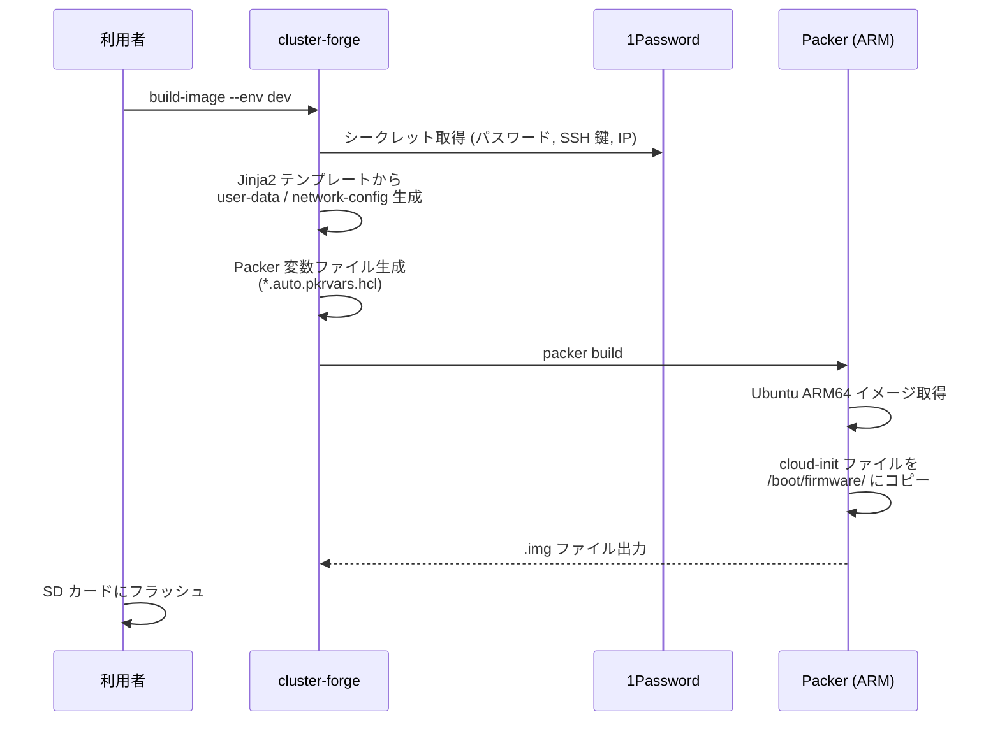
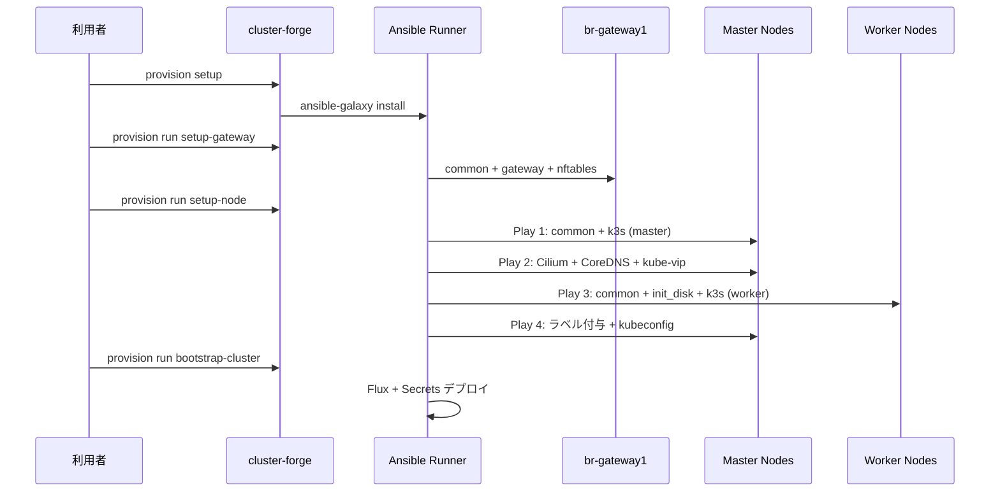

# イメージビルドとプロビジョニング

## 概要

ノードのセットアップは 2 つのフェーズに分かれています。

| フェーズ | ツール | タイミング | 内容 |
|---|---|---|---|
| **イメージビルド** | Packer + cloud-init | SD カード書き込み前 (オフライン) | OS + 初期設定を焼き込んだイメージを作成 |
| **プロビジョニング** | Ansible | ノード起動後 (オンライン) | k3s インストール、ネットワーク設定、クラスタ構築 |

**なぜ 2 フェーズか**: イメージビルドで「どのノードも同じベース状態」を保証し、プロビジョニングで「ノード固有の設定」を適用します。ノードの交換時はイメージを焼き直して再プロビジョニングするだけで、手順書を見ながらの手動セットアップは不要です。

## イメージビルド (Packer)

### フロー



### cloud-init で焼き込まれる内容

**user-data (全サーバー共通)**:
- ホスト名、タイムゾーン (JST)、ロケール (ja_JP.UTF-8)
- root パスワード (SHA512 ハッシュ)
- 運用ユーザー (sudo 権限、SSH 公開鍵認証)
- Avahi デーモン (mDNS)、APT 設定

**network-config (gateway のみ)**:
- eth0: 静的 IP (172.22.10.1/24)、DHCP 無効
- wlan0: WiFi 設定 (SSID、WPA2 パスフレーズ)
- デフォルトゲートウェイ、DNS サーバー

### Packer の仕組み

`imager/` の HCL ファイルで ARM64 イメージのビルドを定義しています。

- `source.pkr.hcl` — Ubuntu 24.04 ARM64 イメージのダウンロード元、パーティション構成 (256MB boot + ext4 root)
- `build.pkr.hcl` — cloud-init ファイルを `/boot/firmware/` にコピーするプロビジョナー
- `variables.pkr.hcl` — ホスト名、cloud-config ファイルパス等の変数定義

ビルドは `packer-builder-arm` を使い、QEMU (aarch64) でクロスプラットフォームビルドを実行します。

## プロビジョニング (Ansible)

### 全体フロー



### Ansible ロール一覧

| ロール | 対象 | 内容 |
|---|---|---|
| **common** | 全ノード | snap/needrestart 削除、必要パッケージインストール、SSH 設定 |
| **gateway** | gateway | DHCP (dnsmasq)、DNS フォワーダー、NTP (chrony)、IP フォワーディング |
| **ipr-cnrs.nftables** | gateway | nftables ファイアウォール (外部ロール) |
| **k3s** | node | k3s のインストールと設定 (primary / secondary / worker で分岐) |
| **secrets** | 全ノード | 1Password から必要なシークレット (k3s_token 等) を取得 |
| **bootstrap/cilium** | primary | Cilium CNI を Helm でインストール |
| **bootstrap/coredns** | primary | CoreDNS を Helm でインストール |
| **bootstrap/kube_vip** | primary | kube-vip を Helm でインストール |
| **bootstrap/fluxcd** | localhost | Flux Operator + FluxInstance をデプロイ |
| **bootstrap/secrets** | localhost | GitHub App、1Password Connect の Kubernetes Secret を作成 |
| **external** | external | 外部ノード固有の設定 |
| **backup** | 対象ノード | Restic バイナリインストール、バックアップスケジュール設定 |
| **monitoring_agent** | 対象ノード | 監視エージェントの設定 |

### setup-node Playbook の詳細

`setup-node` は最も複雑な Playbook で、4 つの Play から構成されています。

**Play 1: マスターノード設定** (`hosts: master`)
1. パッケージ更新
2. 1Password から k3s_token を取得
3. common ロール (基本システム設定)
4. k3s ロール (primary: クラスタ初期化 / secondary: クラスタ参加)

**Play 2: クラスタネットワーク構築** (`hosts: primary`)
1. Kubernetes API の Ready 待ち
2. Helm のインストール
3. bootstrap マニフェストをコピー
4. Cilium CNI → CoreDNS → kube-vip の順にデプロイ

**Play 3: ワーカーノード設定** (`hosts: worker`)
1. パッケージ更新
2. ディスク初期化 (Longhorn 用)
3. 1Password から k3s_token を取得
4. common ロール + k3s ロール (worker: クラスタ参加)

**Play 4: Post Setup** (`hosts: master`)
1. 全ワーカーノードのクラスタ参加を待機
2. ノードラベル付与
3. VIP ドメインを使った kubeconfig の生成

## Playbook 実行順序

フレッシュな状態からクラスタを構築する場合の推奨順序:

```shell
# 1. 環境の起動
uv run cluster-forge bootstrap --env dev

# 2. Ansible 依存のインストール
uv run cluster-forge provision setup --env dev

# 3. インベントリ生成
uv run cluster-forge generate-inventory --env dev

# 4. ゲートウェイ設定 (ネットワーク基盤)
uv run cluster-forge provision run --env dev setup-gateway

# 5. k3s クラスタ構築 (Master → Worker)
uv run cluster-forge provision run --env dev setup-node

# 6. 外部ノード設定
uv run cluster-forge provision run --env dev setup-external

# 7. Flux + シークレットのデプロイ
uv run cluster-forge provision run --env dev bootstrap-cluster

# 8. バックアップ設定
uv run cluster-forge provision run --env dev setup-backup
```

## ノードの追加手順

新しいノード (例: br-node7) を追加する場合:

1. **servers.yaml にサーバーを追加**
   ```yaml
   - name: br-node7
     type: node
     k8s_role: worker
   ```

2. **1Password にシークレットを登録**
   - `br-cluster-{env}` vault に `br-node7` アイテムを作成
   - IP アドレス、MAC アドレス、SSH 公開鍵等を設定

3. **OS イメージのビルド**
   ```shell
   uv run cluster-forge build-image --env dev --server br-node7
   ```

4. **SD カードへの書き込み**
   ```shell
   # 出力された .img ファイルを SD カードにフラッシュ
   ```

5. **インベントリの再生成**
   ```shell
   uv run cluster-forge generate-inventory --env dev
   ```

6. **プロビジョニング**
   ```shell
   uv run cluster-forge provision run --env dev setup-node
   ```

`servers.yaml` 以外のコードファイルを変更する必要はありません。

## プロビジョニング後のサーバー構成

各サーバーにプロビジョニング後に何が動いているかを示します。

### br-gateway1 — Gateway / Router

```
┌─────────────────────────────────────────────────────────┐
│  br-gateway1                                            │
│  WAN: wlan0 (DHCP) / LAN: eth0 (172.22.10.1)           │
│                                                         │
│  ┌───────────────────┐  ┌─────────────────────────┐     │
│  │ Kea DHCP4 Server  │  │ CoreDNS + etcd          │     │
│  │ 172.22.10.100-200 │  │ *.cluster-internal...   │     │
│  │ Lease: 24h/7d     │  │ *.bright-room.net       │     │
│  └───────────────────┘  └─────────────────────────┘     │
│  ┌───────────────────┐  ┌─────────────────────────┐     │
│  │ Chrony NTP        │  │ nftables Firewall       │     │
│  │ ntp.nict.jp       │  │ NAT / DNAT / Forward    │     │
│  └───────────────────┘  └─────────────────────────┘     │
│  ┌──────────────────────────────────────────────────┐   │
│  │ Monitoring: node_exporter (:9100) + Fluent Bit   │   │
│  │ Restic Backup → Garage S3 (daily 03:00)          │   │
│  └──────────────────────────────────────────────────┘   │
└─────────────────────────────────────────────────────────┘
```

### br-node1/2/3 — K3s Master Nodes

```
┌─────────────────────────────────────────────────────────┐
│  br-node1 (Primary) / br-node2, br-node3 (Secondary)   │
│  172.22.10.10 / .11 / .12                               │
│                                                         │
│  ┌──────────────────────────────────────────────────┐   │
│  │ K3s Server                                       │   │
│  │ ├── API Server (:6443)                           │   │
│  │ ├── etcd (embedded, HA across 3 masters)         │   │
│  │ ├── Controller Manager + Scheduler               │   │
│  │ │                                                │   │
│  │ │ 無効化: flannel, kube-proxy, coredns,          │   │
│  │ │   local-storage, servicelb, traefik,           │   │
│  │ │   metrics-server, helm-controller              │   │
│  │ │ Taint: control-plane:NoSchedule                │   │
│  │ └── kubectl (トラブルシュート用)                   │   │
│  ├──────────────────────────────────────────────────┤   │
│  │ Kubernetes Pods (Master にスケジュール)            │   │
│  │ ├── Cilium Agent (DaemonSet)                     │   │
│  │ ├── Cilium Operator (Deployment)                 │   │
│  │ └── Kube-VIP (DaemonSet, VIP: 172.22.10.60)     │   │
│  ├──────────────────────────────────────────────────┤   │
│  │ Restic Backup → Garage S3 (daily 03:00)          │   │
│  └──────────────────────────────────────────────────┘   │
└─────────────────────────────────────────────────────────┘
```

### br-node4/5/6 — K3s Worker Nodes

```
┌─────────────────────────────────────────────────────────┐
│  br-node4 / br-node5 / br-node6                        │
│  172.22.10.13 / .14 / .15                               │
│                                                         │
│  ┌──────────────────────────────────────────────────┐   │
│  │ K3s Agent (kubelet + Container Runtime)           │   │
│  ├──────────────────────────────────────────────────┤   │
│  │ LVM Storage (/storage) — Longhorn データ保存先     │   │
│  ├──────────────────────────────────────────────────┤   │
│  │ Kubernetes Pods (Worker にスケジュール)            │   │
│  │                                                  │   │
│  │ [Networking]   Cilium Agent, Envoy Gateway, Istio│   │
│  │ [Core]         CoreDNS, cert-manager, Flux       │   │
│  │                External Secrets, 1Password Connect│   │
│  │ [Storage]      Longhorn, Velero                  │   │
│  │ [Observability]Prometheus, Grafana, Loki, Tempo  │   │
│  │                Fluentd, Fluent Bit, OTel, EFK    │   │
│  │ [Auth/Data]    Keycloak, CloudNative PG, MongoDB │   │
│  │                Kafka, External DNS               │   │
│  ├──────────────────────────────────────────────────┤   │
│  │ Restic Backup → Garage S3 (daily 03:00)          │   │
│  └──────────────────────────────────────────────────┘   │
└─────────────────────────────────────────────────────────┘
```

### br-external1 — External Services

```
┌─────────────────────────────────────────────────────────┐
│  br-external1 (172.22.10.50)                            │
│                                                         │
│  ┌──────────────────────────────────────────────────┐   │
│  │ Garage S3                                        │   │
│  │ S3 API: :3900 / RPC: :3901 / Web: :3902         │   │
│  │ Data: /storage/garage/data (LVM)                 │   │
│  │ Domain: backup-storage.cluster-internal...       │   │
│  │                                                  │   │
│  │ Buckets:                                         │   │
│  │   restic       ← 全ノード Restic バックアップ     │   │
│  │   k3s-longhorn ← Longhorn ボリュームスナップショット │   │
│  │   k3s-velero   ← Velero クラスタバックアップ      │   │
│  │   k3s-loki     ← Loki ログストレージ             │   │
│  │   k3s-tempo    ← Tempo トレースストレージ         │   │
│  │   k3s-barman   ← PostgreSQL バックアップ         │   │
│  ├──────────────────────────────────────────────────┤   │
│  │ Certbot (Let's Encrypt)                          │   │
│  │ DNS Challenge: Cloudflare API                    │   │
│  │ Cron: 0:00, 12:00 (renewal check)               │   │
│  ├──────────────────────────────────────────────────┤   │
│  │ Monitoring: node_exporter (:9100) + Fluent Bit   │   │
│  │ Restic Backup → Garage S3 (daily 03:00)          │   │
│  └──────────────────────────────────────────────────┘   │
└─────────────────────────────────────────────────────────┘
```
