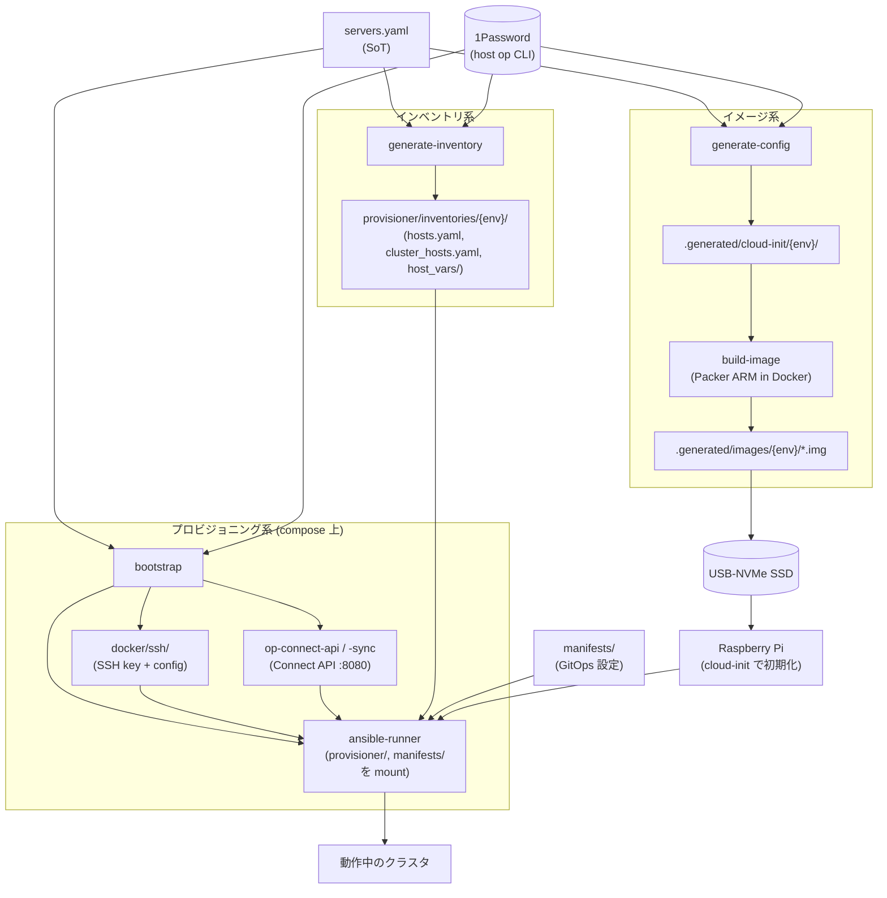

# プロビジョニング

OS イメージ生成 (Packer) からノード初期構築 (Ansible)、クラスタ起動までの流れをまとめる。CLI は `cluster-forge` (`cli/cluster_forge/`)、Make ターゲット経由でも叩ける。

## 全体フロー

`servers.yaml` (SoT) と 1Password Vault `br-cluster-{env}` を入力に、3 系統のサブフローが独立に動く。

- **イメージ系** (`generate-config` → `build-image`): cloud-init を生成して Packer で OS イメージを焼く
- **インベントリ系** (`generate-inventory`): Ansible 用の動的 inventory を生成
- **プロビジョニング系** (`bootstrap` → `provision run`): SSH 鍵セットアップ + Connect 起動 + ansible-runner で Playbook 実行



ポイント:

- `generate-config` / `build-image` / `generate-inventory` は **`bootstrap` 不要**。ホストの `op` CLI で 1Password から直接 secret を読む
- `provision run` のためだけに `bootstrap` (= 1Password Connect 起動 + SSH 鍵書き出し + ansible-runner 起動) が必要
- ansible-runner は `OP_CONNECT_HOST: http://${ENV}-op-connect-api:8080` を介して Connect API から secret を取る (`secrets` ロール)。**ホストの `op` CLI とは別経路**
- ansible-runner には `manifests/` も read-only マウントされ、Cilium / CoreDNS / kube-vip の bootstrap で参照する
- 各ステップは独立・冪等

## 主要コマンド

CLI は `uv run cluster-forge ...`、同等の Make ターゲット (`make {env}/...`) も用意されている (`Makefile`)。

| 用途 | CLI | Make |
|------|-----|------|
| 1Password Connect + SSH 鍵取得 + Ansible Runner 起動 | `cluster-forge bootstrap --env {env}` | `make {env}/bootstrap` |
| cloud-init 設定生成 | `cluster-forge generate-config --env {env} [--server <name>]` | `make {env}/generate-config` |
| OS イメージ作成 | `cluster-forge build-image --env {env} [--server <name>]` | `make {env}/build-image` / `make {env}/image-build/<name>` |
| Ansible inventory 生成 | `cluster-forge generate-inventory --env {env}` | `make {env}/generate-inventory` |
| Playbook 実行 | `cluster-forge provision run --env {env} <playbook>` | `make {env}/provision/<playbook>` |
| 接続疎通 | `cluster-forge provision ping --env {env}` | `make {env}/provision/ping` |
| Lint | `cluster-forge provision lint --env {env}` | `make {env}/provision/lint` |
| 後片付け (compose down) | `cluster-forge clean --env {env} [--all]` | `make {env}/clean` / `make {env}/clean-all` |

`{env}` は `dev` または `prod`。`servers.yaml` の `environments:` で許可されているもの。

## Step 1. イメージビルド (Packer)

### 入出力

| 項目 | 内容 |
|------|------|
| ベース | Ubuntu 24.04 preinstalled-server `arm64+raspi` ([`imager/source.pkr.hcl`](../imager/source.pkr.hcl)) |
| 入力 | `generate-config` が生成した `user-data` / `meta-data` / `network-config`、1Password から取得した SSH 公開鍵 |
| 出力 | `.generated/images/{env}/<hostname>.img` (USB-NVMe SSD に `dd` で焼く) |
| パーティション | `boot` (FAT 256 MiB) + `root` (ext4 残り全部) の 2 パーティション固定 |

64 GiB への root 縮小と、データ用 ext4 パーティション切り出しは、**初回 Ansible 実行時**の [`provisioner/tasks/init_disk.yaml`](../provisioner/tasks/init_disk.yaml) が担う (Packer 段階ではしない)。

### 内部処理

`packer build` が `imager/build.pkr.hcl` を使い、chroot 内で `qemu-aarch64-static` を介して amd64 マシン上から arm64 イメージをカスタマイズする。

## Step 2. Bootstrap (1Password Connect + Ansible Runner)

`cluster-forge bootstrap` が以下を順に行う:

1. `compose.yaml` の `op-connect-api` / `op-connect-sync` を起動
2. Connect API の readiness を待つ
3. `servers.yaml` 各ホスト分の SSH 鍵 / IP を Vault `br-cluster-{env}` から取得し、`docker/ssh/` に書き出す
4. `ansible-runner` コンテナを起動

事前準備として `.secret/{env}/1password-credentials.json` と `.secret/{env}/.connect_token` が必要 (リポジトリ非追跡)。詳細は CLI 実装 [`cli/cluster_forge/cli.py`](../cli/cluster_forge/cli.py) と [`compose.yaml`](../compose.yaml)。

## Step 3. インベントリ生成

| 項目 | 内容 |
|------|------|
| 入力 | `servers.yaml` + 1Password Vault (IP / SSH 情報) |
| 出力 | `provisioner/inventories/{env}/hosts.yaml` ほか (`.gitignore` 対象) |
| Ansible 実行時 | `inventories/base/` (静的) + `inventories/{env}/` (動的) を **両方** `-i` で渡す |

### Ansible グループ構成

| グループ      | 含まれるホスト |
|---------------|----------------|
| `gateway`     | `br-gateway1` |
| `external`    | `br-external1` |
| `master`      | `br-node1`, `br-node2`, `br-node3` |
| `primary`     | `br-node1` のみ (`is_primary_control_node=true`) |
| `worker`      | `br-node4`, `br-node5`, `br-node6` |
| `br_cluster`  | 全ノード (monitoring agent の配布対象) |

## Step 4. プロビジョニング (Ansible Playbook)

Ansible は Compose 上の `ansible-runner` コンテナで実行 ([`compose.yaml`](../compose.yaml))。事前に `bootstrap` 済みであること。

### Playbook 一覧

ソース: [`provisioner/playbooks/`](../provisioner/playbooks). コマンド名はハイフン区切り (`make {env}/provision/<name>`)。

| Playbook                       | 対象ホスト         | 内容 |
|--------------------------------|--------------------|------|
| `setup-gateway`                | `gateway`          | 共通設定 → DHCP (Kea) / DNS (CoreDNS+etcd) / NTP → nftables |
| `setup-external`               | `external`         | ディスク初期化 → certbot → Garage → Caddy |
| `setup-node`                   | `master` + `primary` + `worker` | k3s インストール (4 Play 構成、下記参照) |
| `bootstrap-cluster`            | `localhost`        | Flux 用 secret 投入 → ノード検証 → Flux Operator インストール |
| `setup-monitoring-agent`       | `br_cluster`       | 全ノードに systemd 版 node_exporter / Alloy を配置 |
| `setup-k3s-leader-restart`     | `primary`          | k3s control-plane leader を peer 健全性チェック付きで安全再起動する systemd timer |
| `k3s-start` / `k3s-stop`       | 全 k3s ノード      | systemd サービスの起動 / 停止 |
| `k3s-reset`                    | 全 k3s ノード      | k3s を完全削除 (再構築前提) |
| `shutdown-cluster`             | クラスタ全体       | k3s 停止 → 順序付きシャットダウン |

### `setup-node` の 4 Play 構成

[`provisioner/playbooks/setup_node.yaml`](../provisioner/playbooks/setup_node.yaml) は以下の順で実行する:

| Play | 対象      | 内容 |
|------|-----------|------|
| 1    | `master`  | 全 control-plane に `k3s server` をインストール。`primary` は新規クラスタ起動、`secondary` は primary の `:6443` を待ってから join (throttle=1) |
| 2    | `primary` | primary 上の kubeconfig を使い、Helm で **Cilium / CoreDNS / kube-vip を直接適用** (Flux より先に居る必要があるため) |
| 3    | `worker`  | `init_disk` でディスクを切ってから `k3s agent` で参加 |
| 4    | `master`  | worker の Ready 待ち、ノードラベル、VIP 向け kubeconfig 生成 |

### ロール一覧

| ロール                                              | 概要 |
|-----------------------------------------------------|------|
| [`common`](../provisioner/roles/common)             | SSH / swap / packages / system 設定 (RTL9210 quirk 等)、全ノード共通 |
| [`gateway`](../provisioner/roles/gateway)           | Kea DHCP / CoreDNS+etcd / NTP / pre-configuration |
| [`external`](../provisioner/roles/external)         | Garage / Caddy / certbot |
| [`k3s`](../provisioner/roles/k3s)                   | `install_master` / `install_worker` / `configure` / `post_setup` |
| [`bootstrap/*`](../provisioner/roles/bootstrap)     | Cilium / CoreDNS / kube-vip / Flux / 初期 secrets / ノード検証 |
| [`secrets`](../provisioner/roles/secrets)           | `onepassword.connect` で必要な secret だけを取得 |
| [`monitoring_agent`](../provisioner/roles/monitoring_agent) | systemd node_exporter / Alloy |
| [`k3s_leader_restart`](../provisioner/roles/k3s_leader_restart) | primary の安全リスタート (peer 健全性 TCP チェック) |
| `ipr-cnrs.nftables`                                 | nftables (Galaxy ロール、`requirements.yaml` で取得) |

### Secret の取り扱い

| 項目 | 内容 |
|------|------|
| プロバイダ | 1Password Connect (Compose 上で起動) |
| 使い方     | `secrets` ロールが `onepassword.connect` コレクションで Vault から該当アイテムだけ取得 |
| 環境変数   | `OP_CONNECT_TOKEN` / `OP_CONNECT_HOST` を Runner が解決 |
| ローカル   | `.secret/{env}/1password-credentials.json` と `.secret/{env}/.connect_token` (リポジトリ非追跡) |

## ゼロからの構築シーケンス

`prod` の例 (`dev` も同形式):

```sh
make prod/bootstrap                      # 1Password Connect + Runner 起動
make prod/build-image                    # 全ノードの OS イメージ生成
# 各ノードの USB-NVMe SSD にイメージを焼いて、Pi に挿して通電
make prod/generate-inventory             # SSH 情報含む inventory 生成
make prod/provision/setup-gateway        # gateway1 を立てる (DHCP/DNS が動く)
make prod/provision/setup-external       # external1 を立てる
make prod/provision/setup-node           # k3s 起動 + CNI/CoreDNS/kube-vip ブート
make prod/provision/bootstrap-cluster    # Flux 投入
make prod/provision/setup-monitoring-agent
```

## 再プロビジョン

冪等に再実行できる。失敗時は同じターゲットを再投入。k3s だけ作り直す場合:

```sh
make prod/provision/k3s-reset
make prod/provision/setup-node
make prod/provision/bootstrap-cluster
```

OS イメージからやり直す場合は `build-image` → USB-NVMe SSD 焼き直し → `setup-*` を順に。

## 関連

- [`docs/hardware.md`](hardware.md) — ノード役割とディスクレイアウト
- [`docs/network.md`](network.md) — gateway1 が提供する DHCP / DNS / NTP の中身
- [`docs/kubernetes.md`](kubernetes.md) — `bootstrap-cluster` 以降に Flux が組み立てる中身
- [`Makefile`](../Makefile) — 全コマンドの SoT
